cola Report for Hierarchical Partitioning - 'DarmanisBrain'
==================

**Date**: 2021-07-26 10:30:03 CEST, **cola version**: 1.9.4

----------------------------------------------------------------

<style type='text/css'>

body, td, th {
   font-family: Arial,Helvetica,sans-serif;
   background-color: white;
   font-size: 13px;
  max-width: 800px;
  margin: auto;
  margin-left:210px;
  padding: 0px 10px 0px 10px;
  border-left: 1px solid #EEEEEE;
  line-height: 150%;
}

tt, code, pre {
   font-family: 'DejaVu Sans Mono', 'Droid Sans Mono', 'Lucida Console', Consolas, Monaco, 

monospace;
}

h1 {
   font-size:2.2em;
}

h2 {
   font-size:1.8em;
}

h3 {
   font-size:1.4em;
}

h4 {
   font-size:1.0em;
}

h5 {
   font-size:0.9em;
}

h6 {
   font-size:0.8em;
}

a {
  text-decoration: none;
  color: #0366d6;
}

a:hover {
  text-decoration: underline;
}

a:visited {
   color: #0366d6;
}

pre, img {
  max-width: 100%;
}
pre {
  overflow-x: auto;
}
pre code {
   display: block; padding: 0.5em;
}

code {
  font-size: 92%;
  border: 1px solid #ccc;
}

code[class] {
  background-color: #F8F8F8;
}

table, td, th {
  border: 1px solid #ccc;
}

blockquote {
   color:#666666;
   margin:0;
   padding-left: 1em;
   border-left: 0.5em #EEE solid;
}

hr {
   height: 0px;
   border-bottom: none;
   border-top-width: thin;
   border-top-style: dotted;
   border-top-color: #999999;
}

@media print {
   * {
      background: transparent !important;
      color: black !important;
      filter:none !important;
      -ms-filter: none !important;
   }

   body {
      font-size:12pt;
      max-width:100%;
   }

   a, a:visited {
      text-decoration: underline;
   }

   hr {
      visibility: hidden;
      page-break-before: always;
   }

   pre, blockquote {
      padding-right: 1em;
      page-break-inside: avoid;
   }

   tr, img {
      page-break-inside: avoid;
   }

   img {
      max-width: 100% !important;
   }

   @page :left {
      margin: 15mm 20mm 15mm 10mm;
   }

   @page :right {
      margin: 15mm 10mm 15mm 20mm;
   }

   p, h2, h3 {
      orphans: 3; widows: 3;
   }

   h2, h3 {
      page-break-after: avoid;
   }
}
</style>


## Summary


First the variable is renamed to `res_rh`.


```r
res_rh = rh
```


The partition hierarchy and all available functions which can be applied to `res_rh` object.


```r
res_rh
```

```
#> A 'HierarchicalPartition' object with 'ATC:skmeans' method.
#>   On a matrix with 12036 rows and 466 columns.
#>   Performed in total 3750 partitions.
#>   There are 16 groups under the following parameters:
#>     - min_samples: 6
#>     - mean_silhouette_cutoff: 0.9
#>     - min_n_signatures: 355 (signatures are selected based on:)
#>       - fdr_cutoff: 0.05
#>       - group_diff (scaled values): 0.5
#> 
#> Hierarchy of the partition:
#>   0, 466 cols
#>   |-- 01, 238 cols, 3159 signatures
#>   |   |-- 011, 110 cols, 839 signatures
#>   |   |   |-- 0111, 55 cols, 111 signatures (c)
#>   |   |   `-- 0112, 55 cols, 701 signatures
#>   |   |       |-- 01121, 38 cols, 26 signatures (c)
#>   |   |       `-- 01122, 17 cols, 6 signatures (c)
#>   |   |-- 012, 81 cols, 1988 signatures
#>   |   |   |-- 0121, 19 cols, 8 signatures (c)
#>   |   |   |-- 0122, 25 cols, 130 signatures (c)
#>   |   |   |-- 0123, 17 cols, 69 signatures (c)
#>   |   |   `-- 0124, 20 cols, 76 signatures (c)
#>   |   `-- 013, 47 cols, 865 signatures
#>   |       |-- 0131, 18 cols, 5 signatures (c)
#>   |       |-- 0132, 11 cols (b)
#>   |       `-- 0133, 18 cols, 3 signatures (c)
#>   |-- 02, 176 cols, 3358 signatures
#>   |   |-- 021, 92 cols, 1450 signatures
#>   |   |   |-- 0211, 55 cols, 185 signatures (c)
#>   |   |   `-- 0212, 37 cols, 353 signatures (c)
#>   |   `-- 022, 84 cols, 303 signatures (c)
#>   `-- 03, 52 cols, 982 signatures
#>       |-- 031, 22 cols, 8 signatures (c)
#>       |-- 032, 10 cols (b)
#>       `-- 033, 20 cols, 40 signatures (c)
#> Stop reason:
#>   b) Subgroup had too few columns.
#>   c) There were too few signatures.
#> 
#> Following methods can be applied to this 'HierarchicalPartition' object:
#>  [1] "all_leaves"            "all_nodes"             "cola_report"           "collect_classes"      
#>  [5] "colnames"              "compare_signatures"    "dimension_reduction"   "functional_enrichment"
#>  [9] "get_anno_col"          "get_anno"              "get_children_nodes"    "get_classes"          
#> [13] "get_matrix"            "get_signatures"        "is_leaf_node"          "max_depth"            
#> [17] "merge_node"            "ncol"                  "node_info"             "node_level"           
#> [21] "nrow"                  "rownames"              "show"                  "split_node"           
#> [25] "suggest_best_k"        "test_to_known_factors" "top_rows_heatmap"      "top_rows_overlap"     
#> 
#> You can get result for a single node by e.g. object["01"]
```

The call of `hierarchical_partition()` was:


```
#> hierarchical_partition(data = lt$mat, anno = lt$anno, subset = 500, cores = 4)
```

Dimension of the input matrix:


```r
mat = get_matrix(res_rh)
dim(mat)
```

```
#> [1] 12036   466
```

All the methods that were tried:


```r
res_rh@param$combination_method
```

```
#> [[1]]
#> [1] "ATC"     "skmeans"
```

### Density distribution

The density distribution for each sample is visualized as one column in the following heatmap.
The clustering is based on the distance which is the Kolmogorov-Smirnov statistic between two distributions.


```r
library(ComplexHeatmap)
densityHeatmap(mat, top_annotation = HeatmapAnnotation(df = get_anno(res_rh), 
    col = get_anno_col(res_rh)), ylab = "value", cluster_columns = TRUE, show_column_names = FALSE,
    mc.cores = 1)
```


Some values about the hierarchy:


```r
all_nodes(res_rh)
```

```
#>  [1] "0"     "01"    "011"   "0111"  "0112"  "01121" "01122" "012"   "0121"  "0122"  "0123"  "0124" 
#> [13] "013"   "0131"  "0132"  "0133"  "02"    "021"   "0211"  "0212"  "022"   "03"    "031"   "032"  
#> [25] "033"
```

```r
all_leaves(res_rh)
```

```
#>  [1] "0111"  "01121" "01122" "0121"  "0122"  "0123"  "0124"  "0131"  "0132"  "0133"  "0211"  "0212" 
#> [13] "022"   "031"   "032"   "033"
```

```r
node_info(res_rh)
```

```
#>       id best_method depth best_k n_columns n_signatures p_signatures is_leaf
#> 1      0 ATC:skmeans     1      3       466         7110     0.590728   FALSE
#> 2     01 ATC:skmeans     2      3       238         3159     0.262463   FALSE
#> 3    011 ATC:skmeans     3      2       110          839     0.069708   FALSE
#> 4   0111 ATC:skmeans     4      3        55          111     0.009222    TRUE
#> 5   0112 ATC:skmeans     4      2        55          701     0.058242   FALSE
#> 6  01121 ATC:skmeans     5      2        38           26     0.002160    TRUE
#> 7  01122 ATC:skmeans     5      2        17            6     0.000499    TRUE
#> 8    012 ATC:skmeans     3      4        81         1988     0.165171   FALSE
#> 9   0121 ATC:skmeans     4      2        19            8     0.000665    TRUE
#> 10  0122 ATC:skmeans     4      3        25          130     0.010801    TRUE
#> 11  0123 ATC:skmeans     4      2        17           69     0.005733    TRUE
#> 12  0124 ATC:skmeans     4      2        20           76     0.006314    TRUE
#> 13   013 ATC:skmeans     3      3        47          865     0.071868   FALSE
#> 14  0131 ATC:skmeans     4      2        18            5     0.000415    TRUE
#> 15  0132 not applied     4     NA        11           NA           NA    TRUE
#> 16  0133 ATC:skmeans     4      2        18            3     0.000249    TRUE
#> 17    02 ATC:skmeans     2      2       176         3358     0.278996   FALSE
#> 18   021 ATC:skmeans     3      2        92         1450     0.120472   FALSE
#> 19  0211 ATC:skmeans     4      2        55          185     0.015371    TRUE
#> 20  0212 ATC:skmeans     4      2        37          353     0.029329    TRUE
#> 21   022 ATC:skmeans     3      2        84          303     0.025174    TRUE
#> 22    03 ATC:skmeans     2      3        52          982     0.081589   FALSE
#> 23   031 ATC:skmeans     3      2        22            8     0.000665    TRUE
#> 24   032 not applied     3     NA        10           NA           NA    TRUE
#> 25   033 ATC:skmeans     3      2        20           40     0.003323    TRUE
```

In the output from `node_info()`, there are the following columns:

- `id`: The node id.
- `best_method`: The best method selected.
- `depth`: Depth of the node in the hierarchy.
- `best_k`: Best number of groups of the partition on that node.
- `n_columns`: Number of columns in the submatrix.
- `n_signatures`: Number of signatures with the `best_k`.
- `p_signatures`: Proportion of hte signatures in total number of rows in the matrix.
- `is_leaf`: Whether the node is a leaf.

Labels of nodes are encoded in a special way. The number of digits
correspond to the depth of the node in the hierarchy and the value of the
digits correspond to the index of the subgroup in the current node, E.g. a label
of “012” means the node is the second subgroup of the partition which is the
first subgroup of the root node.

### Suggest the best k


Following table shows the best `k` (number of partitions) for each node in the
partition hierarchy. Clicking on the node name in the table goes to the
corresponding section for the partitioning on that node.

[The cola vignette](https://jokergoo.github.io/cola_vignettes/cola.html#toc_13)
explains the definition of the metrics used for determining the best
number of partitions.


```r
suggest_best_k(res_rh)
```


|Node                  |Best method                                         |Is leaf   |Best k |1-PAC |Mean silhouette |Concordance | #samples|   |
|:---------------------|:---------------------------------------------------|:---------|:------|:-----|:---------------|:-----------|--------:|:--|
|[Node0](#Node0)       |ATC:skmeans                                         |          |4      |0.98  |0.95            |0.97        |      466|** |
|[Node01](#Node01)     |ATC:skmeans                                         |          |3      |1.00  |0.98            |0.99        |      238|** |
|[Node011](#Node011)   |ATC:skmeans                                         |          |4      |0.90  |0.90            |0.94        |      110|*  |
|Node0111-leaf         |ATC:skmeans                                         |✓ (&#99;) |3      |0.98  |0.97            |0.99        |       55|** |
|[Node0112](#Node0112) |ATC:skmeans                                         |          |2      |1.00  |0.99            |0.99        |       55|** |
|Node01121-leaf        |ATC:skmeans                                         |✓ (&#99;) |2      |0.89  |0.95            |0.98        |       38|   |
|Node01122-leaf        |ATC:skmeans                                         |✓ (&#99;) |2      |1.00  |1.00            |1.00        |       17|** |
|[Node012](#Node012)   |ATC:skmeans                                         |          |4      |0.96  |0.95            |0.97        |       81|** |
|Node0121-leaf         |ATC:skmeans                                         |✓ (&#99;) |2      |0.89  |0.96            |0.98        |       19|   |
|Node0122-leaf         |ATC:skmeans                                         |✓ (&#99;) |4      |0.91  |0.83            |0.92        |       25|*  |
|Node0123-leaf         |ATC:skmeans                                         |✓ (&#99;) |2      |1.00  |1.00            |1.00        |       17|** |
|Node0124-leaf         |ATC:skmeans                                         |✓ (&#99;) |2      |1.00  |1.00            |1.00        |       20|** |
|[Node013](#Node013)   |ATC:skmeans                                         |          |3      |1.00  |0.98            |0.99        |       47|** |
|Node0131-leaf         |ATC:skmeans                                         |✓ (&#99;) |3      |0.84  |0.88            |0.95        |       18|   |
|Node0132-leaf         |<span style='color:grey;'><i>not applied</i></span> |✓ (b)     |       |      |                |            |       11|   |
|Node0133-leaf         |ATC:skmeans                                         |✓ (&#99;) |2      |1.00  |1.00            |1.00        |       18|** |
|[Node02](#Node02)     |ATC:skmeans                                         |          |3      |0.94  |0.93            |0.97        |      176|*  |
|[Node021](#Node021)   |ATC:skmeans                                         |          |2      |1.00  |0.98            |0.99        |       92|** |
|Node0211-leaf         |ATC:skmeans                                         |✓ (&#99;) |2      |0.93  |0.97            |0.99        |       55|*  |
|Node0212-leaf         |ATC:skmeans                                         |✓ (&#99;) |3      |0.96  |0.93            |0.97        |       37|** |
|Node022-leaf          |ATC:skmeans                                         |✓ (&#99;) |2      |0.80  |0.92            |0.96        |       84|   |
|[Node03](#Node03)     |ATC:skmeans                                         |          |3      |1.00  |0.97            |0.99        |       52|** |
|Node031-leaf          |ATC:skmeans                                         |✓ (&#99;) |2      |1.00  |1.00            |1.00        |       22|** |
|Node032-leaf          |<span style='color:grey;'><i>not applied</i></span> |✓ (b)     |       |      |                |            |       10|   |
|Node033-leaf          |ATC:skmeans                                         |✓ (&#99;) |2      |1.00  |1.00            |1.00        |       20|** |


Stop reason: b) Subgroup had too few columns. c) There were too few signatures. 

\*\*: 1-PAC > 0.95, \*: 1-PAC > 0.9


### Partition hierarchy

The nodes of the hierarchy can be merged by setting the `merge_node` parameters. Here we 
control the hierarchy with the `min_n_signatures` parameter. The value of `min_n_signatures` is
from `node_info()`.


<style type='text/css'>


.ui-helper-hidden {
	display: none;
}
.ui-helper-hidden-accessible {
	border: 0;
	clip: rect(0 0 0 0);
	height: 1px;
	margin: -1px;
	overflow: hidden;
	padding: 0;
	position: absolute;
	width: 1px;
}
.ui-helper-reset {
	margin: 0;
	padding: 0;
	border: 0;
	outline: 0;
	line-height: 1.3;
	text-decoration: none;
	font-size: 100%;
	list-style: none;
}
.ui-helper-clearfix:before,
.ui-helper-clearfix:after {
	content: "";
	display: table;
	border-collapse: collapse;
}
.ui-helper-clearfix:after {
	clear: both;
}
.ui-helper-zfix {
	width: 100%;
	height: 100%;
	top: 0;
	left: 0;
	position: absolute;
	opacity: 0;
	filter:Alpha(Opacity=0); 
}

.ui-front {
	z-index: 100;
}


.ui-state-disabled {
	cursor: default !important;
	pointer-events: none;
}


.ui-icon {
	display: inline-block;
	vertical-align: middle;
	margin-top: -.25em;
	position: relative;
	text-indent: -99999px;
	overflow: hidden;
	background-repeat: no-repeat;
}

.ui-widget-icon-block {
	left: 50%;
	margin-left: -8px;
	display: block;
}


.ui-widget-overlay {
	position: fixed;
	top: 0;
	left: 0;
	width: 100%;
	height: 100%;
}
.ui-accordion .ui-accordion-header {
	display: block;
	cursor: pointer;
	position: relative;
	margin: 2px 0 0 0;
	padding: .5em .5em .5em .7em;
	font-size: 100%;
}
.ui-accordion .ui-accordion-content {
	padding: 1em 2.2em;
	border-top: 0;
	overflow: auto;
}
.ui-autocomplete {
	position: absolute;
	top: 0;
	left: 0;
	cursor: default;
}
.ui-menu {
	list-style: none;
	padding: 0;
	margin: 0;
	display: block;
	outline: 0;
}
.ui-menu .ui-menu {
	position: absolute;
}
.ui-menu .ui-menu-item {
	margin: 0;
	cursor: pointer;
	
	list-style-image: url("data:image/gif;base64,R0lGODlhAQABAIAAAAAAAP///yH5BAEAAAAALAAAAAABAAEAAAIBRAA7");
}
.ui-menu .ui-menu-item-wrapper {
	position: relative;
	padding: 3px 1em 3px .4em;
}
.ui-menu .ui-menu-divider {
	margin: 5px 0;
	height: 0;
	font-size: 0;
	line-height: 0;
	border-width: 1px 0 0 0;
}
.ui-menu .ui-state-focus,
.ui-menu .ui-state-active {
	margin: -1px;
}


.ui-menu-icons {
	position: relative;
}
.ui-menu-icons .ui-menu-item-wrapper {
	padding-left: 2em;
}


.ui-menu .ui-icon {
	position: absolute;
	top: 0;
	bottom: 0;
	left: .2em;
	margin: auto 0;
}


.ui-menu .ui-menu-icon {
	left: auto;
	right: 0;
}
.ui-button {
	padding: .4em 1em;
	display: inline-block;
	position: relative;
	line-height: normal;
	margin-right: .1em;
	cursor: pointer;
	vertical-align: middle;
	text-align: center;
	-webkit-user-select: none;
	-moz-user-select: none;
	-ms-user-select: none;
	user-select: none;

	
	overflow: visible;
}

.ui-button,
.ui-button:link,
.ui-button:visited,
.ui-button:hover,
.ui-button:active {
	text-decoration: none;
}


.ui-button-icon-only {
	width: 2em;
	box-sizing: border-box;
	text-indent: -9999px;
	white-space: nowrap;
}


input.ui-button.ui-button-icon-only {
	text-indent: 0;
}


.ui-button-icon-only .ui-icon {
	position: absolute;
	top: 50%;
	left: 50%;
	margin-top: -8px;
	margin-left: -8px;
}

.ui-button.ui-icon-notext .ui-icon {
	padding: 0;
	width: 2.1em;
	height: 2.1em;
	text-indent: -9999px;
	white-space: nowrap;

}

input.ui-button.ui-icon-notext .ui-icon {
	width: auto;
	height: auto;
	text-indent: 0;
	white-space: normal;
	padding: .4em 1em;
}


input.ui-button::-moz-focus-inner,
button.ui-button::-moz-focus-inner {
	border: 0;
	padding: 0;
}
.ui-controlgroup {
	vertical-align: middle;
	display: inline-block;
}
.ui-controlgroup > .ui-controlgroup-item {
	float: left;
	margin-left: 0;
	margin-right: 0;
}
.ui-controlgroup > .ui-controlgroup-item:focus,
.ui-controlgroup > .ui-controlgroup-item.ui-visual-focus {
	z-index: 9999;
}
.ui-controlgroup-vertical > .ui-controlgroup-item {
	display: block;
	float: none;
	width: 100%;
	margin-top: 0;
	margin-bottom: 0;
	text-align: left;
}
.ui-controlgroup-vertical .ui-controlgroup-item {
	box-sizing: border-box;
}
.ui-controlgroup .ui-controlgroup-label {
	padding: .4em 1em;
}
.ui-controlgroup .ui-controlgroup-label span {
	font-size: 80%;
}
.ui-controlgroup-horizontal .ui-controlgroup-label + .ui-controlgroup-item {
	border-left: none;
}
.ui-controlgroup-vertical .ui-controlgroup-label + .ui-controlgroup-item {
	border-top: none;
}
.ui-controlgroup-horizontal .ui-controlgroup-label.ui-widget-content {
	border-right: none;
}
.ui-controlgroup-vertical .ui-controlgroup-label.ui-widget-content {
	border-bottom: none;
}


.ui-controlgroup-vertical .ui-spinner-input {

	
	width: 75%;
	width: calc( 100% - 2.4em );
}
.ui-controlgroup-vertical .ui-spinner .ui-spinner-up {
	border-top-style: solid;
}

.ui-checkboxradio-label .ui-icon-background {
	box-shadow: inset 1px 1px 1px #ccc;
	border-radius: .12em;
	border: none;
}
.ui-checkboxradio-radio-label .ui-icon-background {
	width: 16px;
	height: 16px;
	border-radius: 1em;
	overflow: visible;
	border: none;
}
.ui-checkboxradio-radio-label.ui-checkboxradio-checked .ui-icon,
.ui-checkboxradio-radio-label.ui-checkboxradio-checked:hover .ui-icon {
	background-image: none;
	width: 8px;
	height: 8px;
	border-width: 4px;
	border-style: solid;
}
.ui-checkboxradio-disabled {
	pointer-events: none;
}
.ui-datepicker {
	width: 17em;
	padding: .2em .2em 0;
	display: none;
}
.ui-datepicker .ui-datepicker-header {
	position: relative;
	padding: .2em 0;
}
.ui-datepicker .ui-datepicker-prev,
.ui-datepicker .ui-datepicker-next {
	position: absolute;
	top: 2px;
	width: 1.8em;
	height: 1.8em;
}
.ui-datepicker .ui-datepicker-prev-hover,
.ui-datepicker .ui-datepicker-next-hover {
	top: 1px;
}
.ui-datepicker .ui-datepicker-prev {
	left: 2px;
}
.ui-datepicker .ui-datepicker-next {
	right: 2px;
}
.ui-datepicker .ui-datepicker-prev-hover {
	left: 1px;
}
.ui-datepicker .ui-datepicker-next-hover {
	right: 1px;
}
.ui-datepicker .ui-datepicker-prev span,
.ui-datepicker .ui-datepicker-next span {
	display: block;
	position: absolute;
	left: 50%;
	margin-left: -8px;
	top: 50%;
	margin-top: -8px;
}
.ui-datepicker .ui-datepicker-title {
	margin: 0 2.3em;
	line-height: 1.8em;
	text-align: center;
}
.ui-datepicker .ui-datepicker-title select {
	font-size: 1em;
	margin: 1px 0;
}
.ui-datepicker select.ui-datepicker-month,
.ui-datepicker select.ui-datepicker-year {
	width: 45%;
}
.ui-datepicker table {
	width: 100%;
	font-size: .9em;
	border-collapse: collapse;
	margin: 0 0 .4em;
}
.ui-datepicker th {
	padding: .7em .3em;
	text-align: center;
	font-weight: bold;
	border: 0;
}
.ui-datepicker td {
	border: 0;
	padding: 1px;
}
.ui-datepicker td span,
.ui-datepicker td a {
	display: block;
	padding: .2em;
	text-align: right;
	text-decoration: none;
}
.ui-datepicker .ui-datepicker-buttonpane {
	background-image: none;
	margin: .7em 0 0 0;
	padding: 0 .2em;
	border-left: 0;
	border-right: 0;
	border-bottom: 0;
}
.ui-datepicker .ui-datepicker-buttonpane button {
	float: right;
	margin: .5em .2em .4em;
	cursor: pointer;
	padding: .2em .6em .3em .6em;
	width: auto;
	overflow: visible;
}
.ui-datepicker .ui-datepicker-buttonpane button.ui-datepicker-current {
	float: left;
}


.ui-datepicker.ui-datepicker-multi {
	width: auto;
}
.ui-datepicker-multi .ui-datepicker-group {
	float: left;
}
.ui-datepicker-multi .ui-datepicker-group table {
	width: 95%;
	margin: 0 auto .4em;
}
.ui-datepicker-multi-2 .ui-datepicker-group {
	width: 50%;
}
.ui-datepicker-multi-3 .ui-datepicker-group {
	width: 33.3%;
}
.ui-datepicker-multi-4 .ui-datepicker-group {
	width: 25%;
}
.ui-datepicker-multi .ui-datepicker-group-last .ui-datepicker-header,
.ui-datepicker-multi .ui-datepicker-group-middle .ui-datepicker-header {
	border-left-width: 0;
}
.ui-datepicker-multi .ui-datepicker-buttonpane {
	clear: left;
}
.ui-datepicker-row-break {
	clear: both;
	width: 100%;
	font-size: 0;
}


.ui-datepicker-rtl {
	direction: rtl;
}
.ui-datepicker-rtl .ui-datepicker-prev {
	right: 2px;
	left: auto;
}
.ui-datepicker-rtl .ui-datepicker-next {
	left: 2px;
	right: auto;
}
.ui-datepicker-rtl .ui-datepicker-prev:hover {
	right: 1px;
	left: auto;
}
.ui-datepicker-rtl .ui-datepicker-next:hover {
	left: 1px;
	right: auto;
}
.ui-datepicker-rtl .ui-datepicker-buttonpane {
	clear: right;
}
.ui-datepicker-rtl .ui-datepicker-buttonpane button {
	float: left;
}
.ui-datepicker-rtl .ui-datepicker-buttonpane button.ui-datepicker-current,
.ui-datepicker-rtl .ui-datepicker-group {
	float: right;
}
.ui-datepicker-rtl .ui-datepicker-group-last .ui-datepicker-header,
.ui-datepicker-rtl .ui-datepicker-group-middle .ui-datepicker-header {
	border-right-width: 0;
	border-left-width: 1px;
}


.ui-datepicker .ui-icon {
	display: block;
	text-indent: -99999px;
	overflow: hidden;
	background-repeat: no-repeat;
	left: .5em;
	top: .3em;
}
.ui-dialog {
	position: absolute;
	top: 0;
	left: 0;
	padding: .2em;
	outline: 0;
}
.ui-dialog .ui-dialog-titlebar {
	padding: .4em 1em;
	position: relative;
}
.ui-dialog .ui-dialog-title {
	float: left;
	margin: .1em 0;
	white-space: nowrap;
	width: 90%;
	overflow: hidden;
	text-overflow: ellipsis;
}
.ui-dialog .ui-dialog-titlebar-close {
	position: absolute;
	right: .3em;
	top: 50%;
	width: 20px;
	margin: -10px 0 0 0;
	padding: 1px;
	height: 20px;
}
.ui-dialog .ui-dialog-content {
	position: relative;
	border: 0;
	padding: .5em 1em;
	background: none;
	overflow: auto;
}
.ui-dialog .ui-dialog-buttonpane {
	text-align: left;
	border-width: 1px 0 0 0;
	background-image: none;
	margin-top: .5em;
	padding: .3em 1em .5em .4em;
}
.ui-dialog .ui-dialog-buttonpane .ui-dialog-buttonset {
	float: right;
}
.ui-dialog .ui-dialog-buttonpane button {
	margin: .5em .4em .5em 0;
	cursor: pointer;
}
.ui-dialog .ui-resizable-n {
	height: 2px;
	top: 0;
}
.ui-dialog .ui-resizable-e {
	width: 2px;
	right: 0;
}
.ui-dialog .ui-resizable-s {
	height: 2px;
	bottom: 0;
}
.ui-dialog .ui-resizable-w {
	width: 2px;
	left: 0;
}
.ui-dialog .ui-resizable-se,
.ui-dialog .ui-resizable-sw,
.ui-dialog .ui-resizable-ne,
.ui-dialog .ui-resizable-nw {
	width: 7px;
	height: 7px;
}
.ui-dialog .ui-resizable-se {
	right: 0;
	bottom: 0;
}
.ui-dialog .ui-resizable-sw {
	left: 0;
	bottom: 0;
}
.ui-dialog .ui-resizable-ne {
	right: 0;
	top: 0;
}
.ui-dialog .ui-resizable-nw {
	left: 0;
	top: 0;
}
.ui-draggable .ui-dialog-titlebar {
	cursor: move;
}
.ui-draggable-handle {
	-ms-touch-action: none;
	touch-action: none;
}
.ui-resizable {
	position: relative;
}
.ui-resizable-handle {
	position: absolute;
	font-size: 0.1px;
	display: block;
	-ms-touch-action: none;
	touch-action: none;
}
.ui-resizable-disabled .ui-resizable-handle,
.ui-resizable-autohide .ui-resizable-handle {
	display: none;
}
.ui-resizable-n {
	cursor: n-resize;
	height: 7px;
	width: 100%;
	top: -5px;
	left: 0;
}
.ui-resizable-s {
	cursor: s-resize;
	height: 7px;
	width: 100%;
	bottom: -5px;
	left: 0;
}
.ui-resizable-e {
	cursor: e-resize;
	width: 7px;
	right: -5px;
	top: 0;
	height: 100%;
}
.ui-resizable-w {
	cursor: w-resize;
	width: 7px;
	left: -5px;
	top: 0;
	height: 100%;
}
.ui-resizable-se {
	cursor: se-resize;
	width: 12px;
	height: 12px;
	right: 1px;
	bottom: 1px;
}
.ui-resizable-sw {
	cursor: sw-resize;
	width: 9px;
	height: 9px;
	left: -5px;
	bottom: -5px;
}
.ui-resizable-nw {
	cursor: nw-resize;
	width: 9px;
	height: 9px;
	left: -5px;
	top: -5px;
}
.ui-resizable-ne {
	cursor: ne-resize;
	width: 9px;
	height: 9px;
	right: -5px;
	top: -5px;
}
.ui-progressbar {
	height: 2em;
	text-align: left;
	overflow: hidden;
}
.ui-progressbar .ui-progressbar-value {
	margin: -1px;
	height: 100%;
}
.ui-progressbar .ui-progressbar-overlay {
	background: url("data:image/gif;base64,R0lGODlhKAAoAIABAAAAAP///yH/C05FVFNDQVBFMi4wAwEAAAAh+QQJAQABACwAAAAAKAAoAAACkYwNqXrdC52DS06a7MFZI+4FHBCKoDeWKXqymPqGqxvJrXZbMx7Ttc+w9XgU2FB3lOyQRWET2IFGiU9m1frDVpxZZc6bfHwv4c1YXP6k1Vdy292Fb6UkuvFtXpvWSzA+HycXJHUXiGYIiMg2R6W459gnWGfHNdjIqDWVqemH2ekpObkpOlppWUqZiqr6edqqWQAAIfkECQEAAQAsAAAAACgAKAAAApSMgZnGfaqcg1E2uuzDmmHUBR8Qil95hiPKqWn3aqtLsS18y7G1SzNeowWBENtQd+T1JktP05nzPTdJZlR6vUxNWWjV+vUWhWNkWFwxl9VpZRedYcflIOLafaa28XdsH/ynlcc1uPVDZxQIR0K25+cICCmoqCe5mGhZOfeYSUh5yJcJyrkZWWpaR8doJ2o4NYq62lAAACH5BAkBAAEALAAAAAAoACgAAAKVDI4Yy22ZnINRNqosw0Bv7i1gyHUkFj7oSaWlu3ovC8GxNso5fluz3qLVhBVeT/Lz7ZTHyxL5dDalQWPVOsQWtRnuwXaFTj9jVVh8pma9JjZ4zYSj5ZOyma7uuolffh+IR5aW97cHuBUXKGKXlKjn+DiHWMcYJah4N0lYCMlJOXipGRr5qdgoSTrqWSq6WFl2ypoaUAAAIfkECQEAAQAsAAAAACgAKAAAApaEb6HLgd/iO7FNWtcFWe+ufODGjRfoiJ2akShbueb0wtI50zm02pbvwfWEMWBQ1zKGlLIhskiEPm9R6vRXxV4ZzWT2yHOGpWMyorblKlNp8HmHEb/lCXjcW7bmtXP8Xt229OVWR1fod2eWqNfHuMjXCPkIGNileOiImVmCOEmoSfn3yXlJWmoHGhqp6ilYuWYpmTqKUgAAIfkECQEAAQAsAAAAACgAKAAAApiEH6kb58biQ3FNWtMFWW3eNVcojuFGfqnZqSebuS06w5V80/X02pKe8zFwP6EFWOT1lDFk8rGERh1TTNOocQ61Hm4Xm2VexUHpzjymViHrFbiELsefVrn6XKfnt2Q9G/+Xdie499XHd2g4h7ioOGhXGJboGAnXSBnoBwKYyfioubZJ2Hn0RuRZaflZOil56Zp6iioKSXpUAAAh+QQJAQABACwAAAAAKAAoAAACkoQRqRvnxuI7kU1a1UU5bd5tnSeOZXhmn5lWK3qNTWvRdQxP8qvaC+/yaYQzXO7BMvaUEmJRd3TsiMAgswmNYrSgZdYrTX6tSHGZO73ezuAw2uxuQ+BbeZfMxsexY35+/Qe4J1inV0g4x3WHuMhIl2jXOKT2Q+VU5fgoSUI52VfZyfkJGkha6jmY+aaYdirq+lQAACH5BAkBAAEALAAAAAAoACgAAAKWBIKpYe0L3YNKToqswUlvznigd4wiR4KhZrKt9Upqip61i9E3vMvxRdHlbEFiEXfk9YARYxOZZD6VQ2pUunBmtRXo1Lf8hMVVcNl8JafV38aM2/Fu5V16Bn63r6xt97j09+MXSFi4BniGFae3hzbH9+hYBzkpuUh5aZmHuanZOZgIuvbGiNeomCnaxxap2upaCZsq+1kAACH5BAkBAAEALAAAAAAoACgAAAKXjI8By5zf4kOxTVrXNVlv1X0d8IGZGKLnNpYtm8Lr9cqVeuOSvfOW79D9aDHizNhDJidFZhNydEahOaDH6nomtJjp1tutKoNWkvA6JqfRVLHU/QUfau9l2x7G54d1fl995xcIGAdXqMfBNadoYrhH+Mg2KBlpVpbluCiXmMnZ2Sh4GBqJ+ckIOqqJ6LmKSllZmsoq6wpQAAAh+QQJAQABACwAAAAAKAAoAAAClYx/oLvoxuJDkU1a1YUZbJ59nSd2ZXhWqbRa2/gF8Gu2DY3iqs7yrq+xBYEkYvFSM8aSSObE+ZgRl1BHFZNr7pRCavZ5BW2142hY3AN/zWtsmf12p9XxxFl2lpLn1rseztfXZjdIWIf2s5dItwjYKBgo9yg5pHgzJXTEeGlZuenpyPmpGQoKOWkYmSpaSnqKileI2FAAACH5BAkBAAEALAAAAAAoACgAAAKVjB+gu+jG4kORTVrVhRlsnn2dJ3ZleFaptFrb+CXmO9OozeL5VfP99HvAWhpiUdcwkpBH3825AwYdU8xTqlLGhtCosArKMpvfa1mMRae9VvWZfeB2XfPkeLmm18lUcBj+p5dnN8jXZ3YIGEhYuOUn45aoCDkp16hl5IjYJvjWKcnoGQpqyPlpOhr3aElaqrq56Bq7VAAAOw==");
	height: 100%;
	filter: alpha(opacity=25); 
	opacity: 0.25;
}
.ui-progressbar-indeterminate .ui-progressbar-value {
	background-image: none;
}
.ui-selectable {
	-ms-touch-action: none;
	touch-action: none;
}
.ui-selectable-helper {
	position: absolute;
	z-index: 100;
	border: 1px dotted black;
}
.ui-selectmenu-menu {
	padding: 0;
	margin: 0;
	position: absolute;
	top: 0;
	left: 0;
	display: none;
}
.ui-selectmenu-menu .ui-menu {
	overflow: auto;
	overflow-x: hidden;
	padding-bottom: 1px;
}
.ui-selectmenu-menu .ui-menu .ui-selectmenu-optgroup {
	font-size: 1em;
	font-weight: bold;
	line-height: 1.5;
	padding: 2px 0.4em;
	margin: 0.5em 0 0 0;
	height: auto;
	border: 0;
}
.ui-selectmenu-open {
	display: block;
}
.ui-selectmenu-text {
	display: block;
	margin-right: 20px;
	overflow: hidden;
	text-overflow: ellipsis;
}
.ui-selectmenu-button.ui-button {
	text-align: left;
	white-space: nowrap;
	width: 14em;
}
.ui-selectmenu-icon.ui-icon {
	float: right;
	margin-top: 0;
}
.ui-slider {
	position: relative;
	text-align: left;
}
.ui-slider .ui-slider-handle {
	position: absolute;
	z-index: 2;
	width: 1.2em;
	height: 1.2em;
	cursor: default;
	-ms-touch-action: none;
	touch-action: none;
}
.ui-slider .ui-slider-range {
	position: absolute;
	z-index: 1;
	font-size: .7em;
	display: block;
	border: 0;
	background-position: 0 0;
}


.ui-slider.ui-state-disabled .ui-slider-handle,
.ui-slider.ui-state-disabled .ui-slider-range {
	filter: inherit;
}

.ui-slider-horizontal {
	height: .8em;
}
.ui-slider-horizontal .ui-slider-handle {
	top: -.3em;
	margin-left: -.6em;
}
.ui-slider-horizontal .ui-slider-range {
	top: 0;
	height: 100%;
}
.ui-slider-horizontal .ui-slider-range-min {
	left: 0;
}
.ui-slider-horizontal .ui-slider-range-max {
	right: 0;
}

.ui-slider-vertical {
	width: .8em;
	height: 100px;
}
.ui-slider-vertical .ui-slider-handle {
	left: -.3em;
	margin-left: 0;
	margin-bottom: -.6em;
}
.ui-slider-vertical .ui-slider-range {
	left: 0;
	width: 100%;
}
.ui-slider-vertical .ui-slider-range-min {
	bottom: 0;
}
.ui-slider-vertical .ui-slider-range-max {
	top: 0;
}
.ui-sortable-handle {
	-ms-touch-action: none;
	touch-action: none;
}
.ui-spinner {
	position: relative;
	display: inline-block;
	overflow: hidden;
	padding: 0;
	vertical-align: middle;
}
.ui-spinner-input {
	border: none;
	background: none;
	color: inherit;
	padding: .222em 0;
	margin: .2em 0;
	vertical-align: middle;
	margin-left: .4em;
	margin-right: 2em;
}
.ui-spinner-button {
	width: 1.6em;
	height: 50%;
	font-size: .5em;
	padding: 0;
	margin: 0;
	text-align: center;
	position: absolute;
	cursor: default;
	display: block;
	overflow: hidden;
	right: 0;
}

.ui-spinner a.ui-spinner-button {
	border-top-style: none;
	border-bottom-style: none;
	border-right-style: none;
}
.ui-spinner-up {
	top: 0;
}
.ui-spinner-down {
	bottom: 0;
}
.ui-tabs {
	position: relative;
	padding: .2em;
}
.ui-tabs .ui-tabs-nav {
	margin: 0;
	padding: .2em .2em 0;
}
.ui-tabs .ui-tabs-nav li {
	list-style: none;
	float: left;
	position: relative;
	top: 0;
	margin: 1px .2em 0 0;
	border-bottom-width: 0;
	padding: 0;
	white-space: nowrap;
}
.ui-tabs .ui-tabs-nav .ui-tabs-anchor {
	float: left;
	padding: .5em 1em;
	text-decoration: none;
}
.ui-tabs .ui-tabs-nav li.ui-tabs-active {
	margin-bottom: -1px;
	padding-bottom: 1px;
}
.ui-tabs .ui-tabs-nav li.ui-tabs-active .ui-tabs-anchor,
.ui-tabs .ui-tabs-nav li.ui-state-disabled .ui-tabs-anchor,
.ui-tabs .ui-tabs-nav li.ui-tabs-loading .ui-tabs-anchor {
	cursor: text;
}
.ui-tabs-collapsible .ui-tabs-nav li.ui-tabs-active .ui-tabs-anchor {
	cursor: pointer;
}
.ui-tabs .ui-tabs-panel {
	display: block;
	border-width: 0;
	padding: 1em 1.4em;
	background: none;
}
.ui-tooltip {
	padding: 8px;
	position: absolute;
	z-index: 9999;
	max-width: 300px;
}
body .ui-tooltip {
	border-width: 2px;
}

.ui-widget {
	font-family: Arial,Helvetica,sans-serif;
	font-size: 1em;
}
.ui-widget .ui-widget {
	font-size: 1em;
}
.ui-widget input,
.ui-widget select,
.ui-widget textarea,
.ui-widget button {
	font-family: Arial,Helvetica,sans-serif;
	font-size: 1em;
}
.ui-widget.ui-widget-content {
	border: 1px solid #c5c5c5;
}
.ui-widget-content {
	border: 1px solid #dddddd;
	background: #ffffff;
	color: #333333;
}
.ui-widget-content a {
	color: #333333;
}
.ui-widget-header {
	border: 1px solid #dddddd;
	background: #e9e9e9;
	color: #333333;
	font-weight: bold;
}
.ui-widget-header a {
	color: #333333;
}


.ui-state-default,
.ui-widget-content .ui-state-default,
.ui-widget-header .ui-state-default,
.ui-button,


html .ui-button.ui-state-disabled:hover,
html .ui-button.ui-state-disabled:active {
	border: 1px solid #c5c5c5;
	background: #f6f6f6;
	font-weight: normal;
	color: #454545;
}
.ui-state-default a,
.ui-state-default a:link,
.ui-state-default a:visited,
a.ui-button,
a:link.ui-button,
a:visited.ui-button,
.ui-button {
	color: #454545;
	text-decoration: none;
}
.ui-state-hover,
.ui-widget-content .ui-state-hover,
.ui-widget-header .ui-state-hover,
.ui-state-focus,
.ui-widget-content .ui-state-focus,
.ui-widget-header .ui-state-focus,
.ui-button:hover,
.ui-button:focus {
	border: 1px solid #cccccc;
	background: #ededed;
	font-weight: normal;
	color: #2b2b2b;
}
.ui-state-hover a,
.ui-state-hover a:hover,
.ui-state-hover a:link,
.ui-state-hover a:visited,
.ui-state-focus a,
.ui-state-focus a:hover,
.ui-state-focus a:link,
.ui-state-focus a:visited,
a.ui-button:hover,
a.ui-button:focus {
	color: #2b2b2b;
	text-decoration: none;
}

.ui-visual-focus {
	box-shadow: 0 0 3px 1px rgb(94, 158, 214);
}
.ui-state-active,
.ui-widget-content .ui-state-active,
.ui-widget-header .ui-state-active,
a.ui-button:active,
.ui-button:active,
.ui-button.ui-state-active:hover {
	border: 1px solid #003eff;
	background: #007fff;
	font-weight: normal;
	color: #ffffff;
}
.ui-icon-background,
.ui-state-active .ui-icon-background {
	border: #003eff;
	background-color: #ffffff;
}
.ui-state-active a,
.ui-state-active a:link,
.ui-state-active a:visited {
	color: #ffffff;
	text-decoration: none;
}


.ui-state-highlight,
.ui-widget-content .ui-state-highlight,
.ui-widget-header .ui-state-highlight {
	border: 1px solid #dad55e;
	background: #fffa90;
	color: #777620;
}
.ui-state-checked {
	border: 1px solid #dad55e;
	background: #fffa90;
}
.ui-state-highlight a,
.ui-widget-content .ui-state-highlight a,
.ui-widget-header .ui-state-highlight a {
	color: #777620;
}
.ui-state-error,
.ui-widget-content .ui-state-error,
.ui-widget-header .ui-state-error {
	border: 1px solid #f1a899;
	background: #fddfdf;
	color: #5f3f3f;
}
.ui-state-error a,
.ui-widget-content .ui-state-error a,
.ui-widget-header .ui-state-error a {
	color: #5f3f3f;
}
.ui-state-error-text,
.ui-widget-content .ui-state-error-text,
.ui-widget-header .ui-state-error-text {
	color: #5f3f3f;
}
.ui-priority-primary,
.ui-widget-content .ui-priority-primary,
.ui-widget-header .ui-priority-primary {
	font-weight: bold;
}
.ui-priority-secondary,
.ui-widget-content .ui-priority-secondary,
.ui-widget-header .ui-priority-secondary {
	opacity: .7;
	filter:Alpha(Opacity=70); 
	font-weight: normal;
}
.ui-state-disabled,
.ui-widget-content .ui-state-disabled,
.ui-widget-header .ui-state-disabled {
	opacity: .35;
	filter:Alpha(Opacity=35); 
	background-image: none;
}
.ui-state-disabled .ui-icon {
	filter:Alpha(Opacity=35); 
}


.ui-icon {
	width: 16px;
	height: 16px;
}
.ui-icon,
.ui-widget-content .ui-icon {
	background-image: url("images/ui-icons_444444_256x240.png");
}
.ui-widget-header .ui-icon {
	background-image: url("images/ui-icons_444444_256x240.png");
}
.ui-state-hover .ui-icon,
.ui-state-focus .ui-icon,
.ui-button:hover .ui-icon,
.ui-button:focus .ui-icon {
	background-image: url("images/ui-icons_555555_256x240.png");
}
.ui-state-active .ui-icon,
.ui-button:active .ui-icon {
	background-image: url("images/ui-icons_ffffff_256x240.png");
}
.ui-state-highlight .ui-icon,
.ui-button .ui-state-highlight.ui-icon {
	background-image: url("images/ui-icons_777620_256x240.png");
}
.ui-state-error .ui-icon,
.ui-state-error-text .ui-icon {
	background-image: url("images/ui-icons_cc0000_256x240.png");
}
.ui-button .ui-icon {
	background-image: url("images/ui-icons_777777_256x240.png");
}


.ui-icon-blank { background-position: 16px 16px; }
.ui-icon-caret-1-n { background-position: 0 0; }
.ui-icon-caret-1-ne { background-position: -16px 0; }
.ui-icon-caret-1-e { background-position: -32px 0; }
.ui-icon-caret-1-se { background-position: -48px 0; }
.ui-icon-caret-1-s { background-position: -65px 0; }
.ui-icon-caret-1-sw { background-position: -80px 0; }
.ui-icon-caret-1-w { background-position: -96px 0; }
.ui-icon-caret-1-nw { background-position: -112px 0; }
.ui-icon-caret-2-n-s { background-position: -128px 0; }
.ui-icon-caret-2-e-w { background-position: -144px 0; }
.ui-icon-triangle-1-n { background-position: 0 -16px; }
.ui-icon-triangle-1-ne { background-position: -16px -16px; }
.ui-icon-triangle-1-e { background-position: -32px -16px; }
.ui-icon-triangle-1-se { background-position: -48px -16px; }
.ui-icon-triangle-1-s { background-position: -65px -16px; }
.ui-icon-triangle-1-sw { background-position: -80px -16px; }
.ui-icon-triangle-1-w { background-position: -96px -16px; }
.ui-icon-triangle-1-nw { background-position: -112px -16px; }
.ui-icon-triangle-2-n-s { background-position: -128px -16px; }
.ui-icon-triangle-2-e-w { background-position: -144px -16px; }
.ui-icon-arrow-1-n { background-position: 0 -32px; }
.ui-icon-arrow-1-ne { background-position: -16px -32px; }
.ui-icon-arrow-1-e { background-position: -32px -32px; }
.ui-icon-arrow-1-se { background-position: -48px -32px; }
.ui-icon-arrow-1-s { background-position: -65px -32px; }
.ui-icon-arrow-1-sw { background-position: -80px -32px; }
.ui-icon-arrow-1-w { background-position: -96px -32px; }
.ui-icon-arrow-1-nw { background-position: -112px -32px; }
.ui-icon-arrow-2-n-s { background-position: -128px -32px; }
.ui-icon-arrow-2-ne-sw { background-position: -144px -32px; }
.ui-icon-arrow-2-e-w { background-position: -160px -32px; }
.ui-icon-arrow-2-se-nw { background-position: -176px -32px; }
.ui-icon-arrowstop-1-n { background-position: -192px -32px; }
.ui-icon-arrowstop-1-e { background-position: -208px -32px; }
.ui-icon-arrowstop-1-s { background-position: -224px -32px; }
.ui-icon-arrowstop-1-w { background-position: -240px -32px; }
.ui-icon-arrowthick-1-n { background-position: 1px -48px; }
.ui-icon-arrowthick-1-ne { background-position: -16px -48px; }
.ui-icon-arrowthick-1-e { background-position: -32px -48px; }
.ui-icon-arrowthick-1-se { background-position: -48px -48px; }
.ui-icon-arrowthick-1-s { background-position: -64px -48px; }
.ui-icon-arrowthick-1-sw { background-position: -80px -48px; }
.ui-icon-arrowthick-1-w { background-position: -96px -48px; }
.ui-icon-arrowthick-1-nw { background-position: -112px -48px; }
.ui-icon-arrowthick-2-n-s { background-position: -128px -48px; }
.ui-icon-arrowthick-2-ne-sw { background-position: -144px -48px; }
.ui-icon-arrowthick-2-e-w { background-position: -160px -48px; }
.ui-icon-arrowthick-2-se-nw { background-position: -176px -48px; }
.ui-icon-arrowthickstop-1-n { background-position: -192px -48px; }
.ui-icon-arrowthickstop-1-e { background-position: -208px -48px; }
.ui-icon-arrowthickstop-1-s { background-position: -224px -48px; }
.ui-icon-arrowthickstop-1-w { background-position: -240px -48px; }
.ui-icon-arrowreturnthick-1-w { background-position: 0 -64px; }
.ui-icon-arrowreturnthick-1-n { background-position: -16px -64px; }
.ui-icon-arrowreturnthick-1-e { background-position: -32px -64px; }
.ui-icon-arrowreturnthick-1-s { background-position: -48px -64px; }
.ui-icon-arrowreturn-1-w { background-position: -64px -64px; }
.ui-icon-arrowreturn-1-n { background-position: -80px -64px; }
.ui-icon-arrowreturn-1-e { background-position: -96px -64px; }
.ui-icon-arrowreturn-1-s { background-position: -112px -64px; }
.ui-icon-arrowrefresh-1-w { background-position: -128px -64px; }
.ui-icon-arrowrefresh-1-n { background-position: -144px -64px; }
.ui-icon-arrowrefresh-1-e { background-position: -160px -64px; }
.ui-icon-arrowrefresh-1-s { background-position: -176px -64px; }
.ui-icon-arrow-4 { background-position: 0 -80px; }
.ui-icon-arrow-4-diag { background-position: -16px -80px; }
.ui-icon-extlink { background-position: -32px -80px; }
.ui-icon-newwin { background-position: -48px -80px; }
.ui-icon-refresh { background-position: -64px -80px; }
.ui-icon-shuffle { background-position: -80px -80px; }
.ui-icon-transfer-e-w { background-position: -96px -80px; }
.ui-icon-transferthick-e-w { background-position: -112px -80px; }
.ui-icon-folder-collapsed { background-position: 0 -96px; }
.ui-icon-folder-open { background-position: -16px -96px; }
.ui-icon-document { background-position: -32px -96px; }
.ui-icon-document-b { background-position: -48px -96px; }
.ui-icon-note { background-position: -64px -96px; }
.ui-icon-mail-closed { background-position: -80px -96px; }
.ui-icon-mail-open { background-position: -96px -96px; }
.ui-icon-suitcase { background-position: -112px -96px; }
.ui-icon-comment { background-position: -128px -96px; }
.ui-icon-person { background-position: -144px -96px; }
.ui-icon-print { background-position: -160px -96px; }
.ui-icon-trash { background-position: -176px -96px; }
.ui-icon-locked { background-position: -192px -96px; }
.ui-icon-unlocked { background-position: -208px -96px; }
.ui-icon-bookmark { background-position: -224px -96px; }
.ui-icon-tag { background-position: -240px -96px; }
.ui-icon-home { background-position: 0 -112px; }
.ui-icon-flag { background-position: -16px -112px; }
.ui-icon-calendar { background-position: -32px -112px; }
.ui-icon-cart { background-position: -48px -112px; }
.ui-icon-pencil { background-position: -64px -112px; }
.ui-icon-clock { background-position: -80px -112px; }
.ui-icon-disk { background-position: -96px -112px; }
.ui-icon-calculator { background-position: -112px -112px; }
.ui-icon-zoomin { background-position: -128px -112px; }
.ui-icon-zoomout { background-position: -144px -112px; }
.ui-icon-search { background-position: -160px -112px; }
.ui-icon-wrench { background-position: -176px -112px; }
.ui-icon-gear { background-position: -192px -112px; }
.ui-icon-heart { background-position: -208px -112px; }
.ui-icon-star { background-position: -224px -112px; }
.ui-icon-link { background-position: -240px -112px; }
.ui-icon-cancel { background-position: 0 -128px; }
.ui-icon-plus { background-position: -16px -128px; }
.ui-icon-plusthick { background-position: -32px -128px; }
.ui-icon-minus { background-position: -48px -128px; }
.ui-icon-minusthick { background-position: -64px -128px; }
.ui-icon-close { background-position: -80px -128px; }
.ui-icon-closethick { background-position: -96px -128px; }
.ui-icon-key { background-position: -112px -128px; }
.ui-icon-lightbulb { background-position: -128px -128px; }
.ui-icon-scissors { background-position: -144px -128px; }
.ui-icon-clipboard { background-position: -160px -128px; }
.ui-icon-copy { background-position: -176px -128px; }
.ui-icon-contact { background-position: -192px -128px; }
.ui-icon-image { background-position: -208px -128px; }
.ui-icon-video { background-position: -224px -128px; }
.ui-icon-script { background-position: -240px -128px; }
.ui-icon-alert { background-position: 0 -144px; }
.ui-icon-info { background-position: -16px -144px; }
.ui-icon-notice { background-position: -32px -144px; }
.ui-icon-help { background-position: -48px -144px; }
.ui-icon-check { background-position: -64px -144px; }
.ui-icon-bullet { background-position: -80px -144px; }
.ui-icon-radio-on { background-position: -96px -144px; }
.ui-icon-radio-off { background-position: -112px -144px; }
.ui-icon-pin-w { background-position: -128px -144px; }
.ui-icon-pin-s { background-position: -144px -144px; }
.ui-icon-play { background-position: 0 -160px; }
.ui-icon-pause { background-position: -16px -160px; }
.ui-icon-seek-next { background-position: -32px -160px; }
.ui-icon-seek-prev { background-position: -48px -160px; }
.ui-icon-seek-end { background-position: -64px -160px; }
.ui-icon-seek-start { background-position: -80px -160px; }

.ui-icon-seek-first { background-position: -80px -160px; }
.ui-icon-stop { background-position: -96px -160px; }
.ui-icon-eject { background-position: -112px -160px; }
.ui-icon-volume-off { background-position: -128px -160px; }
.ui-icon-volume-on { background-position: -144px -160px; }
.ui-icon-power { background-position: 0 -176px; }
.ui-icon-signal-diag { background-position: -16px -176px; }
.ui-icon-signal { background-position: -32px -176px; }
.ui-icon-battery-0 { background-position: -48px -176px; }
.ui-icon-battery-1 { background-position: -64px -176px; }
.ui-icon-battery-2 { background-position: -80px -176px; }
.ui-icon-battery-3 { background-position: -96px -176px; }
.ui-icon-circle-plus { background-position: 0 -192px; }
.ui-icon-circle-minus { background-position: -16px -192px; }
.ui-icon-circle-close { background-position: -32px -192px; }
.ui-icon-circle-triangle-e { background-position: -48px -192px; }
.ui-icon-circle-triangle-s { background-position: -64px -192px; }
.ui-icon-circle-triangle-w { background-position: -80px -192px; }
.ui-icon-circle-triangle-n { background-position: -96px -192px; }
.ui-icon-circle-arrow-e { background-position: -112px -192px; }
.ui-icon-circle-arrow-s { background-position: -128px -192px; }
.ui-icon-circle-arrow-w { background-position: -144px -192px; }
.ui-icon-circle-arrow-n { background-position: -160px -192px; }
.ui-icon-circle-zoomin { background-position: -176px -192px; }
.ui-icon-circle-zoomout { background-position: -192px -192px; }
.ui-icon-circle-check { background-position: -208px -192px; }
.ui-icon-circlesmall-plus { background-position: 0 -208px; }
.ui-icon-circlesmall-minus { background-position: -16px -208px; }
.ui-icon-circlesmall-close { background-position: -32px -208px; }
.ui-icon-squaresmall-plus { background-position: -48px -208px; }
.ui-icon-squaresmall-minus { background-position: -64px -208px; }
.ui-icon-squaresmall-close { background-position: -80px -208px; }
.ui-icon-grip-dotted-vertical { background-position: 0 -224px; }
.ui-icon-grip-dotted-horizontal { background-position: -16px -224px; }
.ui-icon-grip-solid-vertical { background-position: -32px -224px; }
.ui-icon-grip-solid-horizontal { background-position: -48px -224px; }
.ui-icon-gripsmall-diagonal-se { background-position: -64px -224px; }
.ui-icon-grip-diagonal-se { background-position: -80px -224px; }


.ui-corner-all,
.ui-corner-top,
.ui-corner-left,
.ui-corner-tl {
	border-top-left-radius: 3px;
}
.ui-corner-all,
.ui-corner-top,
.ui-corner-right,
.ui-corner-tr {
	border-top-right-radius: 3px;
}
.ui-corner-all,
.ui-corner-bottom,
.ui-corner-left,
.ui-corner-bl {
	border-bottom-left-radius: 3px;
}
.ui-corner-all,
.ui-corner-bottom,
.ui-corner-right,
.ui-corner-br {
	border-bottom-right-radius: 3px;
}


.ui-widget-overlay {
	background: #aaaaaa;
	opacity: .3;
	filter: Alpha(Opacity=30); 
}
.ui-widget-shadow {
	-webkit-box-shadow: 0px 0px 5px #666666;
	box-shadow: 0px 0px 5px #666666;
} 
</style>
<script src='js/jquery-1.12.4.js'></script>
<script src='js/jquery-ui.js'></script>

<script>
$( function() {
	$( '#tabs-collect-classes-from-hierarchical-partition' ).tabs();
} );
</script>
<div id='tabs-collect-classes-from-hierarchical-partition'>
<ul>
<li><a href='#tab-collect-classes-from-hierarchical-partition-1'>n_signatures ≥ 701</a></li>
<li><a href='#tab-collect-classes-from-hierarchical-partition-2'>n_signatures ≥ 839</a></li>
<li><a href='#tab-collect-classes-from-hierarchical-partition-3'>n_signatures ≥ 865</a></li>
<li><a href='#tab-collect-classes-from-hierarchical-partition-4'>n_signatures ≥ 982</a></li>
<li><a href='#tab-collect-classes-from-hierarchical-partition-5'>n_signatures ≥ 1450</a></li>
<li><a href='#tab-collect-classes-from-hierarchical-partition-6'>n_signatures ≥ 1988</a></li>
<li><a href='#tab-collect-classes-from-hierarchical-partition-7'>n_signatures ≥ 3159</a></li>
<li><a href='#tab-collect-classes-from-hierarchical-partition-8'>n_signatures ≥ 3358</a></li>
<li><a href='#tab-collect-classes-from-hierarchical-partition-9'>n_signatures ≥ 7110</a></li>
</ul>
<div id='tab-collect-classes-from-hierarchical-partition-1'>
<pre><code class="r">collect_classes(res_rh, merge_node = merge_node_param(min_n_signatures = 701))
</code></pre>

<p></p>

</div>
<div id='tab-collect-classes-from-hierarchical-partition-2'>
<pre><code class="r">collect_classes(res_rh, merge_node = merge_node_param(min_n_signatures = 839))
</code></pre>

<p></p>

</div>
<div id='tab-collect-classes-from-hierarchical-partition-3'>
<pre><code class="r">collect_classes(res_rh, merge_node = merge_node_param(min_n_signatures = 865))
</code></pre>

<p></p>

</div>
<div id='tab-collect-classes-from-hierarchical-partition-4'>
<pre><code class="r">collect_classes(res_rh, merge_node = merge_node_param(min_n_signatures = 982))
</code></pre>

<p></p>

</div>
<div id='tab-collect-classes-from-hierarchical-partition-5'>
<pre><code class="r">collect_classes(res_rh, merge_node = merge_node_param(min_n_signatures = 1450))
</code></pre>

<p>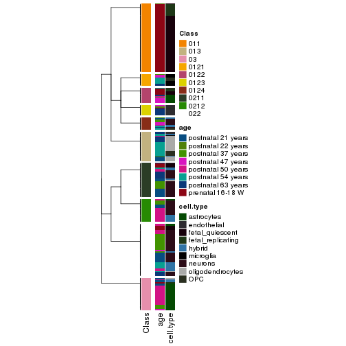</p>

</div>
<div id='tab-collect-classes-from-hierarchical-partition-6'>
<pre><code class="r">collect_classes(res_rh, merge_node = merge_node_param(min_n_signatures = 1988))
</code></pre>

<p></p>

</div>
<div id='tab-collect-classes-from-hierarchical-partition-7'>
<pre><code class="r">collect_classes(res_rh, merge_node = merge_node_param(min_n_signatures = 3159))
</code></pre>

<p></p>

</div>
<div id='tab-collect-classes-from-hierarchical-partition-8'>
<pre><code class="r">collect_classes(res_rh, merge_node = merge_node_param(min_n_signatures = 3358))
</code></pre>

<p></p>

</div>
<div id='tab-collect-classes-from-hierarchical-partition-9'>
<pre><code class="r">collect_classes(res_rh, merge_node = merge_node_param(min_n_signatures = 7110))
</code></pre>

<p></p>

</div>
</div>

Following shows the table of the partitions (You need to click the **show/hide
code output** link to see it).


<script>
$( function() {
	$( '#tabs-get-classes-from-hierarchical-partition' ).tabs();
} );
</script>
<div id='tabs-get-classes-from-hierarchical-partition'>
<ul>
<li><a href='#tab-get-classes-from-hierarchical-partition-1'>n_signatures ≥ 701</a></li>
<li><a href='#tab-get-classes-from-hierarchical-partition-2'>n_signatures ≥ 839</a></li>
<li><a href='#tab-get-classes-from-hierarchical-partition-3'>n_signatures ≥ 865</a></li>
<li><a href='#tab-get-classes-from-hierarchical-partition-4'>n_signatures ≥ 982</a></li>
<li><a href='#tab-get-classes-from-hierarchical-partition-5'>n_signatures ≥ 1450</a></li>
<li><a href='#tab-get-classes-from-hierarchical-partition-6'>n_signatures ≥ 1988</a></li>
<li><a href='#tab-get-classes-from-hierarchical-partition-7'>n_signatures ≥ 3159</a></li>
<li><a href='#tab-get-classes-from-hierarchical-partition-8'>n_signatures ≥ 3358</a></li>
<li><a href='#tab-get-classes-from-hierarchical-partition-9'>n_signatures ≥ 7110</a></li>
</ul>

<div id='tab-get-classes-from-hierarchical-partition-1'>
<p><a id='tab-get-classes-from-hierarchical-partition-1-a' style='color:#0366d6' href='#'>show/hide code output</a></p>
<pre><code class="r">get_classes(res_rh, merge_node = merge_node_param(min_n_signatures = 701))
</code></pre>

<pre><code>#&gt; GSM1657871 GSM1657872 GSM1657873 GSM1657874 GSM1657875 GSM1657876 GSM1657877 GSM1657878 GSM1657879 
#&gt;     &quot;0133&quot;      &quot;022&quot;     &quot;0133&quot;      &quot;022&quot;      &quot;022&quot;     &quot;0132&quot;     &quot;0133&quot;     &quot;0124&quot;      &quot;022&quot; 
#&gt; GSM1657880 GSM1657881 GSM1657882 GSM1657883 GSM1657884 GSM1657885 GSM1657886 GSM1657887 GSM1657888 
#&gt;     &quot;0133&quot;     &quot;0133&quot;      &quot;022&quot;     &quot;0211&quot;      &quot;022&quot;     &quot;0122&quot;      &quot;022&quot;      &quot;022&quot;      &quot;022&quot; 
#&gt; GSM1657889 GSM1657890 GSM1657891 GSM1657892 GSM1657893 GSM1657894 GSM1657895 GSM1657896 GSM1657897 
#&gt;     &quot;0133&quot;     &quot;0133&quot;     &quot;0133&quot;     &quot;0133&quot;     &quot;0132&quot;     &quot;0133&quot;     &quot;0211&quot;      &quot;022&quot;     &quot;0133&quot; 
#&gt; GSM1657898 GSM1657899 GSM1657900 GSM1657901 GSM1657902 GSM1657903 GSM1657904 GSM1657905 GSM1657906 
#&gt;      &quot;022&quot;     &quot;0133&quot;     &quot;0133&quot;     &quot;0133&quot;     &quot;0133&quot;     &quot;0121&quot;     &quot;0121&quot;     &quot;0124&quot;     &quot;0132&quot; 
#&gt; GSM1657907 GSM1657908 GSM1657909 GSM1657910 GSM1657911 GSM1657912 GSM1657913 GSM1657914 GSM1657915 
#&gt;     &quot;0132&quot;     &quot;0132&quot;     &quot;0121&quot;     &quot;0121&quot;     &quot;0122&quot;     &quot;0211&quot;     &quot;0132&quot;     &quot;0124&quot;     &quot;0124&quot; 
#&gt; GSM1657916 GSM1657917 GSM1657918 GSM1657919 GSM1657920 GSM1657921 GSM1657922 GSM1657923 GSM1657924 
#&gt;     &quot;0132&quot;     &quot;0132&quot;     &quot;0132&quot;     &quot;0121&quot;     &quot;0121&quot;     &quot;0124&quot;     &quot;0132&quot;     &quot;0133&quot;     &quot;0121&quot; 
#&gt; GSM1657925 GSM1657926 GSM1657927 GSM1657928 GSM1657929 GSM1657930 GSM1657931 GSM1657932 GSM1657933 
#&gt;     &quot;0121&quot;     &quot;0121&quot;     &quot;0121&quot;     &quot;0124&quot;     &quot;0124&quot;     &quot;0212&quot;      &quot;022&quot;      &quot;033&quot;      &quot;022&quot; 
#&gt; GSM1657934 GSM1657935 GSM1657936 GSM1657937 GSM1657938 GSM1657939 GSM1657940 GSM1657941 GSM1657942 
#&gt;     &quot;0121&quot;      &quot;022&quot;      &quot;022&quot;      &quot;022&quot;      &quot;033&quot;     &quot;0124&quot;      &quot;022&quot;     &quot;0124&quot;      &quot;022&quot; 
#&gt; GSM1657943 GSM1657944 GSM1657945 GSM1657946 GSM1657947 GSM1657948 GSM1657949 GSM1657950 GSM1657951 
#&gt;      &quot;022&quot;     &quot;0131&quot;      &quot;022&quot;     &quot;0212&quot;      &quot;022&quot;     &quot;0124&quot;      &quot;022&quot;      &quot;022&quot;     &quot;0124&quot; 
#&gt; GSM1657952 GSM1657953 GSM1657954 GSM1657955 GSM1657956 GSM1657957 GSM1657958 GSM1657959 GSM1657960 
#&gt;     &quot;0211&quot;     &quot;0122&quot;      &quot;022&quot;      &quot;022&quot;     &quot;0211&quot;     &quot;0211&quot;     &quot;0211&quot;      &quot;022&quot;     &quot;0212&quot; 
#&gt; GSM1657961 GSM1657962 GSM1657963 GSM1657964 GSM1657965 GSM1657966 GSM1657967 GSM1657968 GSM1657969 
#&gt;      &quot;022&quot;     &quot;0212&quot;     &quot;0211&quot;      &quot;022&quot;      &quot;033&quot;     &quot;0211&quot;     &quot;0211&quot;      &quot;022&quot;     &quot;0122&quot; 
#&gt; GSM1657970 GSM1657971 GSM1657972 GSM1657973 GSM1657974 GSM1657975 GSM1657976 GSM1657977 GSM1657978 
#&gt;      &quot;022&quot;     &quot;0212&quot;     &quot;0123&quot;     &quot;0211&quot;      &quot;022&quot;      &quot;033&quot;      &quot;022&quot;     &quot;0212&quot;      &quot;022&quot; 
#&gt; GSM1657979 GSM1657980 GSM1657981 GSM1657982 GSM1657983 GSM1657984 GSM1657985 GSM1657986 GSM1657987 
#&gt;      &quot;033&quot;      &quot;022&quot;      &quot;033&quot;     &quot;0212&quot;      &quot;022&quot;      &quot;022&quot;      &quot;022&quot;     &quot;0211&quot;     &quot;0211&quot; 
#&gt; GSM1657988 GSM1657989 GSM1657990 GSM1657991 GSM1657992 GSM1657993 GSM1657994 GSM1657995 GSM1657996 
#&gt;      &quot;022&quot;     &quot;0124&quot;     &quot;0211&quot;      &quot;022&quot;     &quot;0122&quot;     &quot;0123&quot;     &quot;0121&quot;     &quot;0123&quot;     &quot;0121&quot; 
#&gt; GSM1657997 GSM1657998 GSM1657999 GSM1658000 GSM1658001 GSM1658002 GSM1658003 GSM1658004 GSM1658005 
#&gt;     &quot;0121&quot;     &quot;0122&quot;     &quot;0121&quot;     &quot;0122&quot;     &quot;0124&quot;     &quot;0211&quot;    &quot;01121&quot;     &quot;0123&quot;      &quot;022&quot; 
#&gt; GSM1658006 GSM1658007 GSM1658008 GSM1658009 GSM1658010 GSM1658011 GSM1658012 GSM1658013 GSM1658014 
#&gt;      &quot;031&quot;      &quot;031&quot;     &quot;0211&quot;     &quot;0212&quot;     &quot;0212&quot;     &quot;0212&quot;     &quot;0211&quot;     &quot;0212&quot;     &quot;0212&quot; 
#&gt; GSM1658015 GSM1658016 GSM1658017 GSM1658018 GSM1658019 GSM1658020 GSM1658021 GSM1658022 GSM1658023 
#&gt;     &quot;0212&quot;      &quot;033&quot;      &quot;033&quot;     &quot;0131&quot;     &quot;0212&quot;      &quot;033&quot;      &quot;033&quot;     &quot;0212&quot;      &quot;022&quot; 
#&gt; GSM1658024 GSM1658025 GSM1658026 GSM1658027 GSM1658028 GSM1658029 GSM1658030 GSM1658031 GSM1658032 
#&gt;      &quot;033&quot;      &quot;022&quot;      &quot;033&quot;      &quot;033&quot;     &quot;0212&quot;      &quot;031&quot;      &quot;022&quot;      &quot;033&quot;     &quot;0212&quot; 
#&gt; GSM1658033 GSM1658034 GSM1658035 GSM1658036 GSM1658037 GSM1658038 GSM1658039 GSM1658040 GSM1658041 
#&gt;     &quot;0212&quot;     &quot;0212&quot;      &quot;022&quot;     &quot;0124&quot;     &quot;0212&quot;      &quot;022&quot;      &quot;022&quot;     &quot;0212&quot;     &quot;0212&quot; 
#&gt; GSM1658042 GSM1658043 GSM1658044 GSM1658045 GSM1658046 GSM1658047 GSM1658048 GSM1658049 GSM1658050 
#&gt;      &quot;022&quot;      &quot;031&quot;      &quot;022&quot;      &quot;033&quot;      &quot;022&quot;     &quot;0212&quot;      &quot;032&quot;     &quot;0122&quot;      &quot;031&quot; 
#&gt; GSM1658051 GSM1658052 GSM1658053 GSM1658054 GSM1658055 GSM1658056 GSM1658057 GSM1658058 GSM1658059 
#&gt;      &quot;031&quot;     &quot;0212&quot;      &quot;022&quot;      &quot;031&quot;      &quot;022&quot;      &quot;031&quot;     &quot;0212&quot;     &quot;0211&quot;      &quot;031&quot; 
#&gt; GSM1658060 GSM1658061 GSM1658062 GSM1658063 GSM1658064 GSM1658065 GSM1658066 GSM1658067 GSM1658068 
#&gt;     &quot;0212&quot;      &quot;031&quot;      &quot;022&quot;     &quot;0212&quot;      &quot;031&quot;      &quot;031&quot;      &quot;031&quot;      &quot;031&quot;      &quot;031&quot; 
#&gt; GSM1658069 GSM1658070 GSM1658071 GSM1658072 GSM1658073 GSM1658074 GSM1658075 GSM1658076 GSM1658077 
#&gt;      &quot;031&quot;     &quot;0212&quot;      &quot;031&quot;      &quot;031&quot;      &quot;031&quot;     &quot;0212&quot;     &quot;0212&quot;     &quot;0211&quot;      &quot;022&quot; 
#&gt; GSM1658078 GSM1658079 GSM1658080 GSM1658081 GSM1658082 GSM1658083 GSM1658084 GSM1658085 GSM1658086 
#&gt;      &quot;031&quot;      &quot;031&quot;     &quot;0212&quot;      &quot;033&quot;      &quot;031&quot;     &quot;0123&quot;     &quot;0211&quot;     &quot;0131&quot;     &quot;0123&quot; 
#&gt; GSM1658087 GSM1658088 GSM1658089 GSM1658090 GSM1658091 GSM1658092 GSM1658093 GSM1658094 GSM1658095 
#&gt;     &quot;0211&quot;     &quot;0131&quot;     &quot;0123&quot;     &quot;0211&quot;     &quot;0211&quot;     &quot;0123&quot;     &quot;0133&quot;     &quot;0123&quot;      &quot;022&quot; 
#&gt; GSM1658096 GSM1658097 GSM1658098 GSM1658099 GSM1658100 GSM1658101 GSM1658102 GSM1658103 GSM1658104 
#&gt;     &quot;0123&quot;     &quot;0131&quot;     &quot;0123&quot;     &quot;0123&quot;     &quot;0211&quot;     &quot;0211&quot;     &quot;0123&quot;     &quot;0211&quot;      &quot;022&quot; 
#&gt; GSM1658105 GSM1658106 GSM1658107 GSM1658108 GSM1658109 GSM1658110 GSM1658111 GSM1658112 GSM1658113 
#&gt;     &quot;0211&quot;      &quot;022&quot;     &quot;0211&quot;      &quot;022&quot;     &quot;0131&quot;     &quot;0211&quot;     &quot;0211&quot;     &quot;0131&quot;      &quot;022&quot; 
#&gt; GSM1658114 GSM1658115 GSM1658116 GSM1658117 GSM1658118 GSM1658119 GSM1658120 GSM1658121 GSM1658122 
#&gt;      &quot;022&quot;      &quot;022&quot;     &quot;0121&quot;     &quot;0123&quot;     &quot;0131&quot;     &quot;0131&quot;     &quot;0131&quot;     &quot;0211&quot;     &quot;0123&quot; 
#&gt; GSM1658123 GSM1658124 GSM1658125 GSM1658126 GSM1658127 GSM1658128 GSM1658129 GSM1658130 GSM1658131 
#&gt;     &quot;0131&quot;     &quot;0131&quot;     &quot;0133&quot;     &quot;0123&quot;     &quot;0211&quot;      &quot;022&quot;     &quot;0211&quot;      &quot;032&quot;      &quot;022&quot; 
#&gt; GSM1658132 GSM1658133 GSM1658134 GSM1658135 GSM1658136 GSM1658137 GSM1658138 GSM1658139 GSM1658140 
#&gt;     &quot;0211&quot;      &quot;032&quot;     &quot;0211&quot;      &quot;022&quot;     &quot;0124&quot;     &quot;0211&quot;      &quot;022&quot;      &quot;022&quot;     &quot;0211&quot; 
#&gt; GSM1658141 GSM1658142 GSM1658143 GSM1658144 GSM1658145 GSM1658146 GSM1658147 GSM1658148 GSM1658149 
#&gt;     &quot;0212&quot;      &quot;032&quot;      &quot;022&quot;     &quot;0132&quot;     &quot;0211&quot;      &quot;022&quot;     &quot;0212&quot;     &quot;0212&quot;      &quot;022&quot; 
#&gt; GSM1658150 GSM1658151 GSM1658152 GSM1658153 GSM1658154 GSM1658155 GSM1658156 GSM1658157 GSM1658158 
#&gt;      &quot;022&quot;      &quot;022&quot;      &quot;022&quot;      &quot;022&quot;     &quot;0124&quot;     &quot;0131&quot;     &quot;0212&quot;     &quot;0211&quot;     &quot;0211&quot; 
#&gt; GSM1658159 GSM1658160 GSM1658161 GSM1658162 GSM1658163 GSM1658164 GSM1658165 GSM1658166 GSM1658167 
#&gt;      &quot;032&quot;     &quot;0211&quot;      &quot;032&quot;     &quot;0131&quot;     &quot;0211&quot;     &quot;0131&quot;     &quot;0211&quot;     &quot;0211&quot;     &quot;0131&quot; 
#&gt; GSM1658168 GSM1658169 GSM1658170 GSM1658171 GSM1658172 GSM1658173 GSM1658174 GSM1658175 GSM1658176 
#&gt;      &quot;033&quot;     &quot;0211&quot;     &quot;0212&quot;      &quot;022&quot;     &quot;0211&quot;     &quot;0131&quot;      &quot;033&quot;      &quot;022&quot;     &quot;0211&quot; 
#&gt; GSM1658177 GSM1658178 GSM1658179 GSM1658180 GSM1658181 GSM1658182 GSM1658183 GSM1658184 GSM1658185 
#&gt;     &quot;0211&quot;      &quot;032&quot;     &quot;0211&quot;     &quot;0131&quot;      &quot;022&quot;     &quot;0212&quot;      &quot;032&quot;      &quot;033&quot;     &quot;0122&quot; 
#&gt; GSM1658186 GSM1658187 GSM1658188 GSM1658189 GSM1658190 GSM1658191 GSM1658192 GSM1658193 GSM1658194 
#&gt;     &quot;0122&quot;     &quot;0122&quot;     &quot;0121&quot;     &quot;0121&quot;     &quot;0122&quot;     &quot;0122&quot;      &quot;022&quot;     &quot;0122&quot;     &quot;0124&quot; 
#&gt; GSM1658195 GSM1658196 GSM1658197 GSM1658198 GSM1658199 GSM1658200 GSM1658201 GSM1658202 GSM1658203 
#&gt;      &quot;022&quot;     &quot;0121&quot;     &quot;0124&quot;     &quot;0124&quot;     &quot;0122&quot;     &quot;0124&quot;      &quot;033&quot;     &quot;0122&quot;    &quot;01122&quot; 
#&gt; GSM1658204 GSM1658205 GSM1658206 GSM1658207 GSM1658208 GSM1658209 GSM1658210 GSM1658211 GSM1658212 
#&gt;    &quot;01122&quot;     &quot;0122&quot;    &quot;01122&quot;    &quot;01122&quot;     &quot;0122&quot;    &quot;01122&quot;     &quot;0123&quot;    &quot;01122&quot;    &quot;01121&quot; 
#&gt; GSM1658213 GSM1658214 GSM1658215 GSM1658216 GSM1658217 GSM1658218 GSM1658219 GSM1658220 GSM1658221 
#&gt;      &quot;032&quot;    &quot;01122&quot;      &quot;032&quot;    &quot;01122&quot;     &quot;0122&quot;    &quot;01122&quot;    &quot;01122&quot;    &quot;01122&quot;    &quot;01121&quot; 
#&gt; GSM1658222 GSM1658223 GSM1658224 GSM1658225 GSM1658226 GSM1658227 GSM1658228 GSM1658229 GSM1658230 
#&gt;    &quot;01122&quot;     &quot;0122&quot;    &quot;01122&quot;     &quot;0122&quot;    &quot;01121&quot;    &quot;01121&quot;    &quot;01122&quot;     &quot;0111&quot;    &quot;01121&quot; 
#&gt; GSM1658231 GSM1658232 GSM1658233 GSM1658234 GSM1658235 GSM1658236 GSM1658237 GSM1658238 GSM1658239 
#&gt;     &quot;0111&quot;    &quot;01121&quot;     &quot;0111&quot;    &quot;01121&quot;     &quot;0111&quot;    &quot;01121&quot;     &quot;0111&quot;     &quot;0111&quot;     &quot;0111&quot; 
#&gt; GSM1658240 GSM1658241 GSM1658242 GSM1658243 GSM1658244 GSM1658245 GSM1658246 GSM1658247 GSM1658248 
#&gt;     &quot;0111&quot;     &quot;0111&quot;    &quot;01122&quot;     &quot;0111&quot;     &quot;0111&quot;     &quot;0122&quot;     &quot;0111&quot;     &quot;0111&quot;      &quot;022&quot; 
#&gt; GSM1658249 GSM1658251 GSM1658253 GSM1658255 GSM1658257 GSM1658259 GSM1658262 GSM1658264 GSM1658266 
#&gt;     &quot;0111&quot;     &quot;0111&quot;     &quot;0111&quot;      &quot;022&quot;     &quot;0211&quot;     &quot;0211&quot;     &quot;0111&quot;    &quot;01121&quot;     &quot;0111&quot; 
#&gt; GSM1658268 GSM1658270 GSM1658272 GSM1658275 GSM1658277 GSM1658279 GSM1658281 GSM1658284 GSM1658286 
#&gt;      &quot;022&quot;     &quot;0111&quot;     &quot;0111&quot;    &quot;01121&quot;     &quot;0122&quot;     &quot;0111&quot;      &quot;022&quot;     &quot;0111&quot;     &quot;0111&quot; 
#&gt; GSM1658288 GSM1658290 GSM1658292 GSM1658294 GSM1658297 GSM1658299 GSM1658301 GSM1658304 GSM1658305 
#&gt;    &quot;01121&quot;     &quot;0111&quot;     &quot;0111&quot;      &quot;022&quot;    &quot;01121&quot;     &quot;0211&quot;     &quot;0111&quot;     &quot;0122&quot;     &quot;0111&quot; 
#&gt; GSM1658306 GSM1658307 GSM1658308 GSM1658309 GSM1658310 GSM1658311 GSM1658312 GSM1658313 GSM1658314 
#&gt;    &quot;01121&quot;     &quot;0111&quot;    &quot;01121&quot;    &quot;01121&quot;     &quot;0111&quot;    &quot;01121&quot;     &quot;0111&quot;      &quot;022&quot;     &quot;0111&quot; 
#&gt; GSM1658315 GSM1658316 GSM1658317 GSM1658318 GSM1658319 GSM1658320 GSM1658321 GSM1658322 GSM1658323 
#&gt;    &quot;01121&quot;    &quot;01121&quot;     &quot;0111&quot;     &quot;0111&quot;    &quot;01121&quot;    &quot;01121&quot;     &quot;0111&quot;     &quot;0111&quot;     &quot;0211&quot; 
#&gt; GSM1658324 GSM1658325 GSM1658326 GSM1658327 GSM1658328 GSM1658329 GSM1658330 GSM1658331 GSM1658332 
#&gt;    &quot;01121&quot;    &quot;01121&quot;    &quot;01121&quot;     &quot;0111&quot;     &quot;0111&quot;    &quot;01121&quot;     &quot;0111&quot;     &quot;0122&quot;    &quot;01121&quot; 
#&gt; GSM1658333 GSM1658334 GSM1658335 GSM1658336 GSM1658337 GSM1658338 GSM1658339 GSM1658340 GSM1658341 
#&gt;    &quot;01121&quot;    &quot;01121&quot;     &quot;0111&quot;     &quot;0111&quot;    &quot;01121&quot;     &quot;0111&quot;     &quot;0211&quot;     &quot;0111&quot;    &quot;01121&quot; 
#&gt; GSM1658342 GSM1658343 GSM1658344 GSM1658345 GSM1658346 GSM1658347 GSM1658348 GSM1658349 GSM1658350 
#&gt;     &quot;0111&quot;     &quot;0111&quot;     &quot;0111&quot;    &quot;01121&quot;     &quot;0111&quot;    &quot;01122&quot;      &quot;022&quot;     &quot;0111&quot;     &quot;0111&quot; 
#&gt; GSM1658351 GSM1658352 GSM1658353 GSM1658354 GSM1658355 GSM1658356 GSM1658357 GSM1658358 GSM1658359 
#&gt;     &quot;0111&quot;     &quot;0211&quot;    &quot;01121&quot;     &quot;0111&quot;    &quot;01122&quot;     &quot;0111&quot;    &quot;01121&quot;     &quot;0111&quot;    &quot;01121&quot; 
#&gt; GSM1658360 GSM1658361 GSM1658362 GSM1658363 GSM1658364 GSM1658365 GSM1658366 
#&gt;    &quot;01121&quot;    &quot;01121&quot;     &quot;0111&quot;     &quot;0111&quot;    &quot;01121&quot;     &quot;0111&quot;    &quot;01121&quot;
</code></pre>

<script>
$('#tab-get-classes-from-hierarchical-partition-1-a').parent().next().next().hide();
$('#tab-get-classes-from-hierarchical-partition-1-a').click(function(){
  $('#tab-get-classes-from-hierarchical-partition-1-a').parent().next().next().toggle();
  return(false);
});
</script>
</div>

<div id='tab-get-classes-from-hierarchical-partition-2'>
<p><a id='tab-get-classes-from-hierarchical-partition-2-a' style='color:#0366d6' href='#'>show/hide code output</a></p>
<pre><code class="r">get_classes(res_rh, merge_node = merge_node_param(min_n_signatures = 839))
</code></pre>

<pre><code>#&gt; GSM1657871 GSM1657872 GSM1657873 GSM1657874 GSM1657875 GSM1657876 GSM1657877 GSM1657878 GSM1657879 
#&gt;     &quot;0133&quot;      &quot;022&quot;     &quot;0133&quot;      &quot;022&quot;      &quot;022&quot;     &quot;0132&quot;     &quot;0133&quot;     &quot;0124&quot;      &quot;022&quot; 
#&gt; GSM1657880 GSM1657881 GSM1657882 GSM1657883 GSM1657884 GSM1657885 GSM1657886 GSM1657887 GSM1657888 
#&gt;     &quot;0133&quot;     &quot;0133&quot;      &quot;022&quot;     &quot;0211&quot;      &quot;022&quot;     &quot;0122&quot;      &quot;022&quot;      &quot;022&quot;      &quot;022&quot; 
#&gt; GSM1657889 GSM1657890 GSM1657891 GSM1657892 GSM1657893 GSM1657894 GSM1657895 GSM1657896 GSM1657897 
#&gt;     &quot;0133&quot;     &quot;0133&quot;     &quot;0133&quot;     &quot;0133&quot;     &quot;0132&quot;     &quot;0133&quot;     &quot;0211&quot;      &quot;022&quot;     &quot;0133&quot; 
#&gt; GSM1657898 GSM1657899 GSM1657900 GSM1657901 GSM1657902 GSM1657903 GSM1657904 GSM1657905 GSM1657906 
#&gt;      &quot;022&quot;     &quot;0133&quot;     &quot;0133&quot;     &quot;0133&quot;     &quot;0133&quot;     &quot;0121&quot;     &quot;0121&quot;     &quot;0124&quot;     &quot;0132&quot; 
#&gt; GSM1657907 GSM1657908 GSM1657909 GSM1657910 GSM1657911 GSM1657912 GSM1657913 GSM1657914 GSM1657915 
#&gt;     &quot;0132&quot;     &quot;0132&quot;     &quot;0121&quot;     &quot;0121&quot;     &quot;0122&quot;     &quot;0211&quot;     &quot;0132&quot;     &quot;0124&quot;     &quot;0124&quot; 
#&gt; GSM1657916 GSM1657917 GSM1657918 GSM1657919 GSM1657920 GSM1657921 GSM1657922 GSM1657923 GSM1657924 
#&gt;     &quot;0132&quot;     &quot;0132&quot;     &quot;0132&quot;     &quot;0121&quot;     &quot;0121&quot;     &quot;0124&quot;     &quot;0132&quot;     &quot;0133&quot;     &quot;0121&quot; 
#&gt; GSM1657925 GSM1657926 GSM1657927 GSM1657928 GSM1657929 GSM1657930 GSM1657931 GSM1657932 GSM1657933 
#&gt;     &quot;0121&quot;     &quot;0121&quot;     &quot;0121&quot;     &quot;0124&quot;     &quot;0124&quot;     &quot;0212&quot;      &quot;022&quot;      &quot;033&quot;      &quot;022&quot; 
#&gt; GSM1657934 GSM1657935 GSM1657936 GSM1657937 GSM1657938 GSM1657939 GSM1657940 GSM1657941 GSM1657942 
#&gt;     &quot;0121&quot;      &quot;022&quot;      &quot;022&quot;      &quot;022&quot;      &quot;033&quot;     &quot;0124&quot;      &quot;022&quot;     &quot;0124&quot;      &quot;022&quot; 
#&gt; GSM1657943 GSM1657944 GSM1657945 GSM1657946 GSM1657947 GSM1657948 GSM1657949 GSM1657950 GSM1657951 
#&gt;      &quot;022&quot;     &quot;0131&quot;      &quot;022&quot;     &quot;0212&quot;      &quot;022&quot;     &quot;0124&quot;      &quot;022&quot;      &quot;022&quot;     &quot;0124&quot; 
#&gt; GSM1657952 GSM1657953 GSM1657954 GSM1657955 GSM1657956 GSM1657957 GSM1657958 GSM1657959 GSM1657960 
#&gt;     &quot;0211&quot;     &quot;0122&quot;      &quot;022&quot;      &quot;022&quot;     &quot;0211&quot;     &quot;0211&quot;     &quot;0211&quot;      &quot;022&quot;     &quot;0212&quot; 
#&gt; GSM1657961 GSM1657962 GSM1657963 GSM1657964 GSM1657965 GSM1657966 GSM1657967 GSM1657968 GSM1657969 
#&gt;      &quot;022&quot;     &quot;0212&quot;     &quot;0211&quot;      &quot;022&quot;      &quot;033&quot;     &quot;0211&quot;     &quot;0211&quot;      &quot;022&quot;     &quot;0122&quot; 
#&gt; GSM1657970 GSM1657971 GSM1657972 GSM1657973 GSM1657974 GSM1657975 GSM1657976 GSM1657977 GSM1657978 
#&gt;      &quot;022&quot;     &quot;0212&quot;     &quot;0123&quot;     &quot;0211&quot;      &quot;022&quot;      &quot;033&quot;      &quot;022&quot;     &quot;0212&quot;      &quot;022&quot; 
#&gt; GSM1657979 GSM1657980 GSM1657981 GSM1657982 GSM1657983 GSM1657984 GSM1657985 GSM1657986 GSM1657987 
#&gt;      &quot;033&quot;      &quot;022&quot;      &quot;033&quot;     &quot;0212&quot;      &quot;022&quot;      &quot;022&quot;      &quot;022&quot;     &quot;0211&quot;     &quot;0211&quot; 
#&gt; GSM1657988 GSM1657989 GSM1657990 GSM1657991 GSM1657992 GSM1657993 GSM1657994 GSM1657995 GSM1657996 
#&gt;      &quot;022&quot;     &quot;0124&quot;     &quot;0211&quot;      &quot;022&quot;     &quot;0122&quot;     &quot;0123&quot;     &quot;0121&quot;     &quot;0123&quot;     &quot;0121&quot; 
#&gt; GSM1657997 GSM1657998 GSM1657999 GSM1658000 GSM1658001 GSM1658002 GSM1658003 GSM1658004 GSM1658005 
#&gt;     &quot;0121&quot;     &quot;0122&quot;     &quot;0121&quot;     &quot;0122&quot;     &quot;0124&quot;     &quot;0211&quot;     &quot;0112&quot;     &quot;0123&quot;      &quot;022&quot; 
#&gt; GSM1658006 GSM1658007 GSM1658008 GSM1658009 GSM1658010 GSM1658011 GSM1658012 GSM1658013 GSM1658014 
#&gt;      &quot;031&quot;      &quot;031&quot;     &quot;0211&quot;     &quot;0212&quot;     &quot;0212&quot;     &quot;0212&quot;     &quot;0211&quot;     &quot;0212&quot;     &quot;0212&quot; 
#&gt; GSM1658015 GSM1658016 GSM1658017 GSM1658018 GSM1658019 GSM1658020 GSM1658021 GSM1658022 GSM1658023 
#&gt;     &quot;0212&quot;      &quot;033&quot;      &quot;033&quot;     &quot;0131&quot;     &quot;0212&quot;      &quot;033&quot;      &quot;033&quot;     &quot;0212&quot;      &quot;022&quot; 
#&gt; GSM1658024 GSM1658025 GSM1658026 GSM1658027 GSM1658028 GSM1658029 GSM1658030 GSM1658031 GSM1658032 
#&gt;      &quot;033&quot;      &quot;022&quot;      &quot;033&quot;      &quot;033&quot;     &quot;0212&quot;      &quot;031&quot;      &quot;022&quot;      &quot;033&quot;     &quot;0212&quot; 
#&gt; GSM1658033 GSM1658034 GSM1658035 GSM1658036 GSM1658037 GSM1658038 GSM1658039 GSM1658040 GSM1658041 
#&gt;     &quot;0212&quot;     &quot;0212&quot;      &quot;022&quot;     &quot;0124&quot;     &quot;0212&quot;      &quot;022&quot;      &quot;022&quot;     &quot;0212&quot;     &quot;0212&quot; 
#&gt; GSM1658042 GSM1658043 GSM1658044 GSM1658045 GSM1658046 GSM1658047 GSM1658048 GSM1658049 GSM1658050 
#&gt;      &quot;022&quot;      &quot;031&quot;      &quot;022&quot;      &quot;033&quot;      &quot;022&quot;     &quot;0212&quot;      &quot;032&quot;     &quot;0122&quot;      &quot;031&quot; 
#&gt; GSM1658051 GSM1658052 GSM1658053 GSM1658054 GSM1658055 GSM1658056 GSM1658057 GSM1658058 GSM1658059 
#&gt;      &quot;031&quot;     &quot;0212&quot;      &quot;022&quot;      &quot;031&quot;      &quot;022&quot;      &quot;031&quot;     &quot;0212&quot;     &quot;0211&quot;      &quot;031&quot; 
#&gt; GSM1658060 GSM1658061 GSM1658062 GSM1658063 GSM1658064 GSM1658065 GSM1658066 GSM1658067 GSM1658068 
#&gt;     &quot;0212&quot;      &quot;031&quot;      &quot;022&quot;     &quot;0212&quot;      &quot;031&quot;      &quot;031&quot;      &quot;031&quot;      &quot;031&quot;      &quot;031&quot; 
#&gt; GSM1658069 GSM1658070 GSM1658071 GSM1658072 GSM1658073 GSM1658074 GSM1658075 GSM1658076 GSM1658077 
#&gt;      &quot;031&quot;     &quot;0212&quot;      &quot;031&quot;      &quot;031&quot;      &quot;031&quot;     &quot;0212&quot;     &quot;0212&quot;     &quot;0211&quot;      &quot;022&quot; 
#&gt; GSM1658078 GSM1658079 GSM1658080 GSM1658081 GSM1658082 GSM1658083 GSM1658084 GSM1658085 GSM1658086 
#&gt;      &quot;031&quot;      &quot;031&quot;     &quot;0212&quot;      &quot;033&quot;      &quot;031&quot;     &quot;0123&quot;     &quot;0211&quot;     &quot;0131&quot;     &quot;0123&quot; 
#&gt; GSM1658087 GSM1658088 GSM1658089 GSM1658090 GSM1658091 GSM1658092 GSM1658093 GSM1658094 GSM1658095 
#&gt;     &quot;0211&quot;     &quot;0131&quot;     &quot;0123&quot;     &quot;0211&quot;     &quot;0211&quot;     &quot;0123&quot;     &quot;0133&quot;     &quot;0123&quot;      &quot;022&quot; 
#&gt; GSM1658096 GSM1658097 GSM1658098 GSM1658099 GSM1658100 GSM1658101 GSM1658102 GSM1658103 GSM1658104 
#&gt;     &quot;0123&quot;     &quot;0131&quot;     &quot;0123&quot;     &quot;0123&quot;     &quot;0211&quot;     &quot;0211&quot;     &quot;0123&quot;     &quot;0211&quot;      &quot;022&quot; 
#&gt; GSM1658105 GSM1658106 GSM1658107 GSM1658108 GSM1658109 GSM1658110 GSM1658111 GSM1658112 GSM1658113 
#&gt;     &quot;0211&quot;      &quot;022&quot;     &quot;0211&quot;      &quot;022&quot;     &quot;0131&quot;     &quot;0211&quot;     &quot;0211&quot;     &quot;0131&quot;      &quot;022&quot; 
#&gt; GSM1658114 GSM1658115 GSM1658116 GSM1658117 GSM1658118 GSM1658119 GSM1658120 GSM1658121 GSM1658122 
#&gt;      &quot;022&quot;      &quot;022&quot;     &quot;0121&quot;     &quot;0123&quot;     &quot;0131&quot;     &quot;0131&quot;     &quot;0131&quot;     &quot;0211&quot;     &quot;0123&quot; 
#&gt; GSM1658123 GSM1658124 GSM1658125 GSM1658126 GSM1658127 GSM1658128 GSM1658129 GSM1658130 GSM1658131 
#&gt;     &quot;0131&quot;     &quot;0131&quot;     &quot;0133&quot;     &quot;0123&quot;     &quot;0211&quot;      &quot;022&quot;     &quot;0211&quot;      &quot;032&quot;      &quot;022&quot; 
#&gt; GSM1658132 GSM1658133 GSM1658134 GSM1658135 GSM1658136 GSM1658137 GSM1658138 GSM1658139 GSM1658140 
#&gt;     &quot;0211&quot;      &quot;032&quot;     &quot;0211&quot;      &quot;022&quot;     &quot;0124&quot;     &quot;0211&quot;      &quot;022&quot;      &quot;022&quot;     &quot;0211&quot; 
#&gt; GSM1658141 GSM1658142 GSM1658143 GSM1658144 GSM1658145 GSM1658146 GSM1658147 GSM1658148 GSM1658149 
#&gt;     &quot;0212&quot;      &quot;032&quot;      &quot;022&quot;     &quot;0132&quot;     &quot;0211&quot;      &quot;022&quot;     &quot;0212&quot;     &quot;0212&quot;      &quot;022&quot; 
#&gt; GSM1658150 GSM1658151 GSM1658152 GSM1658153 GSM1658154 GSM1658155 GSM1658156 GSM1658157 GSM1658158 
#&gt;      &quot;022&quot;      &quot;022&quot;      &quot;022&quot;      &quot;022&quot;     &quot;0124&quot;     &quot;0131&quot;     &quot;0212&quot;     &quot;0211&quot;     &quot;0211&quot; 
#&gt; GSM1658159 GSM1658160 GSM1658161 GSM1658162 GSM1658163 GSM1658164 GSM1658165 GSM1658166 GSM1658167 
#&gt;      &quot;032&quot;     &quot;0211&quot;      &quot;032&quot;     &quot;0131&quot;     &quot;0211&quot;     &quot;0131&quot;     &quot;0211&quot;     &quot;0211&quot;     &quot;0131&quot; 
#&gt; GSM1658168 GSM1658169 GSM1658170 GSM1658171 GSM1658172 GSM1658173 GSM1658174 GSM1658175 GSM1658176 
#&gt;      &quot;033&quot;     &quot;0211&quot;     &quot;0212&quot;      &quot;022&quot;     &quot;0211&quot;     &quot;0131&quot;      &quot;033&quot;      &quot;022&quot;     &quot;0211&quot; 
#&gt; GSM1658177 GSM1658178 GSM1658179 GSM1658180 GSM1658181 GSM1658182 GSM1658183 GSM1658184 GSM1658185 
#&gt;     &quot;0211&quot;      &quot;032&quot;     &quot;0211&quot;     &quot;0131&quot;      &quot;022&quot;     &quot;0212&quot;      &quot;032&quot;      &quot;033&quot;     &quot;0122&quot; 
#&gt; GSM1658186 GSM1658187 GSM1658188 GSM1658189 GSM1658190 GSM1658191 GSM1658192 GSM1658193 GSM1658194 
#&gt;     &quot;0122&quot;     &quot;0122&quot;     &quot;0121&quot;     &quot;0121&quot;     &quot;0122&quot;     &quot;0122&quot;      &quot;022&quot;     &quot;0122&quot;     &quot;0124&quot; 
#&gt; GSM1658195 GSM1658196 GSM1658197 GSM1658198 GSM1658199 GSM1658200 GSM1658201 GSM1658202 GSM1658203 
#&gt;      &quot;022&quot;     &quot;0121&quot;     &quot;0124&quot;     &quot;0124&quot;     &quot;0122&quot;     &quot;0124&quot;      &quot;033&quot;     &quot;0122&quot;     &quot;0112&quot; 
#&gt; GSM1658204 GSM1658205 GSM1658206 GSM1658207 GSM1658208 GSM1658209 GSM1658210 GSM1658211 GSM1658212 
#&gt;     &quot;0112&quot;     &quot;0122&quot;     &quot;0112&quot;     &quot;0112&quot;     &quot;0122&quot;     &quot;0112&quot;     &quot;0123&quot;     &quot;0112&quot;     &quot;0112&quot; 
#&gt; GSM1658213 GSM1658214 GSM1658215 GSM1658216 GSM1658217 GSM1658218 GSM1658219 GSM1658220 GSM1658221 
#&gt;      &quot;032&quot;     &quot;0112&quot;      &quot;032&quot;     &quot;0112&quot;     &quot;0122&quot;     &quot;0112&quot;     &quot;0112&quot;     &quot;0112&quot;     &quot;0112&quot; 
#&gt; GSM1658222 GSM1658223 GSM1658224 GSM1658225 GSM1658226 GSM1658227 GSM1658228 GSM1658229 GSM1658230 
#&gt;     &quot;0112&quot;     &quot;0122&quot;     &quot;0112&quot;     &quot;0122&quot;     &quot;0112&quot;     &quot;0112&quot;     &quot;0112&quot;     &quot;0111&quot;     &quot;0112&quot; 
#&gt; GSM1658231 GSM1658232 GSM1658233 GSM1658234 GSM1658235 GSM1658236 GSM1658237 GSM1658238 GSM1658239 
#&gt;     &quot;0111&quot;     &quot;0112&quot;     &quot;0111&quot;     &quot;0112&quot;     &quot;0111&quot;     &quot;0112&quot;     &quot;0111&quot;     &quot;0111&quot;     &quot;0111&quot; 
#&gt; GSM1658240 GSM1658241 GSM1658242 GSM1658243 GSM1658244 GSM1658245 GSM1658246 GSM1658247 GSM1658248 
#&gt;     &quot;0111&quot;     &quot;0111&quot;     &quot;0112&quot;     &quot;0111&quot;     &quot;0111&quot;     &quot;0122&quot;     &quot;0111&quot;     &quot;0111&quot;      &quot;022&quot; 
#&gt; GSM1658249 GSM1658251 GSM1658253 GSM1658255 GSM1658257 GSM1658259 GSM1658262 GSM1658264 GSM1658266 
#&gt;     &quot;0111&quot;     &quot;0111&quot;     &quot;0111&quot;      &quot;022&quot;     &quot;0211&quot;     &quot;0211&quot;     &quot;0111&quot;     &quot;0112&quot;     &quot;0111&quot; 
#&gt; GSM1658268 GSM1658270 GSM1658272 GSM1658275 GSM1658277 GSM1658279 GSM1658281 GSM1658284 GSM1658286 
#&gt;      &quot;022&quot;     &quot;0111&quot;     &quot;0111&quot;     &quot;0112&quot;     &quot;0122&quot;     &quot;0111&quot;      &quot;022&quot;     &quot;0111&quot;     &quot;0111&quot; 
#&gt; GSM1658288 GSM1658290 GSM1658292 GSM1658294 GSM1658297 GSM1658299 GSM1658301 GSM1658304 GSM1658305 
#&gt;     &quot;0112&quot;     &quot;0111&quot;     &quot;0111&quot;      &quot;022&quot;     &quot;0112&quot;     &quot;0211&quot;     &quot;0111&quot;     &quot;0122&quot;     &quot;0111&quot; 
#&gt; GSM1658306 GSM1658307 GSM1658308 GSM1658309 GSM1658310 GSM1658311 GSM1658312 GSM1658313 GSM1658314 
#&gt;     &quot;0112&quot;     &quot;0111&quot;     &quot;0112&quot;     &quot;0112&quot;     &quot;0111&quot;     &quot;0112&quot;     &quot;0111&quot;      &quot;022&quot;     &quot;0111&quot; 
#&gt; GSM1658315 GSM1658316 GSM1658317 GSM1658318 GSM1658319 GSM1658320 GSM1658321 GSM1658322 GSM1658323 
#&gt;     &quot;0112&quot;     &quot;0112&quot;     &quot;0111&quot;     &quot;0111&quot;     &quot;0112&quot;     &quot;0112&quot;     &quot;0111&quot;     &quot;0111&quot;     &quot;0211&quot; 
#&gt; GSM1658324 GSM1658325 GSM1658326 GSM1658327 GSM1658328 GSM1658329 GSM1658330 GSM1658331 GSM1658332 
#&gt;     &quot;0112&quot;     &quot;0112&quot;     &quot;0112&quot;     &quot;0111&quot;     &quot;0111&quot;     &quot;0112&quot;     &quot;0111&quot;     &quot;0122&quot;     &quot;0112&quot; 
#&gt; GSM1658333 GSM1658334 GSM1658335 GSM1658336 GSM1658337 GSM1658338 GSM1658339 GSM1658340 GSM1658341 
#&gt;     &quot;0112&quot;     &quot;0112&quot;     &quot;0111&quot;     &quot;0111&quot;     &quot;0112&quot;     &quot;0111&quot;     &quot;0211&quot;     &quot;0111&quot;     &quot;0112&quot; 
#&gt; GSM1658342 GSM1658343 GSM1658344 GSM1658345 GSM1658346 GSM1658347 GSM1658348 GSM1658349 GSM1658350 
#&gt;     &quot;0111&quot;     &quot;0111&quot;     &quot;0111&quot;     &quot;0112&quot;     &quot;0111&quot;     &quot;0112&quot;      &quot;022&quot;     &quot;0111&quot;     &quot;0111&quot; 
#&gt; GSM1658351 GSM1658352 GSM1658353 GSM1658354 GSM1658355 GSM1658356 GSM1658357 GSM1658358 GSM1658359 
#&gt;     &quot;0111&quot;     &quot;0211&quot;     &quot;0112&quot;     &quot;0111&quot;     &quot;0112&quot;     &quot;0111&quot;     &quot;0112&quot;     &quot;0111&quot;     &quot;0112&quot; 
#&gt; GSM1658360 GSM1658361 GSM1658362 GSM1658363 GSM1658364 GSM1658365 GSM1658366 
#&gt;     &quot;0112&quot;     &quot;0112&quot;     &quot;0111&quot;     &quot;0111&quot;     &quot;0112&quot;     &quot;0111&quot;     &quot;0112&quot;
</code></pre>

<script>
$('#tab-get-classes-from-hierarchical-partition-2-a').parent().next().next().hide();
$('#tab-get-classes-from-hierarchical-partition-2-a').click(function(){
  $('#tab-get-classes-from-hierarchical-partition-2-a').parent().next().next().toggle();
  return(false);
});
</script>
</div>

<div id='tab-get-classes-from-hierarchical-partition-3'>
<p><a id='tab-get-classes-from-hierarchical-partition-3-a' style='color:#0366d6' href='#'>show/hide code output</a></p>
<pre><code class="r">get_classes(res_rh, merge_node = merge_node_param(min_n_signatures = 865))
</code></pre>

<pre><code>#&gt; GSM1657871 GSM1657872 GSM1657873 GSM1657874 GSM1657875 GSM1657876 GSM1657877 GSM1657878 GSM1657879 
#&gt;     &quot;0133&quot;      &quot;022&quot;     &quot;0133&quot;      &quot;022&quot;      &quot;022&quot;     &quot;0132&quot;     &quot;0133&quot;     &quot;0124&quot;      &quot;022&quot; 
#&gt; GSM1657880 GSM1657881 GSM1657882 GSM1657883 GSM1657884 GSM1657885 GSM1657886 GSM1657887 GSM1657888 
#&gt;     &quot;0133&quot;     &quot;0133&quot;      &quot;022&quot;     &quot;0211&quot;      &quot;022&quot;     &quot;0122&quot;      &quot;022&quot;      &quot;022&quot;      &quot;022&quot; 
#&gt; GSM1657889 GSM1657890 GSM1657891 GSM1657892 GSM1657893 GSM1657894 GSM1657895 GSM1657896 GSM1657897 
#&gt;     &quot;0133&quot;     &quot;0133&quot;     &quot;0133&quot;     &quot;0133&quot;     &quot;0132&quot;     &quot;0133&quot;     &quot;0211&quot;      &quot;022&quot;     &quot;0133&quot; 
#&gt; GSM1657898 GSM1657899 GSM1657900 GSM1657901 GSM1657902 GSM1657903 GSM1657904 GSM1657905 GSM1657906 
#&gt;      &quot;022&quot;     &quot;0133&quot;     &quot;0133&quot;     &quot;0133&quot;     &quot;0133&quot;     &quot;0121&quot;     &quot;0121&quot;     &quot;0124&quot;     &quot;0132&quot; 
#&gt; GSM1657907 GSM1657908 GSM1657909 GSM1657910 GSM1657911 GSM1657912 GSM1657913 GSM1657914 GSM1657915 
#&gt;     &quot;0132&quot;     &quot;0132&quot;     &quot;0121&quot;     &quot;0121&quot;     &quot;0122&quot;     &quot;0211&quot;     &quot;0132&quot;     &quot;0124&quot;     &quot;0124&quot; 
#&gt; GSM1657916 GSM1657917 GSM1657918 GSM1657919 GSM1657920 GSM1657921 GSM1657922 GSM1657923 GSM1657924 
#&gt;     &quot;0132&quot;     &quot;0132&quot;     &quot;0132&quot;     &quot;0121&quot;     &quot;0121&quot;     &quot;0124&quot;     &quot;0132&quot;     &quot;0133&quot;     &quot;0121&quot; 
#&gt; GSM1657925 GSM1657926 GSM1657927 GSM1657928 GSM1657929 GSM1657930 GSM1657931 GSM1657932 GSM1657933 
#&gt;     &quot;0121&quot;     &quot;0121&quot;     &quot;0121&quot;     &quot;0124&quot;     &quot;0124&quot;     &quot;0212&quot;      &quot;022&quot;      &quot;033&quot;      &quot;022&quot; 
#&gt; GSM1657934 GSM1657935 GSM1657936 GSM1657937 GSM1657938 GSM1657939 GSM1657940 GSM1657941 GSM1657942 
#&gt;     &quot;0121&quot;      &quot;022&quot;      &quot;022&quot;      &quot;022&quot;      &quot;033&quot;     &quot;0124&quot;      &quot;022&quot;     &quot;0124&quot;      &quot;022&quot; 
#&gt; GSM1657943 GSM1657944 GSM1657945 GSM1657946 GSM1657947 GSM1657948 GSM1657949 GSM1657950 GSM1657951 
#&gt;      &quot;022&quot;     &quot;0131&quot;      &quot;022&quot;     &quot;0212&quot;      &quot;022&quot;     &quot;0124&quot;      &quot;022&quot;      &quot;022&quot;     &quot;0124&quot; 
#&gt; GSM1657952 GSM1657953 GSM1657954 GSM1657955 GSM1657956 GSM1657957 GSM1657958 GSM1657959 GSM1657960 
#&gt;     &quot;0211&quot;     &quot;0122&quot;      &quot;022&quot;      &quot;022&quot;     &quot;0211&quot;     &quot;0211&quot;     &quot;0211&quot;      &quot;022&quot;     &quot;0212&quot; 
#&gt; GSM1657961 GSM1657962 GSM1657963 GSM1657964 GSM1657965 GSM1657966 GSM1657967 GSM1657968 GSM1657969 
#&gt;      &quot;022&quot;     &quot;0212&quot;     &quot;0211&quot;      &quot;022&quot;      &quot;033&quot;     &quot;0211&quot;     &quot;0211&quot;      &quot;022&quot;     &quot;0122&quot; 
#&gt; GSM1657970 GSM1657971 GSM1657972 GSM1657973 GSM1657974 GSM1657975 GSM1657976 GSM1657977 GSM1657978 
#&gt;      &quot;022&quot;     &quot;0212&quot;     &quot;0123&quot;     &quot;0211&quot;      &quot;022&quot;      &quot;033&quot;      &quot;022&quot;     &quot;0212&quot;      &quot;022&quot; 
#&gt; GSM1657979 GSM1657980 GSM1657981 GSM1657982 GSM1657983 GSM1657984 GSM1657985 GSM1657986 GSM1657987 
#&gt;      &quot;033&quot;      &quot;022&quot;      &quot;033&quot;     &quot;0212&quot;      &quot;022&quot;      &quot;022&quot;      &quot;022&quot;     &quot;0211&quot;     &quot;0211&quot; 
#&gt; GSM1657988 GSM1657989 GSM1657990 GSM1657991 GSM1657992 GSM1657993 GSM1657994 GSM1657995 GSM1657996 
#&gt;      &quot;022&quot;     &quot;0124&quot;     &quot;0211&quot;      &quot;022&quot;     &quot;0122&quot;     &quot;0123&quot;     &quot;0121&quot;     &quot;0123&quot;     &quot;0121&quot; 
#&gt; GSM1657997 GSM1657998 GSM1657999 GSM1658000 GSM1658001 GSM1658002 GSM1658003 GSM1658004 GSM1658005 
#&gt;     &quot;0121&quot;     &quot;0122&quot;     &quot;0121&quot;     &quot;0122&quot;     &quot;0124&quot;     &quot;0211&quot;      &quot;011&quot;     &quot;0123&quot;      &quot;022&quot; 
#&gt; GSM1658006 GSM1658007 GSM1658008 GSM1658009 GSM1658010 GSM1658011 GSM1658012 GSM1658013 GSM1658014 
#&gt;      &quot;031&quot;      &quot;031&quot;     &quot;0211&quot;     &quot;0212&quot;     &quot;0212&quot;     &quot;0212&quot;     &quot;0211&quot;     &quot;0212&quot;     &quot;0212&quot; 
#&gt; GSM1658015 GSM1658016 GSM1658017 GSM1658018 GSM1658019 GSM1658020 GSM1658021 GSM1658022 GSM1658023 
#&gt;     &quot;0212&quot;      &quot;033&quot;      &quot;033&quot;     &quot;0131&quot;     &quot;0212&quot;      &quot;033&quot;      &quot;033&quot;     &quot;0212&quot;      &quot;022&quot; 
#&gt; GSM1658024 GSM1658025 GSM1658026 GSM1658027 GSM1658028 GSM1658029 GSM1658030 GSM1658031 GSM1658032 
#&gt;      &quot;033&quot;      &quot;022&quot;      &quot;033&quot;      &quot;033&quot;     &quot;0212&quot;      &quot;031&quot;      &quot;022&quot;      &quot;033&quot;     &quot;0212&quot; 
#&gt; GSM1658033 GSM1658034 GSM1658035 GSM1658036 GSM1658037 GSM1658038 GSM1658039 GSM1658040 GSM1658041 
#&gt;     &quot;0212&quot;     &quot;0212&quot;      &quot;022&quot;     &quot;0124&quot;     &quot;0212&quot;      &quot;022&quot;      &quot;022&quot;     &quot;0212&quot;     &quot;0212&quot; 
#&gt; GSM1658042 GSM1658043 GSM1658044 GSM1658045 GSM1658046 GSM1658047 GSM1658048 GSM1658049 GSM1658050 
#&gt;      &quot;022&quot;      &quot;031&quot;      &quot;022&quot;      &quot;033&quot;      &quot;022&quot;     &quot;0212&quot;      &quot;032&quot;     &quot;0122&quot;      &quot;031&quot; 
#&gt; GSM1658051 GSM1658052 GSM1658053 GSM1658054 GSM1658055 GSM1658056 GSM1658057 GSM1658058 GSM1658059 
#&gt;      &quot;031&quot;     &quot;0212&quot;      &quot;022&quot;      &quot;031&quot;      &quot;022&quot;      &quot;031&quot;     &quot;0212&quot;     &quot;0211&quot;      &quot;031&quot; 
#&gt; GSM1658060 GSM1658061 GSM1658062 GSM1658063 GSM1658064 GSM1658065 GSM1658066 GSM1658067 GSM1658068 
#&gt;     &quot;0212&quot;      &quot;031&quot;      &quot;022&quot;     &quot;0212&quot;      &quot;031&quot;      &quot;031&quot;      &quot;031&quot;      &quot;031&quot;      &quot;031&quot; 
#&gt; GSM1658069 GSM1658070 GSM1658071 GSM1658072 GSM1658073 GSM1658074 GSM1658075 GSM1658076 GSM1658077 
#&gt;      &quot;031&quot;     &quot;0212&quot;      &quot;031&quot;      &quot;031&quot;      &quot;031&quot;     &quot;0212&quot;     &quot;0212&quot;     &quot;0211&quot;      &quot;022&quot; 
#&gt; GSM1658078 GSM1658079 GSM1658080 GSM1658081 GSM1658082 GSM1658083 GSM1658084 GSM1658085 GSM1658086 
#&gt;      &quot;031&quot;      &quot;031&quot;     &quot;0212&quot;      &quot;033&quot;      &quot;031&quot;     &quot;0123&quot;     &quot;0211&quot;     &quot;0131&quot;     &quot;0123&quot; 
#&gt; GSM1658087 GSM1658088 GSM1658089 GSM1658090 GSM1658091 GSM1658092 GSM1658093 GSM1658094 GSM1658095 
#&gt;     &quot;0211&quot;     &quot;0131&quot;     &quot;0123&quot;     &quot;0211&quot;     &quot;0211&quot;     &quot;0123&quot;     &quot;0133&quot;     &quot;0123&quot;      &quot;022&quot; 
#&gt; GSM1658096 GSM1658097 GSM1658098 GSM1658099 GSM1658100 GSM1658101 GSM1658102 GSM1658103 GSM1658104 
#&gt;     &quot;0123&quot;     &quot;0131&quot;     &quot;0123&quot;     &quot;0123&quot;     &quot;0211&quot;     &quot;0211&quot;     &quot;0123&quot;     &quot;0211&quot;      &quot;022&quot; 
#&gt; GSM1658105 GSM1658106 GSM1658107 GSM1658108 GSM1658109 GSM1658110 GSM1658111 GSM1658112 GSM1658113 
#&gt;     &quot;0211&quot;      &quot;022&quot;     &quot;0211&quot;      &quot;022&quot;     &quot;0131&quot;     &quot;0211&quot;     &quot;0211&quot;     &quot;0131&quot;      &quot;022&quot; 
#&gt; GSM1658114 GSM1658115 GSM1658116 GSM1658117 GSM1658118 GSM1658119 GSM1658120 GSM1658121 GSM1658122 
#&gt;      &quot;022&quot;      &quot;022&quot;     &quot;0121&quot;     &quot;0123&quot;     &quot;0131&quot;     &quot;0131&quot;     &quot;0131&quot;     &quot;0211&quot;     &quot;0123&quot; 
#&gt; GSM1658123 GSM1658124 GSM1658125 GSM1658126 GSM1658127 GSM1658128 GSM1658129 GSM1658130 GSM1658131 
#&gt;     &quot;0131&quot;     &quot;0131&quot;     &quot;0133&quot;     &quot;0123&quot;     &quot;0211&quot;      &quot;022&quot;     &quot;0211&quot;      &quot;032&quot;      &quot;022&quot; 
#&gt; GSM1658132 GSM1658133 GSM1658134 GSM1658135 GSM1658136 GSM1658137 GSM1658138 GSM1658139 GSM1658140 
#&gt;     &quot;0211&quot;      &quot;032&quot;     &quot;0211&quot;      &quot;022&quot;     &quot;0124&quot;     &quot;0211&quot;      &quot;022&quot;      &quot;022&quot;     &quot;0211&quot; 
#&gt; GSM1658141 GSM1658142 GSM1658143 GSM1658144 GSM1658145 GSM1658146 GSM1658147 GSM1658148 GSM1658149 
#&gt;     &quot;0212&quot;      &quot;032&quot;      &quot;022&quot;     &quot;0132&quot;     &quot;0211&quot;      &quot;022&quot;     &quot;0212&quot;     &quot;0212&quot;      &quot;022&quot; 
#&gt; GSM1658150 GSM1658151 GSM1658152 GSM1658153 GSM1658154 GSM1658155 GSM1658156 GSM1658157 GSM1658158 
#&gt;      &quot;022&quot;      &quot;022&quot;      &quot;022&quot;      &quot;022&quot;     &quot;0124&quot;     &quot;0131&quot;     &quot;0212&quot;     &quot;0211&quot;     &quot;0211&quot; 
#&gt; GSM1658159 GSM1658160 GSM1658161 GSM1658162 GSM1658163 GSM1658164 GSM1658165 GSM1658166 GSM1658167 
#&gt;      &quot;032&quot;     &quot;0211&quot;      &quot;032&quot;     &quot;0131&quot;     &quot;0211&quot;     &quot;0131&quot;     &quot;0211&quot;     &quot;0211&quot;     &quot;0131&quot; 
#&gt; GSM1658168 GSM1658169 GSM1658170 GSM1658171 GSM1658172 GSM1658173 GSM1658174 GSM1658175 GSM1658176 
#&gt;      &quot;033&quot;     &quot;0211&quot;     &quot;0212&quot;      &quot;022&quot;     &quot;0211&quot;     &quot;0131&quot;      &quot;033&quot;      &quot;022&quot;     &quot;0211&quot; 
#&gt; GSM1658177 GSM1658178 GSM1658179 GSM1658180 GSM1658181 GSM1658182 GSM1658183 GSM1658184 GSM1658185 
#&gt;     &quot;0211&quot;      &quot;032&quot;     &quot;0211&quot;     &quot;0131&quot;      &quot;022&quot;     &quot;0212&quot;      &quot;032&quot;      &quot;033&quot;     &quot;0122&quot; 
#&gt; GSM1658186 GSM1658187 GSM1658188 GSM1658189 GSM1658190 GSM1658191 GSM1658192 GSM1658193 GSM1658194 
#&gt;     &quot;0122&quot;     &quot;0122&quot;     &quot;0121&quot;     &quot;0121&quot;     &quot;0122&quot;     &quot;0122&quot;      &quot;022&quot;     &quot;0122&quot;     &quot;0124&quot; 
#&gt; GSM1658195 GSM1658196 GSM1658197 GSM1658198 GSM1658199 GSM1658200 GSM1658201 GSM1658202 GSM1658203 
#&gt;      &quot;022&quot;     &quot;0121&quot;     &quot;0124&quot;     &quot;0124&quot;     &quot;0122&quot;     &quot;0124&quot;      &quot;033&quot;     &quot;0122&quot;      &quot;011&quot; 
#&gt; GSM1658204 GSM1658205 GSM1658206 GSM1658207 GSM1658208 GSM1658209 GSM1658210 GSM1658211 GSM1658212 
#&gt;      &quot;011&quot;     &quot;0122&quot;      &quot;011&quot;      &quot;011&quot;     &quot;0122&quot;      &quot;011&quot;     &quot;0123&quot;      &quot;011&quot;      &quot;011&quot; 
#&gt; GSM1658213 GSM1658214 GSM1658215 GSM1658216 GSM1658217 GSM1658218 GSM1658219 GSM1658220 GSM1658221 
#&gt;      &quot;032&quot;      &quot;011&quot;      &quot;032&quot;      &quot;011&quot;     &quot;0122&quot;      &quot;011&quot;      &quot;011&quot;      &quot;011&quot;      &quot;011&quot; 
#&gt; GSM1658222 GSM1658223 GSM1658224 GSM1658225 GSM1658226 GSM1658227 GSM1658228 GSM1658229 GSM1658230 
#&gt;      &quot;011&quot;     &quot;0122&quot;      &quot;011&quot;     &quot;0122&quot;      &quot;011&quot;      &quot;011&quot;      &quot;011&quot;      &quot;011&quot;      &quot;011&quot; 
#&gt; GSM1658231 GSM1658232 GSM1658233 GSM1658234 GSM1658235 GSM1658236 GSM1658237 GSM1658238 GSM1658239 
#&gt;      &quot;011&quot;      &quot;011&quot;      &quot;011&quot;      &quot;011&quot;      &quot;011&quot;      &quot;011&quot;      &quot;011&quot;      &quot;011&quot;      &quot;011&quot; 
#&gt; GSM1658240 GSM1658241 GSM1658242 GSM1658243 GSM1658244 GSM1658245 GSM1658246 GSM1658247 GSM1658248 
#&gt;      &quot;011&quot;      &quot;011&quot;      &quot;011&quot;      &quot;011&quot;      &quot;011&quot;     &quot;0122&quot;      &quot;011&quot;      &quot;011&quot;      &quot;022&quot; 
#&gt; GSM1658249 GSM1658251 GSM1658253 GSM1658255 GSM1658257 GSM1658259 GSM1658262 GSM1658264 GSM1658266 
#&gt;      &quot;011&quot;      &quot;011&quot;      &quot;011&quot;      &quot;022&quot;     &quot;0211&quot;     &quot;0211&quot;      &quot;011&quot;      &quot;011&quot;      &quot;011&quot; 
#&gt; GSM1658268 GSM1658270 GSM1658272 GSM1658275 GSM1658277 GSM1658279 GSM1658281 GSM1658284 GSM1658286 
#&gt;      &quot;022&quot;      &quot;011&quot;      &quot;011&quot;      &quot;011&quot;     &quot;0122&quot;      &quot;011&quot;      &quot;022&quot;      &quot;011&quot;      &quot;011&quot; 
#&gt; GSM1658288 GSM1658290 GSM1658292 GSM1658294 GSM1658297 GSM1658299 GSM1658301 GSM1658304 GSM1658305 
#&gt;      &quot;011&quot;      &quot;011&quot;      &quot;011&quot;      &quot;022&quot;      &quot;011&quot;     &quot;0211&quot;      &quot;011&quot;     &quot;0122&quot;      &quot;011&quot; 
#&gt; GSM1658306 GSM1658307 GSM1658308 GSM1658309 GSM1658310 GSM1658311 GSM1658312 GSM1658313 GSM1658314 
#&gt;      &quot;011&quot;      &quot;011&quot;      &quot;011&quot;      &quot;011&quot;      &quot;011&quot;      &quot;011&quot;      &quot;011&quot;      &quot;022&quot;      &quot;011&quot; 
#&gt; GSM1658315 GSM1658316 GSM1658317 GSM1658318 GSM1658319 GSM1658320 GSM1658321 GSM1658322 GSM1658323 
#&gt;      &quot;011&quot;      &quot;011&quot;      &quot;011&quot;      &quot;011&quot;      &quot;011&quot;      &quot;011&quot;      &quot;011&quot;      &quot;011&quot;     &quot;0211&quot; 
#&gt; GSM1658324 GSM1658325 GSM1658326 GSM1658327 GSM1658328 GSM1658329 GSM1658330 GSM1658331 GSM1658332 
#&gt;      &quot;011&quot;      &quot;011&quot;      &quot;011&quot;      &quot;011&quot;      &quot;011&quot;      &quot;011&quot;      &quot;011&quot;     &quot;0122&quot;      &quot;011&quot; 
#&gt; GSM1658333 GSM1658334 GSM1658335 GSM1658336 GSM1658337 GSM1658338 GSM1658339 GSM1658340 GSM1658341 
#&gt;      &quot;011&quot;      &quot;011&quot;      &quot;011&quot;      &quot;011&quot;      &quot;011&quot;      &quot;011&quot;     &quot;0211&quot;      &quot;011&quot;      &quot;011&quot; 
#&gt; GSM1658342 GSM1658343 GSM1658344 GSM1658345 GSM1658346 GSM1658347 GSM1658348 GSM1658349 GSM1658350 
#&gt;      &quot;011&quot;      &quot;011&quot;      &quot;011&quot;      &quot;011&quot;      &quot;011&quot;      &quot;011&quot;      &quot;022&quot;      &quot;011&quot;      &quot;011&quot; 
#&gt; GSM1658351 GSM1658352 GSM1658353 GSM1658354 GSM1658355 GSM1658356 GSM1658357 GSM1658358 GSM1658359 
#&gt;      &quot;011&quot;     &quot;0211&quot;      &quot;011&quot;      &quot;011&quot;      &quot;011&quot;      &quot;011&quot;      &quot;011&quot;      &quot;011&quot;      &quot;011&quot; 
#&gt; GSM1658360 GSM1658361 GSM1658362 GSM1658363 GSM1658364 GSM1658365 GSM1658366 
#&gt;      &quot;011&quot;      &quot;011&quot;      &quot;011&quot;      &quot;011&quot;      &quot;011&quot;      &quot;011&quot;      &quot;011&quot;
</code></pre>

<script>
$('#tab-get-classes-from-hierarchical-partition-3-a').parent().next().next().hide();
$('#tab-get-classes-from-hierarchical-partition-3-a').click(function(){
  $('#tab-get-classes-from-hierarchical-partition-3-a').parent().next().next().toggle();
  return(false);
});
</script>
</div>

<div id='tab-get-classes-from-hierarchical-partition-4'>
<p><a id='tab-get-classes-from-hierarchical-partition-4-a' style='color:#0366d6' href='#'>show/hide code output</a></p>
<pre><code class="r">get_classes(res_rh, merge_node = merge_node_param(min_n_signatures = 982))
</code></pre>

<pre><code>#&gt; GSM1657871 GSM1657872 GSM1657873 GSM1657874 GSM1657875 GSM1657876 GSM1657877 GSM1657878 GSM1657879 
#&gt;      &quot;013&quot;      &quot;022&quot;      &quot;013&quot;      &quot;022&quot;      &quot;022&quot;      &quot;013&quot;      &quot;013&quot;     &quot;0124&quot;      &quot;022&quot; 
#&gt; GSM1657880 GSM1657881 GSM1657882 GSM1657883 GSM1657884 GSM1657885 GSM1657886 GSM1657887 GSM1657888 
#&gt;      &quot;013&quot;      &quot;013&quot;      &quot;022&quot;     &quot;0211&quot;      &quot;022&quot;     &quot;0122&quot;      &quot;022&quot;      &quot;022&quot;      &quot;022&quot; 
#&gt; GSM1657889 GSM1657890 GSM1657891 GSM1657892 GSM1657893 GSM1657894 GSM1657895 GSM1657896 GSM1657897 
#&gt;      &quot;013&quot;      &quot;013&quot;      &quot;013&quot;      &quot;013&quot;      &quot;013&quot;      &quot;013&quot;     &quot;0211&quot;      &quot;022&quot;      &quot;013&quot; 
#&gt; GSM1657898 GSM1657899 GSM1657900 GSM1657901 GSM1657902 GSM1657903 GSM1657904 GSM1657905 GSM1657906 
#&gt;      &quot;022&quot;      &quot;013&quot;      &quot;013&quot;      &quot;013&quot;      &quot;013&quot;     &quot;0121&quot;     &quot;0121&quot;     &quot;0124&quot;      &quot;013&quot; 
#&gt; GSM1657907 GSM1657908 GSM1657909 GSM1657910 GSM1657911 GSM1657912 GSM1657913 GSM1657914 GSM1657915 
#&gt;      &quot;013&quot;      &quot;013&quot;     &quot;0121&quot;     &quot;0121&quot;     &quot;0122&quot;     &quot;0211&quot;      &quot;013&quot;     &quot;0124&quot;     &quot;0124&quot; 
#&gt; GSM1657916 GSM1657917 GSM1657918 GSM1657919 GSM1657920 GSM1657921 GSM1657922 GSM1657923 GSM1657924 
#&gt;      &quot;013&quot;      &quot;013&quot;      &quot;013&quot;     &quot;0121&quot;     &quot;0121&quot;     &quot;0124&quot;      &quot;013&quot;      &quot;013&quot;     &quot;0121&quot; 
#&gt; GSM1657925 GSM1657926 GSM1657927 GSM1657928 GSM1657929 GSM1657930 GSM1657931 GSM1657932 GSM1657933 
#&gt;     &quot;0121&quot;     &quot;0121&quot;     &quot;0121&quot;     &quot;0124&quot;     &quot;0124&quot;     &quot;0212&quot;      &quot;022&quot;      &quot;033&quot;      &quot;022&quot; 
#&gt; GSM1657934 GSM1657935 GSM1657936 GSM1657937 GSM1657938 GSM1657939 GSM1657940 GSM1657941 GSM1657942 
#&gt;     &quot;0121&quot;      &quot;022&quot;      &quot;022&quot;      &quot;022&quot;      &quot;033&quot;     &quot;0124&quot;      &quot;022&quot;     &quot;0124&quot;      &quot;022&quot; 
#&gt; GSM1657943 GSM1657944 GSM1657945 GSM1657946 GSM1657947 GSM1657948 GSM1657949 GSM1657950 GSM1657951 
#&gt;      &quot;022&quot;      &quot;013&quot;      &quot;022&quot;     &quot;0212&quot;      &quot;022&quot;     &quot;0124&quot;      &quot;022&quot;      &quot;022&quot;     &quot;0124&quot; 
#&gt; GSM1657952 GSM1657953 GSM1657954 GSM1657955 GSM1657956 GSM1657957 GSM1657958 GSM1657959 GSM1657960 
#&gt;     &quot;0211&quot;     &quot;0122&quot;      &quot;022&quot;      &quot;022&quot;     &quot;0211&quot;     &quot;0211&quot;     &quot;0211&quot;      &quot;022&quot;     &quot;0212&quot; 
#&gt; GSM1657961 GSM1657962 GSM1657963 GSM1657964 GSM1657965 GSM1657966 GSM1657967 GSM1657968 GSM1657969 
#&gt;      &quot;022&quot;     &quot;0212&quot;     &quot;0211&quot;      &quot;022&quot;      &quot;033&quot;     &quot;0211&quot;     &quot;0211&quot;      &quot;022&quot;     &quot;0122&quot; 
#&gt; GSM1657970 GSM1657971 GSM1657972 GSM1657973 GSM1657974 GSM1657975 GSM1657976 GSM1657977 GSM1657978 
#&gt;      &quot;022&quot;     &quot;0212&quot;     &quot;0123&quot;     &quot;0211&quot;      &quot;022&quot;      &quot;033&quot;      &quot;022&quot;     &quot;0212&quot;      &quot;022&quot; 
#&gt; GSM1657979 GSM1657980 GSM1657981 GSM1657982 GSM1657983 GSM1657984 GSM1657985 GSM1657986 GSM1657987 
#&gt;      &quot;033&quot;      &quot;022&quot;      &quot;033&quot;     &quot;0212&quot;      &quot;022&quot;      &quot;022&quot;      &quot;022&quot;     &quot;0211&quot;     &quot;0211&quot; 
#&gt; GSM1657988 GSM1657989 GSM1657990 GSM1657991 GSM1657992 GSM1657993 GSM1657994 GSM1657995 GSM1657996 
#&gt;      &quot;022&quot;     &quot;0124&quot;     &quot;0211&quot;      &quot;022&quot;     &quot;0122&quot;     &quot;0123&quot;     &quot;0121&quot;     &quot;0123&quot;     &quot;0121&quot; 
#&gt; GSM1657997 GSM1657998 GSM1657999 GSM1658000 GSM1658001 GSM1658002 GSM1658003 GSM1658004 GSM1658005 
#&gt;     &quot;0121&quot;     &quot;0122&quot;     &quot;0121&quot;     &quot;0122&quot;     &quot;0124&quot;     &quot;0211&quot;      &quot;011&quot;     &quot;0123&quot;      &quot;022&quot; 
#&gt; GSM1658006 GSM1658007 GSM1658008 GSM1658009 GSM1658010 GSM1658011 GSM1658012 GSM1658013 GSM1658014 
#&gt;      &quot;031&quot;      &quot;031&quot;     &quot;0211&quot;     &quot;0212&quot;     &quot;0212&quot;     &quot;0212&quot;     &quot;0211&quot;     &quot;0212&quot;     &quot;0212&quot; 
#&gt; GSM1658015 GSM1658016 GSM1658017 GSM1658018 GSM1658019 GSM1658020 GSM1658021 GSM1658022 GSM1658023 
#&gt;     &quot;0212&quot;      &quot;033&quot;      &quot;033&quot;      &quot;013&quot;     &quot;0212&quot;      &quot;033&quot;      &quot;033&quot;     &quot;0212&quot;      &quot;022&quot; 
#&gt; GSM1658024 GSM1658025 GSM1658026 GSM1658027 GSM1658028 GSM1658029 GSM1658030 GSM1658031 GSM1658032 
#&gt;      &quot;033&quot;      &quot;022&quot;      &quot;033&quot;      &quot;033&quot;     &quot;0212&quot;      &quot;031&quot;      &quot;022&quot;      &quot;033&quot;     &quot;0212&quot; 
#&gt; GSM1658033 GSM1658034 GSM1658035 GSM1658036 GSM1658037 GSM1658038 GSM1658039 GSM1658040 GSM1658041 
#&gt;     &quot;0212&quot;     &quot;0212&quot;      &quot;022&quot;     &quot;0124&quot;     &quot;0212&quot;      &quot;022&quot;      &quot;022&quot;     &quot;0212&quot;     &quot;0212&quot; 
#&gt; GSM1658042 GSM1658043 GSM1658044 GSM1658045 GSM1658046 GSM1658047 GSM1658048 GSM1658049 GSM1658050 
#&gt;      &quot;022&quot;      &quot;031&quot;      &quot;022&quot;      &quot;033&quot;      &quot;022&quot;     &quot;0212&quot;      &quot;032&quot;     &quot;0122&quot;      &quot;031&quot; 
#&gt; GSM1658051 GSM1658052 GSM1658053 GSM1658054 GSM1658055 GSM1658056 GSM1658057 GSM1658058 GSM1658059 
#&gt;      &quot;031&quot;     &quot;0212&quot;      &quot;022&quot;      &quot;031&quot;      &quot;022&quot;      &quot;031&quot;     &quot;0212&quot;     &quot;0211&quot;      &quot;031&quot; 
#&gt; GSM1658060 GSM1658061 GSM1658062 GSM1658063 GSM1658064 GSM1658065 GSM1658066 GSM1658067 GSM1658068 
#&gt;     &quot;0212&quot;      &quot;031&quot;      &quot;022&quot;     &quot;0212&quot;      &quot;031&quot;      &quot;031&quot;      &quot;031&quot;      &quot;031&quot;      &quot;031&quot; 
#&gt; GSM1658069 GSM1658070 GSM1658071 GSM1658072 GSM1658073 GSM1658074 GSM1658075 GSM1658076 GSM1658077 
#&gt;      &quot;031&quot;     &quot;0212&quot;      &quot;031&quot;      &quot;031&quot;      &quot;031&quot;     &quot;0212&quot;     &quot;0212&quot;     &quot;0211&quot;      &quot;022&quot; 
#&gt; GSM1658078 GSM1658079 GSM1658080 GSM1658081 GSM1658082 GSM1658083 GSM1658084 GSM1658085 GSM1658086 
#&gt;      &quot;031&quot;      &quot;031&quot;     &quot;0212&quot;      &quot;033&quot;      &quot;031&quot;     &quot;0123&quot;     &quot;0211&quot;      &quot;013&quot;     &quot;0123&quot; 
#&gt; GSM1658087 GSM1658088 GSM1658089 GSM1658090 GSM1658091 GSM1658092 GSM1658093 GSM1658094 GSM1658095 
#&gt;     &quot;0211&quot;      &quot;013&quot;     &quot;0123&quot;     &quot;0211&quot;     &quot;0211&quot;     &quot;0123&quot;      &quot;013&quot;     &quot;0123&quot;      &quot;022&quot; 
#&gt; GSM1658096 GSM1658097 GSM1658098 GSM1658099 GSM1658100 GSM1658101 GSM1658102 GSM1658103 GSM1658104 
#&gt;     &quot;0123&quot;      &quot;013&quot;     &quot;0123&quot;     &quot;0123&quot;     &quot;0211&quot;     &quot;0211&quot;     &quot;0123&quot;     &quot;0211&quot;      &quot;022&quot; 
#&gt; GSM1658105 GSM1658106 GSM1658107 GSM1658108 GSM1658109 GSM1658110 GSM1658111 GSM1658112 GSM1658113 
#&gt;     &quot;0211&quot;      &quot;022&quot;     &quot;0211&quot;      &quot;022&quot;      &quot;013&quot;     &quot;0211&quot;     &quot;0211&quot;      &quot;013&quot;      &quot;022&quot; 
#&gt; GSM1658114 GSM1658115 GSM1658116 GSM1658117 GSM1658118 GSM1658119 GSM1658120 GSM1658121 GSM1658122 
#&gt;      &quot;022&quot;      &quot;022&quot;     &quot;0121&quot;     &quot;0123&quot;      &quot;013&quot;      &quot;013&quot;      &quot;013&quot;     &quot;0211&quot;     &quot;0123&quot; 
#&gt; GSM1658123 GSM1658124 GSM1658125 GSM1658126 GSM1658127 GSM1658128 GSM1658129 GSM1658130 GSM1658131 
#&gt;      &quot;013&quot;      &quot;013&quot;      &quot;013&quot;     &quot;0123&quot;     &quot;0211&quot;      &quot;022&quot;     &quot;0211&quot;      &quot;032&quot;      &quot;022&quot; 
#&gt; GSM1658132 GSM1658133 GSM1658134 GSM1658135 GSM1658136 GSM1658137 GSM1658138 GSM1658139 GSM1658140 
#&gt;     &quot;0211&quot;      &quot;032&quot;     &quot;0211&quot;      &quot;022&quot;     &quot;0124&quot;     &quot;0211&quot;      &quot;022&quot;      &quot;022&quot;     &quot;0211&quot; 
#&gt; GSM1658141 GSM1658142 GSM1658143 GSM1658144 GSM1658145 GSM1658146 GSM1658147 GSM1658148 GSM1658149 
#&gt;     &quot;0212&quot;      &quot;032&quot;      &quot;022&quot;      &quot;013&quot;     &quot;0211&quot;      &quot;022&quot;     &quot;0212&quot;     &quot;0212&quot;      &quot;022&quot; 
#&gt; GSM1658150 GSM1658151 GSM1658152 GSM1658153 GSM1658154 GSM1658155 GSM1658156 GSM1658157 GSM1658158 
#&gt;      &quot;022&quot;      &quot;022&quot;      &quot;022&quot;      &quot;022&quot;     &quot;0124&quot;      &quot;013&quot;     &quot;0212&quot;     &quot;0211&quot;     &quot;0211&quot; 
#&gt; GSM1658159 GSM1658160 GSM1658161 GSM1658162 GSM1658163 GSM1658164 GSM1658165 GSM1658166 GSM1658167 
#&gt;      &quot;032&quot;     &quot;0211&quot;      &quot;032&quot;      &quot;013&quot;     &quot;0211&quot;      &quot;013&quot;     &quot;0211&quot;     &quot;0211&quot;      &quot;013&quot; 
#&gt; GSM1658168 GSM1658169 GSM1658170 GSM1658171 GSM1658172 GSM1658173 GSM1658174 GSM1658175 GSM1658176 
#&gt;      &quot;033&quot;     &quot;0211&quot;     &quot;0212&quot;      &quot;022&quot;     &quot;0211&quot;      &quot;013&quot;      &quot;033&quot;      &quot;022&quot;     &quot;0211&quot; 
#&gt; GSM1658177 GSM1658178 GSM1658179 GSM1658180 GSM1658181 GSM1658182 GSM1658183 GSM1658184 GSM1658185 
#&gt;     &quot;0211&quot;      &quot;032&quot;     &quot;0211&quot;      &quot;013&quot;      &quot;022&quot;     &quot;0212&quot;      &quot;032&quot;      &quot;033&quot;     &quot;0122&quot; 
#&gt; GSM1658186 GSM1658187 GSM1658188 GSM1658189 GSM1658190 GSM1658191 GSM1658192 GSM1658193 GSM1658194 
#&gt;     &quot;0122&quot;     &quot;0122&quot;     &quot;0121&quot;     &quot;0121&quot;     &quot;0122&quot;     &quot;0122&quot;      &quot;022&quot;     &quot;0122&quot;     &quot;0124&quot; 
#&gt; GSM1658195 GSM1658196 GSM1658197 GSM1658198 GSM1658199 GSM1658200 GSM1658201 GSM1658202 GSM1658203 
#&gt;      &quot;022&quot;     &quot;0121&quot;     &quot;0124&quot;     &quot;0124&quot;     &quot;0122&quot;     &quot;0124&quot;      &quot;033&quot;     &quot;0122&quot;      &quot;011&quot; 
#&gt; GSM1658204 GSM1658205 GSM1658206 GSM1658207 GSM1658208 GSM1658209 GSM1658210 GSM1658211 GSM1658212 
#&gt;      &quot;011&quot;     &quot;0122&quot;      &quot;011&quot;      &quot;011&quot;     &quot;0122&quot;      &quot;011&quot;     &quot;0123&quot;      &quot;011&quot;      &quot;011&quot; 
#&gt; GSM1658213 GSM1658214 GSM1658215 GSM1658216 GSM1658217 GSM1658218 GSM1658219 GSM1658220 GSM1658221 
#&gt;      &quot;032&quot;      &quot;011&quot;      &quot;032&quot;      &quot;011&quot;     &quot;0122&quot;      &quot;011&quot;      &quot;011&quot;      &quot;011&quot;      &quot;011&quot; 
#&gt; GSM1658222 GSM1658223 GSM1658224 GSM1658225 GSM1658226 GSM1658227 GSM1658228 GSM1658229 GSM1658230 
#&gt;      &quot;011&quot;     &quot;0122&quot;      &quot;011&quot;     &quot;0122&quot;      &quot;011&quot;      &quot;011&quot;      &quot;011&quot;      &quot;011&quot;      &quot;011&quot; 
#&gt; GSM1658231 GSM1658232 GSM1658233 GSM1658234 GSM1658235 GSM1658236 GSM1658237 GSM1658238 GSM1658239 
#&gt;      &quot;011&quot;      &quot;011&quot;      &quot;011&quot;      &quot;011&quot;      &quot;011&quot;      &quot;011&quot;      &quot;011&quot;      &quot;011&quot;      &quot;011&quot; 
#&gt; GSM1658240 GSM1658241 GSM1658242 GSM1658243 GSM1658244 GSM1658245 GSM1658246 GSM1658247 GSM1658248 
#&gt;      &quot;011&quot;      &quot;011&quot;      &quot;011&quot;      &quot;011&quot;      &quot;011&quot;     &quot;0122&quot;      &quot;011&quot;      &quot;011&quot;      &quot;022&quot; 
#&gt; GSM1658249 GSM1658251 GSM1658253 GSM1658255 GSM1658257 GSM1658259 GSM1658262 GSM1658264 GSM1658266 
#&gt;      &quot;011&quot;      &quot;011&quot;      &quot;011&quot;      &quot;022&quot;     &quot;0211&quot;     &quot;0211&quot;      &quot;011&quot;      &quot;011&quot;      &quot;011&quot; 
#&gt; GSM1658268 GSM1658270 GSM1658272 GSM1658275 GSM1658277 GSM1658279 GSM1658281 GSM1658284 GSM1658286 
#&gt;      &quot;022&quot;      &quot;011&quot;      &quot;011&quot;      &quot;011&quot;     &quot;0122&quot;      &quot;011&quot;      &quot;022&quot;      &quot;011&quot;      &quot;011&quot; 
#&gt; GSM1658288 GSM1658290 GSM1658292 GSM1658294 GSM1658297 GSM1658299 GSM1658301 GSM1658304 GSM1658305 
#&gt;      &quot;011&quot;      &quot;011&quot;      &quot;011&quot;      &quot;022&quot;      &quot;011&quot;     &quot;0211&quot;      &quot;011&quot;     &quot;0122&quot;      &quot;011&quot; 
#&gt; GSM1658306 GSM1658307 GSM1658308 GSM1658309 GSM1658310 GSM1658311 GSM1658312 GSM1658313 GSM1658314 
#&gt;      &quot;011&quot;      &quot;011&quot;      &quot;011&quot;      &quot;011&quot;      &quot;011&quot;      &quot;011&quot;      &quot;011&quot;      &quot;022&quot;      &quot;011&quot; 
#&gt; GSM1658315 GSM1658316 GSM1658317 GSM1658318 GSM1658319 GSM1658320 GSM1658321 GSM1658322 GSM1658323 
#&gt;      &quot;011&quot;      &quot;011&quot;      &quot;011&quot;      &quot;011&quot;      &quot;011&quot;      &quot;011&quot;      &quot;011&quot;      &quot;011&quot;     &quot;0211&quot; 
#&gt; GSM1658324 GSM1658325 GSM1658326 GSM1658327 GSM1658328 GSM1658329 GSM1658330 GSM1658331 GSM1658332 
#&gt;      &quot;011&quot;      &quot;011&quot;      &quot;011&quot;      &quot;011&quot;      &quot;011&quot;      &quot;011&quot;      &quot;011&quot;     &quot;0122&quot;      &quot;011&quot; 
#&gt; GSM1658333 GSM1658334 GSM1658335 GSM1658336 GSM1658337 GSM1658338 GSM1658339 GSM1658340 GSM1658341 
#&gt;      &quot;011&quot;      &quot;011&quot;      &quot;011&quot;      &quot;011&quot;      &quot;011&quot;      &quot;011&quot;     &quot;0211&quot;      &quot;011&quot;      &quot;011&quot; 
#&gt; GSM1658342 GSM1658343 GSM1658344 GSM1658345 GSM1658346 GSM1658347 GSM1658348 GSM1658349 GSM1658350 
#&gt;      &quot;011&quot;      &quot;011&quot;      &quot;011&quot;      &quot;011&quot;      &quot;011&quot;      &quot;011&quot;      &quot;022&quot;      &quot;011&quot;      &quot;011&quot; 
#&gt; GSM1658351 GSM1658352 GSM1658353 GSM1658354 GSM1658355 GSM1658356 GSM1658357 GSM1658358 GSM1658359 
#&gt;      &quot;011&quot;     &quot;0211&quot;      &quot;011&quot;      &quot;011&quot;      &quot;011&quot;      &quot;011&quot;      &quot;011&quot;      &quot;011&quot;      &quot;011&quot; 
#&gt; GSM1658360 GSM1658361 GSM1658362 GSM1658363 GSM1658364 GSM1658365 GSM1658366 
#&gt;      &quot;011&quot;      &quot;011&quot;      &quot;011&quot;      &quot;011&quot;      &quot;011&quot;      &quot;011&quot;      &quot;011&quot;
</code></pre>

<script>
$('#tab-get-classes-from-hierarchical-partition-4-a').parent().next().next().hide();
$('#tab-get-classes-from-hierarchical-partition-4-a').click(function(){
  $('#tab-get-classes-from-hierarchical-partition-4-a').parent().next().next().toggle();
  return(false);
});
</script>
</div>

<div id='tab-get-classes-from-hierarchical-partition-5'>
<p><a id='tab-get-classes-from-hierarchical-partition-5-a' style='color:#0366d6' href='#'>show/hide code output</a></p>
<pre><code class="r">get_classes(res_rh, merge_node = merge_node_param(min_n_signatures = 1450))
</code></pre>

<pre><code>#&gt; GSM1657871 GSM1657872 GSM1657873 GSM1657874 GSM1657875 GSM1657876 GSM1657877 GSM1657878 GSM1657879 
#&gt;      &quot;013&quot;      &quot;022&quot;      &quot;013&quot;      &quot;022&quot;      &quot;022&quot;      &quot;013&quot;      &quot;013&quot;     &quot;0124&quot;      &quot;022&quot; 
#&gt; GSM1657880 GSM1657881 GSM1657882 GSM1657883 GSM1657884 GSM1657885 GSM1657886 GSM1657887 GSM1657888 
#&gt;      &quot;013&quot;      &quot;013&quot;      &quot;022&quot;     &quot;0211&quot;      &quot;022&quot;     &quot;0122&quot;      &quot;022&quot;      &quot;022&quot;      &quot;022&quot; 
#&gt; GSM1657889 GSM1657890 GSM1657891 GSM1657892 GSM1657893 GSM1657894 GSM1657895 GSM1657896 GSM1657897 
#&gt;      &quot;013&quot;      &quot;013&quot;      &quot;013&quot;      &quot;013&quot;      &quot;013&quot;      &quot;013&quot;     &quot;0211&quot;      &quot;022&quot;      &quot;013&quot; 
#&gt; GSM1657898 GSM1657899 GSM1657900 GSM1657901 GSM1657902 GSM1657903 GSM1657904 GSM1657905 GSM1657906 
#&gt;      &quot;022&quot;      &quot;013&quot;      &quot;013&quot;      &quot;013&quot;      &quot;013&quot;     &quot;0121&quot;     &quot;0121&quot;     &quot;0124&quot;      &quot;013&quot; 
#&gt; GSM1657907 GSM1657908 GSM1657909 GSM1657910 GSM1657911 GSM1657912 GSM1657913 GSM1657914 GSM1657915 
#&gt;      &quot;013&quot;      &quot;013&quot;     &quot;0121&quot;     &quot;0121&quot;     &quot;0122&quot;     &quot;0211&quot;      &quot;013&quot;     &quot;0124&quot;     &quot;0124&quot; 
#&gt; GSM1657916 GSM1657917 GSM1657918 GSM1657919 GSM1657920 GSM1657921 GSM1657922 GSM1657923 GSM1657924 
#&gt;      &quot;013&quot;      &quot;013&quot;      &quot;013&quot;     &quot;0121&quot;     &quot;0121&quot;     &quot;0124&quot;      &quot;013&quot;      &quot;013&quot;     &quot;0121&quot; 
#&gt; GSM1657925 GSM1657926 GSM1657927 GSM1657928 GSM1657929 GSM1657930 GSM1657931 GSM1657932 GSM1657933 
#&gt;     &quot;0121&quot;     &quot;0121&quot;     &quot;0121&quot;     &quot;0124&quot;     &quot;0124&quot;     &quot;0212&quot;      &quot;022&quot;       &quot;03&quot;      &quot;022&quot; 
#&gt; GSM1657934 GSM1657935 GSM1657936 GSM1657937 GSM1657938 GSM1657939 GSM1657940 GSM1657941 GSM1657942 
#&gt;     &quot;0121&quot;      &quot;022&quot;      &quot;022&quot;      &quot;022&quot;       &quot;03&quot;     &quot;0124&quot;      &quot;022&quot;     &quot;0124&quot;      &quot;022&quot; 
#&gt; GSM1657943 GSM1657944 GSM1657945 GSM1657946 GSM1657947 GSM1657948 GSM1657949 GSM1657950 GSM1657951 
#&gt;      &quot;022&quot;      &quot;013&quot;      &quot;022&quot;     &quot;0212&quot;      &quot;022&quot;     &quot;0124&quot;      &quot;022&quot;      &quot;022&quot;     &quot;0124&quot; 
#&gt; GSM1657952 GSM1657953 GSM1657954 GSM1657955 GSM1657956 GSM1657957 GSM1657958 GSM1657959 GSM1657960 
#&gt;     &quot;0211&quot;     &quot;0122&quot;      &quot;022&quot;      &quot;022&quot;     &quot;0211&quot;     &quot;0211&quot;     &quot;0211&quot;      &quot;022&quot;     &quot;0212&quot; 
#&gt; GSM1657961 GSM1657962 GSM1657963 GSM1657964 GSM1657965 GSM1657966 GSM1657967 GSM1657968 GSM1657969 
#&gt;      &quot;022&quot;     &quot;0212&quot;     &quot;0211&quot;      &quot;022&quot;       &quot;03&quot;     &quot;0211&quot;     &quot;0211&quot;      &quot;022&quot;     &quot;0122&quot; 
#&gt; GSM1657970 GSM1657971 GSM1657972 GSM1657973 GSM1657974 GSM1657975 GSM1657976 GSM1657977 GSM1657978 
#&gt;      &quot;022&quot;     &quot;0212&quot;     &quot;0123&quot;     &quot;0211&quot;      &quot;022&quot;       &quot;03&quot;      &quot;022&quot;     &quot;0212&quot;      &quot;022&quot; 
#&gt; GSM1657979 GSM1657980 GSM1657981 GSM1657982 GSM1657983 GSM1657984 GSM1657985 GSM1657986 GSM1657987 
#&gt;       &quot;03&quot;      &quot;022&quot;       &quot;03&quot;     &quot;0212&quot;      &quot;022&quot;      &quot;022&quot;      &quot;022&quot;     &quot;0211&quot;     &quot;0211&quot; 
#&gt; GSM1657988 GSM1657989 GSM1657990 GSM1657991 GSM1657992 GSM1657993 GSM1657994 GSM1657995 GSM1657996 
#&gt;      &quot;022&quot;     &quot;0124&quot;     &quot;0211&quot;      &quot;022&quot;     &quot;0122&quot;     &quot;0123&quot;     &quot;0121&quot;     &quot;0123&quot;     &quot;0121&quot; 
#&gt; GSM1657997 GSM1657998 GSM1657999 GSM1658000 GSM1658001 GSM1658002 GSM1658003 GSM1658004 GSM1658005 
#&gt;     &quot;0121&quot;     &quot;0122&quot;     &quot;0121&quot;     &quot;0122&quot;     &quot;0124&quot;     &quot;0211&quot;      &quot;011&quot;     &quot;0123&quot;      &quot;022&quot; 
#&gt; GSM1658006 GSM1658007 GSM1658008 GSM1658009 GSM1658010 GSM1658011 GSM1658012 GSM1658013 GSM1658014 
#&gt;       &quot;03&quot;       &quot;03&quot;     &quot;0211&quot;     &quot;0212&quot;     &quot;0212&quot;     &quot;0212&quot;     &quot;0211&quot;     &quot;0212&quot;     &quot;0212&quot; 
#&gt; GSM1658015 GSM1658016 GSM1658017 GSM1658018 GSM1658019 GSM1658020 GSM1658021 GSM1658022 GSM1658023 
#&gt;     &quot;0212&quot;       &quot;03&quot;       &quot;03&quot;      &quot;013&quot;     &quot;0212&quot;       &quot;03&quot;       &quot;03&quot;     &quot;0212&quot;      &quot;022&quot; 
#&gt; GSM1658024 GSM1658025 GSM1658026 GSM1658027 GSM1658028 GSM1658029 GSM1658030 GSM1658031 GSM1658032 
#&gt;       &quot;03&quot;      &quot;022&quot;       &quot;03&quot;       &quot;03&quot;     &quot;0212&quot;       &quot;03&quot;      &quot;022&quot;       &quot;03&quot;     &quot;0212&quot; 
#&gt; GSM1658033 GSM1658034 GSM1658035 GSM1658036 GSM1658037 GSM1658038 GSM1658039 GSM1658040 GSM1658041 
#&gt;     &quot;0212&quot;     &quot;0212&quot;      &quot;022&quot;     &quot;0124&quot;     &quot;0212&quot;      &quot;022&quot;      &quot;022&quot;     &quot;0212&quot;     &quot;0212&quot; 
#&gt; GSM1658042 GSM1658043 GSM1658044 GSM1658045 GSM1658046 GSM1658047 GSM1658048 GSM1658049 GSM1658050 
#&gt;      &quot;022&quot;       &quot;03&quot;      &quot;022&quot;       &quot;03&quot;      &quot;022&quot;     &quot;0212&quot;       &quot;03&quot;     &quot;0122&quot;       &quot;03&quot; 
#&gt; GSM1658051 GSM1658052 GSM1658053 GSM1658054 GSM1658055 GSM1658056 GSM1658057 GSM1658058 GSM1658059 
#&gt;       &quot;03&quot;     &quot;0212&quot;      &quot;022&quot;       &quot;03&quot;      &quot;022&quot;       &quot;03&quot;     &quot;0212&quot;     &quot;0211&quot;       &quot;03&quot; 
#&gt; GSM1658060 GSM1658061 GSM1658062 GSM1658063 GSM1658064 GSM1658065 GSM1658066 GSM1658067 GSM1658068 
#&gt;     &quot;0212&quot;       &quot;03&quot;      &quot;022&quot;     &quot;0212&quot;       &quot;03&quot;       &quot;03&quot;       &quot;03&quot;       &quot;03&quot;       &quot;03&quot; 
#&gt; GSM1658069 GSM1658070 GSM1658071 GSM1658072 GSM1658073 GSM1658074 GSM1658075 GSM1658076 GSM1658077 
#&gt;       &quot;03&quot;     &quot;0212&quot;       &quot;03&quot;       &quot;03&quot;       &quot;03&quot;     &quot;0212&quot;     &quot;0212&quot;     &quot;0211&quot;      &quot;022&quot; 
#&gt; GSM1658078 GSM1658079 GSM1658080 GSM1658081 GSM1658082 GSM1658083 GSM1658084 GSM1658085 GSM1658086 
#&gt;       &quot;03&quot;       &quot;03&quot;     &quot;0212&quot;       &quot;03&quot;       &quot;03&quot;     &quot;0123&quot;     &quot;0211&quot;      &quot;013&quot;     &quot;0123&quot; 
#&gt; GSM1658087 GSM1658088 GSM1658089 GSM1658090 GSM1658091 GSM1658092 GSM1658093 GSM1658094 GSM1658095 
#&gt;     &quot;0211&quot;      &quot;013&quot;     &quot;0123&quot;     &quot;0211&quot;     &quot;0211&quot;     &quot;0123&quot;      &quot;013&quot;     &quot;0123&quot;      &quot;022&quot; 
#&gt; GSM1658096 GSM1658097 GSM1658098 GSM1658099 GSM1658100 GSM1658101 GSM1658102 GSM1658103 GSM1658104 
#&gt;     &quot;0123&quot;      &quot;013&quot;     &quot;0123&quot;     &quot;0123&quot;     &quot;0211&quot;     &quot;0211&quot;     &quot;0123&quot;     &quot;0211&quot;      &quot;022&quot; 
#&gt; GSM1658105 GSM1658106 GSM1658107 GSM1658108 GSM1658109 GSM1658110 GSM1658111 GSM1658112 GSM1658113 
#&gt;     &quot;0211&quot;      &quot;022&quot;     &quot;0211&quot;      &quot;022&quot;      &quot;013&quot;     &quot;0211&quot;     &quot;0211&quot;      &quot;013&quot;      &quot;022&quot; 
#&gt; GSM1658114 GSM1658115 GSM1658116 GSM1658117 GSM1658118 GSM1658119 GSM1658120 GSM1658121 GSM1658122 
#&gt;      &quot;022&quot;      &quot;022&quot;     &quot;0121&quot;     &quot;0123&quot;      &quot;013&quot;      &quot;013&quot;      &quot;013&quot;     &quot;0211&quot;     &quot;0123&quot; 
#&gt; GSM1658123 GSM1658124 GSM1658125 GSM1658126 GSM1658127 GSM1658128 GSM1658129 GSM1658130 GSM1658131 
#&gt;      &quot;013&quot;      &quot;013&quot;      &quot;013&quot;     &quot;0123&quot;     &quot;0211&quot;      &quot;022&quot;     &quot;0211&quot;       &quot;03&quot;      &quot;022&quot; 
#&gt; GSM1658132 GSM1658133 GSM1658134 GSM1658135 GSM1658136 GSM1658137 GSM1658138 GSM1658139 GSM1658140 
#&gt;     &quot;0211&quot;       &quot;03&quot;     &quot;0211&quot;      &quot;022&quot;     &quot;0124&quot;     &quot;0211&quot;      &quot;022&quot;      &quot;022&quot;     &quot;0211&quot; 
#&gt; GSM1658141 GSM1658142 GSM1658143 GSM1658144 GSM1658145 GSM1658146 GSM1658147 GSM1658148 GSM1658149 
#&gt;     &quot;0212&quot;       &quot;03&quot;      &quot;022&quot;      &quot;013&quot;     &quot;0211&quot;      &quot;022&quot;     &quot;0212&quot;     &quot;0212&quot;      &quot;022&quot; 
#&gt; GSM1658150 GSM1658151 GSM1658152 GSM1658153 GSM1658154 GSM1658155 GSM1658156 GSM1658157 GSM1658158 
#&gt;      &quot;022&quot;      &quot;022&quot;      &quot;022&quot;      &quot;022&quot;     &quot;0124&quot;      &quot;013&quot;     &quot;0212&quot;     &quot;0211&quot;     &quot;0211&quot; 
#&gt; GSM1658159 GSM1658160 GSM1658161 GSM1658162 GSM1658163 GSM1658164 GSM1658165 GSM1658166 GSM1658167 
#&gt;       &quot;03&quot;     &quot;0211&quot;       &quot;03&quot;      &quot;013&quot;     &quot;0211&quot;      &quot;013&quot;     &quot;0211&quot;     &quot;0211&quot;      &quot;013&quot; 
#&gt; GSM1658168 GSM1658169 GSM1658170 GSM1658171 GSM1658172 GSM1658173 GSM1658174 GSM1658175 GSM1658176 
#&gt;       &quot;03&quot;     &quot;0211&quot;     &quot;0212&quot;      &quot;022&quot;     &quot;0211&quot;      &quot;013&quot;       &quot;03&quot;      &quot;022&quot;     &quot;0211&quot; 
#&gt; GSM1658177 GSM1658178 GSM1658179 GSM1658180 GSM1658181 GSM1658182 GSM1658183 GSM1658184 GSM1658185 
#&gt;     &quot;0211&quot;       &quot;03&quot;     &quot;0211&quot;      &quot;013&quot;      &quot;022&quot;     &quot;0212&quot;       &quot;03&quot;       &quot;03&quot;     &quot;0122&quot; 
#&gt; GSM1658186 GSM1658187 GSM1658188 GSM1658189 GSM1658190 GSM1658191 GSM1658192 GSM1658193 GSM1658194 
#&gt;     &quot;0122&quot;     &quot;0122&quot;     &quot;0121&quot;     &quot;0121&quot;     &quot;0122&quot;     &quot;0122&quot;      &quot;022&quot;     &quot;0122&quot;     &quot;0124&quot; 
#&gt; GSM1658195 GSM1658196 GSM1658197 GSM1658198 GSM1658199 GSM1658200 GSM1658201 GSM1658202 GSM1658203 
#&gt;      &quot;022&quot;     &quot;0121&quot;     &quot;0124&quot;     &quot;0124&quot;     &quot;0122&quot;     &quot;0124&quot;       &quot;03&quot;     &quot;0122&quot;      &quot;011&quot; 
#&gt; GSM1658204 GSM1658205 GSM1658206 GSM1658207 GSM1658208 GSM1658209 GSM1658210 GSM1658211 GSM1658212 
#&gt;      &quot;011&quot;     &quot;0122&quot;      &quot;011&quot;      &quot;011&quot;     &quot;0122&quot;      &quot;011&quot;     &quot;0123&quot;      &quot;011&quot;      &quot;011&quot; 
#&gt; GSM1658213 GSM1658214 GSM1658215 GSM1658216 GSM1658217 GSM1658218 GSM1658219 GSM1658220 GSM1658221 
#&gt;       &quot;03&quot;      &quot;011&quot;       &quot;03&quot;      &quot;011&quot;     &quot;0122&quot;      &quot;011&quot;      &quot;011&quot;      &quot;011&quot;      &quot;011&quot; 
#&gt; GSM1658222 GSM1658223 GSM1658224 GSM1658225 GSM1658226 GSM1658227 GSM1658228 GSM1658229 GSM1658230 
#&gt;      &quot;011&quot;     &quot;0122&quot;      &quot;011&quot;     &quot;0122&quot;      &quot;011&quot;      &quot;011&quot;      &quot;011&quot;      &quot;011&quot;      &quot;011&quot; 
#&gt; GSM1658231 GSM1658232 GSM1658233 GSM1658234 GSM1658235 GSM1658236 GSM1658237 GSM1658238 GSM1658239 
#&gt;      &quot;011&quot;      &quot;011&quot;      &quot;011&quot;      &quot;011&quot;      &quot;011&quot;      &quot;011&quot;      &quot;011&quot;      &quot;011&quot;      &quot;011&quot; 
#&gt; GSM1658240 GSM1658241 GSM1658242 GSM1658243 GSM1658244 GSM1658245 GSM1658246 GSM1658247 GSM1658248 
#&gt;      &quot;011&quot;      &quot;011&quot;      &quot;011&quot;      &quot;011&quot;      &quot;011&quot;     &quot;0122&quot;      &quot;011&quot;      &quot;011&quot;      &quot;022&quot; 
#&gt; GSM1658249 GSM1658251 GSM1658253 GSM1658255 GSM1658257 GSM1658259 GSM1658262 GSM1658264 GSM1658266 
#&gt;      &quot;011&quot;      &quot;011&quot;      &quot;011&quot;      &quot;022&quot;     &quot;0211&quot;     &quot;0211&quot;      &quot;011&quot;      &quot;011&quot;      &quot;011&quot; 
#&gt; GSM1658268 GSM1658270 GSM1658272 GSM1658275 GSM1658277 GSM1658279 GSM1658281 GSM1658284 GSM1658286 
#&gt;      &quot;022&quot;      &quot;011&quot;      &quot;011&quot;      &quot;011&quot;     &quot;0122&quot;      &quot;011&quot;      &quot;022&quot;      &quot;011&quot;      &quot;011&quot; 
#&gt; GSM1658288 GSM1658290 GSM1658292 GSM1658294 GSM1658297 GSM1658299 GSM1658301 GSM1658304 GSM1658305 
#&gt;      &quot;011&quot;      &quot;011&quot;      &quot;011&quot;      &quot;022&quot;      &quot;011&quot;     &quot;0211&quot;      &quot;011&quot;     &quot;0122&quot;      &quot;011&quot; 
#&gt; GSM1658306 GSM1658307 GSM1658308 GSM1658309 GSM1658310 GSM1658311 GSM1658312 GSM1658313 GSM1658314 
#&gt;      &quot;011&quot;      &quot;011&quot;      &quot;011&quot;      &quot;011&quot;      &quot;011&quot;      &quot;011&quot;      &quot;011&quot;      &quot;022&quot;      &quot;011&quot; 
#&gt; GSM1658315 GSM1658316 GSM1658317 GSM1658318 GSM1658319 GSM1658320 GSM1658321 GSM1658322 GSM1658323 
#&gt;      &quot;011&quot;      &quot;011&quot;      &quot;011&quot;      &quot;011&quot;      &quot;011&quot;      &quot;011&quot;      &quot;011&quot;      &quot;011&quot;     &quot;0211&quot; 
#&gt; GSM1658324 GSM1658325 GSM1658326 GSM1658327 GSM1658328 GSM1658329 GSM1658330 GSM1658331 GSM1658332 
#&gt;      &quot;011&quot;      &quot;011&quot;      &quot;011&quot;      &quot;011&quot;      &quot;011&quot;      &quot;011&quot;      &quot;011&quot;     &quot;0122&quot;      &quot;011&quot; 
#&gt; GSM1658333 GSM1658334 GSM1658335 GSM1658336 GSM1658337 GSM1658338 GSM1658339 GSM1658340 GSM1658341 
#&gt;      &quot;011&quot;      &quot;011&quot;      &quot;011&quot;      &quot;011&quot;      &quot;011&quot;      &quot;011&quot;     &quot;0211&quot;      &quot;011&quot;      &quot;011&quot; 
#&gt; GSM1658342 GSM1658343 GSM1658344 GSM1658345 GSM1658346 GSM1658347 GSM1658348 GSM1658349 GSM1658350 
#&gt;      &quot;011&quot;      &quot;011&quot;      &quot;011&quot;      &quot;011&quot;      &quot;011&quot;      &quot;011&quot;      &quot;022&quot;      &quot;011&quot;      &quot;011&quot; 
#&gt; GSM1658351 GSM1658352 GSM1658353 GSM1658354 GSM1658355 GSM1658356 GSM1658357 GSM1658358 GSM1658359 
#&gt;      &quot;011&quot;     &quot;0211&quot;      &quot;011&quot;      &quot;011&quot;      &quot;011&quot;      &quot;011&quot;      &quot;011&quot;      &quot;011&quot;      &quot;011&quot; 
#&gt; GSM1658360 GSM1658361 GSM1658362 GSM1658363 GSM1658364 GSM1658365 GSM1658366 
#&gt;      &quot;011&quot;      &quot;011&quot;      &quot;011&quot;      &quot;011&quot;      &quot;011&quot;      &quot;011&quot;      &quot;011&quot;
</code></pre>

<script>
$('#tab-get-classes-from-hierarchical-partition-5-a').parent().next().next().hide();
$('#tab-get-classes-from-hierarchical-partition-5-a').click(function(){
  $('#tab-get-classes-from-hierarchical-partition-5-a').parent().next().next().toggle();
  return(false);
});
</script>
</div>

<div id='tab-get-classes-from-hierarchical-partition-6'>
<p><a id='tab-get-classes-from-hierarchical-partition-6-a' style='color:#0366d6' href='#'>show/hide code output</a></p>
<pre><code class="r">get_classes(res_rh, merge_node = merge_node_param(min_n_signatures = 1988))
</code></pre>

<pre><code>#&gt; GSM1657871 GSM1657872 GSM1657873 GSM1657874 GSM1657875 GSM1657876 GSM1657877 GSM1657878 GSM1657879 
#&gt;      &quot;013&quot;      &quot;022&quot;      &quot;013&quot;      &quot;022&quot;      &quot;022&quot;      &quot;013&quot;      &quot;013&quot;     &quot;0124&quot;      &quot;022&quot; 
#&gt; GSM1657880 GSM1657881 GSM1657882 GSM1657883 GSM1657884 GSM1657885 GSM1657886 GSM1657887 GSM1657888 
#&gt;      &quot;013&quot;      &quot;013&quot;      &quot;022&quot;      &quot;021&quot;      &quot;022&quot;     &quot;0122&quot;      &quot;022&quot;      &quot;022&quot;      &quot;022&quot; 
#&gt; GSM1657889 GSM1657890 GSM1657891 GSM1657892 GSM1657893 GSM1657894 GSM1657895 GSM1657896 GSM1657897 
#&gt;      &quot;013&quot;      &quot;013&quot;      &quot;013&quot;      &quot;013&quot;      &quot;013&quot;      &quot;013&quot;      &quot;021&quot;      &quot;022&quot;      &quot;013&quot; 
#&gt; GSM1657898 GSM1657899 GSM1657900 GSM1657901 GSM1657902 GSM1657903 GSM1657904 GSM1657905 GSM1657906 
#&gt;      &quot;022&quot;      &quot;013&quot;      &quot;013&quot;      &quot;013&quot;      &quot;013&quot;     &quot;0121&quot;     &quot;0121&quot;     &quot;0124&quot;      &quot;013&quot; 
#&gt; GSM1657907 GSM1657908 GSM1657909 GSM1657910 GSM1657911 GSM1657912 GSM1657913 GSM1657914 GSM1657915 
#&gt;      &quot;013&quot;      &quot;013&quot;     &quot;0121&quot;     &quot;0121&quot;     &quot;0122&quot;      &quot;021&quot;      &quot;013&quot;     &quot;0124&quot;     &quot;0124&quot; 
#&gt; GSM1657916 GSM1657917 GSM1657918 GSM1657919 GSM1657920 GSM1657921 GSM1657922 GSM1657923 GSM1657924 
#&gt;      &quot;013&quot;      &quot;013&quot;      &quot;013&quot;     &quot;0121&quot;     &quot;0121&quot;     &quot;0124&quot;      &quot;013&quot;      &quot;013&quot;     &quot;0121&quot; 
#&gt; GSM1657925 GSM1657926 GSM1657927 GSM1657928 GSM1657929 GSM1657930 GSM1657931 GSM1657932 GSM1657933 
#&gt;     &quot;0121&quot;     &quot;0121&quot;     &quot;0121&quot;     &quot;0124&quot;     &quot;0124&quot;      &quot;021&quot;      &quot;022&quot;       &quot;03&quot;      &quot;022&quot; 
#&gt; GSM1657934 GSM1657935 GSM1657936 GSM1657937 GSM1657938 GSM1657939 GSM1657940 GSM1657941 GSM1657942 
#&gt;     &quot;0121&quot;      &quot;022&quot;      &quot;022&quot;      &quot;022&quot;       &quot;03&quot;     &quot;0124&quot;      &quot;022&quot;     &quot;0124&quot;      &quot;022&quot; 
#&gt; GSM1657943 GSM1657944 GSM1657945 GSM1657946 GSM1657947 GSM1657948 GSM1657949 GSM1657950 GSM1657951 
#&gt;      &quot;022&quot;      &quot;013&quot;      &quot;022&quot;      &quot;021&quot;      &quot;022&quot;     &quot;0124&quot;      &quot;022&quot;      &quot;022&quot;     &quot;0124&quot; 
#&gt; GSM1657952 GSM1657953 GSM1657954 GSM1657955 GSM1657956 GSM1657957 GSM1657958 GSM1657959 GSM1657960 
#&gt;      &quot;021&quot;     &quot;0122&quot;      &quot;022&quot;      &quot;022&quot;      &quot;021&quot;      &quot;021&quot;      &quot;021&quot;      &quot;022&quot;      &quot;021&quot; 
#&gt; GSM1657961 GSM1657962 GSM1657963 GSM1657964 GSM1657965 GSM1657966 GSM1657967 GSM1657968 GSM1657969 
#&gt;      &quot;022&quot;      &quot;021&quot;      &quot;021&quot;      &quot;022&quot;       &quot;03&quot;      &quot;021&quot;      &quot;021&quot;      &quot;022&quot;     &quot;0122&quot; 
#&gt; GSM1657970 GSM1657971 GSM1657972 GSM1657973 GSM1657974 GSM1657975 GSM1657976 GSM1657977 GSM1657978 
#&gt;      &quot;022&quot;      &quot;021&quot;     &quot;0123&quot;      &quot;021&quot;      &quot;022&quot;       &quot;03&quot;      &quot;022&quot;      &quot;021&quot;      &quot;022&quot; 
#&gt; GSM1657979 GSM1657980 GSM1657981 GSM1657982 GSM1657983 GSM1657984 GSM1657985 GSM1657986 GSM1657987 
#&gt;       &quot;03&quot;      &quot;022&quot;       &quot;03&quot;      &quot;021&quot;      &quot;022&quot;      &quot;022&quot;      &quot;022&quot;      &quot;021&quot;      &quot;021&quot; 
#&gt; GSM1657988 GSM1657989 GSM1657990 GSM1657991 GSM1657992 GSM1657993 GSM1657994 GSM1657995 GSM1657996 
#&gt;      &quot;022&quot;     &quot;0124&quot;      &quot;021&quot;      &quot;022&quot;     &quot;0122&quot;     &quot;0123&quot;     &quot;0121&quot;     &quot;0123&quot;     &quot;0121&quot; 
#&gt; GSM1657997 GSM1657998 GSM1657999 GSM1658000 GSM1658001 GSM1658002 GSM1658003 GSM1658004 GSM1658005 
#&gt;     &quot;0121&quot;     &quot;0122&quot;     &quot;0121&quot;     &quot;0122&quot;     &quot;0124&quot;      &quot;021&quot;      &quot;011&quot;     &quot;0123&quot;      &quot;022&quot; 
#&gt; GSM1658006 GSM1658007 GSM1658008 GSM1658009 GSM1658010 GSM1658011 GSM1658012 GSM1658013 GSM1658014 
#&gt;       &quot;03&quot;       &quot;03&quot;      &quot;021&quot;      &quot;021&quot;      &quot;021&quot;      &quot;021&quot;      &quot;021&quot;      &quot;021&quot;      &quot;021&quot; 
#&gt; GSM1658015 GSM1658016 GSM1658017 GSM1658018 GSM1658019 GSM1658020 GSM1658021 GSM1658022 GSM1658023 
#&gt;      &quot;021&quot;       &quot;03&quot;       &quot;03&quot;      &quot;013&quot;      &quot;021&quot;       &quot;03&quot;       &quot;03&quot;      &quot;021&quot;      &quot;022&quot; 
#&gt; GSM1658024 GSM1658025 GSM1658026 GSM1658027 GSM1658028 GSM1658029 GSM1658030 GSM1658031 GSM1658032 
#&gt;       &quot;03&quot;      &quot;022&quot;       &quot;03&quot;       &quot;03&quot;      &quot;021&quot;       &quot;03&quot;      &quot;022&quot;       &quot;03&quot;      &quot;021&quot; 
#&gt; GSM1658033 GSM1658034 GSM1658035 GSM1658036 GSM1658037 GSM1658038 GSM1658039 GSM1658040 GSM1658041 
#&gt;      &quot;021&quot;      &quot;021&quot;      &quot;022&quot;     &quot;0124&quot;      &quot;021&quot;      &quot;022&quot;      &quot;022&quot;      &quot;021&quot;      &quot;021&quot; 
#&gt; GSM1658042 GSM1658043 GSM1658044 GSM1658045 GSM1658046 GSM1658047 GSM1658048 GSM1658049 GSM1658050 
#&gt;      &quot;022&quot;       &quot;03&quot;      &quot;022&quot;       &quot;03&quot;      &quot;022&quot;      &quot;021&quot;       &quot;03&quot;     &quot;0122&quot;       &quot;03&quot; 
#&gt; GSM1658051 GSM1658052 GSM1658053 GSM1658054 GSM1658055 GSM1658056 GSM1658057 GSM1658058 GSM1658059 
#&gt;       &quot;03&quot;      &quot;021&quot;      &quot;022&quot;       &quot;03&quot;      &quot;022&quot;       &quot;03&quot;      &quot;021&quot;      &quot;021&quot;       &quot;03&quot; 
#&gt; GSM1658060 GSM1658061 GSM1658062 GSM1658063 GSM1658064 GSM1658065 GSM1658066 GSM1658067 GSM1658068 
#&gt;      &quot;021&quot;       &quot;03&quot;      &quot;022&quot;      &quot;021&quot;       &quot;03&quot;       &quot;03&quot;       &quot;03&quot;       &quot;03&quot;       &quot;03&quot; 
#&gt; GSM1658069 GSM1658070 GSM1658071 GSM1658072 GSM1658073 GSM1658074 GSM1658075 GSM1658076 GSM1658077 
#&gt;       &quot;03&quot;      &quot;021&quot;       &quot;03&quot;       &quot;03&quot;       &quot;03&quot;      &quot;021&quot;      &quot;021&quot;      &quot;021&quot;      &quot;022&quot; 
#&gt; GSM1658078 GSM1658079 GSM1658080 GSM1658081 GSM1658082 GSM1658083 GSM1658084 GSM1658085 GSM1658086 
#&gt;       &quot;03&quot;       &quot;03&quot;      &quot;021&quot;       &quot;03&quot;       &quot;03&quot;     &quot;0123&quot;      &quot;021&quot;      &quot;013&quot;     &quot;0123&quot; 
#&gt; GSM1658087 GSM1658088 GSM1658089 GSM1658090 GSM1658091 GSM1658092 GSM1658093 GSM1658094 GSM1658095 
#&gt;      &quot;021&quot;      &quot;013&quot;     &quot;0123&quot;      &quot;021&quot;      &quot;021&quot;     &quot;0123&quot;      &quot;013&quot;     &quot;0123&quot;      &quot;022&quot; 
#&gt; GSM1658096 GSM1658097 GSM1658098 GSM1658099 GSM1658100 GSM1658101 GSM1658102 GSM1658103 GSM1658104 
#&gt;     &quot;0123&quot;      &quot;013&quot;     &quot;0123&quot;     &quot;0123&quot;      &quot;021&quot;      &quot;021&quot;     &quot;0123&quot;      &quot;021&quot;      &quot;022&quot; 
#&gt; GSM1658105 GSM1658106 GSM1658107 GSM1658108 GSM1658109 GSM1658110 GSM1658111 GSM1658112 GSM1658113 
#&gt;      &quot;021&quot;      &quot;022&quot;      &quot;021&quot;      &quot;022&quot;      &quot;013&quot;      &quot;021&quot;      &quot;021&quot;      &quot;013&quot;      &quot;022&quot; 
#&gt; GSM1658114 GSM1658115 GSM1658116 GSM1658117 GSM1658118 GSM1658119 GSM1658120 GSM1658121 GSM1658122 
#&gt;      &quot;022&quot;      &quot;022&quot;     &quot;0121&quot;     &quot;0123&quot;      &quot;013&quot;      &quot;013&quot;      &quot;013&quot;      &quot;021&quot;     &quot;0123&quot; 
#&gt; GSM1658123 GSM1658124 GSM1658125 GSM1658126 GSM1658127 GSM1658128 GSM1658129 GSM1658130 GSM1658131 
#&gt;      &quot;013&quot;      &quot;013&quot;      &quot;013&quot;     &quot;0123&quot;      &quot;021&quot;      &quot;022&quot;      &quot;021&quot;       &quot;03&quot;      &quot;022&quot; 
#&gt; GSM1658132 GSM1658133 GSM1658134 GSM1658135 GSM1658136 GSM1658137 GSM1658138 GSM1658139 GSM1658140 
#&gt;      &quot;021&quot;       &quot;03&quot;      &quot;021&quot;      &quot;022&quot;     &quot;0124&quot;      &quot;021&quot;      &quot;022&quot;      &quot;022&quot;      &quot;021&quot; 
#&gt; GSM1658141 GSM1658142 GSM1658143 GSM1658144 GSM1658145 GSM1658146 GSM1658147 GSM1658148 GSM1658149 
#&gt;      &quot;021&quot;       &quot;03&quot;      &quot;022&quot;      &quot;013&quot;      &quot;021&quot;      &quot;022&quot;      &quot;021&quot;      &quot;021&quot;      &quot;022&quot; 
#&gt; GSM1658150 GSM1658151 GSM1658152 GSM1658153 GSM1658154 GSM1658155 GSM1658156 GSM1658157 GSM1658158 
#&gt;      &quot;022&quot;      &quot;022&quot;      &quot;022&quot;      &quot;022&quot;     &quot;0124&quot;      &quot;013&quot;      &quot;021&quot;      &quot;021&quot;      &quot;021&quot; 
#&gt; GSM1658159 GSM1658160 GSM1658161 GSM1658162 GSM1658163 GSM1658164 GSM1658165 GSM1658166 GSM1658167 
#&gt;       &quot;03&quot;      &quot;021&quot;       &quot;03&quot;      &quot;013&quot;      &quot;021&quot;      &quot;013&quot;      &quot;021&quot;      &quot;021&quot;      &quot;013&quot; 
#&gt; GSM1658168 GSM1658169 GSM1658170 GSM1658171 GSM1658172 GSM1658173 GSM1658174 GSM1658175 GSM1658176 
#&gt;       &quot;03&quot;      &quot;021&quot;      &quot;021&quot;      &quot;022&quot;      &quot;021&quot;      &quot;013&quot;       &quot;03&quot;      &quot;022&quot;      &quot;021&quot; 
#&gt; GSM1658177 GSM1658178 GSM1658179 GSM1658180 GSM1658181 GSM1658182 GSM1658183 GSM1658184 GSM1658185 
#&gt;      &quot;021&quot;       &quot;03&quot;      &quot;021&quot;      &quot;013&quot;      &quot;022&quot;      &quot;021&quot;       &quot;03&quot;       &quot;03&quot;     &quot;0122&quot; 
#&gt; GSM1658186 GSM1658187 GSM1658188 GSM1658189 GSM1658190 GSM1658191 GSM1658192 GSM1658193 GSM1658194 
#&gt;     &quot;0122&quot;     &quot;0122&quot;     &quot;0121&quot;     &quot;0121&quot;     &quot;0122&quot;     &quot;0122&quot;      &quot;022&quot;     &quot;0122&quot;     &quot;0124&quot; 
#&gt; GSM1658195 GSM1658196 GSM1658197 GSM1658198 GSM1658199 GSM1658200 GSM1658201 GSM1658202 GSM1658203 
#&gt;      &quot;022&quot;     &quot;0121&quot;     &quot;0124&quot;     &quot;0124&quot;     &quot;0122&quot;     &quot;0124&quot;       &quot;03&quot;     &quot;0122&quot;      &quot;011&quot; 
#&gt; GSM1658204 GSM1658205 GSM1658206 GSM1658207 GSM1658208 GSM1658209 GSM1658210 GSM1658211 GSM1658212 
#&gt;      &quot;011&quot;     &quot;0122&quot;      &quot;011&quot;      &quot;011&quot;     &quot;0122&quot;      &quot;011&quot;     &quot;0123&quot;      &quot;011&quot;      &quot;011&quot; 
#&gt; GSM1658213 GSM1658214 GSM1658215 GSM1658216 GSM1658217 GSM1658218 GSM1658219 GSM1658220 GSM1658221 
#&gt;       &quot;03&quot;      &quot;011&quot;       &quot;03&quot;      &quot;011&quot;     &quot;0122&quot;      &quot;011&quot;      &quot;011&quot;      &quot;011&quot;      &quot;011&quot; 
#&gt; GSM1658222 GSM1658223 GSM1658224 GSM1658225 GSM1658226 GSM1658227 GSM1658228 GSM1658229 GSM1658230 
#&gt;      &quot;011&quot;     &quot;0122&quot;      &quot;011&quot;     &quot;0122&quot;      &quot;011&quot;      &quot;011&quot;      &quot;011&quot;      &quot;011&quot;      &quot;011&quot; 
#&gt; GSM1658231 GSM1658232 GSM1658233 GSM1658234 GSM1658235 GSM1658236 GSM1658237 GSM1658238 GSM1658239 
#&gt;      &quot;011&quot;      &quot;011&quot;      &quot;011&quot;      &quot;011&quot;      &quot;011&quot;      &quot;011&quot;      &quot;011&quot;      &quot;011&quot;      &quot;011&quot; 
#&gt; GSM1658240 GSM1658241 GSM1658242 GSM1658243 GSM1658244 GSM1658245 GSM1658246 GSM1658247 GSM1658248 
#&gt;      &quot;011&quot;      &quot;011&quot;      &quot;011&quot;      &quot;011&quot;      &quot;011&quot;     &quot;0122&quot;      &quot;011&quot;      &quot;011&quot;      &quot;022&quot; 
#&gt; GSM1658249 GSM1658251 GSM1658253 GSM1658255 GSM1658257 GSM1658259 GSM1658262 GSM1658264 GSM1658266 
#&gt;      &quot;011&quot;      &quot;011&quot;      &quot;011&quot;      &quot;022&quot;      &quot;021&quot;      &quot;021&quot;      &quot;011&quot;      &quot;011&quot;      &quot;011&quot; 
#&gt; GSM1658268 GSM1658270 GSM1658272 GSM1658275 GSM1658277 GSM1658279 GSM1658281 GSM1658284 GSM1658286 
#&gt;      &quot;022&quot;      &quot;011&quot;      &quot;011&quot;      &quot;011&quot;     &quot;0122&quot;      &quot;011&quot;      &quot;022&quot;      &quot;011&quot;      &quot;011&quot; 
#&gt; GSM1658288 GSM1658290 GSM1658292 GSM1658294 GSM1658297 GSM1658299 GSM1658301 GSM1658304 GSM1658305 
#&gt;      &quot;011&quot;      &quot;011&quot;      &quot;011&quot;      &quot;022&quot;      &quot;011&quot;      &quot;021&quot;      &quot;011&quot;     &quot;0122&quot;      &quot;011&quot; 
#&gt; GSM1658306 GSM1658307 GSM1658308 GSM1658309 GSM1658310 GSM1658311 GSM1658312 GSM1658313 GSM1658314 
#&gt;      &quot;011&quot;      &quot;011&quot;      &quot;011&quot;      &quot;011&quot;      &quot;011&quot;      &quot;011&quot;      &quot;011&quot;      &quot;022&quot;      &quot;011&quot; 
#&gt; GSM1658315 GSM1658316 GSM1658317 GSM1658318 GSM1658319 GSM1658320 GSM1658321 GSM1658322 GSM1658323 
#&gt;      &quot;011&quot;      &quot;011&quot;      &quot;011&quot;      &quot;011&quot;      &quot;011&quot;      &quot;011&quot;      &quot;011&quot;      &quot;011&quot;      &quot;021&quot; 
#&gt; GSM1658324 GSM1658325 GSM1658326 GSM1658327 GSM1658328 GSM1658329 GSM1658330 GSM1658331 GSM1658332 
#&gt;      &quot;011&quot;      &quot;011&quot;      &quot;011&quot;      &quot;011&quot;      &quot;011&quot;      &quot;011&quot;      &quot;011&quot;     &quot;0122&quot;      &quot;011&quot; 
#&gt; GSM1658333 GSM1658334 GSM1658335 GSM1658336 GSM1658337 GSM1658338 GSM1658339 GSM1658340 GSM1658341 
#&gt;      &quot;011&quot;      &quot;011&quot;      &quot;011&quot;      &quot;011&quot;      &quot;011&quot;      &quot;011&quot;      &quot;021&quot;      &quot;011&quot;      &quot;011&quot; 
#&gt; GSM1658342 GSM1658343 GSM1658344 GSM1658345 GSM1658346 GSM1658347 GSM1658348 GSM1658349 GSM1658350 
#&gt;      &quot;011&quot;      &quot;011&quot;      &quot;011&quot;      &quot;011&quot;      &quot;011&quot;      &quot;011&quot;      &quot;022&quot;      &quot;011&quot;      &quot;011&quot; 
#&gt; GSM1658351 GSM1658352 GSM1658353 GSM1658354 GSM1658355 GSM1658356 GSM1658357 GSM1658358 GSM1658359 
#&gt;      &quot;011&quot;      &quot;021&quot;      &quot;011&quot;      &quot;011&quot;      &quot;011&quot;      &quot;011&quot;      &quot;011&quot;      &quot;011&quot;      &quot;011&quot; 
#&gt; GSM1658360 GSM1658361 GSM1658362 GSM1658363 GSM1658364 GSM1658365 GSM1658366 
#&gt;      &quot;011&quot;      &quot;011&quot;      &quot;011&quot;      &quot;011&quot;      &quot;011&quot;      &quot;011&quot;      &quot;011&quot;
</code></pre>

<script>
$('#tab-get-classes-from-hierarchical-partition-6-a').parent().next().next().hide();
$('#tab-get-classes-from-hierarchical-partition-6-a').click(function(){
  $('#tab-get-classes-from-hierarchical-partition-6-a').parent().next().next().toggle();
  return(false);
});
</script>
</div>

<div id='tab-get-classes-from-hierarchical-partition-7'>
<p><a id='tab-get-classes-from-hierarchical-partition-7-a' style='color:#0366d6' href='#'>show/hide code output</a></p>
<pre><code class="r">get_classes(res_rh, merge_node = merge_node_param(min_n_signatures = 3159))
</code></pre>

<pre><code>#&gt; GSM1657871 GSM1657872 GSM1657873 GSM1657874 GSM1657875 GSM1657876 GSM1657877 GSM1657878 GSM1657879 
#&gt;      &quot;013&quot;      &quot;022&quot;      &quot;013&quot;      &quot;022&quot;      &quot;022&quot;      &quot;013&quot;      &quot;013&quot;      &quot;012&quot;      &quot;022&quot; 
#&gt; GSM1657880 GSM1657881 GSM1657882 GSM1657883 GSM1657884 GSM1657885 GSM1657886 GSM1657887 GSM1657888 
#&gt;      &quot;013&quot;      &quot;013&quot;      &quot;022&quot;      &quot;021&quot;      &quot;022&quot;      &quot;012&quot;      &quot;022&quot;      &quot;022&quot;      &quot;022&quot; 
#&gt; GSM1657889 GSM1657890 GSM1657891 GSM1657892 GSM1657893 GSM1657894 GSM1657895 GSM1657896 GSM1657897 
#&gt;      &quot;013&quot;      &quot;013&quot;      &quot;013&quot;      &quot;013&quot;      &quot;013&quot;      &quot;013&quot;      &quot;021&quot;      &quot;022&quot;      &quot;013&quot; 
#&gt; GSM1657898 GSM1657899 GSM1657900 GSM1657901 GSM1657902 GSM1657903 GSM1657904 GSM1657905 GSM1657906 
#&gt;      &quot;022&quot;      &quot;013&quot;      &quot;013&quot;      &quot;013&quot;      &quot;013&quot;      &quot;012&quot;      &quot;012&quot;      &quot;012&quot;      &quot;013&quot; 
#&gt; GSM1657907 GSM1657908 GSM1657909 GSM1657910 GSM1657911 GSM1657912 GSM1657913 GSM1657914 GSM1657915 
#&gt;      &quot;013&quot;      &quot;013&quot;      &quot;012&quot;      &quot;012&quot;      &quot;012&quot;      &quot;021&quot;      &quot;013&quot;      &quot;012&quot;      &quot;012&quot; 
#&gt; GSM1657916 GSM1657917 GSM1657918 GSM1657919 GSM1657920 GSM1657921 GSM1657922 GSM1657923 GSM1657924 
#&gt;      &quot;013&quot;      &quot;013&quot;      &quot;013&quot;      &quot;012&quot;      &quot;012&quot;      &quot;012&quot;      &quot;013&quot;      &quot;013&quot;      &quot;012&quot; 
#&gt; GSM1657925 GSM1657926 GSM1657927 GSM1657928 GSM1657929 GSM1657930 GSM1657931 GSM1657932 GSM1657933 
#&gt;      &quot;012&quot;      &quot;012&quot;      &quot;012&quot;      &quot;012&quot;      &quot;012&quot;      &quot;021&quot;      &quot;022&quot;       &quot;03&quot;      &quot;022&quot; 
#&gt; GSM1657934 GSM1657935 GSM1657936 GSM1657937 GSM1657938 GSM1657939 GSM1657940 GSM1657941 GSM1657942 
#&gt;      &quot;012&quot;      &quot;022&quot;      &quot;022&quot;      &quot;022&quot;       &quot;03&quot;      &quot;012&quot;      &quot;022&quot;      &quot;012&quot;      &quot;022&quot; 
#&gt; GSM1657943 GSM1657944 GSM1657945 GSM1657946 GSM1657947 GSM1657948 GSM1657949 GSM1657950 GSM1657951 
#&gt;      &quot;022&quot;      &quot;013&quot;      &quot;022&quot;      &quot;021&quot;      &quot;022&quot;      &quot;012&quot;      &quot;022&quot;      &quot;022&quot;      &quot;012&quot; 
#&gt; GSM1657952 GSM1657953 GSM1657954 GSM1657955 GSM1657956 GSM1657957 GSM1657958 GSM1657959 GSM1657960 
#&gt;      &quot;021&quot;      &quot;012&quot;      &quot;022&quot;      &quot;022&quot;      &quot;021&quot;      &quot;021&quot;      &quot;021&quot;      &quot;022&quot;      &quot;021&quot; 
#&gt; GSM1657961 GSM1657962 GSM1657963 GSM1657964 GSM1657965 GSM1657966 GSM1657967 GSM1657968 GSM1657969 
#&gt;      &quot;022&quot;      &quot;021&quot;      &quot;021&quot;      &quot;022&quot;       &quot;03&quot;      &quot;021&quot;      &quot;021&quot;      &quot;022&quot;      &quot;012&quot; 
#&gt; GSM1657970 GSM1657971 GSM1657972 GSM1657973 GSM1657974 GSM1657975 GSM1657976 GSM1657977 GSM1657978 
#&gt;      &quot;022&quot;      &quot;021&quot;      &quot;012&quot;      &quot;021&quot;      &quot;022&quot;       &quot;03&quot;      &quot;022&quot;      &quot;021&quot;      &quot;022&quot; 
#&gt; GSM1657979 GSM1657980 GSM1657981 GSM1657982 GSM1657983 GSM1657984 GSM1657985 GSM1657986 GSM1657987 
#&gt;       &quot;03&quot;      &quot;022&quot;       &quot;03&quot;      &quot;021&quot;      &quot;022&quot;      &quot;022&quot;      &quot;022&quot;      &quot;021&quot;      &quot;021&quot; 
#&gt; GSM1657988 GSM1657989 GSM1657990 GSM1657991 GSM1657992 GSM1657993 GSM1657994 GSM1657995 GSM1657996 
#&gt;      &quot;022&quot;      &quot;012&quot;      &quot;021&quot;      &quot;022&quot;      &quot;012&quot;      &quot;012&quot;      &quot;012&quot;      &quot;012&quot;      &quot;012&quot; 
#&gt; GSM1657997 GSM1657998 GSM1657999 GSM1658000 GSM1658001 GSM1658002 GSM1658003 GSM1658004 GSM1658005 
#&gt;      &quot;012&quot;      &quot;012&quot;      &quot;012&quot;      &quot;012&quot;      &quot;012&quot;      &quot;021&quot;      &quot;011&quot;      &quot;012&quot;      &quot;022&quot; 
#&gt; GSM1658006 GSM1658007 GSM1658008 GSM1658009 GSM1658010 GSM1658011 GSM1658012 GSM1658013 GSM1658014 
#&gt;       &quot;03&quot;       &quot;03&quot;      &quot;021&quot;      &quot;021&quot;      &quot;021&quot;      &quot;021&quot;      &quot;021&quot;      &quot;021&quot;      &quot;021&quot; 
#&gt; GSM1658015 GSM1658016 GSM1658017 GSM1658018 GSM1658019 GSM1658020 GSM1658021 GSM1658022 GSM1658023 
#&gt;      &quot;021&quot;       &quot;03&quot;       &quot;03&quot;      &quot;013&quot;      &quot;021&quot;       &quot;03&quot;       &quot;03&quot;      &quot;021&quot;      &quot;022&quot; 
#&gt; GSM1658024 GSM1658025 GSM1658026 GSM1658027 GSM1658028 GSM1658029 GSM1658030 GSM1658031 GSM1658032 
#&gt;       &quot;03&quot;      &quot;022&quot;       &quot;03&quot;       &quot;03&quot;      &quot;021&quot;       &quot;03&quot;      &quot;022&quot;       &quot;03&quot;      &quot;021&quot; 
#&gt; GSM1658033 GSM1658034 GSM1658035 GSM1658036 GSM1658037 GSM1658038 GSM1658039 GSM1658040 GSM1658041 
#&gt;      &quot;021&quot;      &quot;021&quot;      &quot;022&quot;      &quot;012&quot;      &quot;021&quot;      &quot;022&quot;      &quot;022&quot;      &quot;021&quot;      &quot;021&quot; 
#&gt; GSM1658042 GSM1658043 GSM1658044 GSM1658045 GSM1658046 GSM1658047 GSM1658048 GSM1658049 GSM1658050 
#&gt;      &quot;022&quot;       &quot;03&quot;      &quot;022&quot;       &quot;03&quot;      &quot;022&quot;      &quot;021&quot;       &quot;03&quot;      &quot;012&quot;       &quot;03&quot; 
#&gt; GSM1658051 GSM1658052 GSM1658053 GSM1658054 GSM1658055 GSM1658056 GSM1658057 GSM1658058 GSM1658059 
#&gt;       &quot;03&quot;      &quot;021&quot;      &quot;022&quot;       &quot;03&quot;      &quot;022&quot;       &quot;03&quot;      &quot;021&quot;      &quot;021&quot;       &quot;03&quot; 
#&gt; GSM1658060 GSM1658061 GSM1658062 GSM1658063 GSM1658064 GSM1658065 GSM1658066 GSM1658067 GSM1658068 
#&gt;      &quot;021&quot;       &quot;03&quot;      &quot;022&quot;      &quot;021&quot;       &quot;03&quot;       &quot;03&quot;       &quot;03&quot;       &quot;03&quot;       &quot;03&quot; 
#&gt; GSM1658069 GSM1658070 GSM1658071 GSM1658072 GSM1658073 GSM1658074 GSM1658075 GSM1658076 GSM1658077 
#&gt;       &quot;03&quot;      &quot;021&quot;       &quot;03&quot;       &quot;03&quot;       &quot;03&quot;      &quot;021&quot;      &quot;021&quot;      &quot;021&quot;      &quot;022&quot; 
#&gt; GSM1658078 GSM1658079 GSM1658080 GSM1658081 GSM1658082 GSM1658083 GSM1658084 GSM1658085 GSM1658086 
#&gt;       &quot;03&quot;       &quot;03&quot;      &quot;021&quot;       &quot;03&quot;       &quot;03&quot;      &quot;012&quot;      &quot;021&quot;      &quot;013&quot;      &quot;012&quot; 
#&gt; GSM1658087 GSM1658088 GSM1658089 GSM1658090 GSM1658091 GSM1658092 GSM1658093 GSM1658094 GSM1658095 
#&gt;      &quot;021&quot;      &quot;013&quot;      &quot;012&quot;      &quot;021&quot;      &quot;021&quot;      &quot;012&quot;      &quot;013&quot;      &quot;012&quot;      &quot;022&quot; 
#&gt; GSM1658096 GSM1658097 GSM1658098 GSM1658099 GSM1658100 GSM1658101 GSM1658102 GSM1658103 GSM1658104 
#&gt;      &quot;012&quot;      &quot;013&quot;      &quot;012&quot;      &quot;012&quot;      &quot;021&quot;      &quot;021&quot;      &quot;012&quot;      &quot;021&quot;      &quot;022&quot; 
#&gt; GSM1658105 GSM1658106 GSM1658107 GSM1658108 GSM1658109 GSM1658110 GSM1658111 GSM1658112 GSM1658113 
#&gt;      &quot;021&quot;      &quot;022&quot;      &quot;021&quot;      &quot;022&quot;      &quot;013&quot;      &quot;021&quot;      &quot;021&quot;      &quot;013&quot;      &quot;022&quot; 
#&gt; GSM1658114 GSM1658115 GSM1658116 GSM1658117 GSM1658118 GSM1658119 GSM1658120 GSM1658121 GSM1658122 
#&gt;      &quot;022&quot;      &quot;022&quot;      &quot;012&quot;      &quot;012&quot;      &quot;013&quot;      &quot;013&quot;      &quot;013&quot;      &quot;021&quot;      &quot;012&quot; 
#&gt; GSM1658123 GSM1658124 GSM1658125 GSM1658126 GSM1658127 GSM1658128 GSM1658129 GSM1658130 GSM1658131 
#&gt;      &quot;013&quot;      &quot;013&quot;      &quot;013&quot;      &quot;012&quot;      &quot;021&quot;      &quot;022&quot;      &quot;021&quot;       &quot;03&quot;      &quot;022&quot; 
#&gt; GSM1658132 GSM1658133 GSM1658134 GSM1658135 GSM1658136 GSM1658137 GSM1658138 GSM1658139 GSM1658140 
#&gt;      &quot;021&quot;       &quot;03&quot;      &quot;021&quot;      &quot;022&quot;      &quot;012&quot;      &quot;021&quot;      &quot;022&quot;      &quot;022&quot;      &quot;021&quot; 
#&gt; GSM1658141 GSM1658142 GSM1658143 GSM1658144 GSM1658145 GSM1658146 GSM1658147 GSM1658148 GSM1658149 
#&gt;      &quot;021&quot;       &quot;03&quot;      &quot;022&quot;      &quot;013&quot;      &quot;021&quot;      &quot;022&quot;      &quot;021&quot;      &quot;021&quot;      &quot;022&quot; 
#&gt; GSM1658150 GSM1658151 GSM1658152 GSM1658153 GSM1658154 GSM1658155 GSM1658156 GSM1658157 GSM1658158 
#&gt;      &quot;022&quot;      &quot;022&quot;      &quot;022&quot;      &quot;022&quot;      &quot;012&quot;      &quot;013&quot;      &quot;021&quot;      &quot;021&quot;      &quot;021&quot; 
#&gt; GSM1658159 GSM1658160 GSM1658161 GSM1658162 GSM1658163 GSM1658164 GSM1658165 GSM1658166 GSM1658167 
#&gt;       &quot;03&quot;      &quot;021&quot;       &quot;03&quot;      &quot;013&quot;      &quot;021&quot;      &quot;013&quot;      &quot;021&quot;      &quot;021&quot;      &quot;013&quot; 
#&gt; GSM1658168 GSM1658169 GSM1658170 GSM1658171 GSM1658172 GSM1658173 GSM1658174 GSM1658175 GSM1658176 
#&gt;       &quot;03&quot;      &quot;021&quot;      &quot;021&quot;      &quot;022&quot;      &quot;021&quot;      &quot;013&quot;       &quot;03&quot;      &quot;022&quot;      &quot;021&quot; 
#&gt; GSM1658177 GSM1658178 GSM1658179 GSM1658180 GSM1658181 GSM1658182 GSM1658183 GSM1658184 GSM1658185 
#&gt;      &quot;021&quot;       &quot;03&quot;      &quot;021&quot;      &quot;013&quot;      &quot;022&quot;      &quot;021&quot;       &quot;03&quot;       &quot;03&quot;      &quot;012&quot; 
#&gt; GSM1658186 GSM1658187 GSM1658188 GSM1658189 GSM1658190 GSM1658191 GSM1658192 GSM1658193 GSM1658194 
#&gt;      &quot;012&quot;      &quot;012&quot;      &quot;012&quot;      &quot;012&quot;      &quot;012&quot;      &quot;012&quot;      &quot;022&quot;      &quot;012&quot;      &quot;012&quot; 
#&gt; GSM1658195 GSM1658196 GSM1658197 GSM1658198 GSM1658199 GSM1658200 GSM1658201 GSM1658202 GSM1658203 
#&gt;      &quot;022&quot;      &quot;012&quot;      &quot;012&quot;      &quot;012&quot;      &quot;012&quot;      &quot;012&quot;       &quot;03&quot;      &quot;012&quot;      &quot;011&quot; 
#&gt; GSM1658204 GSM1658205 GSM1658206 GSM1658207 GSM1658208 GSM1658209 GSM1658210 GSM1658211 GSM1658212 
#&gt;      &quot;011&quot;      &quot;012&quot;      &quot;011&quot;      &quot;011&quot;      &quot;012&quot;      &quot;011&quot;      &quot;012&quot;      &quot;011&quot;      &quot;011&quot; 
#&gt; GSM1658213 GSM1658214 GSM1658215 GSM1658216 GSM1658217 GSM1658218 GSM1658219 GSM1658220 GSM1658221 
#&gt;       &quot;03&quot;      &quot;011&quot;       &quot;03&quot;      &quot;011&quot;      &quot;012&quot;      &quot;011&quot;      &quot;011&quot;      &quot;011&quot;      &quot;011&quot; 
#&gt; GSM1658222 GSM1658223 GSM1658224 GSM1658225 GSM1658226 GSM1658227 GSM1658228 GSM1658229 GSM1658230 
#&gt;      &quot;011&quot;      &quot;012&quot;      &quot;011&quot;      &quot;012&quot;      &quot;011&quot;      &quot;011&quot;      &quot;011&quot;      &quot;011&quot;      &quot;011&quot; 
#&gt; GSM1658231 GSM1658232 GSM1658233 GSM1658234 GSM1658235 GSM1658236 GSM1658237 GSM1658238 GSM1658239 
#&gt;      &quot;011&quot;      &quot;011&quot;      &quot;011&quot;      &quot;011&quot;      &quot;011&quot;      &quot;011&quot;      &quot;011&quot;      &quot;011&quot;      &quot;011&quot; 
#&gt; GSM1658240 GSM1658241 GSM1658242 GSM1658243 GSM1658244 GSM1658245 GSM1658246 GSM1658247 GSM1658248 
#&gt;      &quot;011&quot;      &quot;011&quot;      &quot;011&quot;      &quot;011&quot;      &quot;011&quot;      &quot;012&quot;      &quot;011&quot;      &quot;011&quot;      &quot;022&quot; 
#&gt; GSM1658249 GSM1658251 GSM1658253 GSM1658255 GSM1658257 GSM1658259 GSM1658262 GSM1658264 GSM1658266 
#&gt;      &quot;011&quot;      &quot;011&quot;      &quot;011&quot;      &quot;022&quot;      &quot;021&quot;      &quot;021&quot;      &quot;011&quot;      &quot;011&quot;      &quot;011&quot; 
#&gt; GSM1658268 GSM1658270 GSM1658272 GSM1658275 GSM1658277 GSM1658279 GSM1658281 GSM1658284 GSM1658286 
#&gt;      &quot;022&quot;      &quot;011&quot;      &quot;011&quot;      &quot;011&quot;      &quot;012&quot;      &quot;011&quot;      &quot;022&quot;      &quot;011&quot;      &quot;011&quot; 
#&gt; GSM1658288 GSM1658290 GSM1658292 GSM1658294 GSM1658297 GSM1658299 GSM1658301 GSM1658304 GSM1658305 
#&gt;      &quot;011&quot;      &quot;011&quot;      &quot;011&quot;      &quot;022&quot;      &quot;011&quot;      &quot;021&quot;      &quot;011&quot;      &quot;012&quot;      &quot;011&quot; 
#&gt; GSM1658306 GSM1658307 GSM1658308 GSM1658309 GSM1658310 GSM1658311 GSM1658312 GSM1658313 GSM1658314 
#&gt;      &quot;011&quot;      &quot;011&quot;      &quot;011&quot;      &quot;011&quot;      &quot;011&quot;      &quot;011&quot;      &quot;011&quot;      &quot;022&quot;      &quot;011&quot; 
#&gt; GSM1658315 GSM1658316 GSM1658317 GSM1658318 GSM1658319 GSM1658320 GSM1658321 GSM1658322 GSM1658323 
#&gt;      &quot;011&quot;      &quot;011&quot;      &quot;011&quot;      &quot;011&quot;      &quot;011&quot;      &quot;011&quot;      &quot;011&quot;      &quot;011&quot;      &quot;021&quot; 
#&gt; GSM1658324 GSM1658325 GSM1658326 GSM1658327 GSM1658328 GSM1658329 GSM1658330 GSM1658331 GSM1658332 
#&gt;      &quot;011&quot;      &quot;011&quot;      &quot;011&quot;      &quot;011&quot;      &quot;011&quot;      &quot;011&quot;      &quot;011&quot;      &quot;012&quot;      &quot;011&quot; 
#&gt; GSM1658333 GSM1658334 GSM1658335 GSM1658336 GSM1658337 GSM1658338 GSM1658339 GSM1658340 GSM1658341 
#&gt;      &quot;011&quot;      &quot;011&quot;      &quot;011&quot;      &quot;011&quot;      &quot;011&quot;      &quot;011&quot;      &quot;021&quot;      &quot;011&quot;      &quot;011&quot; 
#&gt; GSM1658342 GSM1658343 GSM1658344 GSM1658345 GSM1658346 GSM1658347 GSM1658348 GSM1658349 GSM1658350 
#&gt;      &quot;011&quot;      &quot;011&quot;      &quot;011&quot;      &quot;011&quot;      &quot;011&quot;      &quot;011&quot;      &quot;022&quot;      &quot;011&quot;      &quot;011&quot; 
#&gt; GSM1658351 GSM1658352 GSM1658353 GSM1658354 GSM1658355 GSM1658356 GSM1658357 GSM1658358 GSM1658359 
#&gt;      &quot;011&quot;      &quot;021&quot;      &quot;011&quot;      &quot;011&quot;      &quot;011&quot;      &quot;011&quot;      &quot;011&quot;      &quot;011&quot;      &quot;011&quot; 
#&gt; GSM1658360 GSM1658361 GSM1658362 GSM1658363 GSM1658364 GSM1658365 GSM1658366 
#&gt;      &quot;011&quot;      &quot;011&quot;      &quot;011&quot;      &quot;011&quot;      &quot;011&quot;      &quot;011&quot;      &quot;011&quot;
</code></pre>

<script>
$('#tab-get-classes-from-hierarchical-partition-7-a').parent().next().next().hide();
$('#tab-get-classes-from-hierarchical-partition-7-a').click(function(){
  $('#tab-get-classes-from-hierarchical-partition-7-a').parent().next().next().toggle();
  return(false);
});
</script>
</div>

<div id='tab-get-classes-from-hierarchical-partition-8'>
<p><a id='tab-get-classes-from-hierarchical-partition-8-a' style='color:#0366d6' href='#'>show/hide code output</a></p>
<pre><code class="r">get_classes(res_rh, merge_node = merge_node_param(min_n_signatures = 3358))
</code></pre>

<pre><code>#&gt; GSM1657871 GSM1657872 GSM1657873 GSM1657874 GSM1657875 GSM1657876 GSM1657877 GSM1657878 GSM1657879 
#&gt;       &quot;01&quot;      &quot;022&quot;       &quot;01&quot;      &quot;022&quot;      &quot;022&quot;       &quot;01&quot;       &quot;01&quot;       &quot;01&quot;      &quot;022&quot; 
#&gt; GSM1657880 GSM1657881 GSM1657882 GSM1657883 GSM1657884 GSM1657885 GSM1657886 GSM1657887 GSM1657888 
#&gt;       &quot;01&quot;       &quot;01&quot;      &quot;022&quot;      &quot;021&quot;      &quot;022&quot;       &quot;01&quot;      &quot;022&quot;      &quot;022&quot;      &quot;022&quot; 
#&gt; GSM1657889 GSM1657890 GSM1657891 GSM1657892 GSM1657893 GSM1657894 GSM1657895 GSM1657896 GSM1657897 
#&gt;       &quot;01&quot;       &quot;01&quot;       &quot;01&quot;       &quot;01&quot;       &quot;01&quot;       &quot;01&quot;      &quot;021&quot;      &quot;022&quot;       &quot;01&quot; 
#&gt; GSM1657898 GSM1657899 GSM1657900 GSM1657901 GSM1657902 GSM1657903 GSM1657904 GSM1657905 GSM1657906 
#&gt;      &quot;022&quot;       &quot;01&quot;       &quot;01&quot;       &quot;01&quot;       &quot;01&quot;       &quot;01&quot;       &quot;01&quot;       &quot;01&quot;       &quot;01&quot; 
#&gt; GSM1657907 GSM1657908 GSM1657909 GSM1657910 GSM1657911 GSM1657912 GSM1657913 GSM1657914 GSM1657915 
#&gt;       &quot;01&quot;       &quot;01&quot;       &quot;01&quot;       &quot;01&quot;       &quot;01&quot;      &quot;021&quot;       &quot;01&quot;       &quot;01&quot;       &quot;01&quot; 
#&gt; GSM1657916 GSM1657917 GSM1657918 GSM1657919 GSM1657920 GSM1657921 GSM1657922 GSM1657923 GSM1657924 
#&gt;       &quot;01&quot;       &quot;01&quot;       &quot;01&quot;       &quot;01&quot;       &quot;01&quot;       &quot;01&quot;       &quot;01&quot;       &quot;01&quot;       &quot;01&quot; 
#&gt; GSM1657925 GSM1657926 GSM1657927 GSM1657928 GSM1657929 GSM1657930 GSM1657931 GSM1657932 GSM1657933 
#&gt;       &quot;01&quot;       &quot;01&quot;       &quot;01&quot;       &quot;01&quot;       &quot;01&quot;      &quot;021&quot;      &quot;022&quot;       &quot;03&quot;      &quot;022&quot; 
#&gt; GSM1657934 GSM1657935 GSM1657936 GSM1657937 GSM1657938 GSM1657939 GSM1657940 GSM1657941 GSM1657942 
#&gt;       &quot;01&quot;      &quot;022&quot;      &quot;022&quot;      &quot;022&quot;       &quot;03&quot;       &quot;01&quot;      &quot;022&quot;       &quot;01&quot;      &quot;022&quot; 
#&gt; GSM1657943 GSM1657944 GSM1657945 GSM1657946 GSM1657947 GSM1657948 GSM1657949 GSM1657950 GSM1657951 
#&gt;      &quot;022&quot;       &quot;01&quot;      &quot;022&quot;      &quot;021&quot;      &quot;022&quot;       &quot;01&quot;      &quot;022&quot;      &quot;022&quot;       &quot;01&quot; 
#&gt; GSM1657952 GSM1657953 GSM1657954 GSM1657955 GSM1657956 GSM1657957 GSM1657958 GSM1657959 GSM1657960 
#&gt;      &quot;021&quot;       &quot;01&quot;      &quot;022&quot;      &quot;022&quot;      &quot;021&quot;      &quot;021&quot;      &quot;021&quot;      &quot;022&quot;      &quot;021&quot; 
#&gt; GSM1657961 GSM1657962 GSM1657963 GSM1657964 GSM1657965 GSM1657966 GSM1657967 GSM1657968 GSM1657969 
#&gt;      &quot;022&quot;      &quot;021&quot;      &quot;021&quot;      &quot;022&quot;       &quot;03&quot;      &quot;021&quot;      &quot;021&quot;      &quot;022&quot;       &quot;01&quot; 
#&gt; GSM1657970 GSM1657971 GSM1657972 GSM1657973 GSM1657974 GSM1657975 GSM1657976 GSM1657977 GSM1657978 
#&gt;      &quot;022&quot;      &quot;021&quot;       &quot;01&quot;      &quot;021&quot;      &quot;022&quot;       &quot;03&quot;      &quot;022&quot;      &quot;021&quot;      &quot;022&quot; 
#&gt; GSM1657979 GSM1657980 GSM1657981 GSM1657982 GSM1657983 GSM1657984 GSM1657985 GSM1657986 GSM1657987 
#&gt;       &quot;03&quot;      &quot;022&quot;       &quot;03&quot;      &quot;021&quot;      &quot;022&quot;      &quot;022&quot;      &quot;022&quot;      &quot;021&quot;      &quot;021&quot; 
#&gt; GSM1657988 GSM1657989 GSM1657990 GSM1657991 GSM1657992 GSM1657993 GSM1657994 GSM1657995 GSM1657996 
#&gt;      &quot;022&quot;       &quot;01&quot;      &quot;021&quot;      &quot;022&quot;       &quot;01&quot;       &quot;01&quot;       &quot;01&quot;       &quot;01&quot;       &quot;01&quot; 
#&gt; GSM1657997 GSM1657998 GSM1657999 GSM1658000 GSM1658001 GSM1658002 GSM1658003 GSM1658004 GSM1658005 
#&gt;       &quot;01&quot;       &quot;01&quot;       &quot;01&quot;       &quot;01&quot;       &quot;01&quot;      &quot;021&quot;       &quot;01&quot;       &quot;01&quot;      &quot;022&quot; 
#&gt; GSM1658006 GSM1658007 GSM1658008 GSM1658009 GSM1658010 GSM1658011 GSM1658012 GSM1658013 GSM1658014 
#&gt;       &quot;03&quot;       &quot;03&quot;      &quot;021&quot;      &quot;021&quot;      &quot;021&quot;      &quot;021&quot;      &quot;021&quot;      &quot;021&quot;      &quot;021&quot; 
#&gt; GSM1658015 GSM1658016 GSM1658017 GSM1658018 GSM1658019 GSM1658020 GSM1658021 GSM1658022 GSM1658023 
#&gt;      &quot;021&quot;       &quot;03&quot;       &quot;03&quot;       &quot;01&quot;      &quot;021&quot;       &quot;03&quot;       &quot;03&quot;      &quot;021&quot;      &quot;022&quot; 
#&gt; GSM1658024 GSM1658025 GSM1658026 GSM1658027 GSM1658028 GSM1658029 GSM1658030 GSM1658031 GSM1658032 
#&gt;       &quot;03&quot;      &quot;022&quot;       &quot;03&quot;       &quot;03&quot;      &quot;021&quot;       &quot;03&quot;      &quot;022&quot;       &quot;03&quot;      &quot;021&quot; 
#&gt; GSM1658033 GSM1658034 GSM1658035 GSM1658036 GSM1658037 GSM1658038 GSM1658039 GSM1658040 GSM1658041 
#&gt;      &quot;021&quot;      &quot;021&quot;      &quot;022&quot;       &quot;01&quot;      &quot;021&quot;      &quot;022&quot;      &quot;022&quot;      &quot;021&quot;      &quot;021&quot; 
#&gt; GSM1658042 GSM1658043 GSM1658044 GSM1658045 GSM1658046 GSM1658047 GSM1658048 GSM1658049 GSM1658050 
#&gt;      &quot;022&quot;       &quot;03&quot;      &quot;022&quot;       &quot;03&quot;      &quot;022&quot;      &quot;021&quot;       &quot;03&quot;       &quot;01&quot;       &quot;03&quot; 
#&gt; GSM1658051 GSM1658052 GSM1658053 GSM1658054 GSM1658055 GSM1658056 GSM1658057 GSM1658058 GSM1658059 
#&gt;       &quot;03&quot;      &quot;021&quot;      &quot;022&quot;       &quot;03&quot;      &quot;022&quot;       &quot;03&quot;      &quot;021&quot;      &quot;021&quot;       &quot;03&quot; 
#&gt; GSM1658060 GSM1658061 GSM1658062 GSM1658063 GSM1658064 GSM1658065 GSM1658066 GSM1658067 GSM1658068 
#&gt;      &quot;021&quot;       &quot;03&quot;      &quot;022&quot;      &quot;021&quot;       &quot;03&quot;       &quot;03&quot;       &quot;03&quot;       &quot;03&quot;       &quot;03&quot; 
#&gt; GSM1658069 GSM1658070 GSM1658071 GSM1658072 GSM1658073 GSM1658074 GSM1658075 GSM1658076 GSM1658077 
#&gt;       &quot;03&quot;      &quot;021&quot;       &quot;03&quot;       &quot;03&quot;       &quot;03&quot;      &quot;021&quot;      &quot;021&quot;      &quot;021&quot;      &quot;022&quot; 
#&gt; GSM1658078 GSM1658079 GSM1658080 GSM1658081 GSM1658082 GSM1658083 GSM1658084 GSM1658085 GSM1658086 
#&gt;       &quot;03&quot;       &quot;03&quot;      &quot;021&quot;       &quot;03&quot;       &quot;03&quot;       &quot;01&quot;      &quot;021&quot;       &quot;01&quot;       &quot;01&quot; 
#&gt; GSM1658087 GSM1658088 GSM1658089 GSM1658090 GSM1658091 GSM1658092 GSM1658093 GSM1658094 GSM1658095 
#&gt;      &quot;021&quot;       &quot;01&quot;       &quot;01&quot;      &quot;021&quot;      &quot;021&quot;       &quot;01&quot;       &quot;01&quot;       &quot;01&quot;      &quot;022&quot; 
#&gt; GSM1658096 GSM1658097 GSM1658098 GSM1658099 GSM1658100 GSM1658101 GSM1658102 GSM1658103 GSM1658104 
#&gt;       &quot;01&quot;       &quot;01&quot;       &quot;01&quot;       &quot;01&quot;      &quot;021&quot;      &quot;021&quot;       &quot;01&quot;      &quot;021&quot;      &quot;022&quot; 
#&gt; GSM1658105 GSM1658106 GSM1658107 GSM1658108 GSM1658109 GSM1658110 GSM1658111 GSM1658112 GSM1658113 
#&gt;      &quot;021&quot;      &quot;022&quot;      &quot;021&quot;      &quot;022&quot;       &quot;01&quot;      &quot;021&quot;      &quot;021&quot;       &quot;01&quot;      &quot;022&quot; 
#&gt; GSM1658114 GSM1658115 GSM1658116 GSM1658117 GSM1658118 GSM1658119 GSM1658120 GSM1658121 GSM1658122 
#&gt;      &quot;022&quot;      &quot;022&quot;       &quot;01&quot;       &quot;01&quot;       &quot;01&quot;       &quot;01&quot;       &quot;01&quot;      &quot;021&quot;       &quot;01&quot; 
#&gt; GSM1658123 GSM1658124 GSM1658125 GSM1658126 GSM1658127 GSM1658128 GSM1658129 GSM1658130 GSM1658131 
#&gt;       &quot;01&quot;       &quot;01&quot;       &quot;01&quot;       &quot;01&quot;      &quot;021&quot;      &quot;022&quot;      &quot;021&quot;       &quot;03&quot;      &quot;022&quot; 
#&gt; GSM1658132 GSM1658133 GSM1658134 GSM1658135 GSM1658136 GSM1658137 GSM1658138 GSM1658139 GSM1658140 
#&gt;      &quot;021&quot;       &quot;03&quot;      &quot;021&quot;      &quot;022&quot;       &quot;01&quot;      &quot;021&quot;      &quot;022&quot;      &quot;022&quot;      &quot;021&quot; 
#&gt; GSM1658141 GSM1658142 GSM1658143 GSM1658144 GSM1658145 GSM1658146 GSM1658147 GSM1658148 GSM1658149 
#&gt;      &quot;021&quot;       &quot;03&quot;      &quot;022&quot;       &quot;01&quot;      &quot;021&quot;      &quot;022&quot;      &quot;021&quot;      &quot;021&quot;      &quot;022&quot; 
#&gt; GSM1658150 GSM1658151 GSM1658152 GSM1658153 GSM1658154 GSM1658155 GSM1658156 GSM1658157 GSM1658158 
#&gt;      &quot;022&quot;      &quot;022&quot;      &quot;022&quot;      &quot;022&quot;       &quot;01&quot;       &quot;01&quot;      &quot;021&quot;      &quot;021&quot;      &quot;021&quot; 
#&gt; GSM1658159 GSM1658160 GSM1658161 GSM1658162 GSM1658163 GSM1658164 GSM1658165 GSM1658166 GSM1658167 
#&gt;       &quot;03&quot;      &quot;021&quot;       &quot;03&quot;       &quot;01&quot;      &quot;021&quot;       &quot;01&quot;      &quot;021&quot;      &quot;021&quot;       &quot;01&quot; 
#&gt; GSM1658168 GSM1658169 GSM1658170 GSM1658171 GSM1658172 GSM1658173 GSM1658174 GSM1658175 GSM1658176 
#&gt;       &quot;03&quot;      &quot;021&quot;      &quot;021&quot;      &quot;022&quot;      &quot;021&quot;       &quot;01&quot;       &quot;03&quot;      &quot;022&quot;      &quot;021&quot; 
#&gt; GSM1658177 GSM1658178 GSM1658179 GSM1658180 GSM1658181 GSM1658182 GSM1658183 GSM1658184 GSM1658185 
#&gt;      &quot;021&quot;       &quot;03&quot;      &quot;021&quot;       &quot;01&quot;      &quot;022&quot;      &quot;021&quot;       &quot;03&quot;       &quot;03&quot;       &quot;01&quot; 
#&gt; GSM1658186 GSM1658187 GSM1658188 GSM1658189 GSM1658190 GSM1658191 GSM1658192 GSM1658193 GSM1658194 
#&gt;       &quot;01&quot;       &quot;01&quot;       &quot;01&quot;       &quot;01&quot;       &quot;01&quot;       &quot;01&quot;      &quot;022&quot;       &quot;01&quot;       &quot;01&quot; 
#&gt; GSM1658195 GSM1658196 GSM1658197 GSM1658198 GSM1658199 GSM1658200 GSM1658201 GSM1658202 GSM1658203 
#&gt;      &quot;022&quot;       &quot;01&quot;       &quot;01&quot;       &quot;01&quot;       &quot;01&quot;       &quot;01&quot;       &quot;03&quot;       &quot;01&quot;       &quot;01&quot; 
#&gt; GSM1658204 GSM1658205 GSM1658206 GSM1658207 GSM1658208 GSM1658209 GSM1658210 GSM1658211 GSM1658212 
#&gt;       &quot;01&quot;       &quot;01&quot;       &quot;01&quot;       &quot;01&quot;       &quot;01&quot;       &quot;01&quot;       &quot;01&quot;       &quot;01&quot;       &quot;01&quot; 
#&gt; GSM1658213 GSM1658214 GSM1658215 GSM1658216 GSM1658217 GSM1658218 GSM1658219 GSM1658220 GSM1658221 
#&gt;       &quot;03&quot;       &quot;01&quot;       &quot;03&quot;       &quot;01&quot;       &quot;01&quot;       &quot;01&quot;       &quot;01&quot;       &quot;01&quot;       &quot;01&quot; 
#&gt; GSM1658222 GSM1658223 GSM1658224 GSM1658225 GSM1658226 GSM1658227 GSM1658228 GSM1658229 GSM1658230 
#&gt;       &quot;01&quot;       &quot;01&quot;       &quot;01&quot;       &quot;01&quot;       &quot;01&quot;       &quot;01&quot;       &quot;01&quot;       &quot;01&quot;       &quot;01&quot; 
#&gt; GSM1658231 GSM1658232 GSM1658233 GSM1658234 GSM1658235 GSM1658236 GSM1658237 GSM1658238 GSM1658239 
#&gt;       &quot;01&quot;       &quot;01&quot;       &quot;01&quot;       &quot;01&quot;       &quot;01&quot;       &quot;01&quot;       &quot;01&quot;       &quot;01&quot;       &quot;01&quot; 
#&gt; GSM1658240 GSM1658241 GSM1658242 GSM1658243 GSM1658244 GSM1658245 GSM1658246 GSM1658247 GSM1658248 
#&gt;       &quot;01&quot;       &quot;01&quot;       &quot;01&quot;       &quot;01&quot;       &quot;01&quot;       &quot;01&quot;       &quot;01&quot;       &quot;01&quot;      &quot;022&quot; 
#&gt; GSM1658249 GSM1658251 GSM1658253 GSM1658255 GSM1658257 GSM1658259 GSM1658262 GSM1658264 GSM1658266 
#&gt;       &quot;01&quot;       &quot;01&quot;       &quot;01&quot;      &quot;022&quot;      &quot;021&quot;      &quot;021&quot;       &quot;01&quot;       &quot;01&quot;       &quot;01&quot; 
#&gt; GSM1658268 GSM1658270 GSM1658272 GSM1658275 GSM1658277 GSM1658279 GSM1658281 GSM1658284 GSM1658286 
#&gt;      &quot;022&quot;       &quot;01&quot;       &quot;01&quot;       &quot;01&quot;       &quot;01&quot;       &quot;01&quot;      &quot;022&quot;       &quot;01&quot;       &quot;01&quot; 
#&gt; GSM1658288 GSM1658290 GSM1658292 GSM1658294 GSM1658297 GSM1658299 GSM1658301 GSM1658304 GSM1658305 
#&gt;       &quot;01&quot;       &quot;01&quot;       &quot;01&quot;      &quot;022&quot;       &quot;01&quot;      &quot;021&quot;       &quot;01&quot;       &quot;01&quot;       &quot;01&quot; 
#&gt; GSM1658306 GSM1658307 GSM1658308 GSM1658309 GSM1658310 GSM1658311 GSM1658312 GSM1658313 GSM1658314 
#&gt;       &quot;01&quot;       &quot;01&quot;       &quot;01&quot;       &quot;01&quot;       &quot;01&quot;       &quot;01&quot;       &quot;01&quot;      &quot;022&quot;       &quot;01&quot; 
#&gt; GSM1658315 GSM1658316 GSM1658317 GSM1658318 GSM1658319 GSM1658320 GSM1658321 GSM1658322 GSM1658323 
#&gt;       &quot;01&quot;       &quot;01&quot;       &quot;01&quot;       &quot;01&quot;       &quot;01&quot;       &quot;01&quot;       &quot;01&quot;       &quot;01&quot;      &quot;021&quot; 
#&gt; GSM1658324 GSM1658325 GSM1658326 GSM1658327 GSM1658328 GSM1658329 GSM1658330 GSM1658331 GSM1658332 
#&gt;       &quot;01&quot;       &quot;01&quot;       &quot;01&quot;       &quot;01&quot;       &quot;01&quot;       &quot;01&quot;       &quot;01&quot;       &quot;01&quot;       &quot;01&quot; 
#&gt; GSM1658333 GSM1658334 GSM1658335 GSM1658336 GSM1658337 GSM1658338 GSM1658339 GSM1658340 GSM1658341 
#&gt;       &quot;01&quot;       &quot;01&quot;       &quot;01&quot;       &quot;01&quot;       &quot;01&quot;       &quot;01&quot;      &quot;021&quot;       &quot;01&quot;       &quot;01&quot; 
#&gt; GSM1658342 GSM1658343 GSM1658344 GSM1658345 GSM1658346 GSM1658347 GSM1658348 GSM1658349 GSM1658350 
#&gt;       &quot;01&quot;       &quot;01&quot;       &quot;01&quot;       &quot;01&quot;       &quot;01&quot;       &quot;01&quot;      &quot;022&quot;       &quot;01&quot;       &quot;01&quot; 
#&gt; GSM1658351 GSM1658352 GSM1658353 GSM1658354 GSM1658355 GSM1658356 GSM1658357 GSM1658358 GSM1658359 
#&gt;       &quot;01&quot;      &quot;021&quot;       &quot;01&quot;       &quot;01&quot;       &quot;01&quot;       &quot;01&quot;       &quot;01&quot;       &quot;01&quot;       &quot;01&quot; 
#&gt; GSM1658360 GSM1658361 GSM1658362 GSM1658363 GSM1658364 GSM1658365 GSM1658366 
#&gt;       &quot;01&quot;       &quot;01&quot;       &quot;01&quot;       &quot;01&quot;       &quot;01&quot;       &quot;01&quot;       &quot;01&quot;
</code></pre>

<script>
$('#tab-get-classes-from-hierarchical-partition-8-a').parent().next().next().hide();
$('#tab-get-classes-from-hierarchical-partition-8-a').click(function(){
  $('#tab-get-classes-from-hierarchical-partition-8-a').parent().next().next().toggle();
  return(false);
});
</script>
</div>

<div id='tab-get-classes-from-hierarchical-partition-9'>
<p><a id='tab-get-classes-from-hierarchical-partition-9-a' style='color:#0366d6' href='#'>show/hide code output</a></p>
<pre><code class="r">get_classes(res_rh, merge_node = merge_node_param(min_n_signatures = 7110))
</code></pre>

<pre><code>#&gt; GSM1657871 GSM1657872 GSM1657873 GSM1657874 GSM1657875 GSM1657876 GSM1657877 GSM1657878 GSM1657879 
#&gt;       &quot;01&quot;       &quot;02&quot;       &quot;01&quot;       &quot;02&quot;       &quot;02&quot;       &quot;01&quot;       &quot;01&quot;       &quot;01&quot;       &quot;02&quot; 
#&gt; GSM1657880 GSM1657881 GSM1657882 GSM1657883 GSM1657884 GSM1657885 GSM1657886 GSM1657887 GSM1657888 
#&gt;       &quot;01&quot;       &quot;01&quot;       &quot;02&quot;       &quot;02&quot;       &quot;02&quot;       &quot;01&quot;       &quot;02&quot;       &quot;02&quot;       &quot;02&quot; 
#&gt; GSM1657889 GSM1657890 GSM1657891 GSM1657892 GSM1657893 GSM1657894 GSM1657895 GSM1657896 GSM1657897 
#&gt;       &quot;01&quot;       &quot;01&quot;       &quot;01&quot;       &quot;01&quot;       &quot;01&quot;       &quot;01&quot;       &quot;02&quot;       &quot;02&quot;       &quot;01&quot; 
#&gt; GSM1657898 GSM1657899 GSM1657900 GSM1657901 GSM1657902 GSM1657903 GSM1657904 GSM1657905 GSM1657906 
#&gt;       &quot;02&quot;       &quot;01&quot;       &quot;01&quot;       &quot;01&quot;       &quot;01&quot;       &quot;01&quot;       &quot;01&quot;       &quot;01&quot;       &quot;01&quot; 
#&gt; GSM1657907 GSM1657908 GSM1657909 GSM1657910 GSM1657911 GSM1657912 GSM1657913 GSM1657914 GSM1657915 
#&gt;       &quot;01&quot;       &quot;01&quot;       &quot;01&quot;       &quot;01&quot;       &quot;01&quot;       &quot;02&quot;       &quot;01&quot;       &quot;01&quot;       &quot;01&quot; 
#&gt; GSM1657916 GSM1657917 GSM1657918 GSM1657919 GSM1657920 GSM1657921 GSM1657922 GSM1657923 GSM1657924 
#&gt;       &quot;01&quot;       &quot;01&quot;       &quot;01&quot;       &quot;01&quot;       &quot;01&quot;       &quot;01&quot;       &quot;01&quot;       &quot;01&quot;       &quot;01&quot; 
#&gt; GSM1657925 GSM1657926 GSM1657927 GSM1657928 GSM1657929 GSM1657930 GSM1657931 GSM1657932 GSM1657933 
#&gt;       &quot;01&quot;       &quot;01&quot;       &quot;01&quot;       &quot;01&quot;       &quot;01&quot;       &quot;02&quot;       &quot;02&quot;       &quot;03&quot;       &quot;02&quot; 
#&gt; GSM1657934 GSM1657935 GSM1657936 GSM1657937 GSM1657938 GSM1657939 GSM1657940 GSM1657941 GSM1657942 
#&gt;       &quot;01&quot;       &quot;02&quot;       &quot;02&quot;       &quot;02&quot;       &quot;03&quot;       &quot;01&quot;       &quot;02&quot;       &quot;01&quot;       &quot;02&quot; 
#&gt; GSM1657943 GSM1657944 GSM1657945 GSM1657946 GSM1657947 GSM1657948 GSM1657949 GSM1657950 GSM1657951 
#&gt;       &quot;02&quot;       &quot;01&quot;       &quot;02&quot;       &quot;02&quot;       &quot;02&quot;       &quot;01&quot;       &quot;02&quot;       &quot;02&quot;       &quot;01&quot; 
#&gt; GSM1657952 GSM1657953 GSM1657954 GSM1657955 GSM1657956 GSM1657957 GSM1657958 GSM1657959 GSM1657960 
#&gt;       &quot;02&quot;       &quot;01&quot;       &quot;02&quot;       &quot;02&quot;       &quot;02&quot;       &quot;02&quot;       &quot;02&quot;       &quot;02&quot;       &quot;02&quot; 
#&gt; GSM1657961 GSM1657962 GSM1657963 GSM1657964 GSM1657965 GSM1657966 GSM1657967 GSM1657968 GSM1657969 
#&gt;       &quot;02&quot;       &quot;02&quot;       &quot;02&quot;       &quot;02&quot;       &quot;03&quot;       &quot;02&quot;       &quot;02&quot;       &quot;02&quot;       &quot;01&quot; 
#&gt; GSM1657970 GSM1657971 GSM1657972 GSM1657973 GSM1657974 GSM1657975 GSM1657976 GSM1657977 GSM1657978 
#&gt;       &quot;02&quot;       &quot;02&quot;       &quot;01&quot;       &quot;02&quot;       &quot;02&quot;       &quot;03&quot;       &quot;02&quot;       &quot;02&quot;       &quot;02&quot; 
#&gt; GSM1657979 GSM1657980 GSM1657981 GSM1657982 GSM1657983 GSM1657984 GSM1657985 GSM1657986 GSM1657987 
#&gt;       &quot;03&quot;       &quot;02&quot;       &quot;03&quot;       &quot;02&quot;       &quot;02&quot;       &quot;02&quot;       &quot;02&quot;       &quot;02&quot;       &quot;02&quot; 
#&gt; GSM1657988 GSM1657989 GSM1657990 GSM1657991 GSM1657992 GSM1657993 GSM1657994 GSM1657995 GSM1657996 
#&gt;       &quot;02&quot;       &quot;01&quot;       &quot;02&quot;       &quot;02&quot;       &quot;01&quot;       &quot;01&quot;       &quot;01&quot;       &quot;01&quot;       &quot;01&quot; 
#&gt; GSM1657997 GSM1657998 GSM1657999 GSM1658000 GSM1658001 GSM1658002 GSM1658003 GSM1658004 GSM1658005 
#&gt;       &quot;01&quot;       &quot;01&quot;       &quot;01&quot;       &quot;01&quot;       &quot;01&quot;       &quot;02&quot;       &quot;01&quot;       &quot;01&quot;       &quot;02&quot; 
#&gt; GSM1658006 GSM1658007 GSM1658008 GSM1658009 GSM1658010 GSM1658011 GSM1658012 GSM1658013 GSM1658014 
#&gt;       &quot;03&quot;       &quot;03&quot;       &quot;02&quot;       &quot;02&quot;       &quot;02&quot;       &quot;02&quot;       &quot;02&quot;       &quot;02&quot;       &quot;02&quot; 
#&gt; GSM1658015 GSM1658016 GSM1658017 GSM1658018 GSM1658019 GSM1658020 GSM1658021 GSM1658022 GSM1658023 
#&gt;       &quot;02&quot;       &quot;03&quot;       &quot;03&quot;       &quot;01&quot;       &quot;02&quot;       &quot;03&quot;       &quot;03&quot;       &quot;02&quot;       &quot;02&quot; 
#&gt; GSM1658024 GSM1658025 GSM1658026 GSM1658027 GSM1658028 GSM1658029 GSM1658030 GSM1658031 GSM1658032 
#&gt;       &quot;03&quot;       &quot;02&quot;       &quot;03&quot;       &quot;03&quot;       &quot;02&quot;       &quot;03&quot;       &quot;02&quot;       &quot;03&quot;       &quot;02&quot; 
#&gt; GSM1658033 GSM1658034 GSM1658035 GSM1658036 GSM1658037 GSM1658038 GSM1658039 GSM1658040 GSM1658041 
#&gt;       &quot;02&quot;       &quot;02&quot;       &quot;02&quot;       &quot;01&quot;       &quot;02&quot;       &quot;02&quot;       &quot;02&quot;       &quot;02&quot;       &quot;02&quot; 
#&gt; GSM1658042 GSM1658043 GSM1658044 GSM1658045 GSM1658046 GSM1658047 GSM1658048 GSM1658049 GSM1658050 
#&gt;       &quot;02&quot;       &quot;03&quot;       &quot;02&quot;       &quot;03&quot;       &quot;02&quot;       &quot;02&quot;       &quot;03&quot;       &quot;01&quot;       &quot;03&quot; 
#&gt; GSM1658051 GSM1658052 GSM1658053 GSM1658054 GSM1658055 GSM1658056 GSM1658057 GSM1658058 GSM1658059 
#&gt;       &quot;03&quot;       &quot;02&quot;       &quot;02&quot;       &quot;03&quot;       &quot;02&quot;       &quot;03&quot;       &quot;02&quot;       &quot;02&quot;       &quot;03&quot; 
#&gt; GSM1658060 GSM1658061 GSM1658062 GSM1658063 GSM1658064 GSM1658065 GSM1658066 GSM1658067 GSM1658068 
#&gt;       &quot;02&quot;       &quot;03&quot;       &quot;02&quot;       &quot;02&quot;       &quot;03&quot;       &quot;03&quot;       &quot;03&quot;       &quot;03&quot;       &quot;03&quot; 
#&gt; GSM1658069 GSM1658070 GSM1658071 GSM1658072 GSM1658073 GSM1658074 GSM1658075 GSM1658076 GSM1658077 
#&gt;       &quot;03&quot;       &quot;02&quot;       &quot;03&quot;       &quot;03&quot;       &quot;03&quot;       &quot;02&quot;       &quot;02&quot;       &quot;02&quot;       &quot;02&quot; 
#&gt; GSM1658078 GSM1658079 GSM1658080 GSM1658081 GSM1658082 GSM1658083 GSM1658084 GSM1658085 GSM1658086 
#&gt;       &quot;03&quot;       &quot;03&quot;       &quot;02&quot;       &quot;03&quot;       &quot;03&quot;       &quot;01&quot;       &quot;02&quot;       &quot;01&quot;       &quot;01&quot; 
#&gt; GSM1658087 GSM1658088 GSM1658089 GSM1658090 GSM1658091 GSM1658092 GSM1658093 GSM1658094 GSM1658095 
#&gt;       &quot;02&quot;       &quot;01&quot;       &quot;01&quot;       &quot;02&quot;       &quot;02&quot;       &quot;01&quot;       &quot;01&quot;       &quot;01&quot;       &quot;02&quot; 
#&gt; GSM1658096 GSM1658097 GSM1658098 GSM1658099 GSM1658100 GSM1658101 GSM1658102 GSM1658103 GSM1658104 
#&gt;       &quot;01&quot;       &quot;01&quot;       &quot;01&quot;       &quot;01&quot;       &quot;02&quot;       &quot;02&quot;       &quot;01&quot;       &quot;02&quot;       &quot;02&quot; 
#&gt; GSM1658105 GSM1658106 GSM1658107 GSM1658108 GSM1658109 GSM1658110 GSM1658111 GSM1658112 GSM1658113 
#&gt;       &quot;02&quot;       &quot;02&quot;       &quot;02&quot;       &quot;02&quot;       &quot;01&quot;       &quot;02&quot;       &quot;02&quot;       &quot;01&quot;       &quot;02&quot; 
#&gt; GSM1658114 GSM1658115 GSM1658116 GSM1658117 GSM1658118 GSM1658119 GSM1658120 GSM1658121 GSM1658122 
#&gt;       &quot;02&quot;       &quot;02&quot;       &quot;01&quot;       &quot;01&quot;       &quot;01&quot;       &quot;01&quot;       &quot;01&quot;       &quot;02&quot;       &quot;01&quot; 
#&gt; GSM1658123 GSM1658124 GSM1658125 GSM1658126 GSM1658127 GSM1658128 GSM1658129 GSM1658130 GSM1658131 
#&gt;       &quot;01&quot;       &quot;01&quot;       &quot;01&quot;       &quot;01&quot;       &quot;02&quot;       &quot;02&quot;       &quot;02&quot;       &quot;03&quot;       &quot;02&quot; 
#&gt; GSM1658132 GSM1658133 GSM1658134 GSM1658135 GSM1658136 GSM1658137 GSM1658138 GSM1658139 GSM1658140 
#&gt;       &quot;02&quot;       &quot;03&quot;       &quot;02&quot;       &quot;02&quot;       &quot;01&quot;       &quot;02&quot;       &quot;02&quot;       &quot;02&quot;       &quot;02&quot; 
#&gt; GSM1658141 GSM1658142 GSM1658143 GSM1658144 GSM1658145 GSM1658146 GSM1658147 GSM1658148 GSM1658149 
#&gt;       &quot;02&quot;       &quot;03&quot;       &quot;02&quot;       &quot;01&quot;       &quot;02&quot;       &quot;02&quot;       &quot;02&quot;       &quot;02&quot;       &quot;02&quot; 
#&gt; GSM1658150 GSM1658151 GSM1658152 GSM1658153 GSM1658154 GSM1658155 GSM1658156 GSM1658157 GSM1658158 
#&gt;       &quot;02&quot;       &quot;02&quot;       &quot;02&quot;       &quot;02&quot;       &quot;01&quot;       &quot;01&quot;       &quot;02&quot;       &quot;02&quot;       &quot;02&quot; 
#&gt; GSM1658159 GSM1658160 GSM1658161 GSM1658162 GSM1658163 GSM1658164 GSM1658165 GSM1658166 GSM1658167 
#&gt;       &quot;03&quot;       &quot;02&quot;       &quot;03&quot;       &quot;01&quot;       &quot;02&quot;       &quot;01&quot;       &quot;02&quot;       &quot;02&quot;       &quot;01&quot; 
#&gt; GSM1658168 GSM1658169 GSM1658170 GSM1658171 GSM1658172 GSM1658173 GSM1658174 GSM1658175 GSM1658176 
#&gt;       &quot;03&quot;       &quot;02&quot;       &quot;02&quot;       &quot;02&quot;       &quot;02&quot;       &quot;01&quot;       &quot;03&quot;       &quot;02&quot;       &quot;02&quot; 
#&gt; GSM1658177 GSM1658178 GSM1658179 GSM1658180 GSM1658181 GSM1658182 GSM1658183 GSM1658184 GSM1658185 
#&gt;       &quot;02&quot;       &quot;03&quot;       &quot;02&quot;       &quot;01&quot;       &quot;02&quot;       &quot;02&quot;       &quot;03&quot;       &quot;03&quot;       &quot;01&quot; 
#&gt; GSM1658186 GSM1658187 GSM1658188 GSM1658189 GSM1658190 GSM1658191 GSM1658192 GSM1658193 GSM1658194 
#&gt;       &quot;01&quot;       &quot;01&quot;       &quot;01&quot;       &quot;01&quot;       &quot;01&quot;       &quot;01&quot;       &quot;02&quot;       &quot;01&quot;       &quot;01&quot; 
#&gt; GSM1658195 GSM1658196 GSM1658197 GSM1658198 GSM1658199 GSM1658200 GSM1658201 GSM1658202 GSM1658203 
#&gt;       &quot;02&quot;       &quot;01&quot;       &quot;01&quot;       &quot;01&quot;       &quot;01&quot;       &quot;01&quot;       &quot;03&quot;       &quot;01&quot;       &quot;01&quot; 
#&gt; GSM1658204 GSM1658205 GSM1658206 GSM1658207 GSM1658208 GSM1658209 GSM1658210 GSM1658211 GSM1658212 
#&gt;       &quot;01&quot;       &quot;01&quot;       &quot;01&quot;       &quot;01&quot;       &quot;01&quot;       &quot;01&quot;       &quot;01&quot;       &quot;01&quot;       &quot;01&quot; 
#&gt; GSM1658213 GSM1658214 GSM1658215 GSM1658216 GSM1658217 GSM1658218 GSM1658219 GSM1658220 GSM1658221 
#&gt;       &quot;03&quot;       &quot;01&quot;       &quot;03&quot;       &quot;01&quot;       &quot;01&quot;       &quot;01&quot;       &quot;01&quot;       &quot;01&quot;       &quot;01&quot; 
#&gt; GSM1658222 GSM1658223 GSM1658224 GSM1658225 GSM1658226 GSM1658227 GSM1658228 GSM1658229 GSM1658230 
#&gt;       &quot;01&quot;       &quot;01&quot;       &quot;01&quot;       &quot;01&quot;       &quot;01&quot;       &quot;01&quot;       &quot;01&quot;       &quot;01&quot;       &quot;01&quot; 
#&gt; GSM1658231 GSM1658232 GSM1658233 GSM1658234 GSM1658235 GSM1658236 GSM1658237 GSM1658238 GSM1658239 
#&gt;       &quot;01&quot;       &quot;01&quot;       &quot;01&quot;       &quot;01&quot;       &quot;01&quot;       &quot;01&quot;       &quot;01&quot;       &quot;01&quot;       &quot;01&quot; 
#&gt; GSM1658240 GSM1658241 GSM1658242 GSM1658243 GSM1658244 GSM1658245 GSM1658246 GSM1658247 GSM1658248 
#&gt;       &quot;01&quot;       &quot;01&quot;       &quot;01&quot;       &quot;01&quot;       &quot;01&quot;       &quot;01&quot;       &quot;01&quot;       &quot;01&quot;       &quot;02&quot; 
#&gt; GSM1658249 GSM1658251 GSM1658253 GSM1658255 GSM1658257 GSM1658259 GSM1658262 GSM1658264 GSM1658266 
#&gt;       &quot;01&quot;       &quot;01&quot;       &quot;01&quot;       &quot;02&quot;       &quot;02&quot;       &quot;02&quot;       &quot;01&quot;       &quot;01&quot;       &quot;01&quot; 
#&gt; GSM1658268 GSM1658270 GSM1658272 GSM1658275 GSM1658277 GSM1658279 GSM1658281 GSM1658284 GSM1658286 
#&gt;       &quot;02&quot;       &quot;01&quot;       &quot;01&quot;       &quot;01&quot;       &quot;01&quot;       &quot;01&quot;       &quot;02&quot;       &quot;01&quot;       &quot;01&quot; 
#&gt; GSM1658288 GSM1658290 GSM1658292 GSM1658294 GSM1658297 GSM1658299 GSM1658301 GSM1658304 GSM1658305 
#&gt;       &quot;01&quot;       &quot;01&quot;       &quot;01&quot;       &quot;02&quot;       &quot;01&quot;       &quot;02&quot;       &quot;01&quot;       &quot;01&quot;       &quot;01&quot; 
#&gt; GSM1658306 GSM1658307 GSM1658308 GSM1658309 GSM1658310 GSM1658311 GSM1658312 GSM1658313 GSM1658314 
#&gt;       &quot;01&quot;       &quot;01&quot;       &quot;01&quot;       &quot;01&quot;       &quot;01&quot;       &quot;01&quot;       &quot;01&quot;       &quot;02&quot;       &quot;01&quot; 
#&gt; GSM1658315 GSM1658316 GSM1658317 GSM1658318 GSM1658319 GSM1658320 GSM1658321 GSM1658322 GSM1658323 
#&gt;       &quot;01&quot;       &quot;01&quot;       &quot;01&quot;       &quot;01&quot;       &quot;01&quot;       &quot;01&quot;       &quot;01&quot;       &quot;01&quot;       &quot;02&quot; 
#&gt; GSM1658324 GSM1658325 GSM1658326 GSM1658327 GSM1658328 GSM1658329 GSM1658330 GSM1658331 GSM1658332 
#&gt;       &quot;01&quot;       &quot;01&quot;       &quot;01&quot;       &quot;01&quot;       &quot;01&quot;       &quot;01&quot;       &quot;01&quot;       &quot;01&quot;       &quot;01&quot; 
#&gt; GSM1658333 GSM1658334 GSM1658335 GSM1658336 GSM1658337 GSM1658338 GSM1658339 GSM1658340 GSM1658341 
#&gt;       &quot;01&quot;       &quot;01&quot;       &quot;01&quot;       &quot;01&quot;       &quot;01&quot;       &quot;01&quot;       &quot;02&quot;       &quot;01&quot;       &quot;01&quot; 
#&gt; GSM1658342 GSM1658343 GSM1658344 GSM1658345 GSM1658346 GSM1658347 GSM1658348 GSM1658349 GSM1658350 
#&gt;       &quot;01&quot;       &quot;01&quot;       &quot;01&quot;       &quot;01&quot;       &quot;01&quot;       &quot;01&quot;       &quot;02&quot;       &quot;01&quot;       &quot;01&quot; 
#&gt; GSM1658351 GSM1658352 GSM1658353 GSM1658354 GSM1658355 GSM1658356 GSM1658357 GSM1658358 GSM1658359 
#&gt;       &quot;01&quot;       &quot;02&quot;       &quot;01&quot;       &quot;01&quot;       &quot;01&quot;       &quot;01&quot;       &quot;01&quot;       &quot;01&quot;       &quot;01&quot; 
#&gt; GSM1658360 GSM1658361 GSM1658362 GSM1658363 GSM1658364 GSM1658365 GSM1658366 
#&gt;       &quot;01&quot;       &quot;01&quot;       &quot;01&quot;       &quot;01&quot;       &quot;01&quot;       &quot;01&quot;       &quot;01&quot;
</code></pre>

<script>
$('#tab-get-classes-from-hierarchical-partition-9-a').parent().next().next().hide();
$('#tab-get-classes-from-hierarchical-partition-9-a').click(function(){
  $('#tab-get-classes-from-hierarchical-partition-9-a').parent().next().next().toggle();
  return(false);
});
</script>
</div>
</div>


### Top rows heatmap

Heatmaps of the top rows:


```r
top_rows_heatmap(res_rh)
```


Top rows on each node:


```r
top_rows_overlap(res_rh, method = "upset")
```


### UMAP plot

UMAP plot which shows how samples are separated.


<script>
$( function() {
	$( '#tabs-dimension-reduction-by-depth' ).tabs();
} );
</script>
<div id='tabs-dimension-reduction-by-depth'>
<ul>
<li><a href='#tab-dimension-reduction-by-depth-1'>n_signatures ≥ 701</a></li>
<li><a href='#tab-dimension-reduction-by-depth-2'>n_signatures ≥ 839</a></li>
<li><a href='#tab-dimension-reduction-by-depth-3'>n_signatures ≥ 865</a></li>
<li><a href='#tab-dimension-reduction-by-depth-4'>n_signatures ≥ 982</a></li>
<li><a href='#tab-dimension-reduction-by-depth-5'>n_signatures ≥ 1450</a></li>
<li><a href='#tab-dimension-reduction-by-depth-6'>n_signatures ≥ 1988</a></li>
<li><a href='#tab-dimension-reduction-by-depth-7'>n_signatures ≥ 3159</a></li>
<li><a href='#tab-dimension-reduction-by-depth-8'>n_signatures ≥ 3358</a></li>
<li><a href='#tab-dimension-reduction-by-depth-9'>n_signatures ≥ 7110</a></li>
</ul>
<div id='tab-dimension-reduction-by-depth-1'>
<pre><code class="r">par(mfrow = c(1, 2))
dimension_reduction(res_rh, merge_node = merge_node_param(min_n_signatures = 701),
    method = &quot;UMAP&quot;, top_value_method = &quot;SD&quot;, top_n = 1400, scale_rows = FALSE)
dimension_reduction(res_rh, merge_node = merge_node_param(min_n_signatures = 701),
    method = &quot;UMAP&quot;, top_value_method = &quot;ATC&quot;, top_n = 1400, scale_rows = TRUE)
</code></pre>

<p></p>

</div>
<div id='tab-dimension-reduction-by-depth-2'>
<pre><code class="r">par(mfrow = c(1, 2))
dimension_reduction(res_rh, merge_node = merge_node_param(min_n_signatures = 839),
    method = &quot;UMAP&quot;, top_value_method = &quot;SD&quot;, top_n = 1400, scale_rows = FALSE)
dimension_reduction(res_rh, merge_node = merge_node_param(min_n_signatures = 839),
    method = &quot;UMAP&quot;, top_value_method = &quot;ATC&quot;, top_n = 1400, scale_rows = TRUE)
</code></pre>

<p></p>

</div>
<div id='tab-dimension-reduction-by-depth-3'>
<pre><code class="r">par(mfrow = c(1, 2))
dimension_reduction(res_rh, merge_node = merge_node_param(min_n_signatures = 865),
    method = &quot;UMAP&quot;, top_value_method = &quot;SD&quot;, top_n = 1400, scale_rows = FALSE)
dimension_reduction(res_rh, merge_node = merge_node_param(min_n_signatures = 865),
    method = &quot;UMAP&quot;, top_value_method = &quot;ATC&quot;, top_n = 1400, scale_rows = TRUE)
</code></pre>

<p>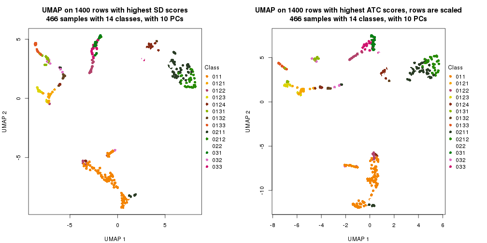</p>

</div>
<div id='tab-dimension-reduction-by-depth-4'>
<pre><code class="r">par(mfrow = c(1, 2))
dimension_reduction(res_rh, merge_node = merge_node_param(min_n_signatures = 982),
    method = &quot;UMAP&quot;, top_value_method = &quot;SD&quot;, top_n = 1400, scale_rows = FALSE)
dimension_reduction(res_rh, merge_node = merge_node_param(min_n_signatures = 982),
    method = &quot;UMAP&quot;, top_value_method = &quot;ATC&quot;, top_n = 1400, scale_rows = TRUE)
</code></pre>

<p></p>

</div>
<div id='tab-dimension-reduction-by-depth-5'>
<pre><code class="r">par(mfrow = c(1, 2))
dimension_reduction(res_rh, merge_node = merge_node_param(min_n_signatures = 1450),
    method = &quot;UMAP&quot;, top_value_method = &quot;SD&quot;, top_n = 1400, scale_rows = FALSE)
dimension_reduction(res_rh, merge_node = merge_node_param(min_n_signatures = 1450),
    method = &quot;UMAP&quot;, top_value_method = &quot;ATC&quot;, top_n = 1400, scale_rows = TRUE)
</code></pre>

<p></p>

</div>
<div id='tab-dimension-reduction-by-depth-6'>
<pre><code class="r">par(mfrow = c(1, 2))
dimension_reduction(res_rh, merge_node = merge_node_param(min_n_signatures = 1988),
    method = &quot;UMAP&quot;, top_value_method = &quot;SD&quot;, top_n = 1400, scale_rows = FALSE)
dimension_reduction(res_rh, merge_node = merge_node_param(min_n_signatures = 1988),
    method = &quot;UMAP&quot;, top_value_method = &quot;ATC&quot;, top_n = 1400, scale_rows = TRUE)
</code></pre>

<p></p>

</div>
<div id='tab-dimension-reduction-by-depth-7'>
<pre><code class="r">par(mfrow = c(1, 2))
dimension_reduction(res_rh, merge_node = merge_node_param(min_n_signatures = 3159),
    method = &quot;UMAP&quot;, top_value_method = &quot;SD&quot;, top_n = 1400, scale_rows = FALSE)
dimension_reduction(res_rh, merge_node = merge_node_param(min_n_signatures = 3159),
    method = &quot;UMAP&quot;, top_value_method = &quot;ATC&quot;, top_n = 1400, scale_rows = TRUE)
</code></pre>

<p></p>

</div>
<div id='tab-dimension-reduction-by-depth-8'>
<pre><code class="r">par(mfrow = c(1, 2))
dimension_reduction(res_rh, merge_node = merge_node_param(min_n_signatures = 3358),
    method = &quot;UMAP&quot;, top_value_method = &quot;SD&quot;, top_n = 1400, scale_rows = FALSE)
dimension_reduction(res_rh, merge_node = merge_node_param(min_n_signatures = 3358),
    method = &quot;UMAP&quot;, top_value_method = &quot;ATC&quot;, top_n = 1400, scale_rows = TRUE)
</code></pre>

<p></p>

</div>
<div id='tab-dimension-reduction-by-depth-9'>
<pre><code class="r">par(mfrow = c(1, 2))
dimension_reduction(res_rh, merge_node = merge_node_param(min_n_signatures = 7110),
    method = &quot;UMAP&quot;, top_value_method = &quot;SD&quot;, top_n = 1400, scale_rows = FALSE)
dimension_reduction(res_rh, merge_node = merge_node_param(min_n_signatures = 7110),
    method = &quot;UMAP&quot;, top_value_method = &quot;ATC&quot;, top_n = 1400, scale_rows = TRUE)
</code></pre>

<p></p>

</div>
</div>


### Signature heatmap

Signatures on the heatmap are the union of all signatures found on every node
on the hierarchy. The number of k-means on rows are automatically selected by the function.


<script>
$( function() {
	$( '#tabs-get-signatures-from-hierarchical-partition' ).tabs();
} );
</script>
<div id='tabs-get-signatures-from-hierarchical-partition'>
<ul>
<li><a href='#tab-get-signatures-from-hierarchical-partition-1'>n_signatures ≥ 701</a></li>
<li><a href='#tab-get-signatures-from-hierarchical-partition-2'>n_signatures ≥ 839</a></li>
<li><a href='#tab-get-signatures-from-hierarchical-partition-3'>n_signatures ≥ 865</a></li>
<li><a href='#tab-get-signatures-from-hierarchical-partition-4'>n_signatures ≥ 982</a></li>
<li><a href='#tab-get-signatures-from-hierarchical-partition-5'>n_signatures ≥ 1450</a></li>
<li><a href='#tab-get-signatures-from-hierarchical-partition-6'>n_signatures ≥ 1988</a></li>
<li><a href='#tab-get-signatures-from-hierarchical-partition-7'>n_signatures ≥ 3159</a></li>
<li><a href='#tab-get-signatures-from-hierarchical-partition-8'>n_signatures ≥ 3358</a></li>
<li><a href='#tab-get-signatures-from-hierarchical-partition-9'>n_signatures ≥ 7110</a></li>
</ul>
<div id='tab-get-signatures-from-hierarchical-partition-1'>
<pre><code class="r">get_signatures(res_rh, merge_node = merge_node_param(min_n_signatures = 701))
</code></pre>

<p></p>

</div>
<div id='tab-get-signatures-from-hierarchical-partition-2'>
<pre><code class="r">get_signatures(res_rh, merge_node = merge_node_param(min_n_signatures = 839))
</code></pre>

<p></p>

</div>
<div id='tab-get-signatures-from-hierarchical-partition-3'>
<pre><code class="r">get_signatures(res_rh, merge_node = merge_node_param(min_n_signatures = 865))
</code></pre>

<p></p>

</div>
<div id='tab-get-signatures-from-hierarchical-partition-4'>
<pre><code class="r">get_signatures(res_rh, merge_node = merge_node_param(min_n_signatures = 982))
</code></pre>

<p></p>

</div>
<div id='tab-get-signatures-from-hierarchical-partition-5'>
<pre><code class="r">get_signatures(res_rh, merge_node = merge_node_param(min_n_signatures = 1450))
</code></pre>

<p></p>

</div>
<div id='tab-get-signatures-from-hierarchical-partition-6'>
<pre><code class="r">get_signatures(res_rh, merge_node = merge_node_param(min_n_signatures = 1988))
</code></pre>

<p></p>

</div>
<div id='tab-get-signatures-from-hierarchical-partition-7'>
<pre><code class="r">get_signatures(res_rh, merge_node = merge_node_param(min_n_signatures = 3159))
</code></pre>

<p></p>

</div>
<div id='tab-get-signatures-from-hierarchical-partition-8'>
<pre><code class="r">get_signatures(res_rh, merge_node = merge_node_param(min_n_signatures = 3358))
</code></pre>

<p></p>

</div>
<div id='tab-get-signatures-from-hierarchical-partition-9'>
<pre><code class="r">get_signatures(res_rh, merge_node = merge_node_param(min_n_signatures = 7110))
</code></pre>

<p>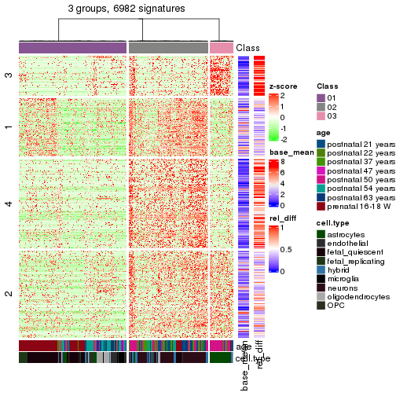</p>

</div>
</div>


Compare signatures from different nodes:


```r
compare_signatures(res_rh, verbose = FALSE)
```


If there are too many signatures, `top_signatures = ...` can be set to only show the 
signatures with the highest FDRs. Note it only works on every node and the final signatures
are the union of all signatures of all nodes.


```r
# code only for demonstration
# e.g. to show the top 500 most significant rows on each node.
tb = get_signature(res_rh, top_signatures = 500)
```


### Test to known annotations

Test correlation between subgroups and known annotations. If the known
annotation is numeric, one-way ANOVA test is applied, and if the known
annotation is discrete, chi-squared contingency table test is applied.


<script>
$( function() {
	$( '#tabs-test-to-known-factors-from-hierarchical-partition' ).tabs();
} );
</script>
<div id='tabs-test-to-known-factors-from-hierarchical-partition'>
<ul>
<li><a href='#tab-test-to-known-factors-from-hierarchical-partition-1'>n_signatures ≥ 701</a></li>
<li><a href='#tab-test-to-known-factors-from-hierarchical-partition-2'>n_signatures ≥ 839</a></li>
<li><a href='#tab-test-to-known-factors-from-hierarchical-partition-3'>n_signatures ≥ 865</a></li>
<li><a href='#tab-test-to-known-factors-from-hierarchical-partition-4'>n_signatures ≥ 982</a></li>
<li><a href='#tab-test-to-known-factors-from-hierarchical-partition-5'>n_signatures ≥ 1450</a></li>
<li><a href='#tab-test-to-known-factors-from-hierarchical-partition-6'>n_signatures ≥ 1988</a></li>
<li><a href='#tab-test-to-known-factors-from-hierarchical-partition-7'>n_signatures ≥ 3159</a></li>
<li><a href='#tab-test-to-known-factors-from-hierarchical-partition-8'>n_signatures ≥ 3358</a></li>
<li><a href='#tab-test-to-known-factors-from-hierarchical-partition-9'>n_signatures ≥ 7110</a></li>
</ul>
<div id='tab-test-to-known-factors-from-hierarchical-partition-1'>
<pre><code class="r">test_to_known_factors(res_rh, merge_node = merge_node_param(min_n_signatures = 701))
</code></pre>

<pre><code>#&gt;             age cell.type
#&gt; class 9.08e-150         0
</code></pre>

</div>
<div id='tab-test-to-known-factors-from-hierarchical-partition-2'>
<pre><code class="r">test_to_known_factors(res_rh, merge_node = merge_node_param(min_n_signatures = 839))
</code></pre>

<pre><code>#&gt;             age cell.type
#&gt; class 4.21e-153         0
</code></pre>

</div>
<div id='tab-test-to-known-factors-from-hierarchical-partition-3'>
<pre><code class="r">test_to_known_factors(res_rh, merge_node = merge_node_param(min_n_signatures = 865))
</code></pre>

<pre><code>#&gt;             age cell.type
#&gt; class 1.61e-156         0
</code></pre>

</div>
<div id='tab-test-to-known-factors-from-hierarchical-partition-4'>
<pre><code class="r">test_to_known_factors(res_rh, merge_node = merge_node_param(min_n_signatures = 982))
</code></pre>

<pre><code>#&gt;            age cell.type
#&gt; class 8.4e-143  1.6e-302
</code></pre>

</div>
<div id='tab-test-to-known-factors-from-hierarchical-partition-5'>
<pre><code class="r">test_to_known_factors(res_rh, merge_node = merge_node_param(min_n_signatures = 1450))
</code></pre>

<pre><code>#&gt;             age cell.type
#&gt; class 6.42e-135 3.95e-301
</code></pre>

</div>
<div id='tab-test-to-known-factors-from-hierarchical-partition-6'>
<pre><code class="r">test_to_known_factors(res_rh, merge_node = merge_node_param(min_n_signatures = 1988))
</code></pre>

<pre><code>#&gt;            age cell.type
#&gt; class 1.8e-126  8.5e-305
</code></pre>

</div>
<div id='tab-test-to-known-factors-from-hierarchical-partition-7'>
<pre><code class="r">test_to_known_factors(res_rh, merge_node = merge_node_param(min_n_signatures = 3159))
</code></pre>

<pre><code>#&gt;             age cell.type
#&gt; class 3.42e-117 5.68e-195
</code></pre>

</div>
<div id='tab-test-to-known-factors-from-hierarchical-partition-8'>
<pre><code class="r">test_to_known_factors(res_rh, merge_node = merge_node_param(min_n_signatures = 3358))
</code></pre>

<pre><code>#&gt;            age cell.type
#&gt; class 1.48e-51  1.31e-98
</code></pre>

</div>
<div id='tab-test-to-known-factors-from-hierarchical-partition-9'>
<pre><code class="r">test_to_known_factors(res_rh, merge_node = merge_node_param(min_n_signatures = 7110))
</code></pre>

<pre><code>#&gt;            age cell.type
#&gt; class 5.94e-52 2.47e-104
</code></pre>

</div>
</div>


## Results for each node


---------------------------------------------------


### Node0


Child nodes: 
                [Node01](#Node01)
        ,
                [Node02](#Node02)
        ,
                [Node03](#Node03)
        .


The object with results only for a single top-value method and a single partitioning method 
can be extracted as:

```r
res = res_rh["0"]
```

A summary of `res` and all the functions that can be applied to it:

```r
res
```

```
#> A 'ConsensusPartition' object with k = 2, 3, 4.
#>   On a matrix with 11420 rows and 466 columns.
#>   Top rows (1142) are extracted by 'ATC' method.
#>   Subgroups are detected by 'skmeans' method.
#>   Performed in total 150 partitions by row resampling.
#>   Best k for subgroups seems to be 4.
#> 
#> Following methods can be applied to this 'ConsensusPartition' object:
#>  [1] "cola_report"             "collect_classes"         "collect_plots"          
#>  [4] "collect_stats"           "colnames"                "compare_partitions"     
#>  [7] "compare_signatures"      "consensus_heatmap"       "dimension_reduction"    
#> [10] "functional_enrichment"   "get_anno_col"            "get_anno"               
#> [13] "get_classes"             "get_consensus"           "get_matrix"             
#> [16] "get_membership"          "get_param"               "get_signatures"         
#> [19] "get_stats"               "is_best_k"               "is_stable_k"            
#> [22] "membership_heatmap"      "ncol"                    "nrow"                   
#> [25] "plot_ecdf"               "predict_classes"         "rownames"               
#> [28] "select_partition_number" "show"                    "suggest_best_k"         
#> [31] "test_to_known_factors"   "top_rows_heatmap"
```

`collect_plots()` function collects all the plots made from `res` for all `k` (number of subgroups)
into one single page to provide an easy and fast comparison between different `k`.

```r
collect_plots(res)
```


The plots are:

- The first row: a plot of the eCDF (empirical cumulative distribution
  function) curves of the consensus matrix for each `k` and the heatmap of
  predicted classes for each `k`.
- The second row: heatmaps of the consensus matrix for each `k`.
- The third row: heatmaps of the membership matrix for each `k`.
- The fouth row: heatmaps of the signatures for each `k`.

All the plots in panels can be made by individual functions and they are
plotted later in this section.

`select_partition_number()` produces several plots showing different
statistics for choosing "optimized" `k`. There are following statistics:

- eCDF curves of the consensus matrix for each `k`;
- 1-PAC. [The PAC score](https://en.wikipedia.org/wiki/Consensus_clustering#Over-interpretation_potential_of_consensus_clustering)
  measures the proportion of the ambiguous subgrouping.
- Mean silhouette score.
- Concordance. The mean probability of fiting the consensus subgroup labels in all
  partitions.
- Area increased. Denote $A_k$ as the area under the eCDF curve for current
  `k`, the area increased is defined as $A_k - A_{k-1}$.
- Rand index. The percent of pairs of samples that are both in a same cluster
  or both are not in a same cluster in the partition of k and k-1.
- Jaccard index. The ratio of pairs of samples are both in a same cluster in
  the partition of k and k-1 and the pairs of samples are both in a same
  cluster in the partition k or k-1.

The detailed explanations of these statistics can be found in [the _cola_
vignette](https://jokergoo.github.io/cola_vignettes/cola.html#toc_13).

Generally speaking, higher 1-PAC score, higher mean silhouette score or higher
concordance corresponds to better partition. Rand index and Jaccard index
measure how similar the current partition is compared to partition with `k-1`.
If they are too similar, we won't accept `k` is better than `k-1`.

```r
select_partition_number(res)
```


The numeric values for all these statistics can be obtained by `get_stats()`.

```r
get_stats(res)
```

```
#>   k 1-PAC mean_silhouette concordance area_increased  Rand Jaccard
#> 2 2 1.000           0.982       0.992          0.486 0.513   0.513
#> 3 3 1.000           0.975       0.991          0.207 0.890   0.789
#> 4 4 0.983           0.949       0.969          0.170 0.876   0.709
```

`suggest_best_k()` suggests the best $k$ based on these statistics. The rules are as follows:

- All $k$ with Jaccard index larger than 0.95 are removed because increasing
  $k$ does not provide enough extra information. If all $k$ are removed, it is
  marked as no subgroup is detected.
- For all $k$ with 1-PAC score larger than 0.9, the maximal $k$ is taken as
  the best $k$, and other $k$ are marked as optional $k$.
- If it does not fit the second rule. The $k$ with the maximal vote of the
  highest 1-PAC score, highest mean silhouette, and highest concordance is
  taken as the best $k$.

```r
suggest_best_k(res)
```

```
#> [1] 4
#> attr(,"optional")
#> [1] 2 3
```

There is also optional best $k$ = 2 3 that is worth to check.

Following is the table of the partitions (You need to click the **show/hide
code output** link to see it). The membership matrix (columns with name `p*`)
is inferred by
[`clue::cl_consensus()`](https://www.rdocumentation.org/link/cl_consensus?package=clue)
function with the `SE` method. Basically the value in the membership matrix
represents the probability to belong to a certain group. The finall subgroup
label for an item is determined with the group with highest probability it
belongs to.

In `get_classes()` function, the entropy is calculated from the membership
matrix and the silhouette score is calculated from the consensus matrix.


<script>
$( function() {
	$( '#tabs-node-0-get-classes' ).tabs();
} );
</script>
<div id='tabs-node-0-get-classes'>
<ul>
<li><a href='#tab-node-0-get-classes-1'>k = 2</a></li>
<li><a href='#tab-node-0-get-classes-2'>k = 3</a></li>
<li><a href='#tab-node-0-get-classes-3'>k = 4</a></li>
</ul>

<div id='tab-node-0-get-classes-1'>
<p><a id='tab-node-0-get-classes-1-a' style='color:#0366d6' href='#'>show/hide code output</a></p>
<pre><code class="r">cbind(get_classes(res, k = 2), get_membership(res, k = 2))
</code></pre>

<pre><code>#&gt;            class entropy silhouette   p1   p2
#&gt; GSM1657871     1   0.000      0.997 1.00 0.00
#&gt; GSM1657872     2   0.000      0.985 0.00 1.00
#&gt; GSM1657873     1   0.000      0.997 1.00 0.00
#&gt; GSM1657874     2   0.680      0.784 0.18 0.82
#&gt; GSM1657875     2   0.000      0.985 0.00 1.00
#&gt; GSM1657876     1   0.000      0.997 1.00 0.00
#&gt; GSM1657877     1   0.000      0.997 1.00 0.00
#&gt; GSM1657878     1   0.000      0.997 1.00 0.00
#&gt; GSM1657879     2   0.000      0.985 0.00 1.00
#&gt; GSM1657880     1   0.000      0.997 1.00 0.00
#&gt; GSM1657881     1   0.000      0.997 1.00 0.00
#&gt; GSM1657882     2   0.000      0.985 0.00 1.00
#&gt; GSM1657883     2   0.000      0.985 0.00 1.00
#&gt; GSM1657884     2   0.000      0.985 0.00 1.00
#&gt; GSM1657885     1   0.000      0.997 1.00 0.00
#&gt; GSM1657886     2   0.000      0.985 0.00 1.00
#&gt; GSM1657887     2   0.000      0.985 0.00 1.00
#&gt; GSM1657888     2   0.000      0.985 0.00 1.00
#&gt; GSM1657889     1   0.000      0.997 1.00 0.00
#&gt; GSM1657890     1   0.000      0.997 1.00 0.00
#&gt; GSM1657891     1   0.000      0.997 1.00 0.00
#&gt; GSM1657892     1   0.000      0.997 1.00 0.00
#&gt; GSM1657893     1   0.000      0.997 1.00 0.00
#&gt; GSM1657894     1   0.000      0.997 1.00 0.00
#&gt; GSM1657895     2   0.000      0.985 0.00 1.00
#&gt; GSM1657896     2   0.000      0.985 0.00 1.00
#&gt; GSM1657897     1   0.000      0.997 1.00 0.00
#&gt; GSM1657898     2   0.000      0.985 0.00 1.00
#&gt; GSM1657899     1   0.000      0.997 1.00 0.00
#&gt; GSM1657900     1   0.000      0.997 1.00 0.00
#&gt; GSM1657901     1   0.000      0.997 1.00 0.00
#&gt; GSM1657902     1   0.000      0.997 1.00 0.00
#&gt; GSM1657903     1   0.000      0.997 1.00 0.00
#&gt; GSM1657904     1   0.000      0.997 1.00 0.00
#&gt; GSM1657905     1   0.000      0.997 1.00 0.00
#&gt; GSM1657906     1   0.000      0.997 1.00 0.00
#&gt; GSM1657907     1   0.000      0.997 1.00 0.00
#&gt; GSM1657908     1   0.000      0.997 1.00 0.00
#&gt; GSM1657909     1   0.000      0.997 1.00 0.00
#&gt; GSM1657910     1   0.000      0.997 1.00 0.00
#&gt; GSM1657911     1   0.000      0.997 1.00 0.00
#&gt; GSM1657912     2   0.000      0.985 0.00 1.00
#&gt; GSM1657913     1   0.000      0.997 1.00 0.00
#&gt; GSM1657914     1   0.000      0.997 1.00 0.00
#&gt; GSM1657915     1   0.000      0.997 1.00 0.00
#&gt; GSM1657916     1   0.000      0.997 1.00 0.00
#&gt; GSM1657917     1   0.000      0.997 1.00 0.00
#&gt; GSM1657918     1   0.000      0.997 1.00 0.00
#&gt; GSM1657919     1   0.000      0.997 1.00 0.00
#&gt; GSM1657920     1   0.000      0.997 1.00 0.00
#&gt; GSM1657921     1   0.000      0.997 1.00 0.00
#&gt; GSM1657922     1   0.000      0.997 1.00 0.00
#&gt; GSM1657923     1   0.000      0.997 1.00 0.00
#&gt; GSM1657924     1   0.000      0.997 1.00 0.00
#&gt; GSM1657925     1   0.000      0.997 1.00 0.00
#&gt; GSM1657926     1   0.000      0.997 1.00 0.00
#&gt; GSM1657927     1   0.000      0.997 1.00 0.00
#&gt; GSM1657928     1   0.000      0.997 1.00 0.00
#&gt; GSM1657929     1   0.000      0.997 1.00 0.00
#&gt; GSM1657930     2   0.000      0.985 0.00 1.00
#&gt; GSM1657931     2   0.469      0.885 0.10 0.90
#&gt; GSM1657932     1   0.000      0.997 1.00 0.00
#&gt; GSM1657933     2   0.000      0.985 0.00 1.00
#&gt; GSM1657934     1   0.000      0.997 1.00 0.00
#&gt; GSM1657935     2   0.000      0.985 0.00 1.00
#&gt; GSM1657936     2   0.000      0.985 0.00 1.00
#&gt; GSM1657937     2   0.000      0.985 0.00 1.00
#&gt; GSM1657938     1   0.000      0.997 1.00 0.00
#&gt; GSM1657939     1   0.000      0.997 1.00 0.00
#&gt; GSM1657940     2   0.000      0.985 0.00 1.00
#&gt; GSM1657941     1   0.141      0.977 0.98 0.02
#&gt; GSM1657942     2   0.981      0.294 0.42 0.58
#&gt; GSM1657943     2   0.000      0.985 0.00 1.00
#&gt; GSM1657944     1   0.000      0.997 1.00 0.00
#&gt; GSM1657945     2   0.000      0.985 0.00 1.00
#&gt; GSM1657946     2   0.000      0.985 0.00 1.00
#&gt; GSM1657947     2   0.000      0.985 0.00 1.00
#&gt; GSM1657948     1   0.000      0.997 1.00 0.00
#&gt; GSM1657949     2   0.000      0.985 0.00 1.00
#&gt; GSM1657950     2   0.000      0.985 0.00 1.00
#&gt; GSM1657951     1   0.000      0.997 1.00 0.00
#&gt; GSM1657952     2   0.000      0.985 0.00 1.00
#&gt; GSM1657953     1   0.000      0.997 1.00 0.00
#&gt; GSM1657954     2   0.000      0.985 0.00 1.00
#&gt; GSM1657955     2   0.000      0.985 0.00 1.00
#&gt; GSM1657956     2   0.000      0.985 0.00 1.00
#&gt; GSM1657957     2   0.000      0.985 0.00 1.00
#&gt; GSM1657958     2   0.000      0.985 0.00 1.00
#&gt; GSM1657959     2   0.000      0.985 0.00 1.00
#&gt; GSM1657960     2   0.000      0.985 0.00 1.00
#&gt; GSM1657961     2   0.000      0.985 0.00 1.00
#&gt; GSM1657962     2   0.000      0.985 0.00 1.00
#&gt; GSM1657963     2   0.000      0.985 0.00 1.00
#&gt; GSM1657964     2   0.000      0.985 0.00 1.00
#&gt; GSM1657965     1   0.000      0.997 1.00 0.00
#&gt; GSM1657966     2   0.000      0.985 0.00 1.00
#&gt; GSM1657967     2   0.000      0.985 0.00 1.00
#&gt; GSM1657968     2   0.000      0.985 0.00 1.00
#&gt; GSM1657969     1   0.000      0.997 1.00 0.00
#&gt; GSM1657970     2   0.141      0.967 0.02 0.98
#&gt; GSM1657971     2   0.000      0.985 0.00 1.00
#&gt; GSM1657972     1   0.000      0.997 1.00 0.00
#&gt; GSM1657973     2   0.000      0.985 0.00 1.00
#&gt; GSM1657974     2   0.141      0.967 0.02 0.98
#&gt; GSM1657975     1   0.000      0.997 1.00 0.00
#&gt; GSM1657976     2   0.760      0.724 0.22 0.78
#&gt; GSM1657977     2   0.000      0.985 0.00 1.00
#&gt; GSM1657978     2   0.000      0.985 0.00 1.00
#&gt; GSM1657979     1   0.000      0.997 1.00 0.00
#&gt; GSM1657980     2   0.000      0.985 0.00 1.00
#&gt; GSM1657981     1   0.529      0.862 0.88 0.12
#&gt; GSM1657982     2   0.000      0.985 0.00 1.00
#&gt; GSM1657983     2   0.000      0.985 0.00 1.00
#&gt; GSM1657984     2   0.000      0.985 0.00 1.00
#&gt; GSM1657985     2   0.000      0.985 0.00 1.00
#&gt; GSM1657986     2   0.000      0.985 0.00 1.00
#&gt; GSM1657987     2   0.000      0.985 0.00 1.00
#&gt; GSM1657988     2   0.000      0.985 0.00 1.00
#&gt; GSM1657989     1   0.000      0.997 1.00 0.00
#&gt; GSM1657990     2   0.000      0.985 0.00 1.00
#&gt; GSM1657991     2   0.000      0.985 0.00 1.00
#&gt; GSM1657992     1   0.000      0.997 1.00 0.00
#&gt; GSM1657993     1   0.000      0.997 1.00 0.00
#&gt; GSM1657994     1   0.000      0.997 1.00 0.00
#&gt; GSM1657995     1   0.000      0.997 1.00 0.00
#&gt; GSM1657996     1   0.000      0.997 1.00 0.00
#&gt; GSM1657997     1   0.000      0.997 1.00 0.00
#&gt; GSM1657998     1   0.000      0.997 1.00 0.00
#&gt; GSM1657999     1   0.000      0.997 1.00 0.00
#&gt; GSM1658000     1   0.000      0.997 1.00 0.00
#&gt; GSM1658001     1   0.000      0.997 1.00 0.00
#&gt; GSM1658002     2   0.000      0.985 0.00 1.00
#&gt; GSM1658003     1   0.000      0.997 1.00 0.00
#&gt; GSM1658004     1   0.000      0.997 1.00 0.00
#&gt; GSM1658005     2   0.000      0.985 0.00 1.00
#&gt; GSM1658006     2   0.000      0.985 0.00 1.00
#&gt; GSM1658007     2   0.000      0.985 0.00 1.00
#&gt; GSM1658008     2   0.000      0.985 0.00 1.00
#&gt; GSM1658009     2   0.000      0.985 0.00 1.00
#&gt; GSM1658010     2   0.000      0.985 0.00 1.00
#&gt; GSM1658011     2   0.000      0.985 0.00 1.00
#&gt; GSM1658012     2   0.000      0.985 0.00 1.00
#&gt; GSM1658013     2   0.000      0.985 0.00 1.00
#&gt; GSM1658014     2   0.000      0.985 0.00 1.00
#&gt; GSM1658015     2   0.000      0.985 0.00 1.00
#&gt; GSM1658016     1   0.000      0.997 1.00 0.00
#&gt; GSM1658017     1   0.000      0.997 1.00 0.00
#&gt; GSM1658018     1   0.000      0.997 1.00 0.00
#&gt; GSM1658019     2   0.000      0.985 0.00 1.00
#&gt; GSM1658020     1   0.000      0.997 1.00 0.00
#&gt; GSM1658021     2   0.958      0.403 0.38 0.62
#&gt; GSM1658022     2   0.000      0.985 0.00 1.00
#&gt; GSM1658023     2   0.000      0.985 0.00 1.00
#&gt; GSM1658024     2   0.141      0.967 0.02 0.98
#&gt; GSM1658025     2   0.000      0.985 0.00 1.00
#&gt; GSM1658026     1   0.000      0.997 1.00 0.00
#&gt; GSM1658027     1   0.000      0.997 1.00 0.00
#&gt; GSM1658028     2   0.000      0.985 0.00 1.00
#&gt; GSM1658029     2   0.000      0.985 0.00 1.00
#&gt; GSM1658030     2   0.000      0.985 0.00 1.00
#&gt; GSM1658031     1   0.000      0.997 1.00 0.00
#&gt; GSM1658032     2   0.000      0.985 0.00 1.00
#&gt; GSM1658033     2   0.000      0.985 0.00 1.00
#&gt; GSM1658034     2   0.000      0.985 0.00 1.00
#&gt; GSM1658035     2   0.000      0.985 0.00 1.00
#&gt; GSM1658036     1   0.000      0.997 1.00 0.00
#&gt; GSM1658037     2   0.000      0.985 0.00 1.00
#&gt; GSM1658038     2   0.000      0.985 0.00 1.00
#&gt; GSM1658039     2   0.000      0.985 0.00 1.00
#&gt; GSM1658040     2   0.000      0.985 0.00 1.00
#&gt; GSM1658041     2   0.000      0.985 0.00 1.00
#&gt; GSM1658042     2   0.000      0.985 0.00 1.00
#&gt; GSM1658043     2   0.000      0.985 0.00 1.00
#&gt; GSM1658044     2   0.000      0.985 0.00 1.00
#&gt; GSM1658045     1   0.000      0.997 1.00 0.00
#&gt; GSM1658046     2   0.000      0.985 0.00 1.00
#&gt; GSM1658047     2   0.000      0.985 0.00 1.00
#&gt; GSM1658048     2   0.000      0.985 0.00 1.00
#&gt; GSM1658049     1   0.000      0.997 1.00 0.00
#&gt; GSM1658050     2   0.000      0.985 0.00 1.00
#&gt; GSM1658051     2   0.943      0.453 0.36 0.64
#&gt; GSM1658052     2   0.000      0.985 0.00 1.00
#&gt; GSM1658053     2   0.000      0.985 0.00 1.00
#&gt; GSM1658054     1   0.000      0.997 1.00 0.00
#&gt; GSM1658055     2   0.000      0.985 0.00 1.00
#&gt; GSM1658056     1   0.000      0.997 1.00 0.00
#&gt; GSM1658057     2   0.000      0.985 0.00 1.00
#&gt; GSM1658058     2   0.000      0.985 0.00 1.00
#&gt; GSM1658059     2   0.981      0.295 0.42 0.58
#&gt; GSM1658060     2   0.000      0.985 0.00 1.00
#&gt; GSM1658061     1   0.000      0.997 1.00 0.00
#&gt; GSM1658062     2   0.000      0.985 0.00 1.00
#&gt; GSM1658063     2   0.000      0.985 0.00 1.00
#&gt; GSM1658064     2   0.141      0.967 0.02 0.98
#&gt; GSM1658065     1   0.000      0.997 1.00 0.00
#&gt; GSM1658066     1   0.000      0.997 1.00 0.00
#&gt; GSM1658067     2   0.760      0.724 0.22 0.78
#&gt; GSM1658068     1   0.000      0.997 1.00 0.00
#&gt; GSM1658069     1   0.000      0.997 1.00 0.00
#&gt; GSM1658070     2   0.000      0.985 0.00 1.00
#&gt; GSM1658071     2   0.469      0.885 0.10 0.90
#&gt; GSM1658072     1   0.000      0.997 1.00 0.00
#&gt; GSM1658073     2   0.000      0.985 0.00 1.00
#&gt; GSM1658074     2   0.000      0.985 0.00 1.00
#&gt; GSM1658075     2   0.000      0.985 0.00 1.00
#&gt; GSM1658076     2   0.000      0.985 0.00 1.00
#&gt; GSM1658077     2   0.000      0.985 0.00 1.00
#&gt; GSM1658078     2   0.000      0.985 0.00 1.00
#&gt; GSM1658079     2   0.000      0.985 0.00 1.00
#&gt; GSM1658080     2   0.000      0.985 0.00 1.00
#&gt; GSM1658081     1   0.000      0.997 1.00 0.00
#&gt; GSM1658082     1   0.000      0.997 1.00 0.00
#&gt; GSM1658083     1   0.000      0.997 1.00 0.00
#&gt; GSM1658084     2   0.000      0.985 0.00 1.00
#&gt; GSM1658085     1   0.000      0.997 1.00 0.00
#&gt; GSM1658086     1   0.000      0.997 1.00 0.00
#&gt; GSM1658087     2   0.000      0.985 0.00 1.00
#&gt; GSM1658088     1   0.000      0.997 1.00 0.00
#&gt; GSM1658089     1   0.000      0.997 1.00 0.00
#&gt; GSM1658090     2   0.000      0.985 0.00 1.00
#&gt; GSM1658091     2   0.000      0.985 0.00 1.00
#&gt; GSM1658092     1   0.000      0.997 1.00 0.00
#&gt; GSM1658093     1   0.000      0.997 1.00 0.00
#&gt; GSM1658094     1   0.000      0.997 1.00 0.00
#&gt; GSM1658095     2   0.000      0.985 0.00 1.00
#&gt; GSM1658096     1   0.000      0.997 1.00 0.00
#&gt; GSM1658097     1   0.000      0.997 1.00 0.00
#&gt; GSM1658098     1   0.000      0.997 1.00 0.00
#&gt; GSM1658099     1   0.000      0.997 1.00 0.00
#&gt; GSM1658100     2   0.000      0.985 0.00 1.00
#&gt; GSM1658101     2   0.000      0.985 0.00 1.00
#&gt; GSM1658102     1   0.000      0.997 1.00 0.00
#&gt; GSM1658103     2   0.000      0.985 0.00 1.00
#&gt; GSM1658104     2   0.000      0.985 0.00 1.00
#&gt; GSM1658105     2   0.000      0.985 0.00 1.00
#&gt; GSM1658106     2   0.000      0.985 0.00 1.00
#&gt; GSM1658107     2   0.000      0.985 0.00 1.00
#&gt; GSM1658108     2   0.000      0.985 0.00 1.00
#&gt; GSM1658109     1   0.000      0.997 1.00 0.00
#&gt; GSM1658110     2   0.000      0.985 0.00 1.00
#&gt; GSM1658111     2   0.000      0.985 0.00 1.00
#&gt; GSM1658112     1   0.000      0.997 1.00 0.00
#&gt; GSM1658113     2   0.000      0.985 0.00 1.00
#&gt; GSM1658114     2   0.000      0.985 0.00 1.00
#&gt; GSM1658115     2   0.000      0.985 0.00 1.00
#&gt; GSM1658116     1   0.000      0.997 1.00 0.00
#&gt; GSM1658117     1   0.000      0.997 1.00 0.00
#&gt; GSM1658118     1   0.000      0.997 1.00 0.00
#&gt; GSM1658119     1   0.000      0.997 1.00 0.00
#&gt; GSM1658120     1   0.000      0.997 1.00 0.00
#&gt; GSM1658121     2   0.000      0.985 0.00 1.00
#&gt; GSM1658122     1   0.000      0.997 1.00 0.00
#&gt; GSM1658123     1   0.000      0.997 1.00 0.00
#&gt; GSM1658124     1   0.000      0.997 1.00 0.00
#&gt; GSM1658125     1   0.000      0.997 1.00 0.00
#&gt; GSM1658126     1   0.000      0.997 1.00 0.00
#&gt; GSM1658127     2   0.000      0.985 0.00 1.00
#&gt; GSM1658128     2   0.000      0.985 0.00 1.00
#&gt; GSM1658129     2   0.000      0.985 0.00 1.00
#&gt; GSM1658130     1   0.000      0.997 1.00 0.00
#&gt; GSM1658131     2   0.000      0.985 0.00 1.00
#&gt; GSM1658132     2   0.000      0.985 0.00 1.00
#&gt; GSM1658133     1   0.402      0.911 0.92 0.08
#&gt; GSM1658134     2   0.000      0.985 0.00 1.00
#&gt; GSM1658135     2   0.000      0.985 0.00 1.00
#&gt; GSM1658136     1   0.000      0.997 1.00 0.00
#&gt; GSM1658137     2   0.000      0.985 0.00 1.00
#&gt; GSM1658138     2   0.000      0.985 0.00 1.00
#&gt; GSM1658139     2   0.000      0.985 0.00 1.00
#&gt; GSM1658140     2   0.000      0.985 0.00 1.00
#&gt; GSM1658141     2   0.000      0.985 0.00 1.00
#&gt; GSM1658142     1   0.000      0.997 1.00 0.00
#&gt; GSM1658143     2   0.000      0.985 0.00 1.00
#&gt; GSM1658144     1   0.000      0.997 1.00 0.00
#&gt; GSM1658145     2   0.000      0.985 0.00 1.00
#&gt; GSM1658146     2   0.000      0.985 0.00 1.00
#&gt; GSM1658147     2   0.000      0.985 0.00 1.00
#&gt; GSM1658148     2   0.000      0.985 0.00 1.00
#&gt; GSM1658149     2   0.000      0.985 0.00 1.00
#&gt; GSM1658150     2   0.000      0.985 0.00 1.00
#&gt; GSM1658151     2   0.000      0.985 0.00 1.00
#&gt; GSM1658152     2   0.000      0.985 0.00 1.00
#&gt; GSM1658153     2   0.000      0.985 0.00 1.00
#&gt; GSM1658154     1   0.000      0.997 1.00 0.00
#&gt; GSM1658155     1   0.000      0.997 1.00 0.00
#&gt; GSM1658156     2   0.000      0.985 0.00 1.00
#&gt; GSM1658157     2   0.000      0.985 0.00 1.00
#&gt; GSM1658158     2   0.000      0.985 0.00 1.00
#&gt; GSM1658159     1   0.000      0.997 1.00 0.00
#&gt; GSM1658160     2   0.000      0.985 0.00 1.00
#&gt; GSM1658161     1   0.000      0.997 1.00 0.00
#&gt; GSM1658162     1   0.000      0.997 1.00 0.00
#&gt; GSM1658163     2   0.000      0.985 0.00 1.00
#&gt; GSM1658164     1   0.000      0.997 1.00 0.00
#&gt; GSM1658165     2   0.000      0.985 0.00 1.00
#&gt; GSM1658166     2   0.000      0.985 0.00 1.00
#&gt; GSM1658167     1   0.000      0.997 1.00 0.00
#&gt; GSM1658168     2   0.000      0.985 0.00 1.00
#&gt; GSM1658169     2   0.000      0.985 0.00 1.00
#&gt; GSM1658170     2   0.000      0.985 0.00 1.00
#&gt; GSM1658171     2   0.000      0.985 0.00 1.00
#&gt; GSM1658172     2   0.000      0.985 0.00 1.00
#&gt; GSM1658173     1   0.000      0.997 1.00 0.00
#&gt; GSM1658174     1   0.000      0.997 1.00 0.00
#&gt; GSM1658175     2   0.000      0.985 0.00 1.00
#&gt; GSM1658176     2   0.000      0.985 0.00 1.00
#&gt; GSM1658177     2   0.000      0.985 0.00 1.00
#&gt; GSM1658178     1   0.000      0.997 1.00 0.00
#&gt; GSM1658179     2   0.000      0.985 0.00 1.00
#&gt; GSM1658180     1   0.000      0.997 1.00 0.00
#&gt; GSM1658181     2   0.000      0.985 0.00 1.00
#&gt; GSM1658182     2   0.000      0.985 0.00 1.00
#&gt; GSM1658183     1   0.000      0.997 1.00 0.00
#&gt; GSM1658184     1   0.000      0.997 1.00 0.00
#&gt; GSM1658185     1   0.000      0.997 1.00 0.00
#&gt; GSM1658186     1   0.000      0.997 1.00 0.00
#&gt; GSM1658187     1   0.000      0.997 1.00 0.00
#&gt; GSM1658188     1   0.000      0.997 1.00 0.00
#&gt; GSM1658189     1   0.000      0.997 1.00 0.00
#&gt; GSM1658190     1   0.000      0.997 1.00 0.00
#&gt; GSM1658191     1   0.000      0.997 1.00 0.00
#&gt; GSM1658192     2   0.000      0.985 0.00 1.00
#&gt; GSM1658193     1   0.000      0.997 1.00 0.00
#&gt; GSM1658194     1   0.000      0.997 1.00 0.00
#&gt; GSM1658195     2   0.000      0.985 0.00 1.00
#&gt; GSM1658196     1   0.000      0.997 1.00 0.00
#&gt; GSM1658197     1   0.000      0.997 1.00 0.00
#&gt; GSM1658198     1   0.000      0.997 1.00 0.00
#&gt; GSM1658199     1   0.000      0.997 1.00 0.00
#&gt; GSM1658200     1   0.000      0.997 1.00 0.00
#&gt; GSM1658201     1   0.000      0.997 1.00 0.00
#&gt; GSM1658202     1   0.000      0.997 1.00 0.00
#&gt; GSM1658203     1   0.000      0.997 1.00 0.00
#&gt; GSM1658204     1   0.000      0.997 1.00 0.00
#&gt; GSM1658205     1   0.000      0.997 1.00 0.00
#&gt; GSM1658206     1   0.000      0.997 1.00 0.00
#&gt; GSM1658207     1   0.000      0.997 1.00 0.00
#&gt; GSM1658208     1   0.000      0.997 1.00 0.00
#&gt; GSM1658209     1   0.000      0.997 1.00 0.00
#&gt; GSM1658210     1   0.000      0.997 1.00 0.00
#&gt; GSM1658211     1   0.000      0.997 1.00 0.00
#&gt; GSM1658212     1   0.000      0.997 1.00 0.00
#&gt; GSM1658213     1   0.000      0.997 1.00 0.00
#&gt; GSM1658214     1   0.000      0.997 1.00 0.00
#&gt; GSM1658215     2   0.000      0.985 0.00 1.00
#&gt; GSM1658216     1   0.000      0.997 1.00 0.00
#&gt; GSM1658217     1   0.000      0.997 1.00 0.00
#&gt; GSM1658218     1   0.000      0.997 1.00 0.00
#&gt; GSM1658219     1   0.000      0.997 1.00 0.00
#&gt; GSM1658220     1   0.000      0.997 1.00 0.00
#&gt; GSM1658221     1   0.000      0.997 1.00 0.00
#&gt; GSM1658222     1   0.000      0.997 1.00 0.00
#&gt; GSM1658223     1   0.000      0.997 1.00 0.00
#&gt; GSM1658224     1   0.000      0.997 1.00 0.00
#&gt; GSM1658225     1   0.000      0.997 1.00 0.00
#&gt; GSM1658226     1   0.000      0.997 1.00 0.00
#&gt; GSM1658227     1   0.000      0.997 1.00 0.00
#&gt; GSM1658228     1   0.000      0.997 1.00 0.00
#&gt; GSM1658229     1   0.000      0.997 1.00 0.00
#&gt; GSM1658230     1   0.000      0.997 1.00 0.00
#&gt; GSM1658231     1   0.000      0.997 1.00 0.00
#&gt; GSM1658232     1   0.000      0.997 1.00 0.00
#&gt; GSM1658233     1   0.000      0.997 1.00 0.00
#&gt; GSM1658234     1   0.000      0.997 1.00 0.00
#&gt; GSM1658235     1   0.000      0.997 1.00 0.00
#&gt; GSM1658236     1   0.000      0.997 1.00 0.00
#&gt; GSM1658237     1   0.000      0.997 1.00 0.00
#&gt; GSM1658238     1   0.000      0.997 1.00 0.00
#&gt; GSM1658239     1   0.000      0.997 1.00 0.00
#&gt; GSM1658240     1   0.000      0.997 1.00 0.00
#&gt; GSM1658241     1   0.000      0.997 1.00 0.00
#&gt; GSM1658242     1   0.000      0.997 1.00 0.00
#&gt; GSM1658243     1   0.000      0.997 1.00 0.00
#&gt; GSM1658244     1   0.000      0.997 1.00 0.00
#&gt; GSM1658245     1   0.000      0.997 1.00 0.00
#&gt; GSM1658246     1   0.000      0.997 1.00 0.00
#&gt; GSM1658247     1   0.000      0.997 1.00 0.00
#&gt; GSM1658248     2   0.000      0.985 0.00 1.00
#&gt; GSM1658249     1   0.000      0.997 1.00 0.00
#&gt; GSM1658251     1   0.000      0.997 1.00 0.00
#&gt; GSM1658253     1   0.000      0.997 1.00 0.00
#&gt; GSM1658255     2   0.000      0.985 0.00 1.00
#&gt; GSM1658257     2   0.000      0.985 0.00 1.00
#&gt; GSM1658259     2   0.000      0.985 0.00 1.00
#&gt; GSM1658262     1   0.000      0.997 1.00 0.00
#&gt; GSM1658264     1   0.000      0.997 1.00 0.00
#&gt; GSM1658266     1   0.141      0.977 0.98 0.02
#&gt; GSM1658268     2   0.529      0.862 0.12 0.88
#&gt; GSM1658270     1   0.000      0.997 1.00 0.00
#&gt; GSM1658272     1   0.000      0.997 1.00 0.00
#&gt; GSM1658275     1   0.000      0.997 1.00 0.00
#&gt; GSM1658277     1   0.000      0.997 1.00 0.00
#&gt; GSM1658279     1   0.000      0.997 1.00 0.00
#&gt; GSM1658281     2   0.795      0.692 0.24 0.76
#&gt; GSM1658284     1   0.000      0.997 1.00 0.00
#&gt; GSM1658286     1   0.000      0.997 1.00 0.00
#&gt; GSM1658288     1   0.000      0.997 1.00 0.00
#&gt; GSM1658290     1   0.000      0.997 1.00 0.00
#&gt; GSM1658292     1   0.000      0.997 1.00 0.00
#&gt; GSM1658294     2   0.000      0.985 0.00 1.00
#&gt; GSM1658297     1   0.000      0.997 1.00 0.00
#&gt; GSM1658299     2   0.000      0.985 0.00 1.00
#&gt; GSM1658301     1   0.000      0.997 1.00 0.00
#&gt; GSM1658304     1   0.000      0.997 1.00 0.00
#&gt; GSM1658305     1   0.000      0.997 1.00 0.00
#&gt; GSM1658306     1   0.000      0.997 1.00 0.00
#&gt; GSM1658307     1   0.000      0.997 1.00 0.00
#&gt; GSM1658308     1   0.000      0.997 1.00 0.00
#&gt; GSM1658309     1   0.000      0.997 1.00 0.00
#&gt; GSM1658310     1   0.000      0.997 1.00 0.00
#&gt; GSM1658311     1   0.000      0.997 1.00 0.00
#&gt; GSM1658312     1   0.000      0.997 1.00 0.00
#&gt; GSM1658313     2   0.000      0.985 0.00 1.00
#&gt; GSM1658314     1   0.000      0.997 1.00 0.00
#&gt; GSM1658315     1   0.000      0.997 1.00 0.00
#&gt; GSM1658316     1   0.000      0.997 1.00 0.00
#&gt; GSM1658317     1   0.000      0.997 1.00 0.00
#&gt; GSM1658318     1   0.000      0.997 1.00 0.00
#&gt; GSM1658319     1   0.000      0.997 1.00 0.00
#&gt; GSM1658320     1   0.000      0.997 1.00 0.00
#&gt; GSM1658321     1   0.000      0.997 1.00 0.00
#&gt; GSM1658322     1   0.000      0.997 1.00 0.00
#&gt; GSM1658323     2   0.000      0.985 0.00 1.00
#&gt; GSM1658324     1   0.000      0.997 1.00 0.00
#&gt; GSM1658325     1   0.000      0.997 1.00 0.00
#&gt; GSM1658326     1   0.000      0.997 1.00 0.00
#&gt; GSM1658327     1   0.000      0.997 1.00 0.00
#&gt; GSM1658328     1   0.000      0.997 1.00 0.00
#&gt; GSM1658329     1   0.000      0.997 1.00 0.00
#&gt; GSM1658330     1   0.000      0.997 1.00 0.00
#&gt; GSM1658331     1   0.000      0.997 1.00 0.00
#&gt; GSM1658332     1   0.000      0.997 1.00 0.00
#&gt; GSM1658333     1   0.000      0.997 1.00 0.00
#&gt; GSM1658334     1   0.000      0.997 1.00 0.00
#&gt; GSM1658335     1   0.000      0.997 1.00 0.00
#&gt; GSM1658336     1   0.000      0.997 1.00 0.00
#&gt; GSM1658337     1   0.000      0.997 1.00 0.00
#&gt; GSM1658338     1   0.000      0.997 1.00 0.00
#&gt; GSM1658339     2   0.000      0.985 0.00 1.00
#&gt; GSM1658340     1   0.529      0.862 0.88 0.12
#&gt; GSM1658341     1   0.000      0.997 1.00 0.00
#&gt; GSM1658342     1   0.000      0.997 1.00 0.00
#&gt; GSM1658343     1   0.529      0.862 0.88 0.12
#&gt; GSM1658344     1   0.000      0.997 1.00 0.00
#&gt; GSM1658345     1   0.000      0.997 1.00 0.00
#&gt; GSM1658346     1   0.000      0.997 1.00 0.00
#&gt; GSM1658347     1   0.000      0.997 1.00 0.00
#&gt; GSM1658348     2   0.327      0.928 0.06 0.94
#&gt; GSM1658349     1   0.000      0.997 1.00 0.00
#&gt; GSM1658350     1   0.000      0.997 1.00 0.00
#&gt; GSM1658351     1   0.000      0.997 1.00 0.00
#&gt; GSM1658352     2   0.000      0.985 0.00 1.00
#&gt; GSM1658353     1   0.000      0.997 1.00 0.00
#&gt; GSM1658354     1   0.000      0.997 1.00 0.00
#&gt; GSM1658355     1   0.000      0.997 1.00 0.00
#&gt; GSM1658356     1   0.000      0.997 1.00 0.00
#&gt; GSM1658357     1   0.000      0.997 1.00 0.00
#&gt; GSM1658358     1   0.000      0.997 1.00 0.00
#&gt; GSM1658359     1   0.000      0.997 1.00 0.00
#&gt; GSM1658360     1   0.000      0.997 1.00 0.00
#&gt; GSM1658361     1   0.000      0.997 1.00 0.00
#&gt; GSM1658362     1   0.000      0.997 1.00 0.00
#&gt; GSM1658363     1   0.000      0.997 1.00 0.00
#&gt; GSM1658364     1   0.000      0.997 1.00 0.00
#&gt; GSM1658365     1   0.827      0.644 0.74 0.26
#&gt; GSM1658366     1   0.000      0.997 1.00 0.00
</code></pre>

<script>
$('#tab-node-0-get-classes-1-a').parent().next().next().hide();
$('#tab-node-0-get-classes-1-a').click(function(){
  $('#tab-node-0-get-classes-1-a').parent().next().next().toggle();
  return(false);
});
</script>
</div>

<div id='tab-node-0-get-classes-2'>
<p><a id='tab-node-0-get-classes-2-a' style='color:#0366d6' href='#'>show/hide code output</a></p>
<pre><code class="r">cbind(get_classes(res, k = 3), get_membership(res, k = 3))
</code></pre>

<pre><code>#&gt;            class entropy silhouette   p1   p2   p3
#&gt; GSM1657871     1  0.0000      0.991 1.00 0.00 0.00
#&gt; GSM1657872     2  0.0000      0.986 0.00 1.00 0.00
#&gt; GSM1657873     1  0.0000      0.991 1.00 0.00 0.00
#&gt; GSM1657874     2  0.4555      0.697 0.20 0.80 0.00
#&gt; GSM1657875     2  0.0000      0.986 0.00 1.00 0.00
#&gt; GSM1657876     1  0.0000      0.991 1.00 0.00 0.00
#&gt; GSM1657877     1  0.0000      0.991 1.00 0.00 0.00
#&gt; GSM1657878     1  0.0000      0.991 1.00 0.00 0.00
#&gt; GSM1657879     2  0.0000      0.986 0.00 1.00 0.00
#&gt; GSM1657880     1  0.0892      0.972 0.98 0.00 0.02
#&gt; GSM1657881     1  0.0000      0.991 1.00 0.00 0.00
#&gt; GSM1657882     2  0.0000      0.986 0.00 1.00 0.00
#&gt; GSM1657883     2  0.0000      0.986 0.00 1.00 0.00
#&gt; GSM1657884     2  0.0000      0.986 0.00 1.00 0.00
#&gt; GSM1657885     1  0.0000      0.991 1.00 0.00 0.00
#&gt; GSM1657886     2  0.0000      0.986 0.00 1.00 0.00
#&gt; GSM1657887     2  0.0000      0.986 0.00 1.00 0.00
#&gt; GSM1657888     2  0.0000      0.986 0.00 1.00 0.00
#&gt; GSM1657889     1  0.0000      0.991 1.00 0.00 0.00
#&gt; GSM1657890     1  0.0000      0.991 1.00 0.00 0.00
#&gt; GSM1657891     1  0.0000      0.991 1.00 0.00 0.00
#&gt; GSM1657892     1  0.0000      0.991 1.00 0.00 0.00
#&gt; GSM1657893     1  0.2066      0.931 0.94 0.00 0.06
#&gt; GSM1657894     1  0.0000      0.991 1.00 0.00 0.00
#&gt; GSM1657895     2  0.0000      0.986 0.00 1.00 0.00
#&gt; GSM1657896     2  0.0000      0.986 0.00 1.00 0.00
#&gt; GSM1657897     1  0.0000      0.991 1.00 0.00 0.00
#&gt; GSM1657898     2  0.0000      0.986 0.00 1.00 0.00
#&gt; GSM1657899     1  0.0000      0.991 1.00 0.00 0.00
#&gt; GSM1657900     1  0.0000      0.991 1.00 0.00 0.00
#&gt; GSM1657901     1  0.0000      0.991 1.00 0.00 0.00
#&gt; GSM1657902     1  0.0000      0.991 1.00 0.00 0.00
#&gt; GSM1657903     1  0.0000      0.991 1.00 0.00 0.00
#&gt; GSM1657904     1  0.0000      0.991 1.00 0.00 0.00
#&gt; GSM1657905     1  0.0000      0.991 1.00 0.00 0.00
#&gt; GSM1657906     1  0.0000      0.991 1.00 0.00 0.00
#&gt; GSM1657907     1  0.0000      0.991 1.00 0.00 0.00
#&gt; GSM1657908     1  0.0000      0.991 1.00 0.00 0.00
#&gt; GSM1657909     1  0.0000      0.991 1.00 0.00 0.00
#&gt; GSM1657910     1  0.0000      0.991 1.00 0.00 0.00
#&gt; GSM1657911     1  0.0000      0.991 1.00 0.00 0.00
#&gt; GSM1657912     2  0.0000      0.986 0.00 1.00 0.00
#&gt; GSM1657913     1  0.0000      0.991 1.00 0.00 0.00
#&gt; GSM1657914     1  0.0000      0.991 1.00 0.00 0.00
#&gt; GSM1657915     1  0.0000      0.991 1.00 0.00 0.00
#&gt; GSM1657916     1  0.0000      0.991 1.00 0.00 0.00
#&gt; GSM1657917     1  0.0000      0.991 1.00 0.00 0.00
#&gt; GSM1657918     1  0.0000      0.991 1.00 0.00 0.00
#&gt; GSM1657919     1  0.0000      0.991 1.00 0.00 0.00
#&gt; GSM1657920     1  0.0000      0.991 1.00 0.00 0.00
#&gt; GSM1657921     1  0.0000      0.991 1.00 0.00 0.00
#&gt; GSM1657922     1  0.0000      0.991 1.00 0.00 0.00
#&gt; GSM1657923     1  0.0000      0.991 1.00 0.00 0.00
#&gt; GSM1657924     1  0.0000      0.991 1.00 0.00 0.00
#&gt; GSM1657925     1  0.0000      0.991 1.00 0.00 0.00
#&gt; GSM1657926     1  0.0000      0.991 1.00 0.00 0.00
#&gt; GSM1657927     1  0.0000      0.991 1.00 0.00 0.00
#&gt; GSM1657928     1  0.0000      0.991 1.00 0.00 0.00
#&gt; GSM1657929     1  0.0000      0.991 1.00 0.00 0.00
#&gt; GSM1657930     2  0.0000      0.986 0.00 1.00 0.00
#&gt; GSM1657931     2  0.2959      0.851 0.10 0.90 0.00
#&gt; GSM1657932     3  0.0000      0.988 0.00 0.00 1.00
#&gt; GSM1657933     2  0.0000      0.986 0.00 1.00 0.00
#&gt; GSM1657934     1  0.0000      0.991 1.00 0.00 0.00
#&gt; GSM1657935     2  0.0000      0.986 0.00 1.00 0.00
#&gt; GSM1657936     2  0.0000      0.986 0.00 1.00 0.00
#&gt; GSM1657937     2  0.0000      0.986 0.00 1.00 0.00
#&gt; GSM1657938     3  0.2959      0.879 0.10 0.00 0.90
#&gt; GSM1657939     1  0.0000      0.991 1.00 0.00 0.00
#&gt; GSM1657940     2  0.0000      0.986 0.00 1.00 0.00
#&gt; GSM1657941     1  0.0000      0.991 1.00 0.00 0.00
#&gt; GSM1657942     2  0.6280      0.156 0.46 0.54 0.00
#&gt; GSM1657943     2  0.0000      0.986 0.00 1.00 0.00
#&gt; GSM1657944     1  0.0000      0.991 1.00 0.00 0.00
#&gt; GSM1657945     2  0.0000      0.986 0.00 1.00 0.00
#&gt; GSM1657946     2  0.0000      0.986 0.00 1.00 0.00
#&gt; GSM1657947     2  0.0000      0.986 0.00 1.00 0.00
#&gt; GSM1657948     1  0.0000      0.991 1.00 0.00 0.00
#&gt; GSM1657949     2  0.0000      0.986 0.00 1.00 0.00
#&gt; GSM1657950     2  0.0000      0.986 0.00 1.00 0.00
#&gt; GSM1657951     1  0.0000      0.991 1.00 0.00 0.00
#&gt; GSM1657952     2  0.0000      0.986 0.00 1.00 0.00
#&gt; GSM1657953     1  0.0000      0.991 1.00 0.00 0.00
#&gt; GSM1657954     2  0.0000      0.986 0.00 1.00 0.00
#&gt; GSM1657955     2  0.0000      0.986 0.00 1.00 0.00
#&gt; GSM1657956     2  0.0000      0.986 0.00 1.00 0.00
#&gt; GSM1657957     2  0.0000      0.986 0.00 1.00 0.00
#&gt; GSM1657958     2  0.0000      0.986 0.00 1.00 0.00
#&gt; GSM1657959     2  0.0000      0.986 0.00 1.00 0.00
#&gt; GSM1657960     2  0.0000      0.986 0.00 1.00 0.00
#&gt; GSM1657961     2  0.0000      0.986 0.00 1.00 0.00
#&gt; GSM1657962     2  0.0000      0.986 0.00 1.00 0.00
#&gt; GSM1657963     2  0.0000      0.986 0.00 1.00 0.00
#&gt; GSM1657964     2  0.0000      0.986 0.00 1.00 0.00
#&gt; GSM1657965     3  0.0000      0.988 0.00 0.00 1.00
#&gt; GSM1657966     2  0.0000      0.986 0.00 1.00 0.00
#&gt; GSM1657967     2  0.0000      0.986 0.00 1.00 0.00
#&gt; GSM1657968     2  0.0000      0.986 0.00 1.00 0.00
#&gt; GSM1657969     1  0.5706      0.529 0.68 0.00 0.32
#&gt; GSM1657970     2  0.1529      0.935 0.04 0.96 0.00
#&gt; GSM1657971     2  0.0000      0.986 0.00 1.00 0.00
#&gt; GSM1657972     1  0.0000      0.991 1.00 0.00 0.00
#&gt; GSM1657973     2  0.0000      0.986 0.00 1.00 0.00
#&gt; GSM1657974     2  0.0892      0.961 0.02 0.98 0.00
#&gt; GSM1657975     3  0.0000      0.988 0.00 0.00 1.00
#&gt; GSM1657976     2  0.4796      0.663 0.22 0.78 0.00
#&gt; GSM1657977     2  0.0000      0.986 0.00 1.00 0.00
#&gt; GSM1657978     2  0.0000      0.986 0.00 1.00 0.00
#&gt; GSM1657979     3  0.0000      0.988 0.00 0.00 1.00
#&gt; GSM1657980     2  0.0000      0.986 0.00 1.00 0.00
#&gt; GSM1657981     3  0.0000      0.988 0.00 0.00 1.00
#&gt; GSM1657982     2  0.0000      0.986 0.00 1.00 0.00
#&gt; GSM1657983     2  0.0000      0.986 0.00 1.00 0.00
#&gt; GSM1657984     2  0.0000      0.986 0.00 1.00 0.00
#&gt; GSM1657985     2  0.0000      0.986 0.00 1.00 0.00
#&gt; GSM1657986     2  0.0000      0.986 0.00 1.00 0.00
#&gt; GSM1657987     2  0.0000      0.986 0.00 1.00 0.00
#&gt; GSM1657988     2  0.0000      0.986 0.00 1.00 0.00
#&gt; GSM1657989     1  0.0000      0.991 1.00 0.00 0.00
#&gt; GSM1657990     2  0.0000      0.986 0.00 1.00 0.00
#&gt; GSM1657991     2  0.0000      0.986 0.00 1.00 0.00
#&gt; GSM1657992     1  0.0000      0.991 1.00 0.00 0.00
#&gt; GSM1657993     1  0.0000      0.991 1.00 0.00 0.00
#&gt; GSM1657994     1  0.0000      0.991 1.00 0.00 0.00
#&gt; GSM1657995     1  0.0000      0.991 1.00 0.00 0.00
#&gt; GSM1657996     1  0.0000      0.991 1.00 0.00 0.00
#&gt; GSM1657997     1  0.0000      0.991 1.00 0.00 0.00
#&gt; GSM1657998     1  0.0000      0.991 1.00 0.00 0.00
#&gt; GSM1657999     1  0.0000      0.991 1.00 0.00 0.00
#&gt; GSM1658000     1  0.0000      0.991 1.00 0.00 0.00
#&gt; GSM1658001     1  0.0000      0.991 1.00 0.00 0.00
#&gt; GSM1658002     2  0.0000      0.986 0.00 1.00 0.00
#&gt; GSM1658003     1  0.0000      0.991 1.00 0.00 0.00
#&gt; GSM1658004     1  0.0000      0.991 1.00 0.00 0.00
#&gt; GSM1658005     2  0.0000      0.986 0.00 1.00 0.00
#&gt; GSM1658006     3  0.0000      0.988 0.00 0.00 1.00
#&gt; GSM1658007     3  0.0000      0.988 0.00 0.00 1.00
#&gt; GSM1658008     2  0.0000      0.986 0.00 1.00 0.00
#&gt; GSM1658009     2  0.0000      0.986 0.00 1.00 0.00
#&gt; GSM1658010     2  0.0000      0.986 0.00 1.00 0.00
#&gt; GSM1658011     2  0.0000      0.986 0.00 1.00 0.00
#&gt; GSM1658012     2  0.0000      0.986 0.00 1.00 0.00
#&gt; GSM1658013     2  0.0000      0.986 0.00 1.00 0.00
#&gt; GSM1658014     2  0.0000      0.986 0.00 1.00 0.00
#&gt; GSM1658015     2  0.0000      0.986 0.00 1.00 0.00
#&gt; GSM1658016     3  0.0000      0.988 0.00 0.00 1.00
#&gt; GSM1658017     3  0.0000      0.988 0.00 0.00 1.00
#&gt; GSM1658018     1  0.0000      0.991 1.00 0.00 0.00
#&gt; GSM1658019     2  0.0000      0.986 0.00 1.00 0.00
#&gt; GSM1658020     3  0.0000      0.988 0.00 0.00 1.00
#&gt; GSM1658021     3  0.0000      0.988 0.00 0.00 1.00
#&gt; GSM1658022     2  0.0000      0.986 0.00 1.00 0.00
#&gt; GSM1658023     2  0.0000      0.986 0.00 1.00 0.00
#&gt; GSM1658024     3  0.0000      0.988 0.00 0.00 1.00
#&gt; GSM1658025     2  0.0000      0.986 0.00 1.00 0.00
#&gt; GSM1658026     3  0.0000      0.988 0.00 0.00 1.00
#&gt; GSM1658027     3  0.0000      0.988 0.00 0.00 1.00
#&gt; GSM1658028     2  0.0000      0.986 0.00 1.00 0.00
#&gt; GSM1658029     3  0.0000      0.988 0.00 0.00 1.00
#&gt; GSM1658030     2  0.0000      0.986 0.00 1.00 0.00
#&gt; GSM1658031     3  0.0000      0.988 0.00 0.00 1.00
#&gt; GSM1658032     2  0.0000      0.986 0.00 1.00 0.00
#&gt; GSM1658033     2  0.0000      0.986 0.00 1.00 0.00
#&gt; GSM1658034     2  0.0000      0.986 0.00 1.00 0.00
#&gt; GSM1658035     2  0.0000      0.986 0.00 1.00 0.00
#&gt; GSM1658036     1  0.0000      0.991 1.00 0.00 0.00
#&gt; GSM1658037     2  0.0000      0.986 0.00 1.00 0.00
#&gt; GSM1658038     2  0.0000      0.986 0.00 1.00 0.00
#&gt; GSM1658039     2  0.0000      0.986 0.00 1.00 0.00
#&gt; GSM1658040     2  0.0000      0.986 0.00 1.00 0.00
#&gt; GSM1658041     2  0.0000      0.986 0.00 1.00 0.00
#&gt; GSM1658042     2  0.0000      0.986 0.00 1.00 0.00
#&gt; GSM1658043     3  0.0000      0.988 0.00 0.00 1.00
#&gt; GSM1658044     2  0.0000      0.986 0.00 1.00 0.00
#&gt; GSM1658045     3  0.0000      0.988 0.00 0.00 1.00
#&gt; GSM1658046     2  0.0000      0.986 0.00 1.00 0.00
#&gt; GSM1658047     2  0.0000      0.986 0.00 1.00 0.00
#&gt; GSM1658048     3  0.0000      0.988 0.00 0.00 1.00
#&gt; GSM1658049     1  0.2537      0.907 0.92 0.00 0.08
#&gt; GSM1658050     3  0.2066      0.927 0.00 0.06 0.94
#&gt; GSM1658051     3  0.0000      0.988 0.00 0.00 1.00
#&gt; GSM1658052     2  0.0000      0.986 0.00 1.00 0.00
#&gt; GSM1658053     2  0.0000      0.986 0.00 1.00 0.00
#&gt; GSM1658054     3  0.0000      0.988 0.00 0.00 1.00
#&gt; GSM1658055     2  0.0000      0.986 0.00 1.00 0.00
#&gt; GSM1658056     3  0.0000      0.988 0.00 0.00 1.00
#&gt; GSM1658057     2  0.0000      0.986 0.00 1.00 0.00
#&gt; GSM1658058     2  0.0000      0.986 0.00 1.00 0.00
#&gt; GSM1658059     3  0.0000      0.988 0.00 0.00 1.00
#&gt; GSM1658060     2  0.0000      0.986 0.00 1.00 0.00
#&gt; GSM1658061     3  0.0000      0.988 0.00 0.00 1.00
#&gt; GSM1658062     2  0.0000      0.986 0.00 1.00 0.00
#&gt; GSM1658063     2  0.0000      0.986 0.00 1.00 0.00
#&gt; GSM1658064     3  0.0000      0.988 0.00 0.00 1.00
#&gt; GSM1658065     3  0.0000      0.988 0.00 0.00 1.00
#&gt; GSM1658066     3  0.0000      0.988 0.00 0.00 1.00
#&gt; GSM1658067     3  0.0000      0.988 0.00 0.00 1.00
#&gt; GSM1658068     3  0.0000      0.988 0.00 0.00 1.00
#&gt; GSM1658069     3  0.0000      0.988 0.00 0.00 1.00
#&gt; GSM1658070     2  0.0000      0.986 0.00 1.00 0.00
#&gt; GSM1658071     3  0.0000      0.988 0.00 0.00 1.00
#&gt; GSM1658072     3  0.0000      0.988 0.00 0.00 1.00
#&gt; GSM1658073     3  0.0000      0.988 0.00 0.00 1.00
#&gt; GSM1658074     2  0.0000      0.986 0.00 1.00 0.00
#&gt; GSM1658075     2  0.0000      0.986 0.00 1.00 0.00
#&gt; GSM1658076     2  0.0000      0.986 0.00 1.00 0.00
#&gt; GSM1658077     2  0.3686      0.831 0.00 0.86 0.14
#&gt; GSM1658078     3  0.0000      0.988 0.00 0.00 1.00
#&gt; GSM1658079     3  0.0000      0.988 0.00 0.00 1.00
#&gt; GSM1658080     2  0.0000      0.986 0.00 1.00 0.00
#&gt; GSM1658081     3  0.0000      0.988 0.00 0.00 1.00
#&gt; GSM1658082     3  0.0000      0.988 0.00 0.00 1.00
#&gt; GSM1658083     1  0.0000      0.991 1.00 0.00 0.00
#&gt; GSM1658084     2  0.0000      0.986 0.00 1.00 0.00
#&gt; GSM1658085     1  0.0000      0.991 1.00 0.00 0.00
#&gt; GSM1658086     1  0.0000      0.991 1.00 0.00 0.00
#&gt; GSM1658087     2  0.0000      0.986 0.00 1.00 0.00
#&gt; GSM1658088     1  0.0000      0.991 1.00 0.00 0.00
#&gt; GSM1658089     1  0.0000      0.991 1.00 0.00 0.00
#&gt; GSM1658090     2  0.0000      0.986 0.00 1.00 0.00
#&gt; GSM1658091     2  0.0000      0.986 0.00 1.00 0.00
#&gt; GSM1658092     1  0.0000      0.991 1.00 0.00 0.00
#&gt; GSM1658093     1  0.0000      0.991 1.00 0.00 0.00
#&gt; GSM1658094     1  0.0000      0.991 1.00 0.00 0.00
#&gt; GSM1658095     2  0.0000      0.986 0.00 1.00 0.00
#&gt; GSM1658096     1  0.0000      0.991 1.00 0.00 0.00
#&gt; GSM1658097     1  0.0000      0.991 1.00 0.00 0.00
#&gt; GSM1658098     1  0.0000      0.991 1.00 0.00 0.00
#&gt; GSM1658099     1  0.0000      0.991 1.00 0.00 0.00
#&gt; GSM1658100     2  0.0000      0.986 0.00 1.00 0.00
#&gt; GSM1658101     2  0.0000      0.986 0.00 1.00 0.00
#&gt; GSM1658102     1  0.0000      0.991 1.00 0.00 0.00
#&gt; GSM1658103     2  0.0000      0.986 0.00 1.00 0.00
#&gt; GSM1658104     2  0.0000      0.986 0.00 1.00 0.00
#&gt; GSM1658105     2  0.0000      0.986 0.00 1.00 0.00
#&gt; GSM1658106     2  0.0000      0.986 0.00 1.00 0.00
#&gt; GSM1658107     2  0.0000      0.986 0.00 1.00 0.00
#&gt; GSM1658108     2  0.0000      0.986 0.00 1.00 0.00
#&gt; GSM1658109     1  0.0000      0.991 1.00 0.00 0.00
#&gt; GSM1658110     2  0.0000      0.986 0.00 1.00 0.00
#&gt; GSM1658111     2  0.0000      0.986 0.00 1.00 0.00
#&gt; GSM1658112     1  0.0000      0.991 1.00 0.00 0.00
#&gt; GSM1658113     2  0.0000      0.986 0.00 1.00 0.00
#&gt; GSM1658114     2  0.0000      0.986 0.00 1.00 0.00
#&gt; GSM1658115     2  0.0000      0.986 0.00 1.00 0.00
#&gt; GSM1658116     1  0.0000      0.991 1.00 0.00 0.00
#&gt; GSM1658117     1  0.0000      0.991 1.00 0.00 0.00
#&gt; GSM1658118     1  0.0000      0.991 1.00 0.00 0.00
#&gt; GSM1658119     1  0.0000      0.991 1.00 0.00 0.00
#&gt; GSM1658120     1  0.0000      0.991 1.00 0.00 0.00
#&gt; GSM1658121     2  0.0000      0.986 0.00 1.00 0.00
#&gt; GSM1658122     1  0.0000      0.991 1.00 0.00 0.00
#&gt; GSM1658123     1  0.0000      0.991 1.00 0.00 0.00
#&gt; GSM1658124     1  0.0000      0.991 1.00 0.00 0.00
#&gt; GSM1658125     1  0.0000      0.991 1.00 0.00 0.00
#&gt; GSM1658126     1  0.0000      0.991 1.00 0.00 0.00
#&gt; GSM1658127     2  0.0000      0.986 0.00 1.00 0.00
#&gt; GSM1658128     2  0.0000      0.986 0.00 1.00 0.00
#&gt; GSM1658129     2  0.0000      0.986 0.00 1.00 0.00
#&gt; GSM1658130     3  0.6126      0.326 0.40 0.00 0.60
#&gt; GSM1658131     2  0.0000      0.986 0.00 1.00 0.00
#&gt; GSM1658132     2  0.0000      0.986 0.00 1.00 0.00
#&gt; GSM1658133     3  0.0000      0.988 0.00 0.00 1.00
#&gt; GSM1658134     2  0.0000      0.986 0.00 1.00 0.00
#&gt; GSM1658135     2  0.0000      0.986 0.00 1.00 0.00
#&gt; GSM1658136     1  0.0000      0.991 1.00 0.00 0.00
#&gt; GSM1658137     2  0.0000      0.986 0.00 1.00 0.00
#&gt; GSM1658138     2  0.0000      0.986 0.00 1.00 0.00
#&gt; GSM1658139     2  0.0000      0.986 0.00 1.00 0.00
#&gt; GSM1658140     2  0.0000      0.986 0.00 1.00 0.00
#&gt; GSM1658141     2  0.0000      0.986 0.00 1.00 0.00
#&gt; GSM1658142     3  0.0000      0.988 0.00 0.00 1.00
#&gt; GSM1658143     2  0.0000      0.986 0.00 1.00 0.00
#&gt; GSM1658144     1  0.0000      0.991 1.00 0.00 0.00
#&gt; GSM1658145     2  0.0000      0.986 0.00 1.00 0.00
#&gt; GSM1658146     2  0.0000      0.986 0.00 1.00 0.00
#&gt; GSM1658147     2  0.0000      0.986 0.00 1.00 0.00
#&gt; GSM1658148     2  0.0000      0.986 0.00 1.00 0.00
#&gt; GSM1658149     2  0.0000      0.986 0.00 1.00 0.00
#&gt; GSM1658150     2  0.0000      0.986 0.00 1.00 0.00
#&gt; GSM1658151     2  0.0000      0.986 0.00 1.00 0.00
#&gt; GSM1658152     2  0.0000      0.986 0.00 1.00 0.00
#&gt; GSM1658153     2  0.0000      0.986 0.00 1.00 0.00
#&gt; GSM1658154     1  0.0000      0.991 1.00 0.00 0.00
#&gt; GSM1658155     1  0.5216      0.647 0.74 0.00 0.26
#&gt; GSM1658156     2  0.0000      0.986 0.00 1.00 0.00
#&gt; GSM1658157     2  0.0000      0.986 0.00 1.00 0.00
#&gt; GSM1658158     2  0.0000      0.986 0.00 1.00 0.00
#&gt; GSM1658159     3  0.0000      0.988 0.00 0.00 1.00
#&gt; GSM1658160     2  0.0000      0.986 0.00 1.00 0.00
#&gt; GSM1658161     3  0.0000      0.988 0.00 0.00 1.00
#&gt; GSM1658162     1  0.6126      0.332 0.60 0.00 0.40
#&gt; GSM1658163     2  0.0000      0.986 0.00 1.00 0.00
#&gt; GSM1658164     1  0.0000      0.991 1.00 0.00 0.00
#&gt; GSM1658165     2  0.0000      0.986 0.00 1.00 0.00
#&gt; GSM1658166     2  0.0000      0.986 0.00 1.00 0.00
#&gt; GSM1658167     1  0.0000      0.991 1.00 0.00 0.00
#&gt; GSM1658168     3  0.0000      0.988 0.00 0.00 1.00
#&gt; GSM1658169     2  0.0000      0.986 0.00 1.00 0.00
#&gt; GSM1658170     2  0.0000      0.986 0.00 1.00 0.00
#&gt; GSM1658171     2  0.0000      0.986 0.00 1.00 0.00
#&gt; GSM1658172     2  0.0000      0.986 0.00 1.00 0.00
#&gt; GSM1658173     1  0.0000      0.991 1.00 0.00 0.00
#&gt; GSM1658174     3  0.0000      0.988 0.00 0.00 1.00
#&gt; GSM1658175     2  0.0000      0.986 0.00 1.00 0.00
#&gt; GSM1658176     2  0.0000      0.986 0.00 1.00 0.00
#&gt; GSM1658177     2  0.0000      0.986 0.00 1.00 0.00
#&gt; GSM1658178     3  0.0000      0.988 0.00 0.00 1.00
#&gt; GSM1658179     2  0.0000      0.986 0.00 1.00 0.00
#&gt; GSM1658180     1  0.0000      0.991 1.00 0.00 0.00
#&gt; GSM1658181     2  0.0000      0.986 0.00 1.00 0.00
#&gt; GSM1658182     2  0.0000      0.986 0.00 1.00 0.00
#&gt; GSM1658183     3  0.0000      0.988 0.00 0.00 1.00
#&gt; GSM1658184     3  0.0000      0.988 0.00 0.00 1.00
#&gt; GSM1658185     1  0.0000      0.991 1.00 0.00 0.00
#&gt; GSM1658186     1  0.0000      0.991 1.00 0.00 0.00
#&gt; GSM1658187     1  0.5948      0.436 0.64 0.00 0.36
#&gt; GSM1658188     1  0.0000      0.991 1.00 0.00 0.00
#&gt; GSM1658189     1  0.0000      0.991 1.00 0.00 0.00
#&gt; GSM1658190     1  0.0000      0.991 1.00 0.00 0.00
#&gt; GSM1658191     1  0.0000      0.991 1.00 0.00 0.00
#&gt; GSM1658192     2  0.0000      0.986 0.00 1.00 0.00
#&gt; GSM1658193     1  0.0000      0.991 1.00 0.00 0.00
#&gt; GSM1658194     1  0.0000      0.991 1.00 0.00 0.00
#&gt; GSM1658195     2  0.0000      0.986 0.00 1.00 0.00
#&gt; GSM1658196     1  0.0000      0.991 1.00 0.00 0.00
#&gt; GSM1658197     1  0.0000      0.991 1.00 0.00 0.00
#&gt; GSM1658198     1  0.0000      0.991 1.00 0.00 0.00
#&gt; GSM1658199     1  0.0000      0.991 1.00 0.00 0.00
#&gt; GSM1658200     1  0.0000      0.991 1.00 0.00 0.00
#&gt; GSM1658201     3  0.0000      0.988 0.00 0.00 1.00
#&gt; GSM1658202     1  0.0000      0.991 1.00 0.00 0.00
#&gt; GSM1658203     1  0.0000      0.991 1.00 0.00 0.00
#&gt; GSM1658204     1  0.0000      0.991 1.00 0.00 0.00
#&gt; GSM1658205     1  0.0000      0.991 1.00 0.00 0.00
#&gt; GSM1658206     1  0.0000      0.991 1.00 0.00 0.00
#&gt; GSM1658207     1  0.0000      0.991 1.00 0.00 0.00
#&gt; GSM1658208     1  0.0000      0.991 1.00 0.00 0.00
#&gt; GSM1658209     1  0.0000      0.991 1.00 0.00 0.00
#&gt; GSM1658210     1  0.0000      0.991 1.00 0.00 0.00
#&gt; GSM1658211     1  0.0000      0.991 1.00 0.00 0.00
#&gt; GSM1658212     1  0.0000      0.991 1.00 0.00 0.00
#&gt; GSM1658213     3  0.0000      0.988 0.00 0.00 1.00
#&gt; GSM1658214     1  0.0000      0.991 1.00 0.00 0.00
#&gt; GSM1658215     3  0.0000      0.988 0.00 0.00 1.00
#&gt; GSM1658216     1  0.0000      0.991 1.00 0.00 0.00
#&gt; GSM1658217     1  0.0000      0.991 1.00 0.00 0.00
#&gt; GSM1658218     1  0.0000      0.991 1.00 0.00 0.00
#&gt; GSM1658219     1  0.0000      0.991 1.00 0.00 0.00
#&gt; GSM1658220     1  0.0000      0.991 1.00 0.00 0.00
#&gt; GSM1658221     1  0.0000      0.991 1.00 0.00 0.00
#&gt; GSM1658222     1  0.0000      0.991 1.00 0.00 0.00
#&gt; GSM1658223     1  0.0000      0.991 1.00 0.00 0.00
#&gt; GSM1658224     1  0.0000      0.991 1.00 0.00 0.00
#&gt; GSM1658225     1  0.0000      0.991 1.00 0.00 0.00
#&gt; GSM1658226     1  0.0000      0.991 1.00 0.00 0.00
#&gt; GSM1658227     1  0.0000      0.991 1.00 0.00 0.00
#&gt; GSM1658228     1  0.0000      0.991 1.00 0.00 0.00
#&gt; GSM1658229     1  0.0000      0.991 1.00 0.00 0.00
#&gt; GSM1658230     1  0.0000      0.991 1.00 0.00 0.00
#&gt; GSM1658231     1  0.0000      0.991 1.00 0.00 0.00
#&gt; GSM1658232     1  0.0000      0.991 1.00 0.00 0.00
#&gt; GSM1658233     1  0.0000      0.991 1.00 0.00 0.00
#&gt; GSM1658234     1  0.0000      0.991 1.00 0.00 0.00
#&gt; GSM1658235     1  0.0000      0.991 1.00 0.00 0.00
#&gt; GSM1658236     1  0.0000      0.991 1.00 0.00 0.00
#&gt; GSM1658237     1  0.0000      0.991 1.00 0.00 0.00
#&gt; GSM1658238     1  0.0000      0.991 1.00 0.00 0.00
#&gt; GSM1658239     1  0.0000      0.991 1.00 0.00 0.00
#&gt; GSM1658240     1  0.0000      0.991 1.00 0.00 0.00
#&gt; GSM1658241     1  0.0000      0.991 1.00 0.00 0.00
#&gt; GSM1658242     1  0.0000      0.991 1.00 0.00 0.00
#&gt; GSM1658243     1  0.0000      0.991 1.00 0.00 0.00
#&gt; GSM1658244     1  0.0000      0.991 1.00 0.00 0.00
#&gt; GSM1658245     1  0.0000      0.991 1.00 0.00 0.00
#&gt; GSM1658246     1  0.0000      0.991 1.00 0.00 0.00
#&gt; GSM1658247     1  0.0000      0.991 1.00 0.00 0.00
#&gt; GSM1658248     2  0.0000      0.986 0.00 1.00 0.00
#&gt; GSM1658249     1  0.0000      0.991 1.00 0.00 0.00
#&gt; GSM1658251     1  0.0000      0.991 1.00 0.00 0.00
#&gt; GSM1658253     1  0.0000      0.991 1.00 0.00 0.00
#&gt; GSM1658255     2  0.0000      0.986 0.00 1.00 0.00
#&gt; GSM1658257     2  0.0000      0.986 0.00 1.00 0.00
#&gt; GSM1658259     2  0.0000      0.986 0.00 1.00 0.00
#&gt; GSM1658262     1  0.0000      0.991 1.00 0.00 0.00
#&gt; GSM1658264     1  0.0000      0.991 1.00 0.00 0.00
#&gt; GSM1658266     1  0.0892      0.968 0.98 0.02 0.00
#&gt; GSM1658268     2  0.5216      0.595 0.26 0.74 0.00
#&gt; GSM1658270     1  0.0000      0.991 1.00 0.00 0.00
#&gt; GSM1658272     1  0.0000      0.991 1.00 0.00 0.00
#&gt; GSM1658275     1  0.0000      0.991 1.00 0.00 0.00
#&gt; GSM1658277     1  0.0000      0.991 1.00 0.00 0.00
#&gt; GSM1658279     1  0.0000      0.991 1.00 0.00 0.00
#&gt; GSM1658281     2  0.6045      0.387 0.38 0.62 0.00
#&gt; GSM1658284     1  0.0000      0.991 1.00 0.00 0.00
#&gt; GSM1658286     1  0.0000      0.991 1.00 0.00 0.00
#&gt; GSM1658288     1  0.0000      0.991 1.00 0.00 0.00
#&gt; GSM1658290     1  0.0000      0.991 1.00 0.00 0.00
#&gt; GSM1658292     1  0.0000      0.991 1.00 0.00 0.00
#&gt; GSM1658294     2  0.0000      0.986 0.00 1.00 0.00
#&gt; GSM1658297     1  0.0000      0.991 1.00 0.00 0.00
#&gt; GSM1658299     2  0.0000      0.986 0.00 1.00 0.00
#&gt; GSM1658301     1  0.0000      0.991 1.00 0.00 0.00
#&gt; GSM1658304     1  0.0000      0.991 1.00 0.00 0.00
#&gt; GSM1658305     1  0.0000      0.991 1.00 0.00 0.00
#&gt; GSM1658306     1  0.0000      0.991 1.00 0.00 0.00
#&gt; GSM1658307     1  0.0000      0.991 1.00 0.00 0.00
#&gt; GSM1658308     1  0.0000      0.991 1.00 0.00 0.00
#&gt; GSM1658309     1  0.0000      0.991 1.00 0.00 0.00
#&gt; GSM1658310     1  0.0000      0.991 1.00 0.00 0.00
#&gt; GSM1658311     1  0.0000      0.991 1.00 0.00 0.00
#&gt; GSM1658312     1  0.0000      0.991 1.00 0.00 0.00
#&gt; GSM1658313     2  0.0000      0.986 0.00 1.00 0.00
#&gt; GSM1658314     1  0.0000      0.991 1.00 0.00 0.00
#&gt; GSM1658315     1  0.0000      0.991 1.00 0.00 0.00
#&gt; GSM1658316     1  0.0000      0.991 1.00 0.00 0.00
#&gt; GSM1658317     1  0.0000      0.991 1.00 0.00 0.00
#&gt; GSM1658318     1  0.0000      0.991 1.00 0.00 0.00
#&gt; GSM1658319     1  0.0000      0.991 1.00 0.00 0.00
#&gt; GSM1658320     1  0.0000      0.991 1.00 0.00 0.00
#&gt; GSM1658321     1  0.0000      0.991 1.00 0.00 0.00
#&gt; GSM1658322     1  0.0000      0.991 1.00 0.00 0.00
#&gt; GSM1658323     2  0.0000      0.986 0.00 1.00 0.00
#&gt; GSM1658324     1  0.0000      0.991 1.00 0.00 0.00
#&gt; GSM1658325     1  0.0000      0.991 1.00 0.00 0.00
#&gt; GSM1658326     1  0.0000      0.991 1.00 0.00 0.00
#&gt; GSM1658327     1  0.0000      0.991 1.00 0.00 0.00
#&gt; GSM1658328     1  0.0000      0.991 1.00 0.00 0.00
#&gt; GSM1658329     1  0.0000      0.991 1.00 0.00 0.00
#&gt; GSM1658330     1  0.0000      0.991 1.00 0.00 0.00
#&gt; GSM1658331     1  0.0000      0.991 1.00 0.00 0.00
#&gt; GSM1658332     1  0.0000      0.991 1.00 0.00 0.00
#&gt; GSM1658333     1  0.0000      0.991 1.00 0.00 0.00
#&gt; GSM1658334     1  0.0000      0.991 1.00 0.00 0.00
#&gt; GSM1658335     1  0.0000      0.991 1.00 0.00 0.00
#&gt; GSM1658336     1  0.0000      0.991 1.00 0.00 0.00
#&gt; GSM1658337     1  0.0000      0.991 1.00 0.00 0.00
#&gt; GSM1658338     1  0.0000      0.991 1.00 0.00 0.00
#&gt; GSM1658339     2  0.0000      0.986 0.00 1.00 0.00
#&gt; GSM1658340     1  0.2066      0.919 0.94 0.06 0.00
#&gt; GSM1658341     1  0.0000      0.991 1.00 0.00 0.00
#&gt; GSM1658342     1  0.0000      0.991 1.00 0.00 0.00
#&gt; GSM1658343     1  0.3340      0.839 0.88 0.12 0.00
#&gt; GSM1658344     1  0.0000      0.991 1.00 0.00 0.00
#&gt; GSM1658345     1  0.0000      0.991 1.00 0.00 0.00
#&gt; GSM1658346     1  0.0000      0.991 1.00 0.00 0.00
#&gt; GSM1658347     1  0.0000      0.991 1.00 0.00 0.00
#&gt; GSM1658348     2  0.2066      0.908 0.06 0.94 0.00
#&gt; GSM1658349     1  0.0000      0.991 1.00 0.00 0.00
#&gt; GSM1658350     1  0.0000      0.991 1.00 0.00 0.00
#&gt; GSM1658351     1  0.0000      0.991 1.00 0.00 0.00
#&gt; GSM1658352     2  0.0000      0.986 0.00 1.00 0.00
#&gt; GSM1658353     1  0.0000      0.991 1.00 0.00 0.00
#&gt; GSM1658354     1  0.0000      0.991 1.00 0.00 0.00
#&gt; GSM1658355     1  0.0000      0.991 1.00 0.00 0.00
#&gt; GSM1658356     1  0.0000      0.991 1.00 0.00 0.00
#&gt; GSM1658357     1  0.0000      0.991 1.00 0.00 0.00
#&gt; GSM1658358     1  0.0000      0.991 1.00 0.00 0.00
#&gt; GSM1658359     1  0.0000      0.991 1.00 0.00 0.00
#&gt; GSM1658360     1  0.0000      0.991 1.00 0.00 0.00
#&gt; GSM1658361     1  0.0000      0.991 1.00 0.00 0.00
#&gt; GSM1658362     1  0.0000      0.991 1.00 0.00 0.00
#&gt; GSM1658363     1  0.0000      0.991 1.00 0.00 0.00
#&gt; GSM1658364     1  0.0000      0.991 1.00 0.00 0.00
#&gt; GSM1658365     1  0.5216      0.620 0.74 0.26 0.00
#&gt; GSM1658366     1  0.0000      0.991 1.00 0.00 0.00
</code></pre>

<script>
$('#tab-node-0-get-classes-2-a').parent().next().next().hide();
$('#tab-node-0-get-classes-2-a').click(function(){
  $('#tab-node-0-get-classes-2-a').parent().next().next().toggle();
  return(false);
});
</script>
</div>

<div id='tab-node-0-get-classes-3'>
<p><a id='tab-node-0-get-classes-3-a' style='color:#0366d6' href='#'>show/hide code output</a></p>
<pre><code class="r">cbind(get_classes(res, k = 4), get_membership(res, k = 4))
</code></pre>

<pre><code>#&gt;            class entropy silhouette   p1   p2   p3   p4
#&gt; GSM1657871     1  0.0000     0.9712 1.00 0.00 0.00 0.00
#&gt; GSM1657872     2  0.0000     0.9808 0.00 1.00 0.00 0.00
#&gt; GSM1657873     1  0.0000     0.9712 1.00 0.00 0.00 0.00
#&gt; GSM1657874     2  0.5820     0.5852 0.24 0.68 0.00 0.08
#&gt; GSM1657875     2  0.2011     0.9311 0.00 0.92 0.00 0.08
#&gt; GSM1657876     1  0.0000     0.9712 1.00 0.00 0.00 0.00
#&gt; GSM1657877     1  0.0000     0.9712 1.00 0.00 0.00 0.00
#&gt; GSM1657878     1  0.2011     0.8938 0.92 0.00 0.00 0.08
#&gt; GSM1657879     2  0.0000     0.9808 0.00 1.00 0.00 0.00
#&gt; GSM1657880     1  0.0000     0.9712 1.00 0.00 0.00 0.00
#&gt; GSM1657881     1  0.0000     0.9712 1.00 0.00 0.00 0.00
#&gt; GSM1657882     2  0.2011     0.9311 0.00 0.92 0.00 0.08
#&gt; GSM1657883     2  0.0000     0.9808 0.00 1.00 0.00 0.00
#&gt; GSM1657884     2  0.0000     0.9808 0.00 1.00 0.00 0.00
#&gt; GSM1657885     1  0.0000     0.9712 1.00 0.00 0.00 0.00
#&gt; GSM1657886     2  0.0000     0.9808 0.00 1.00 0.00 0.00
#&gt; GSM1657887     2  0.0000     0.9808 0.00 1.00 0.00 0.00
#&gt; GSM1657888     2  0.2011     0.9311 0.00 0.92 0.00 0.08
#&gt; GSM1657889     1  0.0000     0.9712 1.00 0.00 0.00 0.00
#&gt; GSM1657890     1  0.0000     0.9712 1.00 0.00 0.00 0.00
#&gt; GSM1657891     1  0.0000     0.9712 1.00 0.00 0.00 0.00
#&gt; GSM1657892     1  0.0000     0.9712 1.00 0.00 0.00 0.00
#&gt; GSM1657893     1  0.0000     0.9712 1.00 0.00 0.00 0.00
#&gt; GSM1657894     1  0.0000     0.9712 1.00 0.00 0.00 0.00
#&gt; GSM1657895     2  0.0000     0.9808 0.00 1.00 0.00 0.00
#&gt; GSM1657896     2  0.2011     0.9311 0.00 0.92 0.00 0.08
#&gt; GSM1657897     1  0.0000     0.9712 1.00 0.00 0.00 0.00
#&gt; GSM1657898     2  0.2011     0.9311 0.00 0.92 0.00 0.08
#&gt; GSM1657899     1  0.0000     0.9712 1.00 0.00 0.00 0.00
#&gt; GSM1657900     1  0.0000     0.9712 1.00 0.00 0.00 0.00
#&gt; GSM1657901     1  0.0000     0.9712 1.00 0.00 0.00 0.00
#&gt; GSM1657902     1  0.0000     0.9712 1.00 0.00 0.00 0.00
#&gt; GSM1657903     1  0.0000     0.9712 1.00 0.00 0.00 0.00
#&gt; GSM1657904     1  0.0000     0.9712 1.00 0.00 0.00 0.00
#&gt; GSM1657905     1  0.0000     0.9712 1.00 0.00 0.00 0.00
#&gt; GSM1657906     1  0.0000     0.9712 1.00 0.00 0.00 0.00
#&gt; GSM1657907     1  0.0000     0.9712 1.00 0.00 0.00 0.00
#&gt; GSM1657908     1  0.0000     0.9712 1.00 0.00 0.00 0.00
#&gt; GSM1657909     1  0.0000     0.9712 1.00 0.00 0.00 0.00
#&gt; GSM1657910     1  0.0000     0.9712 1.00 0.00 0.00 0.00
#&gt; GSM1657911     1  0.0000     0.9712 1.00 0.00 0.00 0.00
#&gt; GSM1657912     2  0.0000     0.9808 0.00 1.00 0.00 0.00
#&gt; GSM1657913     1  0.0000     0.9712 1.00 0.00 0.00 0.00
#&gt; GSM1657914     1  0.0000     0.9712 1.00 0.00 0.00 0.00
#&gt; GSM1657915     1  0.0000     0.9712 1.00 0.00 0.00 0.00
#&gt; GSM1657916     1  0.0000     0.9712 1.00 0.00 0.00 0.00
#&gt; GSM1657917     1  0.0000     0.9712 1.00 0.00 0.00 0.00
#&gt; GSM1657918     1  0.0000     0.9712 1.00 0.00 0.00 0.00
#&gt; GSM1657919     1  0.0000     0.9712 1.00 0.00 0.00 0.00
#&gt; GSM1657920     1  0.0000     0.9712 1.00 0.00 0.00 0.00
#&gt; GSM1657921     1  0.0000     0.9712 1.00 0.00 0.00 0.00
#&gt; GSM1657922     1  0.0000     0.9712 1.00 0.00 0.00 0.00
#&gt; GSM1657923     1  0.0000     0.9712 1.00 0.00 0.00 0.00
#&gt; GSM1657924     1  0.0000     0.9712 1.00 0.00 0.00 0.00
#&gt; GSM1657925     1  0.0000     0.9712 1.00 0.00 0.00 0.00
#&gt; GSM1657926     1  0.0000     0.9712 1.00 0.00 0.00 0.00
#&gt; GSM1657927     1  0.0000     0.9712 1.00 0.00 0.00 0.00
#&gt; GSM1657928     1  0.0000     0.9712 1.00 0.00 0.00 0.00
#&gt; GSM1657929     1  0.2011     0.8938 0.92 0.00 0.00 0.08
#&gt; GSM1657930     2  0.0000     0.9808 0.00 1.00 0.00 0.00
#&gt; GSM1657931     2  0.4581     0.7832 0.12 0.80 0.00 0.08
#&gt; GSM1657932     3  0.0000     0.9896 0.00 0.00 1.00 0.00
#&gt; GSM1657933     2  0.0707     0.9694 0.00 0.98 0.00 0.02
#&gt; GSM1657934     1  0.0000     0.9712 1.00 0.00 0.00 0.00
#&gt; GSM1657935     2  0.0000     0.9808 0.00 1.00 0.00 0.00
#&gt; GSM1657936     2  0.2011     0.9311 0.00 0.92 0.00 0.08
#&gt; GSM1657937     2  0.0000     0.9808 0.00 1.00 0.00 0.00
#&gt; GSM1657938     1  0.4948     0.2339 0.56 0.00 0.44 0.00
#&gt; GSM1657939     1  0.2011     0.8938 0.92 0.00 0.00 0.08
#&gt; GSM1657940     2  0.0000     0.9808 0.00 1.00 0.00 0.00
#&gt; GSM1657941     1  0.2011     0.8938 0.92 0.00 0.00 0.08
#&gt; GSM1657942     1  0.6382     0.3645 0.58 0.34 0.00 0.08
#&gt; GSM1657943     2  0.0000     0.9808 0.00 1.00 0.00 0.00
#&gt; GSM1657944     1  0.0000     0.9712 1.00 0.00 0.00 0.00
#&gt; GSM1657945     2  0.0000     0.9808 0.00 1.00 0.00 0.00
#&gt; GSM1657946     2  0.0000     0.9808 0.00 1.00 0.00 0.00
#&gt; GSM1657947     2  0.2011     0.9311 0.00 0.92 0.00 0.08
#&gt; GSM1657948     1  0.2011     0.8938 0.92 0.00 0.00 0.08
#&gt; GSM1657949     2  0.0000     0.9808 0.00 1.00 0.00 0.00
#&gt; GSM1657950     2  0.1637     0.9445 0.00 0.94 0.00 0.06
#&gt; GSM1657951     1  0.2011     0.8938 0.92 0.00 0.00 0.08
#&gt; GSM1657952     2  0.0000     0.9808 0.00 1.00 0.00 0.00
#&gt; GSM1657953     1  0.0000     0.9712 1.00 0.00 0.00 0.00
#&gt; GSM1657954     2  0.2011     0.9311 0.00 0.92 0.00 0.08
#&gt; GSM1657955     2  0.0000     0.9808 0.00 1.00 0.00 0.00
#&gt; GSM1657956     2  0.0000     0.9808 0.00 1.00 0.00 0.00
#&gt; GSM1657957     2  0.0000     0.9808 0.00 1.00 0.00 0.00
#&gt; GSM1657958     2  0.0000     0.9808 0.00 1.00 0.00 0.00
#&gt; GSM1657959     2  0.2011     0.9311 0.00 0.92 0.00 0.08
#&gt; GSM1657960     2  0.0000     0.9808 0.00 1.00 0.00 0.00
#&gt; GSM1657961     2  0.2011     0.9311 0.00 0.92 0.00 0.08
#&gt; GSM1657962     2  0.0000     0.9808 0.00 1.00 0.00 0.00
#&gt; GSM1657963     2  0.0000     0.9808 0.00 1.00 0.00 0.00
#&gt; GSM1657964     2  0.2011     0.9311 0.00 0.92 0.00 0.08
#&gt; GSM1657965     3  0.0000     0.9896 0.00 0.00 1.00 0.00
#&gt; GSM1657966     2  0.0000     0.9808 0.00 1.00 0.00 0.00
#&gt; GSM1657967     2  0.0000     0.9808 0.00 1.00 0.00 0.00
#&gt; GSM1657968     2  0.2011     0.9311 0.00 0.92 0.00 0.08
#&gt; GSM1657969     1  0.2345     0.8744 0.90 0.00 0.10 0.00
#&gt; GSM1657970     2  0.4581     0.7829 0.12 0.80 0.00 0.08
#&gt; GSM1657971     2  0.0000     0.9808 0.00 1.00 0.00 0.00
#&gt; GSM1657972     1  0.0000     0.9712 1.00 0.00 0.00 0.00
#&gt; GSM1657973     2  0.0000     0.9808 0.00 1.00 0.00 0.00
#&gt; GSM1657974     2  0.2706     0.9137 0.02 0.90 0.00 0.08
#&gt; GSM1657975     3  0.0000     0.9896 0.00 0.00 1.00 0.00
#&gt; GSM1657976     1  0.5962     0.5129 0.66 0.26 0.00 0.08
#&gt; GSM1657977     2  0.0000     0.9808 0.00 1.00 0.00 0.00
#&gt; GSM1657978     2  0.2011     0.9311 0.00 0.92 0.00 0.08
#&gt; GSM1657979     3  0.0000     0.9896 0.00 0.00 1.00 0.00
#&gt; GSM1657980     2  0.0707     0.9693 0.00 0.98 0.00 0.02
#&gt; GSM1657981     3  0.0000     0.9896 0.00 0.00 1.00 0.00
#&gt; GSM1657982     2  0.0000     0.9808 0.00 1.00 0.00 0.00
#&gt; GSM1657983     2  0.2011     0.9311 0.00 0.92 0.00 0.08
#&gt; GSM1657984     2  0.2011     0.9311 0.00 0.92 0.00 0.08
#&gt; GSM1657985     2  0.0000     0.9808 0.00 1.00 0.00 0.00
#&gt; GSM1657986     2  0.0000     0.9808 0.00 1.00 0.00 0.00
#&gt; GSM1657987     2  0.0000     0.9808 0.00 1.00 0.00 0.00
#&gt; GSM1657988     2  0.0000     0.9808 0.00 1.00 0.00 0.00
#&gt; GSM1657989     1  0.2011     0.8938 0.92 0.00 0.00 0.08
#&gt; GSM1657990     2  0.0000     0.9808 0.00 1.00 0.00 0.00
#&gt; GSM1657991     2  0.1211     0.9573 0.00 0.96 0.00 0.04
#&gt; GSM1657992     1  0.0000     0.9712 1.00 0.00 0.00 0.00
#&gt; GSM1657993     1  0.0000     0.9712 1.00 0.00 0.00 0.00
#&gt; GSM1657994     1  0.0000     0.9712 1.00 0.00 0.00 0.00
#&gt; GSM1657995     1  0.0000     0.9712 1.00 0.00 0.00 0.00
#&gt; GSM1657996     1  0.0000     0.9712 1.00 0.00 0.00 0.00
#&gt; GSM1657997     1  0.0000     0.9712 1.00 0.00 0.00 0.00
#&gt; GSM1657998     1  0.0000     0.9712 1.00 0.00 0.00 0.00
#&gt; GSM1657999     1  0.0000     0.9712 1.00 0.00 0.00 0.00
#&gt; GSM1658000     1  0.0000     0.9712 1.00 0.00 0.00 0.00
#&gt; GSM1658001     1  0.0000     0.9712 1.00 0.00 0.00 0.00
#&gt; GSM1658002     2  0.0000     0.9808 0.00 1.00 0.00 0.00
#&gt; GSM1658003     1  0.0000     0.9712 1.00 0.00 0.00 0.00
#&gt; GSM1658004     1  0.0000     0.9712 1.00 0.00 0.00 0.00
#&gt; GSM1658005     2  0.0000     0.9808 0.00 1.00 0.00 0.00
#&gt; GSM1658006     3  0.0000     0.9896 0.00 0.00 1.00 0.00
#&gt; GSM1658007     3  0.0000     0.9896 0.00 0.00 1.00 0.00
#&gt; GSM1658008     2  0.0000     0.9808 0.00 1.00 0.00 0.00
#&gt; GSM1658009     2  0.0000     0.9808 0.00 1.00 0.00 0.00
#&gt; GSM1658010     2  0.0000     0.9808 0.00 1.00 0.00 0.00
#&gt; GSM1658011     2  0.0000     0.9808 0.00 1.00 0.00 0.00
#&gt; GSM1658012     2  0.0000     0.9808 0.00 1.00 0.00 0.00
#&gt; GSM1658013     2  0.0000     0.9808 0.00 1.00 0.00 0.00
#&gt; GSM1658014     2  0.0000     0.9808 0.00 1.00 0.00 0.00
#&gt; GSM1658015     2  0.0000     0.9808 0.00 1.00 0.00 0.00
#&gt; GSM1658016     3  0.0000     0.9896 0.00 0.00 1.00 0.00
#&gt; GSM1658017     3  0.0000     0.9896 0.00 0.00 1.00 0.00
#&gt; GSM1658018     1  0.0000     0.9712 1.00 0.00 0.00 0.00
#&gt; GSM1658019     2  0.0000     0.9808 0.00 1.00 0.00 0.00
#&gt; GSM1658020     3  0.0000     0.9896 0.00 0.00 1.00 0.00
#&gt; GSM1658021     3  0.0000     0.9896 0.00 0.00 1.00 0.00
#&gt; GSM1658022     2  0.0000     0.9808 0.00 1.00 0.00 0.00
#&gt; GSM1658023     2  0.2011     0.9311 0.00 0.92 0.00 0.08
#&gt; GSM1658024     3  0.2011     0.9236 0.00 0.00 0.92 0.08
#&gt; GSM1658025     2  0.0000     0.9808 0.00 1.00 0.00 0.00
#&gt; GSM1658026     3  0.0000     0.9896 0.00 0.00 1.00 0.00
#&gt; GSM1658027     3  0.2345     0.8504 0.10 0.00 0.90 0.00
#&gt; GSM1658028     2  0.0000     0.9808 0.00 1.00 0.00 0.00
#&gt; GSM1658029     3  0.0000     0.9896 0.00 0.00 1.00 0.00
#&gt; GSM1658030     2  0.0000     0.9808 0.00 1.00 0.00 0.00
#&gt; GSM1658031     3  0.0000     0.9896 0.00 0.00 1.00 0.00
#&gt; GSM1658032     2  0.0000     0.9808 0.00 1.00 0.00 0.00
#&gt; GSM1658033     2  0.0000     0.9808 0.00 1.00 0.00 0.00
#&gt; GSM1658034     2  0.0000     0.9808 0.00 1.00 0.00 0.00
#&gt; GSM1658035     2  0.0707     0.9693 0.00 0.98 0.00 0.02
#&gt; GSM1658036     1  0.2011     0.8938 0.92 0.00 0.00 0.08
#&gt; GSM1658037     2  0.0000     0.9808 0.00 1.00 0.00 0.00
#&gt; GSM1658038     2  0.2011     0.9311 0.00 0.92 0.00 0.08
#&gt; GSM1658039     2  0.2011     0.9311 0.00 0.92 0.00 0.08
#&gt; GSM1658040     2  0.0000     0.9808 0.00 1.00 0.00 0.00
#&gt; GSM1658041     2  0.0000     0.9808 0.00 1.00 0.00 0.00
#&gt; GSM1658042     2  0.2011     0.9311 0.00 0.92 0.00 0.08
#&gt; GSM1658043     3  0.0000     0.9896 0.00 0.00 1.00 0.00
#&gt; GSM1658044     2  0.2011     0.9311 0.00 0.92 0.00 0.08
#&gt; GSM1658045     3  0.0000     0.9896 0.00 0.00 1.00 0.00
#&gt; GSM1658046     2  0.0000     0.9808 0.00 1.00 0.00 0.00
#&gt; GSM1658047     2  0.0000     0.9808 0.00 1.00 0.00 0.00
#&gt; GSM1658048     3  0.2011     0.9236 0.00 0.00 0.92 0.08
#&gt; GSM1658049     1  0.0707     0.9523 0.98 0.00 0.02 0.00
#&gt; GSM1658050     3  0.1637     0.9162 0.00 0.06 0.94 0.00
#&gt; GSM1658051     3  0.0000     0.9896 0.00 0.00 1.00 0.00
#&gt; GSM1658052     2  0.0000     0.9808 0.00 1.00 0.00 0.00
#&gt; GSM1658053     2  0.0000     0.9808 0.00 1.00 0.00 0.00
#&gt; GSM1658054     3  0.0000     0.9896 0.00 0.00 1.00 0.00
#&gt; GSM1658055     2  0.2011     0.9311 0.00 0.92 0.00 0.08
#&gt; GSM1658056     3  0.0000     0.9896 0.00 0.00 1.00 0.00
#&gt; GSM1658057     2  0.0000     0.9808 0.00 1.00 0.00 0.00
#&gt; GSM1658058     2  0.0000     0.9808 0.00 1.00 0.00 0.00
#&gt; GSM1658059     3  0.0000     0.9896 0.00 0.00 1.00 0.00
#&gt; GSM1658060     2  0.0000     0.9808 0.00 1.00 0.00 0.00
#&gt; GSM1658061     3  0.0000     0.9896 0.00 0.00 1.00 0.00
#&gt; GSM1658062     2  0.2011     0.9311 0.00 0.92 0.00 0.08
#&gt; GSM1658063     2  0.0000     0.9808 0.00 1.00 0.00 0.00
#&gt; GSM1658064     3  0.0000     0.9896 0.00 0.00 1.00 0.00
#&gt; GSM1658065     3  0.0000     0.9896 0.00 0.00 1.00 0.00
#&gt; GSM1658066     3  0.0000     0.9896 0.00 0.00 1.00 0.00
#&gt; GSM1658067     3  0.0000     0.9896 0.00 0.00 1.00 0.00
#&gt; GSM1658068     3  0.0000     0.9896 0.00 0.00 1.00 0.00
#&gt; GSM1658069     3  0.0000     0.9896 0.00 0.00 1.00 0.00
#&gt; GSM1658070     2  0.0000     0.9808 0.00 1.00 0.00 0.00
#&gt; GSM1658071     3  0.0000     0.9896 0.00 0.00 1.00 0.00
#&gt; GSM1658072     3  0.0000     0.9896 0.00 0.00 1.00 0.00
#&gt; GSM1658073     3  0.0000     0.9896 0.00 0.00 1.00 0.00
#&gt; GSM1658074     2  0.0000     0.9808 0.00 1.00 0.00 0.00
#&gt; GSM1658075     2  0.0000     0.9808 0.00 1.00 0.00 0.00
#&gt; GSM1658076     2  0.0000     0.9808 0.00 1.00 0.00 0.00
#&gt; GSM1658077     2  0.5077     0.7458 0.00 0.76 0.16 0.08
#&gt; GSM1658078     3  0.0000     0.9896 0.00 0.00 1.00 0.00
#&gt; GSM1658079     3  0.0000     0.9896 0.00 0.00 1.00 0.00
#&gt; GSM1658080     2  0.0000     0.9808 0.00 1.00 0.00 0.00
#&gt; GSM1658081     3  0.0000     0.9896 0.00 0.00 1.00 0.00
#&gt; GSM1658082     3  0.0000     0.9896 0.00 0.00 1.00 0.00
#&gt; GSM1658083     1  0.0000     0.9712 1.00 0.00 0.00 0.00
#&gt; GSM1658084     2  0.0000     0.9808 0.00 1.00 0.00 0.00
#&gt; GSM1658085     1  0.0000     0.9712 1.00 0.00 0.00 0.00
#&gt; GSM1658086     1  0.0000     0.9712 1.00 0.00 0.00 0.00
#&gt; GSM1658087     2  0.0000     0.9808 0.00 1.00 0.00 0.00
#&gt; GSM1658088     1  0.0000     0.9712 1.00 0.00 0.00 0.00
#&gt; GSM1658089     1  0.0000     0.9712 1.00 0.00 0.00 0.00
#&gt; GSM1658090     2  0.0000     0.9808 0.00 1.00 0.00 0.00
#&gt; GSM1658091     2  0.0000     0.9808 0.00 1.00 0.00 0.00
#&gt; GSM1658092     1  0.0000     0.9712 1.00 0.00 0.00 0.00
#&gt; GSM1658093     1  0.0000     0.9712 1.00 0.00 0.00 0.00
#&gt; GSM1658094     1  0.0000     0.9712 1.00 0.00 0.00 0.00
#&gt; GSM1658095     2  0.1211     0.9574 0.00 0.96 0.00 0.04
#&gt; GSM1658096     1  0.0000     0.9712 1.00 0.00 0.00 0.00
#&gt; GSM1658097     1  0.0000     0.9712 1.00 0.00 0.00 0.00
#&gt; GSM1658098     1  0.0000     0.9712 1.00 0.00 0.00 0.00
#&gt; GSM1658099     1  0.0000     0.9712 1.00 0.00 0.00 0.00
#&gt; GSM1658100     2  0.0000     0.9808 0.00 1.00 0.00 0.00
#&gt; GSM1658101     2  0.0000     0.9808 0.00 1.00 0.00 0.00
#&gt; GSM1658102     1  0.0000     0.9712 1.00 0.00 0.00 0.00
#&gt; GSM1658103     2  0.0000     0.9808 0.00 1.00 0.00 0.00
#&gt; GSM1658104     2  0.0000     0.9808 0.00 1.00 0.00 0.00
#&gt; GSM1658105     2  0.0000     0.9808 0.00 1.00 0.00 0.00
#&gt; GSM1658106     2  0.0000     0.9808 0.00 1.00 0.00 0.00
#&gt; GSM1658107     2  0.0000     0.9808 0.00 1.00 0.00 0.00
#&gt; GSM1658108     2  0.0000     0.9808 0.00 1.00 0.00 0.00
#&gt; GSM1658109     1  0.0000     0.9712 1.00 0.00 0.00 0.00
#&gt; GSM1658110     2  0.0000     0.9808 0.00 1.00 0.00 0.00
#&gt; GSM1658111     2  0.0000     0.9808 0.00 1.00 0.00 0.00
#&gt; GSM1658112     1  0.0000     0.9712 1.00 0.00 0.00 0.00
#&gt; GSM1658113     2  0.0000     0.9808 0.00 1.00 0.00 0.00
#&gt; GSM1658114     2  0.0000     0.9808 0.00 1.00 0.00 0.00
#&gt; GSM1658115     2  0.0000     0.9808 0.00 1.00 0.00 0.00
#&gt; GSM1658116     1  0.0000     0.9712 1.00 0.00 0.00 0.00
#&gt; GSM1658117     1  0.0000     0.9712 1.00 0.00 0.00 0.00
#&gt; GSM1658118     1  0.0000     0.9712 1.00 0.00 0.00 0.00
#&gt; GSM1658119     1  0.0000     0.9712 1.00 0.00 0.00 0.00
#&gt; GSM1658120     1  0.0000     0.9712 1.00 0.00 0.00 0.00
#&gt; GSM1658121     2  0.0000     0.9808 0.00 1.00 0.00 0.00
#&gt; GSM1658122     1  0.0000     0.9712 1.00 0.00 0.00 0.00
#&gt; GSM1658123     1  0.0000     0.9712 1.00 0.00 0.00 0.00
#&gt; GSM1658124     1  0.0000     0.9712 1.00 0.00 0.00 0.00
#&gt; GSM1658125     1  0.0000     0.9712 1.00 0.00 0.00 0.00
#&gt; GSM1658126     1  0.0000     0.9712 1.00 0.00 0.00 0.00
#&gt; GSM1658127     2  0.0000     0.9808 0.00 1.00 0.00 0.00
#&gt; GSM1658128     2  0.0000     0.9808 0.00 1.00 0.00 0.00
#&gt; GSM1658129     2  0.0000     0.9808 0.00 1.00 0.00 0.00
#&gt; GSM1658130     1  0.4977     0.1674 0.54 0.00 0.46 0.00
#&gt; GSM1658131     2  0.0000     0.9808 0.00 1.00 0.00 0.00
#&gt; GSM1658132     2  0.0000     0.9808 0.00 1.00 0.00 0.00
#&gt; GSM1658133     3  0.0000     0.9896 0.00 0.00 1.00 0.00
#&gt; GSM1658134     2  0.0000     0.9808 0.00 1.00 0.00 0.00
#&gt; GSM1658135     2  0.0000     0.9808 0.00 1.00 0.00 0.00
#&gt; GSM1658136     1  0.2011     0.8938 0.92 0.00 0.00 0.08
#&gt; GSM1658137     2  0.0000     0.9808 0.00 1.00 0.00 0.00
#&gt; GSM1658138     2  0.0000     0.9808 0.00 1.00 0.00 0.00
#&gt; GSM1658139     2  0.0000     0.9808 0.00 1.00 0.00 0.00
#&gt; GSM1658140     2  0.0000     0.9808 0.00 1.00 0.00 0.00
#&gt; GSM1658141     2  0.0000     0.9808 0.00 1.00 0.00 0.00
#&gt; GSM1658142     3  0.0000     0.9896 0.00 0.00 1.00 0.00
#&gt; GSM1658143     2  0.0000     0.9808 0.00 1.00 0.00 0.00
#&gt; GSM1658144     1  0.0000     0.9712 1.00 0.00 0.00 0.00
#&gt; GSM1658145     2  0.0000     0.9808 0.00 1.00 0.00 0.00
#&gt; GSM1658146     2  0.0000     0.9808 0.00 1.00 0.00 0.00
#&gt; GSM1658147     2  0.0000     0.9808 0.00 1.00 0.00 0.00
#&gt; GSM1658148     2  0.0000     0.9808 0.00 1.00 0.00 0.00
#&gt; GSM1658149     2  0.1637     0.9445 0.00 0.94 0.00 0.06
#&gt; GSM1658150     2  0.0000     0.9808 0.00 1.00 0.00 0.00
#&gt; GSM1658151     2  0.2011     0.9311 0.00 0.92 0.00 0.08
#&gt; GSM1658152     2  0.0000     0.9808 0.00 1.00 0.00 0.00
#&gt; GSM1658153     2  0.0000     0.9808 0.00 1.00 0.00 0.00
#&gt; GSM1658154     1  0.0000     0.9712 1.00 0.00 0.00 0.00
#&gt; GSM1658155     1  0.2921     0.8291 0.86 0.00 0.14 0.00
#&gt; GSM1658156     2  0.0000     0.9808 0.00 1.00 0.00 0.00
#&gt; GSM1658157     2  0.0000     0.9808 0.00 1.00 0.00 0.00
#&gt; GSM1658158     2  0.0000     0.9808 0.00 1.00 0.00 0.00
#&gt; GSM1658159     3  0.0000     0.9896 0.00 0.00 1.00 0.00
#&gt; GSM1658160     2  0.0000     0.9808 0.00 1.00 0.00 0.00
#&gt; GSM1658161     3  0.0000     0.9896 0.00 0.00 1.00 0.00
#&gt; GSM1658162     1  0.2647     0.8535 0.88 0.00 0.12 0.00
#&gt; GSM1658163     2  0.0000     0.9808 0.00 1.00 0.00 0.00
#&gt; GSM1658164     1  0.0000     0.9712 1.00 0.00 0.00 0.00
#&gt; GSM1658165     2  0.0000     0.9808 0.00 1.00 0.00 0.00
#&gt; GSM1658166     2  0.0000     0.9808 0.00 1.00 0.00 0.00
#&gt; GSM1658167     1  0.0000     0.9712 1.00 0.00 0.00 0.00
#&gt; GSM1658168     3  0.0000     0.9896 0.00 0.00 1.00 0.00
#&gt; GSM1658169     2  0.0000     0.9808 0.00 1.00 0.00 0.00
#&gt; GSM1658170     2  0.0000     0.9808 0.00 1.00 0.00 0.00
#&gt; GSM1658171     2  0.0000     0.9808 0.00 1.00 0.00 0.00
#&gt; GSM1658172     2  0.0000     0.9808 0.00 1.00 0.00 0.00
#&gt; GSM1658173     1  0.0000     0.9712 1.00 0.00 0.00 0.00
#&gt; GSM1658174     3  0.0000     0.9896 0.00 0.00 1.00 0.00
#&gt; GSM1658175     2  0.0000     0.9808 0.00 1.00 0.00 0.00
#&gt; GSM1658176     2  0.0000     0.9808 0.00 1.00 0.00 0.00
#&gt; GSM1658177     2  0.0000     0.9808 0.00 1.00 0.00 0.00
#&gt; GSM1658178     3  0.0000     0.9896 0.00 0.00 1.00 0.00
#&gt; GSM1658179     2  0.0000     0.9808 0.00 1.00 0.00 0.00
#&gt; GSM1658180     1  0.0000     0.9712 1.00 0.00 0.00 0.00
#&gt; GSM1658181     2  0.0000     0.9808 0.00 1.00 0.00 0.00
#&gt; GSM1658182     2  0.0000     0.9808 0.00 1.00 0.00 0.00
#&gt; GSM1658183     3  0.0000     0.9896 0.00 0.00 1.00 0.00
#&gt; GSM1658184     3  0.0000     0.9896 0.00 0.00 1.00 0.00
#&gt; GSM1658185     1  0.0000     0.9712 1.00 0.00 0.00 0.00
#&gt; GSM1658186     1  0.0000     0.9712 1.00 0.00 0.00 0.00
#&gt; GSM1658187     1  0.1637     0.9156 0.94 0.00 0.06 0.00
#&gt; GSM1658188     1  0.0000     0.9712 1.00 0.00 0.00 0.00
#&gt; GSM1658189     1  0.0000     0.9712 1.00 0.00 0.00 0.00
#&gt; GSM1658190     1  0.0000     0.9712 1.00 0.00 0.00 0.00
#&gt; GSM1658191     1  0.0000     0.9712 1.00 0.00 0.00 0.00
#&gt; GSM1658192     2  0.0000     0.9808 0.00 1.00 0.00 0.00
#&gt; GSM1658193     1  0.0000     0.9712 1.00 0.00 0.00 0.00
#&gt; GSM1658194     1  0.0000     0.9712 1.00 0.00 0.00 0.00
#&gt; GSM1658195     2  0.0000     0.9808 0.00 1.00 0.00 0.00
#&gt; GSM1658196     1  0.0000     0.9712 1.00 0.00 0.00 0.00
#&gt; GSM1658197     1  0.0000     0.9712 1.00 0.00 0.00 0.00
#&gt; GSM1658198     1  0.0000     0.9712 1.00 0.00 0.00 0.00
#&gt; GSM1658199     1  0.0000     0.9712 1.00 0.00 0.00 0.00
#&gt; GSM1658200     4  0.4624     0.5137 0.34 0.00 0.00 0.66
#&gt; GSM1658201     3  0.0000     0.9896 0.00 0.00 1.00 0.00
#&gt; GSM1658202     1  0.0000     0.9712 1.00 0.00 0.00 0.00
#&gt; GSM1658203     4  0.2647     0.9204 0.12 0.00 0.00 0.88
#&gt; GSM1658204     1  0.0000     0.9712 1.00 0.00 0.00 0.00
#&gt; GSM1658205     1  0.0000     0.9712 1.00 0.00 0.00 0.00
#&gt; GSM1658206     1  0.0000     0.9712 1.00 0.00 0.00 0.00
#&gt; GSM1658207     1  0.0000     0.9712 1.00 0.00 0.00 0.00
#&gt; GSM1658208     1  0.0000     0.9712 1.00 0.00 0.00 0.00
#&gt; GSM1658209     1  0.0000     0.9712 1.00 0.00 0.00 0.00
#&gt; GSM1658210     1  0.0000     0.9712 1.00 0.00 0.00 0.00
#&gt; GSM1658211     1  0.0000     0.9712 1.00 0.00 0.00 0.00
#&gt; GSM1658212     1  0.0000     0.9712 1.00 0.00 0.00 0.00
#&gt; GSM1658213     3  0.2921     0.8347 0.00 0.00 0.86 0.14
#&gt; GSM1658214     1  0.0000     0.9712 1.00 0.00 0.00 0.00
#&gt; GSM1658215     3  0.0000     0.9896 0.00 0.00 1.00 0.00
#&gt; GSM1658216     1  0.0000     0.9712 1.00 0.00 0.00 0.00
#&gt; GSM1658217     1  0.0000     0.9712 1.00 0.00 0.00 0.00
#&gt; GSM1658218     1  0.3172     0.7814 0.84 0.00 0.00 0.16
#&gt; GSM1658219     1  0.0000     0.9712 1.00 0.00 0.00 0.00
#&gt; GSM1658220     1  0.0000     0.9712 1.00 0.00 0.00 0.00
#&gt; GSM1658221     1  0.0000     0.9712 1.00 0.00 0.00 0.00
#&gt; GSM1658222     1  0.0000     0.9712 1.00 0.00 0.00 0.00
#&gt; GSM1658223     1  0.0000     0.9712 1.00 0.00 0.00 0.00
#&gt; GSM1658224     1  0.0000     0.9712 1.00 0.00 0.00 0.00
#&gt; GSM1658225     1  0.0000     0.9712 1.00 0.00 0.00 0.00
#&gt; GSM1658226     1  0.0000     0.9712 1.00 0.00 0.00 0.00
#&gt; GSM1658227     1  0.0000     0.9712 1.00 0.00 0.00 0.00
#&gt; GSM1658228     1  0.0000     0.9712 1.00 0.00 0.00 0.00
#&gt; GSM1658229     4  0.2011     0.9617 0.08 0.00 0.00 0.92
#&gt; GSM1658230     1  0.0000     0.9712 1.00 0.00 0.00 0.00
#&gt; GSM1658231     4  0.2011     0.9617 0.08 0.00 0.00 0.92
#&gt; GSM1658232     1  0.0000     0.9712 1.00 0.00 0.00 0.00
#&gt; GSM1658233     4  0.2011     0.9617 0.08 0.00 0.00 0.92
#&gt; GSM1658234     1  0.3400     0.7495 0.82 0.00 0.00 0.18
#&gt; GSM1658235     4  0.2011     0.9617 0.08 0.00 0.00 0.92
#&gt; GSM1658236     1  0.0000     0.9712 1.00 0.00 0.00 0.00
#&gt; GSM1658237     4  0.2011     0.9617 0.08 0.00 0.00 0.92
#&gt; GSM1658238     4  0.2011     0.9617 0.08 0.00 0.00 0.92
#&gt; GSM1658239     4  0.2011     0.9617 0.08 0.00 0.00 0.92
#&gt; GSM1658240     4  0.2011     0.9617 0.08 0.00 0.00 0.92
#&gt; GSM1658241     4  0.2011     0.9617 0.08 0.00 0.00 0.92
#&gt; GSM1658242     1  0.0000     0.9712 1.00 0.00 0.00 0.00
#&gt; GSM1658243     4  0.2011     0.9617 0.08 0.00 0.00 0.92
#&gt; GSM1658244     4  0.2011     0.9617 0.08 0.00 0.00 0.92
#&gt; GSM1658245     1  0.0000     0.9712 1.00 0.00 0.00 0.00
#&gt; GSM1658246     4  0.2011     0.9617 0.08 0.00 0.00 0.92
#&gt; GSM1658247     4  0.2011     0.9617 0.08 0.00 0.00 0.92
#&gt; GSM1658248     4  0.2011     0.8508 0.00 0.08 0.00 0.92
#&gt; GSM1658249     4  0.2011     0.9617 0.08 0.00 0.00 0.92
#&gt; GSM1658251     4  0.3400     0.8433 0.18 0.00 0.00 0.82
#&gt; GSM1658253     4  0.2011     0.9617 0.08 0.00 0.00 0.92
#&gt; GSM1658255     2  0.2921     0.8356 0.00 0.86 0.00 0.14
#&gt; GSM1658257     4  0.2011     0.8508 0.00 0.08 0.00 0.92
#&gt; GSM1658259     2  0.0000     0.9808 0.00 1.00 0.00 0.00
#&gt; GSM1658262     4  0.2011     0.9617 0.08 0.00 0.00 0.92
#&gt; GSM1658264     1  0.0000     0.9712 1.00 0.00 0.00 0.00
#&gt; GSM1658266     4  0.2011     0.9617 0.08 0.00 0.00 0.92
#&gt; GSM1658268     4  0.2011     0.8508 0.00 0.08 0.00 0.92
#&gt; GSM1658270     4  0.2011     0.9617 0.08 0.00 0.00 0.92
#&gt; GSM1658272     4  0.2011     0.9617 0.08 0.00 0.00 0.92
#&gt; GSM1658275     1  0.0000     0.9712 1.00 0.00 0.00 0.00
#&gt; GSM1658277     1  0.0000     0.9712 1.00 0.00 0.00 0.00
#&gt; GSM1658279     4  0.2011     0.9617 0.08 0.00 0.00 0.92
#&gt; GSM1658281     4  0.2411     0.9096 0.04 0.04 0.00 0.92
#&gt; GSM1658284     4  0.2011     0.9617 0.08 0.00 0.00 0.92
#&gt; GSM1658286     4  0.2011     0.9617 0.08 0.00 0.00 0.92
#&gt; GSM1658288     1  0.0000     0.9712 1.00 0.00 0.00 0.00
#&gt; GSM1658290     4  0.2011     0.9617 0.08 0.00 0.00 0.92
#&gt; GSM1658292     4  0.2011     0.9617 0.08 0.00 0.00 0.92
#&gt; GSM1658294     4  0.2011     0.8508 0.00 0.08 0.00 0.92
#&gt; GSM1658297     1  0.0000     0.9712 1.00 0.00 0.00 0.00
#&gt; GSM1658299     2  0.0000     0.9808 0.00 1.00 0.00 0.00
#&gt; GSM1658301     4  0.2011     0.9617 0.08 0.00 0.00 0.92
#&gt; GSM1658304     1  0.0000     0.9712 1.00 0.00 0.00 0.00
#&gt; GSM1658305     4  0.2011     0.9617 0.08 0.00 0.00 0.92
#&gt; GSM1658306     1  0.0000     0.9712 1.00 0.00 0.00 0.00
#&gt; GSM1658307     4  0.2011     0.9617 0.08 0.00 0.00 0.92
#&gt; GSM1658308     1  0.2647     0.8382 0.88 0.00 0.00 0.12
#&gt; GSM1658309     1  0.0000     0.9712 1.00 0.00 0.00 0.00
#&gt; GSM1658310     4  0.2011     0.9617 0.08 0.00 0.00 0.92
#&gt; GSM1658311     1  0.0000     0.9712 1.00 0.00 0.00 0.00
#&gt; GSM1658312     4  0.2011     0.9617 0.08 0.00 0.00 0.92
#&gt; GSM1658313     4  0.2011     0.8508 0.00 0.08 0.00 0.92
#&gt; GSM1658314     4  0.2011     0.9617 0.08 0.00 0.00 0.92
#&gt; GSM1658315     1  0.0000     0.9712 1.00 0.00 0.00 0.00
#&gt; GSM1658316     1  0.0000     0.9712 1.00 0.00 0.00 0.00
#&gt; GSM1658317     4  0.2011     0.9617 0.08 0.00 0.00 0.92
#&gt; GSM1658318     4  0.2011     0.9617 0.08 0.00 0.00 0.92
#&gt; GSM1658319     4  0.3400     0.8440 0.18 0.00 0.00 0.82
#&gt; GSM1658320     1  0.0000     0.9712 1.00 0.00 0.00 0.00
#&gt; GSM1658321     4  0.2921     0.8957 0.14 0.00 0.00 0.86
#&gt; GSM1658322     4  0.3172     0.8708 0.16 0.00 0.00 0.84
#&gt; GSM1658323     4  0.2011     0.8508 0.00 0.08 0.00 0.92
#&gt; GSM1658324     1  0.0000     0.9712 1.00 0.00 0.00 0.00
#&gt; GSM1658325     1  0.0000     0.9712 1.00 0.00 0.00 0.00
#&gt; GSM1658326     1  0.0000     0.9712 1.00 0.00 0.00 0.00
#&gt; GSM1658327     4  0.2011     0.9617 0.08 0.00 0.00 0.92
#&gt; GSM1658328     4  0.2011     0.9617 0.08 0.00 0.00 0.92
#&gt; GSM1658329     1  0.0000     0.9712 1.00 0.00 0.00 0.00
#&gt; GSM1658330     4  0.2345     0.9420 0.10 0.00 0.00 0.90
#&gt; GSM1658331     1  0.0000     0.9712 1.00 0.00 0.00 0.00
#&gt; GSM1658332     1  0.0000     0.9712 1.00 0.00 0.00 0.00
#&gt; GSM1658333     1  0.0000     0.9712 1.00 0.00 0.00 0.00
#&gt; GSM1658334     1  0.0000     0.9712 1.00 0.00 0.00 0.00
#&gt; GSM1658335     4  0.2011     0.9617 0.08 0.00 0.00 0.92
#&gt; GSM1658336     4  0.2011     0.9617 0.08 0.00 0.00 0.92
#&gt; GSM1658337     1  0.4948     0.0872 0.56 0.00 0.00 0.44
#&gt; GSM1658338     4  0.2011     0.9617 0.08 0.00 0.00 0.92
#&gt; GSM1658339     2  0.0000     0.9808 0.00 1.00 0.00 0.00
#&gt; GSM1658340     4  0.2011     0.9617 0.08 0.00 0.00 0.92
#&gt; GSM1658341     1  0.0000     0.9712 1.00 0.00 0.00 0.00
#&gt; GSM1658342     4  0.2011     0.9617 0.08 0.00 0.00 0.92
#&gt; GSM1658343     4  0.2011     0.9617 0.08 0.00 0.00 0.92
#&gt; GSM1658344     4  0.2011     0.9617 0.08 0.00 0.00 0.92
#&gt; GSM1658345     1  0.2011     0.8884 0.92 0.00 0.00 0.08
#&gt; GSM1658346     4  0.2011     0.9617 0.08 0.00 0.00 0.92
#&gt; GSM1658347     1  0.0000     0.9712 1.00 0.00 0.00 0.00
#&gt; GSM1658348     4  0.2011     0.8508 0.00 0.08 0.00 0.92
#&gt; GSM1658349     4  0.2345     0.9420 0.10 0.00 0.00 0.90
#&gt; GSM1658350     1  0.4948     0.0880 0.56 0.00 0.00 0.44
#&gt; GSM1658351     4  0.2011     0.9617 0.08 0.00 0.00 0.92
#&gt; GSM1658352     2  0.0000     0.9808 0.00 1.00 0.00 0.00
#&gt; GSM1658353     1  0.4977     0.0025 0.54 0.00 0.00 0.46
#&gt; GSM1658354     4  0.2011     0.9617 0.08 0.00 0.00 0.92
#&gt; GSM1658355     4  0.4134     0.7280 0.26 0.00 0.00 0.74
#&gt; GSM1658356     4  0.2011     0.9617 0.08 0.00 0.00 0.92
#&gt; GSM1658357     1  0.0000     0.9712 1.00 0.00 0.00 0.00
#&gt; GSM1658358     4  0.2011     0.9617 0.08 0.00 0.00 0.92
#&gt; GSM1658359     1  0.0000     0.9712 1.00 0.00 0.00 0.00
#&gt; GSM1658360     1  0.0000     0.9712 1.00 0.00 0.00 0.00
#&gt; GSM1658361     1  0.0000     0.9712 1.00 0.00 0.00 0.00
#&gt; GSM1658362     4  0.2011     0.9617 0.08 0.00 0.00 0.92
#&gt; GSM1658363     4  0.2647     0.9202 0.12 0.00 0.00 0.88
#&gt; GSM1658364     1  0.0000     0.9712 1.00 0.00 0.00 0.00
#&gt; GSM1658365     4  0.2335     0.9367 0.06 0.02 0.00 0.92
#&gt; GSM1658366     1  0.0000     0.9712 1.00 0.00 0.00 0.00
</code></pre>

<script>
$('#tab-node-0-get-classes-3-a').parent().next().next().hide();
$('#tab-node-0-get-classes-3-a').click(function(){
  $('#tab-node-0-get-classes-3-a').parent().next().next().toggle();
  return(false);
});
</script>
</div>
</div>

Heatmaps for the consensus matrix. It visualizes the probability of two
samples to be in a same group.


<script>
$( function() {
	$( '#tabs-node-0-consensus-heatmap' ).tabs();
} );
</script>
<div id='tabs-node-0-consensus-heatmap'>
<ul>
<li><a href='#tab-node-0-consensus-heatmap-1'>k = 2</a></li>
<li><a href='#tab-node-0-consensus-heatmap-2'>k = 3</a></li>
<li><a href='#tab-node-0-consensus-heatmap-3'>k = 4</a></li>
</ul>
<div id='tab-node-0-consensus-heatmap-1'>
<pre><code class="r">consensus_heatmap(res, k = 2)
</code></pre>

<p></p>

</div>
<div id='tab-node-0-consensus-heatmap-2'>
<pre><code class="r">consensus_heatmap(res, k = 3)
</code></pre>

<p></p>

</div>
<div id='tab-node-0-consensus-heatmap-3'>
<pre><code class="r">consensus_heatmap(res, k = 4)
</code></pre>

<p></p>

</div>
</div>

Heatmaps for the membership of samples in all partitions to see how consistent they are:


<script>
$( function() {
	$( '#tabs-node-0-membership-heatmap' ).tabs();
} );
</script>
<div id='tabs-node-0-membership-heatmap'>
<ul>
<li><a href='#tab-node-0-membership-heatmap-1'>k = 2</a></li>
<li><a href='#tab-node-0-membership-heatmap-2'>k = 3</a></li>
<li><a href='#tab-node-0-membership-heatmap-3'>k = 4</a></li>
</ul>
<div id='tab-node-0-membership-heatmap-1'>
<pre><code class="r">membership_heatmap(res, k = 2)
</code></pre>

<p></p>

</div>
<div id='tab-node-0-membership-heatmap-2'>
<pre><code class="r">membership_heatmap(res, k = 3)
</code></pre>

<p></p>

</div>
<div id='tab-node-0-membership-heatmap-3'>
<pre><code class="r">membership_heatmap(res, k = 4)
</code></pre>

<p></p>

</div>
</div>

As soon as the classes for columns are determined, the signatures
that are significantly different between subgroups can be looked for. 
Following are the heatmaps for signatures.


Signature heatmaps where rows are scaled:


<script>
$( function() {
	$( '#tabs-node-0-get-signatures' ).tabs();
} );
</script>
<div id='tabs-node-0-get-signatures'>
<ul>
<li><a href='#tab-node-0-get-signatures-1'>k = 2</a></li>
<li><a href='#tab-node-0-get-signatures-2'>k = 3</a></li>
<li><a href='#tab-node-0-get-signatures-3'>k = 4</a></li>
</ul>
<div id='tab-node-0-get-signatures-1'>
<pre><code class="r">get_signatures(res, k = 2)
</code></pre>

<p></p>

</div>
<div id='tab-node-0-get-signatures-2'>
<pre><code class="r">get_signatures(res, k = 3)
</code></pre>

<p></p>

</div>
<div id='tab-node-0-get-signatures-3'>
<pre><code class="r">get_signatures(res, k = 4)
</code></pre>

<p></p>

</div>
</div>


Signature heatmaps where rows are not scaled:


<script>
$( function() {
	$( '#tabs-node-0-get-signatures-no-scale' ).tabs();
} );
</script>
<div id='tabs-node-0-get-signatures-no-scale'>
<ul>
<li><a href='#tab-node-0-get-signatures-no-scale-1'>k = 2</a></li>
<li><a href='#tab-node-0-get-signatures-no-scale-2'>k = 3</a></li>
<li><a href='#tab-node-0-get-signatures-no-scale-3'>k = 4</a></li>
</ul>
<div id='tab-node-0-get-signatures-no-scale-1'>
<pre><code class="r">get_signatures(res, k = 2, scale_rows = FALSE)
</code></pre>

<p></p>

</div>
<div id='tab-node-0-get-signatures-no-scale-2'>
<pre><code class="r">get_signatures(res, k = 3, scale_rows = FALSE)
</code></pre>

<p></p>

</div>
<div id='tab-node-0-get-signatures-no-scale-3'>
<pre><code class="r">get_signatures(res, k = 4, scale_rows = FALSE)
</code></pre>

<p></p>

</div>
</div>


Compare the overlap of signatures from different k:

```r
compare_signatures(res)
```


`get_signature()` returns a data frame invisibly. To get the list of signatures, the function
call should be assigned to a variable explicitly. In following code, if `plot` argument is set
to `FALSE`, no heatmap is plotted while only the differential analysis is performed.

```r
# code only for demonstration
tb = get_signature(res, k = ..., plot = FALSE)
```

An example of the output of `tb` is:

```
#>   which_row         fdr    mean_1    mean_2 scaled_mean_1 scaled_mean_2 km
#> 1        38 0.042760348  8.373488  9.131774    -0.5533452     0.5164555  1
#> 2        40 0.018707592  7.106213  8.469186    -0.6173731     0.5762149  1
#> 3        55 0.019134737 10.221463 11.207825    -0.6159697     0.5749050  1
#> 4        59 0.006059896  5.921854  7.869574    -0.6899429     0.6439467  1
#> 5        60 0.018055526  8.928898 10.211722    -0.6204761     0.5791110  1
#> 6        98 0.009384629 15.714769 14.887706     0.6635654    -0.6193277  2
...
```

The columns in `tb` are:

1. `which_row`: row indices corresponding to the input matrix.
2. `fdr`: FDR for the differential test. 
3. `mean_x`: The mean value in group x.
4. `scaled_mean_x`: The mean value in group x after rows are scaled.
5. `km`: Row groups if k-means clustering is applied to rows (which is done by automatically selecting number of clusters).

If there are too many signatures, `top_signatures = ...` can be set to only show the 
signatures with the highest FDRs:

```r
# code only for demonstration
# e.g. to show the top 500 most significant rows
tb = get_signature(res, k = ..., top_signatures = 500)
```

If the signatures are defined as these which are uniquely high in current group, `diff_method` argument
can be set to `"uniquely_high_in_one_group"`:

```r
# code only for demonstration
tb = get_signature(res, k = ..., diff_method = "uniquely_high_in_one_group")
```


UMAP plot which shows how samples are separated.


<script>
$( function() {
	$( '#tabs-node-0-dimension-reduction' ).tabs();
} );
</script>
<div id='tabs-node-0-dimension-reduction'>
<ul>
<li><a href='#tab-node-0-dimension-reduction-1'>k = 2</a></li>
<li><a href='#tab-node-0-dimension-reduction-2'>k = 3</a></li>
<li><a href='#tab-node-0-dimension-reduction-3'>k = 4</a></li>
</ul>
<div id='tab-node-0-dimension-reduction-1'>
<pre><code class="r">dimension_reduction(res, k = 2, method = &quot;UMAP&quot;)
</code></pre>

<p></p>

</div>
<div id='tab-node-0-dimension-reduction-2'>
<pre><code class="r">dimension_reduction(res, k = 3, method = &quot;UMAP&quot;)
</code></pre>

<p></p>

</div>
<div id='tab-node-0-dimension-reduction-3'>
<pre><code class="r">dimension_reduction(res, k = 4, method = &quot;UMAP&quot;)
</code></pre>

<p></p>

</div>
</div>


Following heatmap shows how subgroups are split when increasing `k`:

```r
collect_classes(res)
```


Test correlation between subgroups and known annotations. If the known
annotation is numeric, one-way ANOVA test is applied, and if the known
annotation is discrete, chi-squared contingency table test is applied.

```r
test_to_known_factors(res)
```

```
#>             n_sample age(p-value) cell.type(p-value) k
#> ATC:skmeans      462     2.67e-28           8.96e-52 2
#> ATC:skmeans      461     1.97e-52          7.69e-106 3
#> ATC:skmeans      460     1.99e-76          1.24e-139 4
```


If matrix rows can be associated to genes, consider to use `functional_enrichment(res,
...)` to perform function enrichment for the signature genes. See [this vignette](https://jokergoo.github.io/cola_vignettes/functional_enrichment.html) for more detailed explanations.


 

---------------------------------------------------


### Node01


Parent node: [Node0](#Node0).
Child nodes: 
                [Node011](#Node011)
        ,
                [Node012](#Node012)
        ,
                [Node013](#Node013)
        ,
                [Node021](#Node021)
        ,
                Node022-leaf
        ,
                Node031-leaf
        ,
                Node032-leaf
        ,
                Node033-leaf
        .


The object with results only for a single top-value method and a single partitioning method 
can be extracted as:

```r
res = res_rh["01"]
```

A summary of `res` and all the functions that can be applied to it:

```r
res
```

```
#> A 'ConsensusPartition' object with k = 2, 3, 4.
#>   On a matrix with 11418 rows and 238 columns.
#>   Top rows (1142) are extracted by 'ATC' method.
#>   Subgroups are detected by 'skmeans' method.
#>   Performed in total 150 partitions by row resampling.
#>   Best k for subgroups seems to be 3.
#> 
#> Following methods can be applied to this 'ConsensusPartition' object:
#>  [1] "cola_report"             "collect_classes"         "collect_plots"          
#>  [4] "collect_stats"           "colnames"                "compare_partitions"     
#>  [7] "compare_signatures"      "consensus_heatmap"       "dimension_reduction"    
#> [10] "functional_enrichment"   "get_anno_col"            "get_anno"               
#> [13] "get_classes"             "get_consensus"           "get_matrix"             
#> [16] "get_membership"          "get_param"               "get_signatures"         
#> [19] "get_stats"               "is_best_k"               "is_stable_k"            
#> [22] "membership_heatmap"      "ncol"                    "nrow"                   
#> [25] "plot_ecdf"               "predict_classes"         "rownames"               
#> [28] "select_partition_number" "show"                    "suggest_best_k"         
#> [31] "test_to_known_factors"   "top_rows_heatmap"
```

`collect_plots()` function collects all the plots made from `res` for all `k` (number of subgroups)
into one single page to provide an easy and fast comparison between different `k`.

```r
collect_plots(res)
```


The plots are:

- The first row: a plot of the eCDF (empirical cumulative distribution
  function) curves of the consensus matrix for each `k` and the heatmap of
  predicted classes for each `k`.
- The second row: heatmaps of the consensus matrix for each `k`.
- The third row: heatmaps of the membership matrix for each `k`.
- The fouth row: heatmaps of the signatures for each `k`.

All the plots in panels can be made by individual functions and they are
plotted later in this section.

`select_partition_number()` produces several plots showing different
statistics for choosing "optimized" `k`. There are following statistics:

- eCDF curves of the consensus matrix for each `k`;
- 1-PAC. [The PAC score](https://en.wikipedia.org/wiki/Consensus_clustering#Over-interpretation_potential_of_consensus_clustering)
  measures the proportion of the ambiguous subgrouping.
- Mean silhouette score.
- Concordance. The mean probability of fiting the consensus subgroup labels in all
  partitions.
- Area increased. Denote $A_k$ as the area under the eCDF curve for current
  `k`, the area increased is defined as $A_k - A_{k-1}$.
- Rand index. The percent of pairs of samples that are both in a same cluster
  or both are not in a same cluster in the partition of k and k-1.
- Jaccard index. The ratio of pairs of samples are both in a same cluster in
  the partition of k and k-1 and the pairs of samples are both in a same
  cluster in the partition k or k-1.

The detailed explanations of these statistics can be found in [the _cola_
vignette](https://jokergoo.github.io/cola_vignettes/cola.html#toc_13).

Generally speaking, higher 1-PAC score, higher mean silhouette score or higher
concordance corresponds to better partition. Rand index and Jaccard index
measure how similar the current partition is compared to partition with `k-1`.
If they are too similar, we won't accept `k` is better than `k-1`.

```r
select_partition_number(res)
```


The numeric values for all these statistics can be obtained by `get_stats()`.

```r
get_stats(res)
```

```
#>   k 1-PAC mean_silhouette concordance area_increased  Rand Jaccard
#> 2 2 1.000           0.997       0.999          0.503 0.498   0.498
#> 3 3 1.000           0.983       0.993          0.262 0.826   0.665
#> 4 4 0.844           0.937       0.953          0.123 0.901   0.738
```

`suggest_best_k()` suggests the best $k$ based on these statistics. The rules are as follows:

- All $k$ with Jaccard index larger than 0.95 are removed because increasing
  $k$ does not provide enough extra information. If all $k$ are removed, it is
  marked as no subgroup is detected.
- For all $k$ with 1-PAC score larger than 0.9, the maximal $k$ is taken as
  the best $k$, and other $k$ are marked as optional $k$.
- If it does not fit the second rule. The $k$ with the maximal vote of the
  highest 1-PAC score, highest mean silhouette, and highest concordance is
  taken as the best $k$.

```r
suggest_best_k(res)
```

```
#> [1] 3
#> attr(,"optional")
#> [1] 2
```

There is also optional best $k$ = 2 that is worth to check.

Following is the table of the partitions (You need to click the **show/hide
code output** link to see it). The membership matrix (columns with name `p*`)
is inferred by
[`clue::cl_consensus()`](https://www.rdocumentation.org/link/cl_consensus?package=clue)
function with the `SE` method. Basically the value in the membership matrix
represents the probability to belong to a certain group. The finall subgroup
label for an item is determined with the group with highest probability it
belongs to.

In `get_classes()` function, the entropy is calculated from the membership
matrix and the silhouette score is calculated from the consensus matrix.


<script>
$( function() {
	$( '#tabs-node-01-get-classes' ).tabs();
} );
</script>
<div id='tabs-node-01-get-classes'>
<ul>
<li><a href='#tab-node-01-get-classes-1'>k = 2</a></li>
<li><a href='#tab-node-01-get-classes-2'>k = 3</a></li>
<li><a href='#tab-node-01-get-classes-3'>k = 4</a></li>
</ul>

<div id='tab-node-01-get-classes-1'>
<p><a id='tab-node-01-get-classes-1-a' style='color:#0366d6' href='#'>show/hide code output</a></p>
<pre><code class="r">cbind(get_classes(res, k = 2), get_membership(res, k = 2))
</code></pre>

<pre><code>#&gt;            class entropy silhouette   p1   p2
#&gt; GSM1657871     2   0.000      0.998 0.00 1.00
#&gt; GSM1657873     2   0.000      0.998 0.00 1.00
#&gt; GSM1657876     2   0.000      0.998 0.00 1.00
#&gt; GSM1657877     2   0.000      0.998 0.00 1.00
#&gt; GSM1657878     2   0.000      0.998 0.00 1.00
#&gt; GSM1657880     2   0.000      0.998 0.00 1.00
#&gt; GSM1657881     2   0.000      0.998 0.00 1.00
#&gt; GSM1657885     2   0.000      0.998 0.00 1.00
#&gt; GSM1657889     2   0.000      0.998 0.00 1.00
#&gt; GSM1657890     2   0.000      0.998 0.00 1.00
#&gt; GSM1657891     2   0.000      0.998 0.00 1.00
#&gt; GSM1657892     2   0.000      0.998 0.00 1.00
#&gt; GSM1657893     2   0.000      0.998 0.00 1.00
#&gt; GSM1657894     2   0.000      0.998 0.00 1.00
#&gt; GSM1657897     2   0.000      0.998 0.00 1.00
#&gt; GSM1657899     2   0.000      0.998 0.00 1.00
#&gt; GSM1657900     2   0.000      0.998 0.00 1.00
#&gt; GSM1657901     2   0.000      0.998 0.00 1.00
#&gt; GSM1657902     2   0.000      0.998 0.00 1.00
#&gt; GSM1657903     2   0.000      0.998 0.00 1.00
#&gt; GSM1657904     2   0.000      0.998 0.00 1.00
#&gt; GSM1657905     2   0.000      0.998 0.00 1.00
#&gt; GSM1657906     2   0.000      0.998 0.00 1.00
#&gt; GSM1657907     2   0.000      0.998 0.00 1.00
#&gt; GSM1657908     2   0.000      0.998 0.00 1.00
#&gt; GSM1657909     2   0.000      0.998 0.00 1.00
#&gt; GSM1657910     2   0.000      0.998 0.00 1.00
#&gt; GSM1657911     2   0.000      0.998 0.00 1.00
#&gt; GSM1657913     2   0.000      0.998 0.00 1.00
#&gt; GSM1657914     2   0.000      0.998 0.00 1.00
#&gt; GSM1657915     2   0.000      0.998 0.00 1.00
#&gt; GSM1657916     2   0.000      0.998 0.00 1.00
#&gt; GSM1657917     2   0.000      0.998 0.00 1.00
#&gt; GSM1657918     2   0.000      0.998 0.00 1.00
#&gt; GSM1657919     2   0.000      0.998 0.00 1.00
#&gt; GSM1657920     2   0.000      0.998 0.00 1.00
#&gt; GSM1657921     2   0.000      0.998 0.00 1.00
#&gt; GSM1657922     2   0.000      0.998 0.00 1.00
#&gt; GSM1657923     2   0.000      0.998 0.00 1.00
#&gt; GSM1657924     2   0.000      0.998 0.00 1.00
#&gt; GSM1657925     2   0.000      0.998 0.00 1.00
#&gt; GSM1657926     2   0.000      0.998 0.00 1.00
#&gt; GSM1657927     2   0.000      0.998 0.00 1.00
#&gt; GSM1657928     2   0.000      0.998 0.00 1.00
#&gt; GSM1657929     2   0.000      0.998 0.00 1.00
#&gt; GSM1657934     2   0.000      0.998 0.00 1.00
#&gt; GSM1657939     2   0.000      0.998 0.00 1.00
#&gt; GSM1657941     2   0.000      0.998 0.00 1.00
#&gt; GSM1657944     2   0.000      0.998 0.00 1.00
#&gt; GSM1657948     2   0.000      0.998 0.00 1.00
#&gt; GSM1657951     2   0.000      0.998 0.00 1.00
#&gt; GSM1657953     2   0.000      0.998 0.00 1.00
#&gt; GSM1657969     2   0.000      0.998 0.00 1.00
#&gt; GSM1657972     2   0.000      0.998 0.00 1.00
#&gt; GSM1657989     2   0.000      0.998 0.00 1.00
#&gt; GSM1657992     2   0.000      0.998 0.00 1.00
#&gt; GSM1657993     2   0.000      0.998 0.00 1.00
#&gt; GSM1657994     2   0.000      0.998 0.00 1.00
#&gt; GSM1657995     2   0.000      0.998 0.00 1.00
#&gt; GSM1657996     2   0.000      0.998 0.00 1.00
#&gt; GSM1657997     2   0.000      0.998 0.00 1.00
#&gt; GSM1657998     2   0.000      0.998 0.00 1.00
#&gt; GSM1657999     2   0.000      0.998 0.00 1.00
#&gt; GSM1658000     2   0.000      0.998 0.00 1.00
#&gt; GSM1658001     2   0.000      0.998 0.00 1.00
#&gt; GSM1658003     1   0.000      0.999 1.00 0.00
#&gt; GSM1658004     2   0.000      0.998 0.00 1.00
#&gt; GSM1658018     2   0.000      0.998 0.00 1.00
#&gt; GSM1658036     2   0.000      0.998 0.00 1.00
#&gt; GSM1658049     2   0.000      0.998 0.00 1.00
#&gt; GSM1658083     2   0.000      0.998 0.00 1.00
#&gt; GSM1658085     2   0.000      0.998 0.00 1.00
#&gt; GSM1658086     2   0.000      0.998 0.00 1.00
#&gt; GSM1658088     2   0.000      0.998 0.00 1.00
#&gt; GSM1658089     2   0.000      0.998 0.00 1.00
#&gt; GSM1658092     2   0.000      0.998 0.00 1.00
#&gt; GSM1658093     2   0.000      0.998 0.00 1.00
#&gt; GSM1658094     2   0.000      0.998 0.00 1.00
#&gt; GSM1658096     2   0.000      0.998 0.00 1.00
#&gt; GSM1658097     2   0.000      0.998 0.00 1.00
#&gt; GSM1658098     2   0.000      0.998 0.00 1.00
#&gt; GSM1658099     2   0.000      0.998 0.00 1.00
#&gt; GSM1658102     2   0.000      0.998 0.00 1.00
#&gt; GSM1658109     2   0.000      0.998 0.00 1.00
#&gt; GSM1658112     2   0.000      0.998 0.00 1.00
#&gt; GSM1658116     2   0.000      0.998 0.00 1.00
#&gt; GSM1658117     2   0.000      0.998 0.00 1.00
#&gt; GSM1658118     2   0.000      0.998 0.00 1.00
#&gt; GSM1658119     2   0.000      0.998 0.00 1.00
#&gt; GSM1658120     2   0.000      0.998 0.00 1.00
#&gt; GSM1658122     2   0.000      0.998 0.00 1.00
#&gt; GSM1658123     2   0.000      0.998 0.00 1.00
#&gt; GSM1658124     2   0.000      0.998 0.00 1.00
#&gt; GSM1658125     2   0.000      0.998 0.00 1.00
#&gt; GSM1658126     2   0.000      0.998 0.00 1.00
#&gt; GSM1658136     2   0.000      0.998 0.00 1.00
#&gt; GSM1658144     2   0.000      0.998 0.00 1.00
#&gt; GSM1658154     2   0.000      0.998 0.00 1.00
#&gt; GSM1658155     2   0.000      0.998 0.00 1.00
#&gt; GSM1658162     2   0.000      0.998 0.00 1.00
#&gt; GSM1658164     2   0.000      0.998 0.00 1.00
#&gt; GSM1658167     2   0.000      0.998 0.00 1.00
#&gt; GSM1658173     2   0.000      0.998 0.00 1.00
#&gt; GSM1658180     2   0.000      0.998 0.00 1.00
#&gt; GSM1658185     2   0.000      0.998 0.00 1.00
#&gt; GSM1658186     2   0.000      0.998 0.00 1.00
#&gt; GSM1658187     2   0.000      0.998 0.00 1.00
#&gt; GSM1658188     2   0.000      0.998 0.00 1.00
#&gt; GSM1658189     2   0.000      0.998 0.00 1.00
#&gt; GSM1658190     2   0.000      0.998 0.00 1.00
#&gt; GSM1658191     2   0.000      0.998 0.00 1.00
#&gt; GSM1658193     2   0.000      0.998 0.00 1.00
#&gt; GSM1658194     2   0.000      0.998 0.00 1.00
#&gt; GSM1658196     2   0.000      0.998 0.00 1.00
#&gt; GSM1658197     2   0.000      0.998 0.00 1.00
#&gt; GSM1658198     2   0.000      0.998 0.00 1.00
#&gt; GSM1658199     2   0.000      0.998 0.00 1.00
#&gt; GSM1658200     1   0.327      0.936 0.94 0.06
#&gt; GSM1658202     2   0.000      0.998 0.00 1.00
#&gt; GSM1658203     1   0.000      0.999 1.00 0.00
#&gt; GSM1658204     1   0.000      0.999 1.00 0.00
#&gt; GSM1658205     1   0.000      0.999 1.00 0.00
#&gt; GSM1658206     1   0.000      0.999 1.00 0.00
#&gt; GSM1658207     1   0.000      0.999 1.00 0.00
#&gt; GSM1658208     2   0.000      0.998 0.00 1.00
#&gt; GSM1658209     1   0.000      0.999 1.00 0.00
#&gt; GSM1658210     1   0.000      0.999 1.00 0.00
#&gt; GSM1658211     1   0.000      0.999 1.00 0.00
#&gt; GSM1658212     1   0.000      0.999 1.00 0.00
#&gt; GSM1658214     1   0.000      0.999 1.00 0.00
#&gt; GSM1658216     1   0.000      0.999 1.00 0.00
#&gt; GSM1658217     1   0.000      0.999 1.00 0.00
#&gt; GSM1658218     1   0.000      0.999 1.00 0.00
#&gt; GSM1658219     1   0.000      0.999 1.00 0.00
#&gt; GSM1658220     1   0.000      0.999 1.00 0.00
#&gt; GSM1658221     1   0.000      0.999 1.00 0.00
#&gt; GSM1658222     1   0.000      0.999 1.00 0.00
#&gt; GSM1658223     2   0.760      0.718 0.22 0.78
#&gt; GSM1658224     1   0.000      0.999 1.00 0.00
#&gt; GSM1658225     1   0.000      0.999 1.00 0.00
#&gt; GSM1658226     1   0.000      0.999 1.00 0.00
#&gt; GSM1658227     1   0.000      0.999 1.00 0.00
#&gt; GSM1658228     1   0.000      0.999 1.00 0.00
#&gt; GSM1658229     1   0.000      0.999 1.00 0.00
#&gt; GSM1658230     1   0.000      0.999 1.00 0.00
#&gt; GSM1658231     1   0.000      0.999 1.00 0.00
#&gt; GSM1658232     1   0.000      0.999 1.00 0.00
#&gt; GSM1658233     1   0.000      0.999 1.00 0.00
#&gt; GSM1658234     1   0.000      0.999 1.00 0.00
#&gt; GSM1658235     1   0.000      0.999 1.00 0.00
#&gt; GSM1658236     1   0.000      0.999 1.00 0.00
#&gt; GSM1658237     1   0.000      0.999 1.00 0.00
#&gt; GSM1658238     1   0.000      0.999 1.00 0.00
#&gt; GSM1658239     1   0.000      0.999 1.00 0.00
#&gt; GSM1658240     1   0.000      0.999 1.00 0.00
#&gt; GSM1658241     1   0.000      0.999 1.00 0.00
#&gt; GSM1658242     1   0.000      0.999 1.00 0.00
#&gt; GSM1658243     1   0.000      0.999 1.00 0.00
#&gt; GSM1658244     1   0.000      0.999 1.00 0.00
#&gt; GSM1658245     1   0.000      0.999 1.00 0.00
#&gt; GSM1658246     1   0.000      0.999 1.00 0.00
#&gt; GSM1658247     1   0.000      0.999 1.00 0.00
#&gt; GSM1658249     1   0.000      0.999 1.00 0.00
#&gt; GSM1658251     1   0.000      0.999 1.00 0.00
#&gt; GSM1658253     1   0.000      0.999 1.00 0.00
#&gt; GSM1658262     1   0.000      0.999 1.00 0.00
#&gt; GSM1658264     1   0.000      0.999 1.00 0.00
#&gt; GSM1658266     1   0.000      0.999 1.00 0.00
#&gt; GSM1658270     1   0.000      0.999 1.00 0.00
#&gt; GSM1658272     1   0.000      0.999 1.00 0.00
#&gt; GSM1658275     1   0.000      0.999 1.00 0.00
#&gt; GSM1658277     1   0.000      0.999 1.00 0.00
#&gt; GSM1658279     1   0.000      0.999 1.00 0.00
#&gt; GSM1658284     1   0.000      0.999 1.00 0.00
#&gt; GSM1658286     1   0.000      0.999 1.00 0.00
#&gt; GSM1658288     1   0.000      0.999 1.00 0.00
#&gt; GSM1658290     1   0.000      0.999 1.00 0.00
#&gt; GSM1658292     1   0.000      0.999 1.00 0.00
#&gt; GSM1658297     1   0.000      0.999 1.00 0.00
#&gt; GSM1658301     1   0.000      0.999 1.00 0.00
#&gt; GSM1658304     2   0.000      0.998 0.00 1.00
#&gt; GSM1658305     1   0.000      0.999 1.00 0.00
#&gt; GSM1658306     1   0.000      0.999 1.00 0.00
#&gt; GSM1658307     1   0.000      0.999 1.00 0.00
#&gt; GSM1658308     1   0.000      0.999 1.00 0.00
#&gt; GSM1658309     1   0.000      0.999 1.00 0.00
#&gt; GSM1658310     1   0.000      0.999 1.00 0.00
#&gt; GSM1658311     1   0.000      0.999 1.00 0.00
#&gt; GSM1658312     1   0.000      0.999 1.00 0.00
#&gt; GSM1658314     1   0.000      0.999 1.00 0.00
#&gt; GSM1658315     1   0.000      0.999 1.00 0.00
#&gt; GSM1658316     1   0.000      0.999 1.00 0.00
#&gt; GSM1658317     1   0.000      0.999 1.00 0.00
#&gt; GSM1658318     1   0.000      0.999 1.00 0.00
#&gt; GSM1658319     1   0.000      0.999 1.00 0.00
#&gt; GSM1658320     1   0.000      0.999 1.00 0.00
#&gt; GSM1658321     1   0.000      0.999 1.00 0.00
#&gt; GSM1658322     1   0.000      0.999 1.00 0.00
#&gt; GSM1658324     1   0.000      0.999 1.00 0.00
#&gt; GSM1658325     1   0.000      0.999 1.00 0.00
#&gt; GSM1658326     1   0.000      0.999 1.00 0.00
#&gt; GSM1658327     1   0.000      0.999 1.00 0.00
#&gt; GSM1658328     1   0.000      0.999 1.00 0.00
#&gt; GSM1658329     1   0.000      0.999 1.00 0.00
#&gt; GSM1658330     1   0.000      0.999 1.00 0.00
#&gt; GSM1658331     1   0.000      0.999 1.00 0.00
#&gt; GSM1658332     1   0.000      0.999 1.00 0.00
#&gt; GSM1658333     1   0.000      0.999 1.00 0.00
#&gt; GSM1658334     1   0.000      0.999 1.00 0.00
#&gt; GSM1658335     1   0.000      0.999 1.00 0.00
#&gt; GSM1658336     1   0.000      0.999 1.00 0.00
#&gt; GSM1658337     1   0.000      0.999 1.00 0.00
#&gt; GSM1658338     1   0.000      0.999 1.00 0.00
#&gt; GSM1658340     1   0.000      0.999 1.00 0.00
#&gt; GSM1658341     1   0.000      0.999 1.00 0.00
#&gt; GSM1658342     1   0.000      0.999 1.00 0.00
#&gt; GSM1658343     1   0.000      0.999 1.00 0.00
#&gt; GSM1658344     1   0.000      0.999 1.00 0.00
#&gt; GSM1658345     1   0.000      0.999 1.00 0.00
#&gt; GSM1658346     1   0.000      0.999 1.00 0.00
#&gt; GSM1658347     1   0.000      0.999 1.00 0.00
#&gt; GSM1658349     1   0.000      0.999 1.00 0.00
#&gt; GSM1658350     1   0.000      0.999 1.00 0.00
#&gt; GSM1658351     1   0.000      0.999 1.00 0.00
#&gt; GSM1658353     1   0.000      0.999 1.00 0.00
#&gt; GSM1658354     1   0.000      0.999 1.00 0.00
#&gt; GSM1658355     1   0.000      0.999 1.00 0.00
#&gt; GSM1658356     1   0.000      0.999 1.00 0.00
#&gt; GSM1658357     1   0.000      0.999 1.00 0.00
#&gt; GSM1658358     1   0.000      0.999 1.00 0.00
#&gt; GSM1658359     1   0.000      0.999 1.00 0.00
#&gt; GSM1658360     1   0.000      0.999 1.00 0.00
#&gt; GSM1658361     1   0.000      0.999 1.00 0.00
#&gt; GSM1658362     1   0.000      0.999 1.00 0.00
#&gt; GSM1658363     1   0.000      0.999 1.00 0.00
#&gt; GSM1658364     1   0.000      0.999 1.00 0.00
#&gt; GSM1658365     1   0.000      0.999 1.00 0.00
#&gt; GSM1658366     1   0.000      0.999 1.00 0.00
</code></pre>

<script>
$('#tab-node-01-get-classes-1-a').parent().next().next().hide();
$('#tab-node-01-get-classes-1-a').click(function(){
  $('#tab-node-01-get-classes-1-a').parent().next().next().toggle();
  return(false);
});
</script>
</div>

<div id='tab-node-01-get-classes-2'>
<p><a id='tab-node-01-get-classes-2-a' style='color:#0366d6' href='#'>show/hide code output</a></p>
<pre><code class="r">cbind(get_classes(res, k = 3), get_membership(res, k = 3))
</code></pre>

<pre><code>#&gt;            class entropy silhouette   p1   p2   p3
#&gt; GSM1657871     3   0.000      1.000 0.00 0.00 1.00
#&gt; GSM1657873     3   0.000      1.000 0.00 0.00 1.00
#&gt; GSM1657876     3   0.000      1.000 0.00 0.00 1.00
#&gt; GSM1657877     3   0.000      1.000 0.00 0.00 1.00
#&gt; GSM1657878     2   0.000      0.983 0.00 1.00 0.00
#&gt; GSM1657880     3   0.000      1.000 0.00 0.00 1.00
#&gt; GSM1657881     3   0.000      1.000 0.00 0.00 1.00
#&gt; GSM1657885     2   0.000      0.983 0.00 1.00 0.00
#&gt; GSM1657889     3   0.000      1.000 0.00 0.00 1.00
#&gt; GSM1657890     3   0.000      1.000 0.00 0.00 1.00
#&gt; GSM1657891     3   0.000      1.000 0.00 0.00 1.00
#&gt; GSM1657892     3   0.000      1.000 0.00 0.00 1.00
#&gt; GSM1657893     3   0.000      1.000 0.00 0.00 1.00
#&gt; GSM1657894     3   0.000      1.000 0.00 0.00 1.00
#&gt; GSM1657897     3   0.000      1.000 0.00 0.00 1.00
#&gt; GSM1657899     3   0.000      1.000 0.00 0.00 1.00
#&gt; GSM1657900     3   0.000      1.000 0.00 0.00 1.00
#&gt; GSM1657901     3   0.000      1.000 0.00 0.00 1.00
#&gt; GSM1657902     3   0.000      1.000 0.00 0.00 1.00
#&gt; GSM1657903     2   0.000      0.983 0.00 1.00 0.00
#&gt; GSM1657904     2   0.000      0.983 0.00 1.00 0.00
#&gt; GSM1657905     2   0.000      0.983 0.00 1.00 0.00
#&gt; GSM1657906     3   0.000      1.000 0.00 0.00 1.00
#&gt; GSM1657907     3   0.000      1.000 0.00 0.00 1.00
#&gt; GSM1657908     3   0.000      1.000 0.00 0.00 1.00
#&gt; GSM1657909     2   0.000      0.983 0.00 1.00 0.00
#&gt; GSM1657910     2   0.000      0.983 0.00 1.00 0.00
#&gt; GSM1657911     2   0.000      0.983 0.00 1.00 0.00
#&gt; GSM1657913     3   0.000      1.000 0.00 0.00 1.00
#&gt; GSM1657914     2   0.000      0.983 0.00 1.00 0.00
#&gt; GSM1657915     2   0.000      0.983 0.00 1.00 0.00
#&gt; GSM1657916     3   0.000      1.000 0.00 0.00 1.00
#&gt; GSM1657917     3   0.000      1.000 0.00 0.00 1.00
#&gt; GSM1657918     3   0.000      1.000 0.00 0.00 1.00
#&gt; GSM1657919     2   0.000      0.983 0.00 1.00 0.00
#&gt; GSM1657920     2   0.000      0.983 0.00 1.00 0.00
#&gt; GSM1657921     2   0.000      0.983 0.00 1.00 0.00
#&gt; GSM1657922     3   0.000      1.000 0.00 0.00 1.00
#&gt; GSM1657923     3   0.000      1.000 0.00 0.00 1.00
#&gt; GSM1657924     2   0.000      0.983 0.00 1.00 0.00
#&gt; GSM1657925     2   0.000      0.983 0.00 1.00 0.00
#&gt; GSM1657926     2   0.000      0.983 0.00 1.00 0.00
#&gt; GSM1657927     2   0.000      0.983 0.00 1.00 0.00
#&gt; GSM1657928     2   0.455      0.745 0.00 0.80 0.20
#&gt; GSM1657929     2   0.000      0.983 0.00 1.00 0.00
#&gt; GSM1657934     2   0.000      0.983 0.00 1.00 0.00
#&gt; GSM1657939     2   0.000      0.983 0.00 1.00 0.00
#&gt; GSM1657941     2   0.000      0.983 0.00 1.00 0.00
#&gt; GSM1657944     3   0.000      1.000 0.00 0.00 1.00
#&gt; GSM1657948     2   0.000      0.983 0.00 1.00 0.00
#&gt; GSM1657951     2   0.000      0.983 0.00 1.00 0.00
#&gt; GSM1657953     2   0.000      0.983 0.00 1.00 0.00
#&gt; GSM1657969     2   0.000      0.983 0.00 1.00 0.00
#&gt; GSM1657972     2   0.000      0.983 0.00 1.00 0.00
#&gt; GSM1657989     2   0.000      0.983 0.00 1.00 0.00
#&gt; GSM1657992     2   0.000      0.983 0.00 1.00 0.00
#&gt; GSM1657993     2   0.000      0.983 0.00 1.00 0.00
#&gt; GSM1657994     2   0.000      0.983 0.00 1.00 0.00
#&gt; GSM1657995     2   0.000      0.983 0.00 1.00 0.00
#&gt; GSM1657996     2   0.000      0.983 0.00 1.00 0.00
#&gt; GSM1657997     2   0.000      0.983 0.00 1.00 0.00
#&gt; GSM1657998     2   0.000      0.983 0.00 1.00 0.00
#&gt; GSM1657999     2   0.000      0.983 0.00 1.00 0.00
#&gt; GSM1658000     2   0.000      0.983 0.00 1.00 0.00
#&gt; GSM1658001     2   0.000      0.983 0.00 1.00 0.00
#&gt; GSM1658003     1   0.334      0.859 0.88 0.12 0.00
#&gt; GSM1658004     2   0.000      0.983 0.00 1.00 0.00
#&gt; GSM1658018     3   0.000      1.000 0.00 0.00 1.00
#&gt; GSM1658036     2   0.000      0.983 0.00 1.00 0.00
#&gt; GSM1658049     2   0.000      0.983 0.00 1.00 0.00
#&gt; GSM1658083     2   0.000      0.983 0.00 1.00 0.00
#&gt; GSM1658085     3   0.000      1.000 0.00 0.00 1.00
#&gt; GSM1658086     2   0.000      0.983 0.00 1.00 0.00
#&gt; GSM1658088     3   0.000      1.000 0.00 0.00 1.00
#&gt; GSM1658089     2   0.000      0.983 0.00 1.00 0.00
#&gt; GSM1658092     2   0.000      0.983 0.00 1.00 0.00
#&gt; GSM1658093     3   0.000      1.000 0.00 0.00 1.00
#&gt; GSM1658094     2   0.000      0.983 0.00 1.00 0.00
#&gt; GSM1658096     2   0.254      0.903 0.00 0.92 0.08
#&gt; GSM1658097     3   0.000      1.000 0.00 0.00 1.00
#&gt; GSM1658098     2   0.000      0.983 0.00 1.00 0.00
#&gt; GSM1658099     2   0.000      0.983 0.00 1.00 0.00
#&gt; GSM1658102     2   0.000      0.983 0.00 1.00 0.00
#&gt; GSM1658109     3   0.000      1.000 0.00 0.00 1.00
#&gt; GSM1658112     3   0.000      1.000 0.00 0.00 1.00
#&gt; GSM1658116     2   0.000      0.983 0.00 1.00 0.00
#&gt; GSM1658117     2   0.000      0.983 0.00 1.00 0.00
#&gt; GSM1658118     3   0.000      1.000 0.00 0.00 1.00
#&gt; GSM1658119     3   0.000      1.000 0.00 0.00 1.00
#&gt; GSM1658120     3   0.000      1.000 0.00 0.00 1.00
#&gt; GSM1658122     2   0.000      0.983 0.00 1.00 0.00
#&gt; GSM1658123     3   0.000      1.000 0.00 0.00 1.00
#&gt; GSM1658124     3   0.000      1.000 0.00 0.00 1.00
#&gt; GSM1658125     3   0.000      1.000 0.00 0.00 1.00
#&gt; GSM1658126     2   0.000      0.983 0.00 1.00 0.00
#&gt; GSM1658136     2   0.000      0.983 0.00 1.00 0.00
#&gt; GSM1658144     3   0.000      1.000 0.00 0.00 1.00
#&gt; GSM1658154     2   0.000      0.983 0.00 1.00 0.00
#&gt; GSM1658155     3   0.000      1.000 0.00 0.00 1.00
#&gt; GSM1658162     3   0.000      1.000 0.00 0.00 1.00
#&gt; GSM1658164     3   0.000      1.000 0.00 0.00 1.00
#&gt; GSM1658167     3   0.000      1.000 0.00 0.00 1.00
#&gt; GSM1658173     3   0.000      1.000 0.00 0.00 1.00
#&gt; GSM1658180     3   0.000      1.000 0.00 0.00 1.00
#&gt; GSM1658185     2   0.000      0.983 0.00 1.00 0.00
#&gt; GSM1658186     2   0.000      0.983 0.00 1.00 0.00
#&gt; GSM1658187     2   0.000      0.983 0.00 1.00 0.00
#&gt; GSM1658188     2   0.000      0.983 0.00 1.00 0.00
#&gt; GSM1658189     2   0.000      0.983 0.00 1.00 0.00
#&gt; GSM1658190     2   0.000      0.983 0.00 1.00 0.00
#&gt; GSM1658191     2   0.000      0.983 0.00 1.00 0.00
#&gt; GSM1658193     2   0.000      0.983 0.00 1.00 0.00
#&gt; GSM1658194     2   0.000      0.983 0.00 1.00 0.00
#&gt; GSM1658196     2   0.000      0.983 0.00 1.00 0.00
#&gt; GSM1658197     2   0.000      0.983 0.00 1.00 0.00
#&gt; GSM1658198     2   0.000      0.983 0.00 1.00 0.00
#&gt; GSM1658199     2   0.000      0.983 0.00 1.00 0.00
#&gt; GSM1658200     2   0.000      0.983 0.00 1.00 0.00
#&gt; GSM1658202     2   0.000      0.983 0.00 1.00 0.00
#&gt; GSM1658203     1   0.000      0.995 1.00 0.00 0.00
#&gt; GSM1658204     1   0.000      0.995 1.00 0.00 0.00
#&gt; GSM1658205     2   0.000      0.983 0.00 1.00 0.00
#&gt; GSM1658206     1   0.000      0.995 1.00 0.00 0.00
#&gt; GSM1658207     1   0.000      0.995 1.00 0.00 0.00
#&gt; GSM1658208     2   0.000      0.983 0.00 1.00 0.00
#&gt; GSM1658209     1   0.334      0.859 0.88 0.12 0.00
#&gt; GSM1658210     2   0.334      0.842 0.12 0.88 0.00
#&gt; GSM1658211     1   0.000      0.995 1.00 0.00 0.00
#&gt; GSM1658212     1   0.000      0.995 1.00 0.00 0.00
#&gt; GSM1658214     1   0.000      0.995 1.00 0.00 0.00
#&gt; GSM1658216     1   0.000      0.995 1.00 0.00 0.00
#&gt; GSM1658217     2   0.595      0.443 0.36 0.64 0.00
#&gt; GSM1658218     1   0.000      0.995 1.00 0.00 0.00
#&gt; GSM1658219     1   0.000      0.995 1.00 0.00 0.00
#&gt; GSM1658220     1   0.000      0.995 1.00 0.00 0.00
#&gt; GSM1658221     1   0.000      0.995 1.00 0.00 0.00
#&gt; GSM1658222     1   0.000      0.995 1.00 0.00 0.00
#&gt; GSM1658223     2   0.000      0.983 0.00 1.00 0.00
#&gt; GSM1658224     1   0.000      0.995 1.00 0.00 0.00
#&gt; GSM1658225     2   0.556      0.576 0.30 0.70 0.00
#&gt; GSM1658226     1   0.000      0.995 1.00 0.00 0.00
#&gt; GSM1658227     1   0.000      0.995 1.00 0.00 0.00
#&gt; GSM1658228     1   0.000      0.995 1.00 0.00 0.00
#&gt; GSM1658229     1   0.000      0.995 1.00 0.00 0.00
#&gt; GSM1658230     1   0.000      0.995 1.00 0.00 0.00
#&gt; GSM1658231     1   0.000      0.995 1.00 0.00 0.00
#&gt; GSM1658232     1   0.000      0.995 1.00 0.00 0.00
#&gt; GSM1658233     1   0.000      0.995 1.00 0.00 0.00
#&gt; GSM1658234     1   0.000      0.995 1.00 0.00 0.00
#&gt; GSM1658235     1   0.000      0.995 1.00 0.00 0.00
#&gt; GSM1658236     1   0.000      0.995 1.00 0.00 0.00
#&gt; GSM1658237     1   0.000      0.995 1.00 0.00 0.00
#&gt; GSM1658238     1   0.000      0.995 1.00 0.00 0.00
#&gt; GSM1658239     1   0.000      0.995 1.00 0.00 0.00
#&gt; GSM1658240     1   0.000      0.995 1.00 0.00 0.00
#&gt; GSM1658241     1   0.000      0.995 1.00 0.00 0.00
#&gt; GSM1658242     1   0.000      0.995 1.00 0.00 0.00
#&gt; GSM1658243     1   0.000      0.995 1.00 0.00 0.00
#&gt; GSM1658244     1   0.000      0.995 1.00 0.00 0.00
#&gt; GSM1658245     2   0.254      0.891 0.08 0.92 0.00
#&gt; GSM1658246     1   0.000      0.995 1.00 0.00 0.00
#&gt; GSM1658247     1   0.000      0.995 1.00 0.00 0.00
#&gt; GSM1658249     1   0.000      0.995 1.00 0.00 0.00
#&gt; GSM1658251     1   0.000      0.995 1.00 0.00 0.00
#&gt; GSM1658253     1   0.000      0.995 1.00 0.00 0.00
#&gt; GSM1658262     1   0.000      0.995 1.00 0.00 0.00
#&gt; GSM1658264     1   0.000      0.995 1.00 0.00 0.00
#&gt; GSM1658266     1   0.000      0.995 1.00 0.00 0.00
#&gt; GSM1658270     1   0.000      0.995 1.00 0.00 0.00
#&gt; GSM1658272     1   0.000      0.995 1.00 0.00 0.00
#&gt; GSM1658275     1   0.000      0.995 1.00 0.00 0.00
#&gt; GSM1658277     2   0.000      0.983 0.00 1.00 0.00
#&gt; GSM1658279     1   0.000      0.995 1.00 0.00 0.00
#&gt; GSM1658284     1   0.000      0.995 1.00 0.00 0.00
#&gt; GSM1658286     1   0.000      0.995 1.00 0.00 0.00
#&gt; GSM1658288     1   0.000      0.995 1.00 0.00 0.00
#&gt; GSM1658290     1   0.000      0.995 1.00 0.00 0.00
#&gt; GSM1658292     1   0.000      0.995 1.00 0.00 0.00
#&gt; GSM1658297     1   0.000      0.995 1.00 0.00 0.00
#&gt; GSM1658301     1   0.000      0.995 1.00 0.00 0.00
#&gt; GSM1658304     2   0.000      0.983 0.00 1.00 0.00
#&gt; GSM1658305     1   0.000      0.995 1.00 0.00 0.00
#&gt; GSM1658306     1   0.000      0.995 1.00 0.00 0.00
#&gt; GSM1658307     1   0.000      0.995 1.00 0.00 0.00
#&gt; GSM1658308     1   0.000      0.995 1.00 0.00 0.00
#&gt; GSM1658309     1   0.000      0.995 1.00 0.00 0.00
#&gt; GSM1658310     1   0.000      0.995 1.00 0.00 0.00
#&gt; GSM1658311     1   0.000      0.995 1.00 0.00 0.00
#&gt; GSM1658312     1   0.000      0.995 1.00 0.00 0.00
#&gt; GSM1658314     1   0.000      0.995 1.00 0.00 0.00
#&gt; GSM1658315     1   0.000      0.995 1.00 0.00 0.00
#&gt; GSM1658316     1   0.000      0.995 1.00 0.00 0.00
#&gt; GSM1658317     1   0.000      0.995 1.00 0.00 0.00
#&gt; GSM1658318     1   0.000      0.995 1.00 0.00 0.00
#&gt; GSM1658319     1   0.000      0.995 1.00 0.00 0.00
#&gt; GSM1658320     1   0.153      0.953 0.96 0.04 0.00
#&gt; GSM1658321     1   0.000      0.995 1.00 0.00 0.00
#&gt; GSM1658322     1   0.000      0.995 1.00 0.00 0.00
#&gt; GSM1658324     1   0.000      0.995 1.00 0.00 0.00
#&gt; GSM1658325     1   0.000      0.995 1.00 0.00 0.00
#&gt; GSM1658326     1   0.000      0.995 1.00 0.00 0.00
#&gt; GSM1658327     1   0.000      0.995 1.00 0.00 0.00
#&gt; GSM1658328     1   0.000      0.995 1.00 0.00 0.00
#&gt; GSM1658329     1   0.000      0.995 1.00 0.00 0.00
#&gt; GSM1658330     1   0.000      0.995 1.00 0.00 0.00
#&gt; GSM1658331     2   0.000      0.983 0.00 1.00 0.00
#&gt; GSM1658332     1   0.000      0.995 1.00 0.00 0.00
#&gt; GSM1658333     1   0.000      0.995 1.00 0.00 0.00
#&gt; GSM1658334     1   0.000      0.995 1.00 0.00 0.00
#&gt; GSM1658335     1   0.000      0.995 1.00 0.00 0.00
#&gt; GSM1658336     1   0.000      0.995 1.00 0.00 0.00
#&gt; GSM1658337     1   0.000      0.995 1.00 0.00 0.00
#&gt; GSM1658338     1   0.000      0.995 1.00 0.00 0.00
#&gt; GSM1658340     1   0.000      0.995 1.00 0.00 0.00
#&gt; GSM1658341     1   0.000      0.995 1.00 0.00 0.00
#&gt; GSM1658342     1   0.000      0.995 1.00 0.00 0.00
#&gt; GSM1658343     1   0.000      0.995 1.00 0.00 0.00
#&gt; GSM1658344     1   0.000      0.995 1.00 0.00 0.00
#&gt; GSM1658345     1   0.000      0.995 1.00 0.00 0.00
#&gt; GSM1658346     1   0.000      0.995 1.00 0.00 0.00
#&gt; GSM1658347     1   0.000      0.995 1.00 0.00 0.00
#&gt; GSM1658349     1   0.000      0.995 1.00 0.00 0.00
#&gt; GSM1658350     1   0.000      0.995 1.00 0.00 0.00
#&gt; GSM1658351     1   0.000      0.995 1.00 0.00 0.00
#&gt; GSM1658353     1   0.000      0.995 1.00 0.00 0.00
#&gt; GSM1658354     1   0.000      0.995 1.00 0.00 0.00
#&gt; GSM1658355     1   0.000      0.995 1.00 0.00 0.00
#&gt; GSM1658356     1   0.000      0.995 1.00 0.00 0.00
#&gt; GSM1658357     1   0.000      0.995 1.00 0.00 0.00
#&gt; GSM1658358     1   0.000      0.995 1.00 0.00 0.00
#&gt; GSM1658359     1   0.480      0.717 0.78 0.22 0.00
#&gt; GSM1658360     1   0.000      0.995 1.00 0.00 0.00
#&gt; GSM1658361     1   0.000      0.995 1.00 0.00 0.00
#&gt; GSM1658362     1   0.000      0.995 1.00 0.00 0.00
#&gt; GSM1658363     1   0.000      0.995 1.00 0.00 0.00
#&gt; GSM1658364     1   0.000      0.995 1.00 0.00 0.00
#&gt; GSM1658365     1   0.000      0.995 1.00 0.00 0.00
#&gt; GSM1658366     1   0.000      0.995 1.00 0.00 0.00
</code></pre>

<script>
$('#tab-node-01-get-classes-2-a').parent().next().next().hide();
$('#tab-node-01-get-classes-2-a').click(function(){
  $('#tab-node-01-get-classes-2-a').parent().next().next().toggle();
  return(false);
});
</script>
</div>

<div id='tab-node-01-get-classes-3'>
<p><a id='tab-node-01-get-classes-3-a' style='color:#0366d6' href='#'>show/hide code output</a></p>
<pre><code class="r">cbind(get_classes(res, k = 4), get_membership(res, k = 4))
</code></pre>

<pre><code>#&gt;            class entropy silhouette   p1   p2   p3   p4
#&gt; GSM1657871     3  0.0000      0.993 0.00 0.00 1.00 0.00
#&gt; GSM1657873     3  0.0000      0.993 0.00 0.00 1.00 0.00
#&gt; GSM1657876     3  0.0000      0.993 0.00 0.00 1.00 0.00
#&gt; GSM1657877     3  0.0000      0.993 0.00 0.00 1.00 0.00
#&gt; GSM1657878     2  0.2921      0.921 0.00 0.86 0.00 0.14
#&gt; GSM1657880     3  0.0000      0.993 0.00 0.00 1.00 0.00
#&gt; GSM1657881     3  0.0000      0.993 0.00 0.00 1.00 0.00
#&gt; GSM1657885     2  0.2921      0.921 0.00 0.86 0.00 0.14
#&gt; GSM1657889     3  0.0000      0.993 0.00 0.00 1.00 0.00
#&gt; GSM1657890     3  0.0000      0.993 0.00 0.00 1.00 0.00
#&gt; GSM1657891     3  0.0000      0.993 0.00 0.00 1.00 0.00
#&gt; GSM1657892     3  0.0000      0.993 0.00 0.00 1.00 0.00
#&gt; GSM1657893     3  0.0000      0.993 0.00 0.00 1.00 0.00
#&gt; GSM1657894     3  0.0000      0.993 0.00 0.00 1.00 0.00
#&gt; GSM1657897     3  0.0000      0.993 0.00 0.00 1.00 0.00
#&gt; GSM1657899     3  0.0000      0.993 0.00 0.00 1.00 0.00
#&gt; GSM1657900     3  0.0000      0.993 0.00 0.00 1.00 0.00
#&gt; GSM1657901     3  0.0000      0.993 0.00 0.00 1.00 0.00
#&gt; GSM1657902     3  0.0000      0.993 0.00 0.00 1.00 0.00
#&gt; GSM1657903     4  0.0000      0.984 0.00 0.00 0.00 1.00
#&gt; GSM1657904     4  0.0000      0.984 0.00 0.00 0.00 1.00
#&gt; GSM1657905     4  0.0000      0.984 0.00 0.00 0.00 1.00
#&gt; GSM1657906     3  0.0000      0.993 0.00 0.00 1.00 0.00
#&gt; GSM1657907     3  0.0000      0.993 0.00 0.00 1.00 0.00
#&gt; GSM1657908     3  0.0707      0.970 0.00 0.00 0.98 0.02
#&gt; GSM1657909     4  0.0000      0.984 0.00 0.00 0.00 1.00
#&gt; GSM1657910     4  0.0000      0.984 0.00 0.00 0.00 1.00
#&gt; GSM1657911     2  0.2921      0.921 0.00 0.86 0.00 0.14
#&gt; GSM1657913     3  0.0000      0.993 0.00 0.00 1.00 0.00
#&gt; GSM1657914     2  0.2921      0.921 0.00 0.86 0.00 0.14
#&gt; GSM1657915     2  0.2921      0.921 0.00 0.86 0.00 0.14
#&gt; GSM1657916     3  0.0000      0.993 0.00 0.00 1.00 0.00
#&gt; GSM1657917     3  0.0000      0.993 0.00 0.00 1.00 0.00
#&gt; GSM1657918     3  0.0000      0.993 0.00 0.00 1.00 0.00
#&gt; GSM1657919     4  0.0000      0.984 0.00 0.00 0.00 1.00
#&gt; GSM1657920     4  0.0000      0.984 0.00 0.00 0.00 1.00
#&gt; GSM1657921     2  0.2921      0.921 0.00 0.86 0.00 0.14
#&gt; GSM1657922     3  0.4277      0.613 0.00 0.00 0.72 0.28
#&gt; GSM1657923     3  0.0000      0.993 0.00 0.00 1.00 0.00
#&gt; GSM1657924     4  0.0000      0.984 0.00 0.00 0.00 1.00
#&gt; GSM1657925     4  0.0000      0.984 0.00 0.00 0.00 1.00
#&gt; GSM1657926     4  0.0000      0.984 0.00 0.00 0.00 1.00
#&gt; GSM1657927     4  0.0000      0.984 0.00 0.00 0.00 1.00
#&gt; GSM1657928     2  0.3525      0.892 0.00 0.86 0.04 0.10
#&gt; GSM1657929     2  0.2921      0.921 0.00 0.86 0.00 0.14
#&gt; GSM1657934     4  0.0000      0.984 0.00 0.00 0.00 1.00
#&gt; GSM1657939     2  0.2921      0.921 0.00 0.86 0.00 0.14
#&gt; GSM1657941     2  0.2921      0.921 0.00 0.86 0.00 0.14
#&gt; GSM1657944     3  0.0000      0.993 0.00 0.00 1.00 0.00
#&gt; GSM1657948     2  0.2921      0.921 0.00 0.86 0.00 0.14
#&gt; GSM1657951     2  0.2921      0.921 0.00 0.86 0.00 0.14
#&gt; GSM1657953     2  0.2921      0.921 0.00 0.86 0.00 0.14
#&gt; GSM1657969     2  0.2921      0.921 0.00 0.86 0.00 0.14
#&gt; GSM1657972     4  0.0000      0.984 0.00 0.00 0.00 1.00
#&gt; GSM1657989     2  0.2921      0.921 0.00 0.86 0.00 0.14
#&gt; GSM1657992     2  0.2921      0.921 0.00 0.86 0.00 0.14
#&gt; GSM1657993     4  0.0000      0.984 0.00 0.00 0.00 1.00
#&gt; GSM1657994     4  0.0000      0.984 0.00 0.00 0.00 1.00
#&gt; GSM1657995     4  0.0000      0.984 0.00 0.00 0.00 1.00
#&gt; GSM1657996     4  0.0000      0.984 0.00 0.00 0.00 1.00
#&gt; GSM1657997     4  0.0000      0.984 0.00 0.00 0.00 1.00
#&gt; GSM1657998     2  0.2921      0.921 0.00 0.86 0.00 0.14
#&gt; GSM1657999     4  0.0000      0.984 0.00 0.00 0.00 1.00
#&gt; GSM1658000     2  0.2921      0.921 0.00 0.86 0.00 0.14
#&gt; GSM1658001     2  0.2921      0.921 0.00 0.86 0.00 0.14
#&gt; GSM1658003     2  0.0000      0.844 0.00 1.00 0.00 0.00
#&gt; GSM1658004     4  0.0000      0.984 0.00 0.00 0.00 1.00
#&gt; GSM1658018     3  0.0000      0.993 0.00 0.00 1.00 0.00
#&gt; GSM1658036     2  0.2921      0.921 0.00 0.86 0.00 0.14
#&gt; GSM1658049     2  0.2921      0.921 0.00 0.86 0.00 0.14
#&gt; GSM1658083     4  0.0000      0.984 0.00 0.00 0.00 1.00
#&gt; GSM1658085     3  0.0000      0.993 0.00 0.00 1.00 0.00
#&gt; GSM1658086     4  0.0000      0.984 0.00 0.00 0.00 1.00
#&gt; GSM1658088     3  0.0000      0.993 0.00 0.00 1.00 0.00
#&gt; GSM1658089     4  0.0000      0.984 0.00 0.00 0.00 1.00
#&gt; GSM1658092     4  0.0000      0.984 0.00 0.00 0.00 1.00
#&gt; GSM1658093     3  0.0000      0.993 0.00 0.00 1.00 0.00
#&gt; GSM1658094     4  0.0000      0.984 0.00 0.00 0.00 1.00
#&gt; GSM1658096     4  0.0000      0.984 0.00 0.00 0.00 1.00
#&gt; GSM1658097     3  0.0000      0.993 0.00 0.00 1.00 0.00
#&gt; GSM1658098     4  0.0000      0.984 0.00 0.00 0.00 1.00
#&gt; GSM1658099     4  0.0000      0.984 0.00 0.00 0.00 1.00
#&gt; GSM1658102     4  0.0000      0.984 0.00 0.00 0.00 1.00
#&gt; GSM1658109     3  0.0000      0.993 0.00 0.00 1.00 0.00
#&gt; GSM1658112     3  0.0000      0.993 0.00 0.00 1.00 0.00
#&gt; GSM1658116     4  0.0000      0.984 0.00 0.00 0.00 1.00
#&gt; GSM1658117     4  0.0000      0.984 0.00 0.00 0.00 1.00
#&gt; GSM1658118     3  0.0000      0.993 0.00 0.00 1.00 0.00
#&gt; GSM1658119     3  0.0000      0.993 0.00 0.00 1.00 0.00
#&gt; GSM1658120     3  0.0000      0.993 0.00 0.00 1.00 0.00
#&gt; GSM1658122     4  0.0000      0.984 0.00 0.00 0.00 1.00
#&gt; GSM1658123     3  0.0000      0.993 0.00 0.00 1.00 0.00
#&gt; GSM1658124     3  0.0000      0.993 0.00 0.00 1.00 0.00
#&gt; GSM1658125     3  0.0000      0.993 0.00 0.00 1.00 0.00
#&gt; GSM1658126     4  0.0000      0.984 0.00 0.00 0.00 1.00
#&gt; GSM1658136     2  0.2921      0.921 0.00 0.86 0.00 0.14
#&gt; GSM1658144     3  0.0000      0.993 0.00 0.00 1.00 0.00
#&gt; GSM1658154     2  0.2921      0.921 0.00 0.86 0.00 0.14
#&gt; GSM1658155     3  0.0000      0.993 0.00 0.00 1.00 0.00
#&gt; GSM1658162     3  0.0000      0.993 0.00 0.00 1.00 0.00
#&gt; GSM1658164     3  0.0000      0.993 0.00 0.00 1.00 0.00
#&gt; GSM1658167     3  0.0000      0.993 0.00 0.00 1.00 0.00
#&gt; GSM1658173     3  0.0000      0.993 0.00 0.00 1.00 0.00
#&gt; GSM1658180     3  0.0000      0.993 0.00 0.00 1.00 0.00
#&gt; GSM1658185     2  0.2921      0.921 0.00 0.86 0.00 0.14
#&gt; GSM1658186     2  0.2921      0.921 0.00 0.86 0.00 0.14
#&gt; GSM1658187     2  0.2921      0.921 0.00 0.86 0.00 0.14
#&gt; GSM1658188     4  0.0000      0.984 0.00 0.00 0.00 1.00
#&gt; GSM1658189     4  0.0000      0.984 0.00 0.00 0.00 1.00
#&gt; GSM1658190     2  0.2921      0.921 0.00 0.86 0.00 0.14
#&gt; GSM1658191     2  0.2921      0.921 0.00 0.86 0.00 0.14
#&gt; GSM1658193     2  0.2921      0.921 0.00 0.86 0.00 0.14
#&gt; GSM1658194     2  0.2921      0.921 0.00 0.86 0.00 0.14
#&gt; GSM1658196     4  0.0000      0.984 0.00 0.00 0.00 1.00
#&gt; GSM1658197     2  0.2921      0.921 0.00 0.86 0.00 0.14
#&gt; GSM1658198     2  0.2921      0.921 0.00 0.86 0.00 0.14
#&gt; GSM1658199     2  0.2921      0.921 0.00 0.86 0.00 0.14
#&gt; GSM1658200     2  0.2921      0.921 0.00 0.86 0.00 0.14
#&gt; GSM1658202     2  0.2921      0.921 0.00 0.86 0.00 0.14
#&gt; GSM1658203     1  0.0000      0.959 1.00 0.00 0.00 0.00
#&gt; GSM1658204     1  0.2921      0.898 0.86 0.14 0.00 0.00
#&gt; GSM1658205     2  0.0000      0.844 0.00 1.00 0.00 0.00
#&gt; GSM1658206     1  0.2345      0.917 0.90 0.10 0.00 0.00
#&gt; GSM1658207     1  0.2921      0.898 0.86 0.14 0.00 0.00
#&gt; GSM1658208     2  0.3400      0.729 0.00 0.82 0.00 0.18
#&gt; GSM1658209     4  0.6933      0.360 0.30 0.14 0.00 0.56
#&gt; GSM1658210     2  0.4907      0.137 0.00 0.58 0.00 0.42
#&gt; GSM1658211     1  0.2921      0.898 0.86 0.14 0.00 0.00
#&gt; GSM1658212     1  0.2921      0.898 0.86 0.14 0.00 0.00
#&gt; GSM1658214     1  0.4491      0.846 0.80 0.14 0.00 0.06
#&gt; GSM1658216     1  0.2921      0.898 0.86 0.14 0.00 0.00
#&gt; GSM1658217     2  0.0000      0.844 0.00 1.00 0.00 0.00
#&gt; GSM1658218     1  0.0000      0.959 1.00 0.00 0.00 0.00
#&gt; GSM1658219     1  0.2921      0.898 0.86 0.14 0.00 0.00
#&gt; GSM1658220     1  0.2921      0.898 0.86 0.14 0.00 0.00
#&gt; GSM1658221     1  0.2647      0.908 0.88 0.12 0.00 0.00
#&gt; GSM1658222     1  0.2921      0.898 0.86 0.14 0.00 0.00
#&gt; GSM1658223     2  0.0000      0.844 0.00 1.00 0.00 0.00
#&gt; GSM1658224     1  0.2921      0.898 0.86 0.14 0.00 0.00
#&gt; GSM1658225     2  0.0000      0.844 0.00 1.00 0.00 0.00
#&gt; GSM1658226     1  0.4522      0.664 0.68 0.32 0.00 0.00
#&gt; GSM1658227     1  0.2921      0.898 0.86 0.14 0.00 0.00
#&gt; GSM1658228     1  0.2921      0.898 0.86 0.14 0.00 0.00
#&gt; GSM1658229     1  0.0000      0.959 1.00 0.00 0.00 0.00
#&gt; GSM1658230     1  0.2921      0.898 0.86 0.14 0.00 0.00
#&gt; GSM1658231     1  0.0000      0.959 1.00 0.00 0.00 0.00
#&gt; GSM1658232     1  0.2921      0.898 0.86 0.14 0.00 0.00
#&gt; GSM1658233     1  0.0000      0.959 1.00 0.00 0.00 0.00
#&gt; GSM1658234     1  0.0000      0.959 1.00 0.00 0.00 0.00
#&gt; GSM1658235     1  0.0000      0.959 1.00 0.00 0.00 0.00
#&gt; GSM1658236     1  0.2921      0.898 0.86 0.14 0.00 0.00
#&gt; GSM1658237     1  0.0000      0.959 1.00 0.00 0.00 0.00
#&gt; GSM1658238     1  0.0000      0.959 1.00 0.00 0.00 0.00
#&gt; GSM1658239     1  0.0000      0.959 1.00 0.00 0.00 0.00
#&gt; GSM1658240     1  0.0000      0.959 1.00 0.00 0.00 0.00
#&gt; GSM1658241     1  0.0000      0.959 1.00 0.00 0.00 0.00
#&gt; GSM1658242     1  0.2921      0.898 0.86 0.14 0.00 0.00
#&gt; GSM1658243     1  0.0000      0.959 1.00 0.00 0.00 0.00
#&gt; GSM1658244     1  0.0000      0.959 1.00 0.00 0.00 0.00
#&gt; GSM1658245     2  0.0000      0.844 0.00 1.00 0.00 0.00
#&gt; GSM1658246     1  0.0000      0.959 1.00 0.00 0.00 0.00
#&gt; GSM1658247     1  0.0000      0.959 1.00 0.00 0.00 0.00
#&gt; GSM1658249     1  0.0000      0.959 1.00 0.00 0.00 0.00
#&gt; GSM1658251     1  0.0000      0.959 1.00 0.00 0.00 0.00
#&gt; GSM1658253     1  0.0000      0.959 1.00 0.00 0.00 0.00
#&gt; GSM1658262     1  0.0000      0.959 1.00 0.00 0.00 0.00
#&gt; GSM1658264     1  0.2921      0.898 0.86 0.14 0.00 0.00
#&gt; GSM1658266     1  0.0000      0.959 1.00 0.00 0.00 0.00
#&gt; GSM1658270     1  0.0000      0.959 1.00 0.00 0.00 0.00
#&gt; GSM1658272     1  0.0000      0.959 1.00 0.00 0.00 0.00
#&gt; GSM1658275     1  0.0707      0.952 0.98 0.02 0.00 0.00
#&gt; GSM1658277     2  0.0000      0.844 0.00 1.00 0.00 0.00
#&gt; GSM1658279     1  0.0000      0.959 1.00 0.00 0.00 0.00
#&gt; GSM1658284     1  0.0000      0.959 1.00 0.00 0.00 0.00
#&gt; GSM1658286     1  0.0000      0.959 1.00 0.00 0.00 0.00
#&gt; GSM1658288     1  0.0707      0.952 0.98 0.02 0.00 0.00
#&gt; GSM1658290     1  0.0000      0.959 1.00 0.00 0.00 0.00
#&gt; GSM1658292     1  0.0000      0.959 1.00 0.00 0.00 0.00
#&gt; GSM1658297     1  0.0000      0.959 1.00 0.00 0.00 0.00
#&gt; GSM1658301     1  0.0000      0.959 1.00 0.00 0.00 0.00
#&gt; GSM1658304     2  0.2921      0.921 0.00 0.86 0.00 0.14
#&gt; GSM1658305     1  0.0000      0.959 1.00 0.00 0.00 0.00
#&gt; GSM1658306     1  0.2921      0.898 0.86 0.14 0.00 0.00
#&gt; GSM1658307     1  0.0000      0.959 1.00 0.00 0.00 0.00
#&gt; GSM1658308     1  0.0000      0.959 1.00 0.00 0.00 0.00
#&gt; GSM1658309     1  0.2921      0.898 0.86 0.14 0.00 0.00
#&gt; GSM1658310     1  0.0000      0.959 1.00 0.00 0.00 0.00
#&gt; GSM1658311     2  0.0000      0.844 0.00 1.00 0.00 0.00
#&gt; GSM1658312     1  0.0000      0.959 1.00 0.00 0.00 0.00
#&gt; GSM1658314     1  0.0000      0.959 1.00 0.00 0.00 0.00
#&gt; GSM1658315     1  0.0000      0.959 1.00 0.00 0.00 0.00
#&gt; GSM1658316     1  0.2921      0.898 0.86 0.14 0.00 0.00
#&gt; GSM1658317     1  0.0000      0.959 1.00 0.00 0.00 0.00
#&gt; GSM1658318     1  0.0000      0.959 1.00 0.00 0.00 0.00
#&gt; GSM1658319     1  0.0000      0.959 1.00 0.00 0.00 0.00
#&gt; GSM1658320     2  0.0000      0.844 0.00 1.00 0.00 0.00
#&gt; GSM1658321     1  0.0000      0.959 1.00 0.00 0.00 0.00
#&gt; GSM1658322     1  0.0000      0.959 1.00 0.00 0.00 0.00
#&gt; GSM1658324     1  0.2647      0.908 0.88 0.12 0.00 0.00
#&gt; GSM1658325     1  0.0000      0.959 1.00 0.00 0.00 0.00
#&gt; GSM1658326     1  0.0000      0.959 1.00 0.00 0.00 0.00
#&gt; GSM1658327     1  0.0000      0.959 1.00 0.00 0.00 0.00
#&gt; GSM1658328     1  0.0000      0.959 1.00 0.00 0.00 0.00
#&gt; GSM1658329     2  0.3172      0.661 0.16 0.84 0.00 0.00
#&gt; GSM1658330     1  0.0000      0.959 1.00 0.00 0.00 0.00
#&gt; GSM1658331     2  0.0000      0.844 0.00 1.00 0.00 0.00
#&gt; GSM1658332     1  0.2921      0.898 0.86 0.14 0.00 0.00
#&gt; GSM1658333     1  0.0000      0.959 1.00 0.00 0.00 0.00
#&gt; GSM1658334     1  0.2921      0.898 0.86 0.14 0.00 0.00
#&gt; GSM1658335     1  0.0000      0.959 1.00 0.00 0.00 0.00
#&gt; GSM1658336     1  0.0000      0.959 1.00 0.00 0.00 0.00
#&gt; GSM1658337     1  0.0000      0.959 1.00 0.00 0.00 0.00
#&gt; GSM1658338     1  0.0000      0.959 1.00 0.00 0.00 0.00
#&gt; GSM1658340     1  0.0000      0.959 1.00 0.00 0.00 0.00
#&gt; GSM1658341     2  0.4406      0.430 0.30 0.70 0.00 0.00
#&gt; GSM1658342     1  0.0000      0.959 1.00 0.00 0.00 0.00
#&gt; GSM1658343     1  0.0000      0.959 1.00 0.00 0.00 0.00
#&gt; GSM1658344     1  0.0000      0.959 1.00 0.00 0.00 0.00
#&gt; GSM1658345     1  0.0000      0.959 1.00 0.00 0.00 0.00
#&gt; GSM1658346     1  0.0000      0.959 1.00 0.00 0.00 0.00
#&gt; GSM1658347     1  0.0000      0.959 1.00 0.00 0.00 0.00
#&gt; GSM1658349     1  0.0000      0.959 1.00 0.00 0.00 0.00
#&gt; GSM1658350     1  0.0000      0.959 1.00 0.00 0.00 0.00
#&gt; GSM1658351     1  0.0000      0.959 1.00 0.00 0.00 0.00
#&gt; GSM1658353     1  0.0000      0.959 1.00 0.00 0.00 0.00
#&gt; GSM1658354     1  0.0000      0.959 1.00 0.00 0.00 0.00
#&gt; GSM1658355     1  0.0000      0.959 1.00 0.00 0.00 0.00
#&gt; GSM1658356     1  0.0000      0.959 1.00 0.00 0.00 0.00
#&gt; GSM1658357     1  0.2921      0.898 0.86 0.14 0.00 0.00
#&gt; GSM1658358     1  0.0000      0.959 1.00 0.00 0.00 0.00
#&gt; GSM1658359     2  0.0000      0.844 0.00 1.00 0.00 0.00
#&gt; GSM1658360     2  0.1211      0.810 0.04 0.96 0.00 0.00
#&gt; GSM1658361     1  0.2921      0.898 0.86 0.14 0.00 0.00
#&gt; GSM1658362     1  0.0000      0.959 1.00 0.00 0.00 0.00
#&gt; GSM1658363     1  0.0000      0.959 1.00 0.00 0.00 0.00
#&gt; GSM1658364     1  0.2647      0.908 0.88 0.12 0.00 0.00
#&gt; GSM1658365     1  0.0000      0.959 1.00 0.00 0.00 0.00
#&gt; GSM1658366     1  0.2921      0.898 0.86 0.14 0.00 0.00
</code></pre>

<script>
$('#tab-node-01-get-classes-3-a').parent().next().next().hide();
$('#tab-node-01-get-classes-3-a').click(function(){
  $('#tab-node-01-get-classes-3-a').parent().next().next().toggle();
  return(false);
});
</script>
</div>
</div>

Heatmaps for the consensus matrix. It visualizes the probability of two
samples to be in a same group.


<script>
$( function() {
	$( '#tabs-node-01-consensus-heatmap' ).tabs();
} );
</script>
<div id='tabs-node-01-consensus-heatmap'>
<ul>
<li><a href='#tab-node-01-consensus-heatmap-1'>k = 2</a></li>
<li><a href='#tab-node-01-consensus-heatmap-2'>k = 3</a></li>
<li><a href='#tab-node-01-consensus-heatmap-3'>k = 4</a></li>
</ul>
<div id='tab-node-01-consensus-heatmap-1'>
<pre><code class="r">consensus_heatmap(res, k = 2)
</code></pre>

<p></p>

</div>
<div id='tab-node-01-consensus-heatmap-2'>
<pre><code class="r">consensus_heatmap(res, k = 3)
</code></pre>

<p></p>

</div>
<div id='tab-node-01-consensus-heatmap-3'>
<pre><code class="r">consensus_heatmap(res, k = 4)
</code></pre>

<p></p>

</div>
</div>

Heatmaps for the membership of samples in all partitions to see how consistent they are:


<script>
$( function() {
	$( '#tabs-node-01-membership-heatmap' ).tabs();
} );
</script>
<div id='tabs-node-01-membership-heatmap'>
<ul>
<li><a href='#tab-node-01-membership-heatmap-1'>k = 2</a></li>
<li><a href='#tab-node-01-membership-heatmap-2'>k = 3</a></li>
<li><a href='#tab-node-01-membership-heatmap-3'>k = 4</a></li>
</ul>
<div id='tab-node-01-membership-heatmap-1'>
<pre><code class="r">membership_heatmap(res, k = 2)
</code></pre>

<p></p>

</div>
<div id='tab-node-01-membership-heatmap-2'>
<pre><code class="r">membership_heatmap(res, k = 3)
</code></pre>

<p></p>

</div>
<div id='tab-node-01-membership-heatmap-3'>
<pre><code class="r">membership_heatmap(res, k = 4)
</code></pre>

<p></p>

</div>
</div>

As soon as the classes for columns are determined, the signatures
that are significantly different between subgroups can be looked for. 
Following are the heatmaps for signatures.


Signature heatmaps where rows are scaled:


<script>
$( function() {
	$( '#tabs-node-01-get-signatures' ).tabs();
} );
</script>
<div id='tabs-node-01-get-signatures'>
<ul>
<li><a href='#tab-node-01-get-signatures-1'>k = 2</a></li>
<li><a href='#tab-node-01-get-signatures-2'>k = 3</a></li>
<li><a href='#tab-node-01-get-signatures-3'>k = 4</a></li>
</ul>
<div id='tab-node-01-get-signatures-1'>
<pre><code class="r">get_signatures(res, k = 2)
</code></pre>

<p></p>

</div>
<div id='tab-node-01-get-signatures-2'>
<pre><code class="r">get_signatures(res, k = 3)
</code></pre>

<p></p>

</div>
<div id='tab-node-01-get-signatures-3'>
<pre><code class="r">get_signatures(res, k = 4)
</code></pre>

<p></p>

</div>
</div>


Signature heatmaps where rows are not scaled:


<script>
$( function() {
	$( '#tabs-node-01-get-signatures-no-scale' ).tabs();
} );
</script>
<div id='tabs-node-01-get-signatures-no-scale'>
<ul>
<li><a href='#tab-node-01-get-signatures-no-scale-1'>k = 2</a></li>
<li><a href='#tab-node-01-get-signatures-no-scale-2'>k = 3</a></li>
<li><a href='#tab-node-01-get-signatures-no-scale-3'>k = 4</a></li>
</ul>
<div id='tab-node-01-get-signatures-no-scale-1'>
<pre><code class="r">get_signatures(res, k = 2, scale_rows = FALSE)
</code></pre>

<p></p>

</div>
<div id='tab-node-01-get-signatures-no-scale-2'>
<pre><code class="r">get_signatures(res, k = 3, scale_rows = FALSE)
</code></pre>

<p></p>

</div>
<div id='tab-node-01-get-signatures-no-scale-3'>
<pre><code class="r">get_signatures(res, k = 4, scale_rows = FALSE)
</code></pre>

<p></p>

</div>
</div>


Compare the overlap of signatures from different k:

```r
compare_signatures(res)
```


`get_signature()` returns a data frame invisibly. To get the list of signatures, the function
call should be assigned to a variable explicitly. In following code, if `plot` argument is set
to `FALSE`, no heatmap is plotted while only the differential analysis is performed.

```r
# code only for demonstration
tb = get_signature(res, k = ..., plot = FALSE)
```

An example of the output of `tb` is:

```
#>   which_row         fdr    mean_1    mean_2 scaled_mean_1 scaled_mean_2 km
#> 1        38 0.042760348  8.373488  9.131774    -0.5533452     0.5164555  1
#> 2        40 0.018707592  7.106213  8.469186    -0.6173731     0.5762149  1
#> 3        55 0.019134737 10.221463 11.207825    -0.6159697     0.5749050  1
#> 4        59 0.006059896  5.921854  7.869574    -0.6899429     0.6439467  1
#> 5        60 0.018055526  8.928898 10.211722    -0.6204761     0.5791110  1
#> 6        98 0.009384629 15.714769 14.887706     0.6635654    -0.6193277  2
...
```

The columns in `tb` are:

1. `which_row`: row indices corresponding to the input matrix.
2. `fdr`: FDR for the differential test. 
3. `mean_x`: The mean value in group x.
4. `scaled_mean_x`: The mean value in group x after rows are scaled.
5. `km`: Row groups if k-means clustering is applied to rows (which is done by automatically selecting number of clusters).

If there are too many signatures, `top_signatures = ...` can be set to only show the 
signatures with the highest FDRs:

```r
# code only for demonstration
# e.g. to show the top 500 most significant rows
tb = get_signature(res, k = ..., top_signatures = 500)
```

If the signatures are defined as these which are uniquely high in current group, `diff_method` argument
can be set to `"uniquely_high_in_one_group"`:

```r
# code only for demonstration
tb = get_signature(res, k = ..., diff_method = "uniquely_high_in_one_group")
```


UMAP plot which shows how samples are separated.


<script>
$( function() {
	$( '#tabs-node-01-dimension-reduction' ).tabs();
} );
</script>
<div id='tabs-node-01-dimension-reduction'>
<ul>
<li><a href='#tab-node-01-dimension-reduction-1'>k = 2</a></li>
<li><a href='#tab-node-01-dimension-reduction-2'>k = 3</a></li>
<li><a href='#tab-node-01-dimension-reduction-3'>k = 4</a></li>
</ul>
<div id='tab-node-01-dimension-reduction-1'>
<pre><code class="r">dimension_reduction(res, k = 2, method = &quot;UMAP&quot;)
</code></pre>

<p>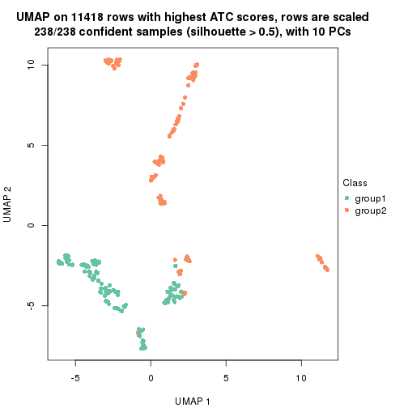</p>

</div>
<div id='tab-node-01-dimension-reduction-2'>
<pre><code class="r">dimension_reduction(res, k = 3, method = &quot;UMAP&quot;)
</code></pre>

<p></p>

</div>
<div id='tab-node-01-dimension-reduction-3'>
<pre><code class="r">dimension_reduction(res, k = 4, method = &quot;UMAP&quot;)
</code></pre>

<p></p>

</div>
</div>


Following heatmap shows how subgroups are split when increasing `k`:

```r
collect_classes(res)
```


Test correlation between subgroups and known annotations. If the known
annotation is numeric, one-way ANOVA test is applied, and if the known
annotation is discrete, chi-squared contingency table test is applied.

```r
test_to_known_factors(res)
```

```
#>             n_sample age(p-value) cell.type(p-value) k
#> ATC:skmeans      238     5.16e-44           8.65e-44 2
#> ATC:skmeans      237     1.48e-47           2.49e-64 3
#> ATC:skmeans      235     1.04e-47           7.54e-86 4
```


If matrix rows can be associated to genes, consider to use `functional_enrichment(res,
...)` to perform function enrichment for the signature genes. See [this vignette](https://jokergoo.github.io/cola_vignettes/functional_enrichment.html) for more detailed explanations.


 

---------------------------------------------------


### Node011


Parent node: [Node01](#Node01).
Child nodes: 
                Node0111-leaf
        ,
                [Node0112](#Node0112)
        ,
                Node0121-leaf
        ,
                Node0122-leaf
        ,
                Node0123-leaf
        ,
                Node0124-leaf
        ,
                Node0131-leaf
        ,
                Node0132-leaf
        ,
                Node0133-leaf
        ,
                Node0211-leaf
        ,
                Node0212-leaf
        .


The object with results only for a single top-value method and a single partitioning method 
can be extracted as:

```r
res = res_rh["011"]
```

A summary of `res` and all the functions that can be applied to it:

```r
res
```

```
#> A 'ConsensusPartition' object with k = 2, 3, 4.
#>   On a matrix with 10941 rows and 110 columns.
#>   Top rows (974) are extracted by 'ATC' method.
#>   Subgroups are detected by 'skmeans' method.
#>   Performed in total 150 partitions by row resampling.
#>   Best k for subgroups seems to be 4.
#> 
#> Following methods can be applied to this 'ConsensusPartition' object:
#>  [1] "cola_report"             "collect_classes"         "collect_plots"          
#>  [4] "collect_stats"           "colnames"                "compare_partitions"     
#>  [7] "compare_signatures"      "consensus_heatmap"       "dimension_reduction"    
#> [10] "functional_enrichment"   "get_anno_col"            "get_anno"               
#> [13] "get_classes"             "get_consensus"           "get_matrix"             
#> [16] "get_membership"          "get_param"               "get_signatures"         
#> [19] "get_stats"               "is_best_k"               "is_stable_k"            
#> [22] "membership_heatmap"      "ncol"                    "nrow"                   
#> [25] "plot_ecdf"               "predict_classes"         "rownames"               
#> [28] "select_partition_number" "show"                    "suggest_best_k"         
#> [31] "test_to_known_factors"   "top_rows_heatmap"
```

`collect_plots()` function collects all the plots made from `res` for all `k` (number of subgroups)
into one single page to provide an easy and fast comparison between different `k`.

```r
collect_plots(res)
```


The plots are:

- The first row: a plot of the eCDF (empirical cumulative distribution
  function) curves of the consensus matrix for each `k` and the heatmap of
  predicted classes for each `k`.
- The second row: heatmaps of the consensus matrix for each `k`.
- The third row: heatmaps of the membership matrix for each `k`.
- The fouth row: heatmaps of the signatures for each `k`.

All the plots in panels can be made by individual functions and they are
plotted later in this section.

`select_partition_number()` produces several plots showing different
statistics for choosing "optimized" `k`. There are following statistics:

- eCDF curves of the consensus matrix for each `k`;
- 1-PAC. [The PAC score](https://en.wikipedia.org/wiki/Consensus_clustering#Over-interpretation_potential_of_consensus_clustering)
  measures the proportion of the ambiguous subgrouping.
- Mean silhouette score.
- Concordance. The mean probability of fiting the consensus subgroup labels in all
  partitions.
- Area increased. Denote $A_k$ as the area under the eCDF curve for current
  `k`, the area increased is defined as $A_k - A_{k-1}$.
- Rand index. The percent of pairs of samples that are both in a same cluster
  or both are not in a same cluster in the partition of k and k-1.
- Jaccard index. The ratio of pairs of samples are both in a same cluster in
  the partition of k and k-1 and the pairs of samples are both in a same
  cluster in the partition k or k-1.

The detailed explanations of these statistics can be found in [the _cola_
vignette](https://jokergoo.github.io/cola_vignettes/cola.html#toc_13).

Generally speaking, higher 1-PAC score, higher mean silhouette score or higher
concordance corresponds to better partition. Rand index and Jaccard index
measure how similar the current partition is compared to partition with `k-1`.
If they are too similar, we won't accept `k` is better than `k-1`.

```r
select_partition_number(res)
```


The numeric values for all these statistics can be obtained by `get_stats()`.

```r
get_stats(res)
```

```
#>   k 1-PAC mean_silhouette concordance area_increased  Rand Jaccard
#> 2 2 1.000           0.976       0.991          0.505 0.495   0.495
#> 3 3 0.984           0.949       0.981          0.241 0.808   0.637
#> 4 4 0.905           0.903       0.945          0.152 0.883   0.696
```

`suggest_best_k()` suggests the best $k$ based on these statistics. The rules are as follows:

- All $k$ with Jaccard index larger than 0.95 are removed because increasing
  $k$ does not provide enough extra information. If all $k$ are removed, it is
  marked as no subgroup is detected.
- For all $k$ with 1-PAC score larger than 0.9, the maximal $k$ is taken as
  the best $k$, and other $k$ are marked as optional $k$.
- If it does not fit the second rule. The $k$ with the maximal vote of the
  highest 1-PAC score, highest mean silhouette, and highest concordance is
  taken as the best $k$.

```r
suggest_best_k(res)
```

```
#> [1] 4
#> attr(,"optional")
#> [1] 2 3
```

There is also optional best $k$ = 2 3 that is worth to check.

Following is the table of the partitions (You need to click the **show/hide
code output** link to see it). The membership matrix (columns with name `p*`)
is inferred by
[`clue::cl_consensus()`](https://www.rdocumentation.org/link/cl_consensus?package=clue)
function with the `SE` method. Basically the value in the membership matrix
represents the probability to belong to a certain group. The finall subgroup
label for an item is determined with the group with highest probability it
belongs to.

In `get_classes()` function, the entropy is calculated from the membership
matrix and the silhouette score is calculated from the consensus matrix.


<script>
$( function() {
	$( '#tabs-node-011-get-classes' ).tabs();
} );
</script>
<div id='tabs-node-011-get-classes'>
<ul>
<li><a href='#tab-node-011-get-classes-1'>k = 2</a></li>
<li><a href='#tab-node-011-get-classes-2'>k = 3</a></li>
<li><a href='#tab-node-011-get-classes-3'>k = 4</a></li>
</ul>

<div id='tab-node-011-get-classes-1'>
<p><a id='tab-node-011-get-classes-1-a' style='color:#0366d6' href='#'>show/hide code output</a></p>
<pre><code class="r">cbind(get_classes(res, k = 2), get_membership(res, k = 2))
</code></pre>

<pre><code>#&gt;            class entropy silhouette   p1   p2
#&gt; GSM1658003     2   0.000      0.992 0.00 1.00
#&gt; GSM1658203     2   0.000      0.992 0.00 1.00
#&gt; GSM1658204     2   0.000      0.992 0.00 1.00
#&gt; GSM1658206     2   0.000      0.992 0.00 1.00
#&gt; GSM1658207     2   0.000      0.992 0.00 1.00
#&gt; GSM1658209     2   0.000      0.992 0.00 1.00
#&gt; GSM1658211     2   0.000      0.992 0.00 1.00
#&gt; GSM1658212     2   0.000      0.992 0.00 1.00
#&gt; GSM1658214     2   0.000      0.992 0.00 1.00
#&gt; GSM1658216     2   0.000      0.992 0.00 1.00
#&gt; GSM1658218     2   0.000      0.992 0.00 1.00
#&gt; GSM1658219     2   0.000      0.992 0.00 1.00
#&gt; GSM1658220     2   0.000      0.992 0.00 1.00
#&gt; GSM1658221     2   0.000      0.992 0.00 1.00
#&gt; GSM1658222     2   0.000      0.992 0.00 1.00
#&gt; GSM1658224     2   0.000      0.992 0.00 1.00
#&gt; GSM1658226     2   0.000      0.992 0.00 1.00
#&gt; GSM1658227     2   0.000      0.992 0.00 1.00
#&gt; GSM1658228     2   0.000      0.992 0.00 1.00
#&gt; GSM1658229     1   0.000      0.990 1.00 0.00
#&gt; GSM1658230     2   0.000      0.992 0.00 1.00
#&gt; GSM1658231     1   0.000      0.990 1.00 0.00
#&gt; GSM1658232     2   0.000      0.992 0.00 1.00
#&gt; GSM1658233     1   0.000      0.990 1.00 0.00
#&gt; GSM1658234     2   0.000      0.992 0.00 1.00
#&gt; GSM1658235     1   0.000      0.990 1.00 0.00
#&gt; GSM1658236     2   0.000      0.992 0.00 1.00
#&gt; GSM1658237     1   0.000      0.990 1.00 0.00
#&gt; GSM1658238     1   0.000      0.990 1.00 0.00
#&gt; GSM1658239     1   0.000      0.990 1.00 0.00
#&gt; GSM1658240     1   0.000      0.990 1.00 0.00
#&gt; GSM1658241     1   0.000      0.990 1.00 0.00
#&gt; GSM1658242     2   0.000      0.992 0.00 1.00
#&gt; GSM1658243     1   0.000      0.990 1.00 0.00
#&gt; GSM1658244     1   0.000      0.990 1.00 0.00
#&gt; GSM1658246     1   0.000      0.990 1.00 0.00
#&gt; GSM1658247     1   0.000      0.990 1.00 0.00
#&gt; GSM1658249     1   0.000      0.990 1.00 0.00
#&gt; GSM1658251     1   0.000      0.990 1.00 0.00
#&gt; GSM1658253     1   0.000      0.990 1.00 0.00
#&gt; GSM1658262     1   0.000      0.990 1.00 0.00
#&gt; GSM1658264     2   0.000      0.992 0.00 1.00
#&gt; GSM1658266     1   0.000      0.990 1.00 0.00
#&gt; GSM1658270     1   0.000      0.990 1.00 0.00
#&gt; GSM1658272     1   0.000      0.990 1.00 0.00
#&gt; GSM1658275     2   0.000      0.992 0.00 1.00
#&gt; GSM1658279     1   0.000      0.990 1.00 0.00
#&gt; GSM1658284     1   0.000      0.990 1.00 0.00
#&gt; GSM1658286     1   0.000      0.990 1.00 0.00
#&gt; GSM1658288     2   0.000      0.992 0.00 1.00
#&gt; GSM1658290     1   0.000      0.990 1.00 0.00
#&gt; GSM1658292     1   0.000      0.990 1.00 0.00
#&gt; GSM1658297     2   0.000      0.992 0.00 1.00
#&gt; GSM1658301     1   0.000      0.990 1.00 0.00
#&gt; GSM1658305     1   0.402      0.906 0.92 0.08
#&gt; GSM1658306     2   0.000      0.992 0.00 1.00
#&gt; GSM1658307     1   0.000      0.990 1.00 0.00
#&gt; GSM1658308     2   0.000      0.992 0.00 1.00
#&gt; GSM1658309     2   0.000      0.992 0.00 1.00
#&gt; GSM1658310     1   0.000      0.990 1.00 0.00
#&gt; GSM1658311     2   0.000      0.992 0.00 1.00
#&gt; GSM1658312     1   0.000      0.990 1.00 0.00
#&gt; GSM1658314     1   0.000      0.990 1.00 0.00
#&gt; GSM1658315     2   0.000      0.992 0.00 1.00
#&gt; GSM1658316     2   0.000      0.992 0.00 1.00
#&gt; GSM1658317     1   0.000      0.990 1.00 0.00
#&gt; GSM1658318     1   0.000      0.990 1.00 0.00
#&gt; GSM1658319     2   0.000      0.992 0.00 1.00
#&gt; GSM1658320     2   0.000      0.992 0.00 1.00
#&gt; GSM1658321     1   0.000      0.990 1.00 0.00
#&gt; GSM1658322     1   0.000      0.990 1.00 0.00
#&gt; GSM1658324     2   0.000      0.992 0.00 1.00
#&gt; GSM1658325     2   0.981      0.263 0.42 0.58
#&gt; GSM1658326     2   0.000      0.992 0.00 1.00
#&gt; GSM1658327     1   0.000      0.990 1.00 0.00
#&gt; GSM1658328     1   0.000      0.990 1.00 0.00
#&gt; GSM1658329     2   0.000      0.992 0.00 1.00
#&gt; GSM1658330     1   0.000      0.990 1.00 0.00
#&gt; GSM1658332     2   0.000      0.992 0.00 1.00
#&gt; GSM1658333     2   0.000      0.992 0.00 1.00
#&gt; GSM1658334     2   0.000      0.992 0.00 1.00
#&gt; GSM1658335     1   0.000      0.990 1.00 0.00
#&gt; GSM1658336     1   0.000      0.990 1.00 0.00
#&gt; GSM1658337     2   0.000      0.992 0.00 1.00
#&gt; GSM1658338     1   0.000      0.990 1.00 0.00
#&gt; GSM1658340     1   0.000      0.990 1.00 0.00
#&gt; GSM1658341     2   0.000      0.992 0.00 1.00
#&gt; GSM1658342     1   0.000      0.990 1.00 0.00
#&gt; GSM1658343     1   0.000      0.990 1.00 0.00
#&gt; GSM1658344     1   0.000      0.990 1.00 0.00
#&gt; GSM1658345     2   0.000      0.992 0.00 1.00
#&gt; GSM1658346     1   0.000      0.990 1.00 0.00
#&gt; GSM1658347     2   0.000      0.992 0.00 1.00
#&gt; GSM1658349     1   0.000      0.990 1.00 0.00
#&gt; GSM1658350     1   0.995      0.139 0.54 0.46
#&gt; GSM1658351     1   0.000      0.990 1.00 0.00
#&gt; GSM1658353     2   0.000      0.992 0.00 1.00
#&gt; GSM1658354     1   0.000      0.990 1.00 0.00
#&gt; GSM1658355     2   0.000      0.992 0.00 1.00
#&gt; GSM1658356     1   0.000      0.990 1.00 0.00
#&gt; GSM1658357     2   0.000      0.992 0.00 1.00
#&gt; GSM1658358     1   0.000      0.990 1.00 0.00
#&gt; GSM1658359     2   0.000      0.992 0.00 1.00
#&gt; GSM1658360     2   0.000      0.992 0.00 1.00
#&gt; GSM1658361     2   0.000      0.992 0.00 1.00
#&gt; GSM1658362     1   0.000      0.990 1.00 0.00
#&gt; GSM1658363     1   0.000      0.990 1.00 0.00
#&gt; GSM1658364     2   0.000      0.992 0.00 1.00
#&gt; GSM1658365     1   0.000      0.990 1.00 0.00
#&gt; GSM1658366     2   0.000      0.992 0.00 1.00
</code></pre>

<script>
$('#tab-node-011-get-classes-1-a').parent().next().next().hide();
$('#tab-node-011-get-classes-1-a').click(function(){
  $('#tab-node-011-get-classes-1-a').parent().next().next().toggle();
  return(false);
});
</script>
</div>

<div id='tab-node-011-get-classes-2'>
<p><a id='tab-node-011-get-classes-2-a' style='color:#0366d6' href='#'>show/hide code output</a></p>
<pre><code class="r">cbind(get_classes(res, k = 3), get_membership(res, k = 3))
</code></pre>

<pre><code>#&gt;            class entropy silhouette   p1   p2   p3
#&gt; GSM1658003     2  0.0000     0.9799 0.00 1.00 0.00
#&gt; GSM1658203     3  0.0000     0.9786 0.00 0.00 1.00
#&gt; GSM1658204     3  0.0000     0.9786 0.00 0.00 1.00
#&gt; GSM1658206     3  0.0000     0.9786 0.00 0.00 1.00
#&gt; GSM1658207     3  0.0000     0.9786 0.00 0.00 1.00
#&gt; GSM1658209     3  0.0000     0.9786 0.00 0.00 1.00
#&gt; GSM1658211     3  0.0000     0.9786 0.00 0.00 1.00
#&gt; GSM1658212     2  0.0892     0.9602 0.00 0.98 0.02
#&gt; GSM1658214     3  0.0000     0.9786 0.00 0.00 1.00
#&gt; GSM1658216     3  0.0000     0.9786 0.00 0.00 1.00
#&gt; GSM1658218     3  0.0000     0.9786 0.00 0.00 1.00
#&gt; GSM1658219     3  0.0000     0.9786 0.00 0.00 1.00
#&gt; GSM1658220     3  0.0000     0.9786 0.00 0.00 1.00
#&gt; GSM1658221     2  0.0000     0.9799 0.00 1.00 0.00
#&gt; GSM1658222     3  0.0000     0.9786 0.00 0.00 1.00
#&gt; GSM1658224     3  0.0000     0.9786 0.00 0.00 1.00
#&gt; GSM1658226     2  0.0000     0.9799 0.00 1.00 0.00
#&gt; GSM1658227     2  0.0000     0.9799 0.00 1.00 0.00
#&gt; GSM1658228     3  0.5948     0.4358 0.00 0.36 0.64
#&gt; GSM1658229     1  0.0000     0.9756 1.00 0.00 0.00
#&gt; GSM1658230     2  0.0000     0.9799 0.00 1.00 0.00
#&gt; GSM1658231     1  0.0000     0.9756 1.00 0.00 0.00
#&gt; GSM1658232     2  0.0000     0.9799 0.00 1.00 0.00
#&gt; GSM1658233     1  0.0000     0.9756 1.00 0.00 0.00
#&gt; GSM1658234     2  0.0000     0.9799 0.00 1.00 0.00
#&gt; GSM1658235     1  0.0000     0.9756 1.00 0.00 0.00
#&gt; GSM1658236     2  0.0000     0.9799 0.00 1.00 0.00
#&gt; GSM1658237     1  0.0000     0.9756 1.00 0.00 0.00
#&gt; GSM1658238     1  0.0000     0.9756 1.00 0.00 0.00
#&gt; GSM1658239     1  0.0000     0.9756 1.00 0.00 0.00
#&gt; GSM1658240     1  0.0000     0.9756 1.00 0.00 0.00
#&gt; GSM1658241     1  0.0000     0.9756 1.00 0.00 0.00
#&gt; GSM1658242     3  0.0000     0.9786 0.00 0.00 1.00
#&gt; GSM1658243     1  0.0000     0.9756 1.00 0.00 0.00
#&gt; GSM1658244     1  0.0000     0.9756 1.00 0.00 0.00
#&gt; GSM1658246     1  0.0000     0.9756 1.00 0.00 0.00
#&gt; GSM1658247     1  0.0000     0.9756 1.00 0.00 0.00
#&gt; GSM1658249     1  0.0000     0.9756 1.00 0.00 0.00
#&gt; GSM1658251     1  0.0000     0.9756 1.00 0.00 0.00
#&gt; GSM1658253     1  0.0000     0.9756 1.00 0.00 0.00
#&gt; GSM1658262     1  0.0000     0.9756 1.00 0.00 0.00
#&gt; GSM1658264     2  0.0000     0.9799 0.00 1.00 0.00
#&gt; GSM1658266     1  0.0000     0.9756 1.00 0.00 0.00
#&gt; GSM1658270     1  0.0000     0.9756 1.00 0.00 0.00
#&gt; GSM1658272     1  0.0000     0.9756 1.00 0.00 0.00
#&gt; GSM1658275     2  0.0000     0.9799 0.00 1.00 0.00
#&gt; GSM1658279     1  0.0000     0.9756 1.00 0.00 0.00
#&gt; GSM1658284     1  0.0000     0.9756 1.00 0.00 0.00
#&gt; GSM1658286     1  0.0000     0.9756 1.00 0.00 0.00
#&gt; GSM1658288     2  0.0000     0.9799 0.00 1.00 0.00
#&gt; GSM1658290     1  0.0000     0.9756 1.00 0.00 0.00
#&gt; GSM1658292     1  0.0000     0.9756 1.00 0.00 0.00
#&gt; GSM1658297     2  0.0000     0.9799 0.00 1.00 0.00
#&gt; GSM1658301     1  0.0000     0.9756 1.00 0.00 0.00
#&gt; GSM1658305     2  0.0000     0.9799 0.00 1.00 0.00
#&gt; GSM1658306     2  0.0000     0.9799 0.00 1.00 0.00
#&gt; GSM1658307     1  0.0000     0.9756 1.00 0.00 0.00
#&gt; GSM1658308     2  0.0000     0.9799 0.00 1.00 0.00
#&gt; GSM1658309     2  0.0000     0.9799 0.00 1.00 0.00
#&gt; GSM1658310     1  0.0000     0.9756 1.00 0.00 0.00
#&gt; GSM1658311     2  0.0000     0.9799 0.00 1.00 0.00
#&gt; GSM1658312     1  0.0000     0.9756 1.00 0.00 0.00
#&gt; GSM1658314     1  0.0000     0.9756 1.00 0.00 0.00
#&gt; GSM1658315     2  0.0000     0.9799 0.00 1.00 0.00
#&gt; GSM1658316     2  0.0000     0.9799 0.00 1.00 0.00
#&gt; GSM1658317     1  0.0000     0.9756 1.00 0.00 0.00
#&gt; GSM1658318     1  0.0000     0.9756 1.00 0.00 0.00
#&gt; GSM1658319     2  0.0000     0.9799 0.00 1.00 0.00
#&gt; GSM1658320     2  0.0000     0.9799 0.00 1.00 0.00
#&gt; GSM1658321     1  0.5560     0.5710 0.70 0.30 0.00
#&gt; GSM1658322     1  0.3340     0.8409 0.88 0.12 0.00
#&gt; GSM1658324     2  0.0000     0.9799 0.00 1.00 0.00
#&gt; GSM1658325     2  0.0000     0.9799 0.00 1.00 0.00
#&gt; GSM1658326     2  0.0000     0.9799 0.00 1.00 0.00
#&gt; GSM1658327     1  0.0000     0.9756 1.00 0.00 0.00
#&gt; GSM1658328     1  0.0000     0.9756 1.00 0.00 0.00
#&gt; GSM1658329     2  0.0000     0.9799 0.00 1.00 0.00
#&gt; GSM1658330     1  0.2959     0.8669 0.90 0.10 0.00
#&gt; GSM1658332     2  0.0000     0.9799 0.00 1.00 0.00
#&gt; GSM1658333     2  0.0000     0.9799 0.00 1.00 0.00
#&gt; GSM1658334     2  0.0000     0.9799 0.00 1.00 0.00
#&gt; GSM1658335     1  0.0000     0.9756 1.00 0.00 0.00
#&gt; GSM1658336     1  0.0000     0.9756 1.00 0.00 0.00
#&gt; GSM1658337     2  0.0000     0.9799 0.00 1.00 0.00
#&gt; GSM1658338     1  0.0000     0.9756 1.00 0.00 0.00
#&gt; GSM1658340     1  0.0000     0.9756 1.00 0.00 0.00
#&gt; GSM1658341     2  0.0000     0.9799 0.00 1.00 0.00
#&gt; GSM1658342     2  0.5016     0.6589 0.24 0.76 0.00
#&gt; GSM1658343     1  0.0000     0.9756 1.00 0.00 0.00
#&gt; GSM1658344     1  0.0000     0.9756 1.00 0.00 0.00
#&gt; GSM1658345     2  0.0000     0.9799 0.00 1.00 0.00
#&gt; GSM1658346     3  0.0000     0.9786 0.00 0.00 1.00
#&gt; GSM1658347     3  0.0000     0.9786 0.00 0.00 1.00
#&gt; GSM1658349     1  0.6302     0.0744 0.52 0.48 0.00
#&gt; GSM1658350     2  0.0000     0.9799 0.00 1.00 0.00
#&gt; GSM1658351     2  0.6192     0.2613 0.42 0.58 0.00
#&gt; GSM1658353     2  0.0000     0.9799 0.00 1.00 0.00
#&gt; GSM1658354     1  0.0000     0.9756 1.00 0.00 0.00
#&gt; GSM1658355     3  0.0000     0.9786 0.00 0.00 1.00
#&gt; GSM1658356     1  0.0000     0.9756 1.00 0.00 0.00
#&gt; GSM1658357     2  0.0000     0.9799 0.00 1.00 0.00
#&gt; GSM1658358     1  0.0000     0.9756 1.00 0.00 0.00
#&gt; GSM1658359     2  0.0000     0.9799 0.00 1.00 0.00
#&gt; GSM1658360     2  0.0000     0.9799 0.00 1.00 0.00
#&gt; GSM1658361     2  0.0000     0.9799 0.00 1.00 0.00
#&gt; GSM1658362     1  0.0000     0.9756 1.00 0.00 0.00
#&gt; GSM1658363     2  0.0000     0.9799 0.00 1.00 0.00
#&gt; GSM1658364     2  0.0000     0.9799 0.00 1.00 0.00
#&gt; GSM1658365     1  0.0000     0.9756 1.00 0.00 0.00
#&gt; GSM1658366     2  0.0000     0.9799 0.00 1.00 0.00
</code></pre>

<script>
$('#tab-node-011-get-classes-2-a').parent().next().next().hide();
$('#tab-node-011-get-classes-2-a').click(function(){
  $('#tab-node-011-get-classes-2-a').parent().next().next().toggle();
  return(false);
});
</script>
</div>

<div id='tab-node-011-get-classes-3'>
<p><a id='tab-node-011-get-classes-3-a' style='color:#0366d6' href='#'>show/hide code output</a></p>
<pre><code class="r">cbind(get_classes(res, k = 4), get_membership(res, k = 4))
</code></pre>

<pre><code>#&gt;            class entropy silhouette   p1   p2   p3   p4
#&gt; GSM1658003     2  0.0000      0.962 0.00 1.00 0.00 0.00
#&gt; GSM1658203     3  0.0000      0.996 0.00 0.00 1.00 0.00
#&gt; GSM1658204     3  0.0000      0.996 0.00 0.00 1.00 0.00
#&gt; GSM1658206     3  0.0000      0.996 0.00 0.00 1.00 0.00
#&gt; GSM1658207     3  0.0000      0.996 0.00 0.00 1.00 0.00
#&gt; GSM1658209     3  0.0000      0.996 0.00 0.00 1.00 0.00
#&gt; GSM1658211     3  0.0000      0.996 0.00 0.00 1.00 0.00
#&gt; GSM1658212     2  0.0707      0.951 0.00 0.98 0.02 0.00
#&gt; GSM1658214     3  0.0000      0.996 0.00 0.00 1.00 0.00
#&gt; GSM1658216     3  0.0000      0.996 0.00 0.00 1.00 0.00
#&gt; GSM1658218     3  0.0000      0.996 0.00 0.00 1.00 0.00
#&gt; GSM1658219     3  0.0000      0.996 0.00 0.00 1.00 0.00
#&gt; GSM1658220     3  0.0000      0.996 0.00 0.00 1.00 0.00
#&gt; GSM1658221     2  0.0000      0.962 0.00 1.00 0.00 0.00
#&gt; GSM1658222     3  0.0000      0.996 0.00 0.00 1.00 0.00
#&gt; GSM1658224     3  0.0000      0.996 0.00 0.00 1.00 0.00
#&gt; GSM1658226     2  0.0000      0.962 0.00 1.00 0.00 0.00
#&gt; GSM1658227     2  0.0000      0.962 0.00 1.00 0.00 0.00
#&gt; GSM1658228     2  0.4977      0.155 0.00 0.54 0.46 0.00
#&gt; GSM1658229     1  0.0000      0.927 1.00 0.00 0.00 0.00
#&gt; GSM1658230     2  0.0000      0.962 0.00 1.00 0.00 0.00
#&gt; GSM1658231     1  0.0000      0.927 1.00 0.00 0.00 0.00
#&gt; GSM1658232     2  0.0000      0.962 0.00 1.00 0.00 0.00
#&gt; GSM1658233     1  0.0000      0.927 1.00 0.00 0.00 0.00
#&gt; GSM1658234     2  0.0707      0.951 0.00 0.98 0.00 0.02
#&gt; GSM1658235     1  0.0000      0.927 1.00 0.00 0.00 0.00
#&gt; GSM1658236     2  0.0000      0.962 0.00 1.00 0.00 0.00
#&gt; GSM1658237     1  0.0000      0.927 1.00 0.00 0.00 0.00
#&gt; GSM1658238     4  0.2345      0.903 0.10 0.00 0.00 0.90
#&gt; GSM1658239     4  0.2011      0.915 0.08 0.00 0.00 0.92
#&gt; GSM1658240     1  0.0000      0.927 1.00 0.00 0.00 0.00
#&gt; GSM1658241     1  0.0707      0.922 0.98 0.00 0.00 0.02
#&gt; GSM1658242     3  0.0000      0.996 0.00 0.00 1.00 0.00
#&gt; GSM1658243     1  0.0000      0.927 1.00 0.00 0.00 0.00
#&gt; GSM1658244     1  0.0707      0.922 0.98 0.00 0.00 0.02
#&gt; GSM1658246     1  0.1211      0.911 0.96 0.00 0.00 0.04
#&gt; GSM1658247     1  0.0000      0.927 1.00 0.00 0.00 0.00
#&gt; GSM1658249     1  0.3172      0.789 0.84 0.00 0.00 0.16
#&gt; GSM1658251     1  0.1211      0.905 0.96 0.00 0.00 0.04
#&gt; GSM1658253     4  0.1637      0.912 0.06 0.00 0.00 0.94
#&gt; GSM1658262     1  0.0000      0.927 1.00 0.00 0.00 0.00
#&gt; GSM1658264     2  0.0000      0.962 0.00 1.00 0.00 0.00
#&gt; GSM1658266     1  0.1637      0.896 0.94 0.00 0.00 0.06
#&gt; GSM1658270     4  0.2011      0.915 0.08 0.00 0.00 0.92
#&gt; GSM1658272     1  0.0707      0.922 0.98 0.00 0.00 0.02
#&gt; GSM1658275     2  0.0000      0.962 0.00 1.00 0.00 0.00
#&gt; GSM1658279     1  0.0000      0.927 1.00 0.00 0.00 0.00
#&gt; GSM1658284     4  0.2011      0.915 0.08 0.00 0.00 0.92
#&gt; GSM1658286     1  0.0707      0.917 0.98 0.00 0.00 0.02
#&gt; GSM1658288     2  0.0000      0.962 0.00 1.00 0.00 0.00
#&gt; GSM1658290     1  0.0707      0.922 0.98 0.00 0.00 0.02
#&gt; GSM1658292     1  0.0707      0.922 0.98 0.00 0.00 0.02
#&gt; GSM1658297     2  0.0707      0.951 0.00 0.98 0.00 0.02
#&gt; GSM1658301     1  0.0000      0.927 1.00 0.00 0.00 0.00
#&gt; GSM1658305     2  0.5902      0.655 0.16 0.70 0.00 0.14
#&gt; GSM1658306     2  0.0000      0.962 0.00 1.00 0.00 0.00
#&gt; GSM1658307     1  0.2011      0.877 0.92 0.00 0.00 0.08
#&gt; GSM1658308     2  0.1637      0.933 0.00 0.94 0.00 0.06
#&gt; GSM1658309     2  0.0000      0.962 0.00 1.00 0.00 0.00
#&gt; GSM1658310     1  0.0707      0.917 0.98 0.00 0.00 0.02
#&gt; GSM1658311     2  0.0000      0.962 0.00 1.00 0.00 0.00
#&gt; GSM1658312     4  0.4790      0.406 0.38 0.00 0.00 0.62
#&gt; GSM1658314     1  0.4977      0.231 0.54 0.00 0.00 0.46
#&gt; GSM1658315     2  0.1637      0.933 0.00 0.94 0.00 0.06
#&gt; GSM1658316     2  0.0000      0.962 0.00 1.00 0.00 0.00
#&gt; GSM1658317     1  0.0000      0.927 1.00 0.00 0.00 0.00
#&gt; GSM1658318     1  0.2345      0.852 0.90 0.00 0.00 0.10
#&gt; GSM1658319     2  0.2011      0.918 0.00 0.92 0.00 0.08
#&gt; GSM1658320     2  0.0000      0.962 0.00 1.00 0.00 0.00
#&gt; GSM1658321     1  0.4292      0.787 0.82 0.08 0.00 0.10
#&gt; GSM1658322     1  0.2706      0.865 0.90 0.02 0.00 0.08
#&gt; GSM1658324     2  0.0000      0.962 0.00 1.00 0.00 0.00
#&gt; GSM1658325     2  0.1637      0.930 0.00 0.94 0.00 0.06
#&gt; GSM1658326     2  0.1637      0.933 0.00 0.94 0.00 0.06
#&gt; GSM1658327     4  0.1637      0.912 0.06 0.00 0.00 0.94
#&gt; GSM1658328     1  0.1211      0.911 0.96 0.00 0.00 0.04
#&gt; GSM1658329     2  0.0000      0.962 0.00 1.00 0.00 0.00
#&gt; GSM1658330     1  0.3037      0.854 0.88 0.02 0.00 0.10
#&gt; GSM1658332     2  0.0000      0.962 0.00 1.00 0.00 0.00
#&gt; GSM1658333     2  0.0707      0.954 0.00 0.98 0.00 0.02
#&gt; GSM1658334     2  0.0000      0.962 0.00 1.00 0.00 0.00
#&gt; GSM1658335     4  0.1637      0.912 0.06 0.00 0.00 0.94
#&gt; GSM1658336     1  0.0707      0.922 0.98 0.00 0.00 0.02
#&gt; GSM1658337     2  0.1637      0.933 0.00 0.94 0.00 0.06
#&gt; GSM1658338     4  0.1637      0.912 0.06 0.00 0.00 0.94
#&gt; GSM1658340     4  0.3172      0.851 0.16 0.00 0.00 0.84
#&gt; GSM1658341     2  0.0000      0.962 0.00 1.00 0.00 0.00
#&gt; GSM1658342     4  0.3037      0.788 0.02 0.10 0.00 0.88
#&gt; GSM1658343     4  0.2011      0.915 0.08 0.00 0.00 0.92
#&gt; GSM1658344     4  0.2345      0.905 0.10 0.00 0.00 0.90
#&gt; GSM1658345     2  0.0707      0.954 0.00 0.98 0.00 0.02
#&gt; GSM1658346     3  0.1637      0.934 0.00 0.00 0.94 0.06
#&gt; GSM1658347     3  0.0000      0.996 0.00 0.00 1.00 0.00
#&gt; GSM1658349     1  0.6248      0.499 0.64 0.26 0.00 0.10
#&gt; GSM1658350     2  0.2921      0.865 0.00 0.86 0.00 0.14
#&gt; GSM1658351     4  0.7845      0.196 0.32 0.28 0.00 0.40
#&gt; GSM1658353     2  0.1211      0.944 0.00 0.96 0.00 0.04
#&gt; GSM1658354     4  0.2011      0.915 0.08 0.00 0.00 0.92
#&gt; GSM1658355     3  0.0000      0.996 0.00 0.00 1.00 0.00
#&gt; GSM1658356     4  0.1637      0.912 0.06 0.00 0.00 0.94
#&gt; GSM1658357     2  0.0000      0.962 0.00 1.00 0.00 0.00
#&gt; GSM1658358     4  0.1637      0.912 0.06 0.00 0.00 0.94
#&gt; GSM1658359     2  0.0000      0.962 0.00 1.00 0.00 0.00
#&gt; GSM1658360     2  0.0000      0.962 0.00 1.00 0.00 0.00
#&gt; GSM1658361     2  0.0000      0.962 0.00 1.00 0.00 0.00
#&gt; GSM1658362     4  0.2011      0.915 0.08 0.00 0.00 0.92
#&gt; GSM1658363     2  0.4227      0.823 0.06 0.82 0.00 0.12
#&gt; GSM1658364     2  0.0707      0.954 0.00 0.98 0.00 0.02
#&gt; GSM1658365     1  0.3400      0.760 0.82 0.00 0.00 0.18
#&gt; GSM1658366     2  0.0000      0.962 0.00 1.00 0.00 0.00
</code></pre>

<script>
$('#tab-node-011-get-classes-3-a').parent().next().next().hide();
$('#tab-node-011-get-classes-3-a').click(function(){
  $('#tab-node-011-get-classes-3-a').parent().next().next().toggle();
  return(false);
});
</script>
</div>
</div>

Heatmaps for the consensus matrix. It visualizes the probability of two
samples to be in a same group.


<script>
$( function() {
	$( '#tabs-node-011-consensus-heatmap' ).tabs();
} );
</script>
<div id='tabs-node-011-consensus-heatmap'>
<ul>
<li><a href='#tab-node-011-consensus-heatmap-1'>k = 2</a></li>
<li><a href='#tab-node-011-consensus-heatmap-2'>k = 3</a></li>
<li><a href='#tab-node-011-consensus-heatmap-3'>k = 4</a></li>
</ul>
<div id='tab-node-011-consensus-heatmap-1'>
<pre><code class="r">consensus_heatmap(res, k = 2)
</code></pre>

<p></p>

</div>
<div id='tab-node-011-consensus-heatmap-2'>
<pre><code class="r">consensus_heatmap(res, k = 3)
</code></pre>

<p></p>

</div>
<div id='tab-node-011-consensus-heatmap-3'>
<pre><code class="r">consensus_heatmap(res, k = 4)
</code></pre>

<p></p>

</div>
</div>

Heatmaps for the membership of samples in all partitions to see how consistent they are:


<script>
$( function() {
	$( '#tabs-node-011-membership-heatmap' ).tabs();
} );
</script>
<div id='tabs-node-011-membership-heatmap'>
<ul>
<li><a href='#tab-node-011-membership-heatmap-1'>k = 2</a></li>
<li><a href='#tab-node-011-membership-heatmap-2'>k = 3</a></li>
<li><a href='#tab-node-011-membership-heatmap-3'>k = 4</a></li>
</ul>
<div id='tab-node-011-membership-heatmap-1'>
<pre><code class="r">membership_heatmap(res, k = 2)
</code></pre>

<p>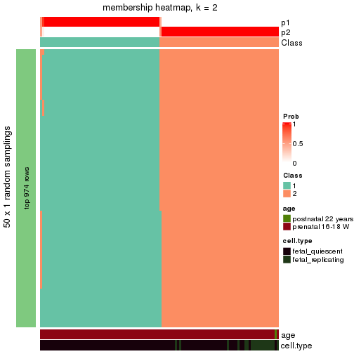</p>

</div>
<div id='tab-node-011-membership-heatmap-2'>
<pre><code class="r">membership_heatmap(res, k = 3)
</code></pre>

<p></p>

</div>
<div id='tab-node-011-membership-heatmap-3'>
<pre><code class="r">membership_heatmap(res, k = 4)
</code></pre>

<p></p>

</div>
</div>

As soon as the classes for columns are determined, the signatures
that are significantly different between subgroups can be looked for. 
Following are the heatmaps for signatures.


Signature heatmaps where rows are scaled:


<script>
$( function() {
	$( '#tabs-node-011-get-signatures' ).tabs();
} );
</script>
<div id='tabs-node-011-get-signatures'>
<ul>
<li><a href='#tab-node-011-get-signatures-1'>k = 2</a></li>
<li><a href='#tab-node-011-get-signatures-2'>k = 3</a></li>
<li><a href='#tab-node-011-get-signatures-3'>k = 4</a></li>
</ul>
<div id='tab-node-011-get-signatures-1'>
<pre><code class="r">get_signatures(res, k = 2)
</code></pre>

<p></p>

</div>
<div id='tab-node-011-get-signatures-2'>
<pre><code class="r">get_signatures(res, k = 3)
</code></pre>

<p></p>

</div>
<div id='tab-node-011-get-signatures-3'>
<pre><code class="r">get_signatures(res, k = 4)
</code></pre>

<p></p>

</div>
</div>


Signature heatmaps where rows are not scaled:


<script>
$( function() {
	$( '#tabs-node-011-get-signatures-no-scale' ).tabs();
} );
</script>
<div id='tabs-node-011-get-signatures-no-scale'>
<ul>
<li><a href='#tab-node-011-get-signatures-no-scale-1'>k = 2</a></li>
<li><a href='#tab-node-011-get-signatures-no-scale-2'>k = 3</a></li>
<li><a href='#tab-node-011-get-signatures-no-scale-3'>k = 4</a></li>
</ul>
<div id='tab-node-011-get-signatures-no-scale-1'>
<pre><code class="r">get_signatures(res, k = 2, scale_rows = FALSE)
</code></pre>

<p></p>

</div>
<div id='tab-node-011-get-signatures-no-scale-2'>
<pre><code class="r">get_signatures(res, k = 3, scale_rows = FALSE)
</code></pre>

<p></p>

</div>
<div id='tab-node-011-get-signatures-no-scale-3'>
<pre><code class="r">get_signatures(res, k = 4, scale_rows = FALSE)
</code></pre>

<p></p>

</div>
</div>


Compare the overlap of signatures from different k:

```r
compare_signatures(res)
```


`get_signature()` returns a data frame invisibly. To get the list of signatures, the function
call should be assigned to a variable explicitly. In following code, if `plot` argument is set
to `FALSE`, no heatmap is plotted while only the differential analysis is performed.

```r
# code only for demonstration
tb = get_signature(res, k = ..., plot = FALSE)
```

An example of the output of `tb` is:

```
#>   which_row         fdr    mean_1    mean_2 scaled_mean_1 scaled_mean_2 km
#> 1        38 0.042760348  8.373488  9.131774    -0.5533452     0.5164555  1
#> 2        40 0.018707592  7.106213  8.469186    -0.6173731     0.5762149  1
#> 3        55 0.019134737 10.221463 11.207825    -0.6159697     0.5749050  1
#> 4        59 0.006059896  5.921854  7.869574    -0.6899429     0.6439467  1
#> 5        60 0.018055526  8.928898 10.211722    -0.6204761     0.5791110  1
#> 6        98 0.009384629 15.714769 14.887706     0.6635654    -0.6193277  2
...
```

The columns in `tb` are:

1. `which_row`: row indices corresponding to the input matrix.
2. `fdr`: FDR for the differential test. 
3. `mean_x`: The mean value in group x.
4. `scaled_mean_x`: The mean value in group x after rows are scaled.
5. `km`: Row groups if k-means clustering is applied to rows (which is done by automatically selecting number of clusters).

If there are too many signatures, `top_signatures = ...` can be set to only show the 
signatures with the highest FDRs:

```r
# code only for demonstration
# e.g. to show the top 500 most significant rows
tb = get_signature(res, k = ..., top_signatures = 500)
```

If the signatures are defined as these which are uniquely high in current group, `diff_method` argument
can be set to `"uniquely_high_in_one_group"`:

```r
# code only for demonstration
tb = get_signature(res, k = ..., diff_method = "uniquely_high_in_one_group")
```


UMAP plot which shows how samples are separated.


<script>
$( function() {
	$( '#tabs-node-011-dimension-reduction' ).tabs();
} );
</script>
<div id='tabs-node-011-dimension-reduction'>
<ul>
<li><a href='#tab-node-011-dimension-reduction-1'>k = 2</a></li>
<li><a href='#tab-node-011-dimension-reduction-2'>k = 3</a></li>
<li><a href='#tab-node-011-dimension-reduction-3'>k = 4</a></li>
</ul>
<div id='tab-node-011-dimension-reduction-1'>
<pre><code class="r">dimension_reduction(res, k = 2, method = &quot;UMAP&quot;)
</code></pre>

<p></p>

</div>
<div id='tab-node-011-dimension-reduction-2'>
<pre><code class="r">dimension_reduction(res, k = 3, method = &quot;UMAP&quot;)
</code></pre>

<p></p>

</div>
<div id='tab-node-011-dimension-reduction-3'>
<pre><code class="r">dimension_reduction(res, k = 4, method = &quot;UMAP&quot;)
</code></pre>

<p></p>

</div>
</div>


Following heatmap shows how subgroups are split when increasing `k`:

```r
collect_classes(res)
```


Test correlation between subgroups and known annotations. If the known
annotation is numeric, one-way ANOVA test is applied, and if the known
annotation is discrete, chi-squared contingency table test is applied.

```r
test_to_known_factors(res)
```

```
#>             n_sample age(p-value) cell.type(p-value) k
#> ATC:skmeans      108        1.000           1.14e-05 2
#> ATC:skmeans      107        0.458           7.60e-21 3
#> ATC:skmeans      105        0.665           1.42e-19 4
```


If matrix rows can be associated to genes, consider to use `functional_enrichment(res,
...)` to perform function enrichment for the signature genes. See [this vignette](https://jokergoo.github.io/cola_vignettes/functional_enrichment.html) for more detailed explanations.


 

---------------------------------------------------


### Node0112


Parent node: [Node011](#Node011).
Child nodes: 
                Node01121-leaf
        ,
                Node01122-leaf
        .


The object with results only for a single top-value method and a single partitioning method 
can be extracted as:

```r
res = res_rh["0112"]
```

A summary of `res` and all the functions that can be applied to it:

```r
res
```

```
#> A 'ConsensusPartition' object with k = 2, 3, 4.
#>   On a matrix with 10102 rows and 55 columns.
#>   Top rows (1010) are extracted by 'ATC' method.
#>   Subgroups are detected by 'skmeans' method.
#>   Performed in total 150 partitions by row resampling.
#>   Best k for subgroups seems to be 2.
#> 
#> Following methods can be applied to this 'ConsensusPartition' object:
#>  [1] "cola_report"             "collect_classes"         "collect_plots"          
#>  [4] "collect_stats"           "colnames"                "compare_partitions"     
#>  [7] "compare_signatures"      "consensus_heatmap"       "dimension_reduction"    
#> [10] "functional_enrichment"   "get_anno_col"            "get_anno"               
#> [13] "get_classes"             "get_consensus"           "get_matrix"             
#> [16] "get_membership"          "get_param"               "get_signatures"         
#> [19] "get_stats"               "is_best_k"               "is_stable_k"            
#> [22] "membership_heatmap"      "ncol"                    "nrow"                   
#> [25] "plot_ecdf"               "predict_classes"         "rownames"               
#> [28] "select_partition_number" "show"                    "suggest_best_k"         
#> [31] "test_to_known_factors"   "top_rows_heatmap"
```

`collect_plots()` function collects all the plots made from `res` for all `k` (number of subgroups)
into one single page to provide an easy and fast comparison between different `k`.

```r
collect_plots(res)
```


The plots are:

- The first row: a plot of the eCDF (empirical cumulative distribution
  function) curves of the consensus matrix for each `k` and the heatmap of
  predicted classes for each `k`.
- The second row: heatmaps of the consensus matrix for each `k`.
- The third row: heatmaps of the membership matrix for each `k`.
- The fouth row: heatmaps of the signatures for each `k`.

All the plots in panels can be made by individual functions and they are
plotted later in this section.

`select_partition_number()` produces several plots showing different
statistics for choosing "optimized" `k`. There are following statistics:

- eCDF curves of the consensus matrix for each `k`;
- 1-PAC. [The PAC score](https://en.wikipedia.org/wiki/Consensus_clustering#Over-interpretation_potential_of_consensus_clustering)
  measures the proportion of the ambiguous subgrouping.
- Mean silhouette score.
- Concordance. The mean probability of fiting the consensus subgroup labels in all
  partitions.
- Area increased. Denote $A_k$ as the area under the eCDF curve for current
  `k`, the area increased is defined as $A_k - A_{k-1}$.
- Rand index. The percent of pairs of samples that are both in a same cluster
  or both are not in a same cluster in the partition of k and k-1.
- Jaccard index. The ratio of pairs of samples are both in a same cluster in
  the partition of k and k-1 and the pairs of samples are both in a same
  cluster in the partition k or k-1.

The detailed explanations of these statistics can be found in [the _cola_
vignette](https://jokergoo.github.io/cola_vignettes/cola.html#toc_13).

Generally speaking, higher 1-PAC score, higher mean silhouette score or higher
concordance corresponds to better partition. Rand index and Jaccard index
measure how similar the current partition is compared to partition with `k-1`.
If they are too similar, we won't accept `k` is better than `k-1`.

```r
select_partition_number(res)
```


The numeric values for all these statistics can be obtained by `get_stats()`.

```r
get_stats(res)
```

```
#>   k 1-PAC mean_silhouette concordance area_increased  Rand Jaccard
#> 2 2 1.000           0.986       0.994          0.431 0.565   0.565
#> 3 3 0.756           0.833       0.915          0.227 0.945   0.903
#> 4 4 0.468           0.548       0.776          0.267 0.826   0.665
```

`suggest_best_k()` suggests the best $k$ based on these statistics. The rules are as follows:

- All $k$ with Jaccard index larger than 0.95 are removed because increasing
  $k$ does not provide enough extra information. If all $k$ are removed, it is
  marked as no subgroup is detected.
- For all $k$ with 1-PAC score larger than 0.9, the maximal $k$ is taken as
  the best $k$, and other $k$ are marked as optional $k$.
- If it does not fit the second rule. The $k$ with the maximal vote of the
  highest 1-PAC score, highest mean silhouette, and highest concordance is
  taken as the best $k$.

```r
suggest_best_k(res)
```

```
#> [1] 2
```


Following is the table of the partitions (You need to click the **show/hide
code output** link to see it). The membership matrix (columns with name `p*`)
is inferred by
[`clue::cl_consensus()`](https://www.rdocumentation.org/link/cl_consensus?package=clue)
function with the `SE` method. Basically the value in the membership matrix
represents the probability to belong to a certain group. The finall subgroup
label for an item is determined with the group with highest probability it
belongs to.

In `get_classes()` function, the entropy is calculated from the membership
matrix and the silhouette score is calculated from the consensus matrix.


<script>
$( function() {
	$( '#tabs-node-0112-get-classes' ).tabs();
} );
</script>
<div id='tabs-node-0112-get-classes'>
<ul>
<li><a href='#tab-node-0112-get-classes-1'>k = 2</a></li>
<li><a href='#tab-node-0112-get-classes-2'>k = 3</a></li>
<li><a href='#tab-node-0112-get-classes-3'>k = 4</a></li>
</ul>

<div id='tab-node-0112-get-classes-1'>
<p><a id='tab-node-0112-get-classes-1-a' style='color:#0366d6' href='#'>show/hide code output</a></p>
<pre><code class="r">cbind(get_classes(res, k = 2), get_membership(res, k = 2))
</code></pre>

<pre><code>#&gt;            class entropy silhouette   p1   p2
#&gt; GSM1658003     1   0.000      1.000 1.00 0.00
#&gt; GSM1658203     2   0.000      0.980 0.00 1.00
#&gt; GSM1658204     2   0.000      0.980 0.00 1.00
#&gt; GSM1658206     2   0.000      0.980 0.00 1.00
#&gt; GSM1658207     2   0.000      0.980 0.00 1.00
#&gt; GSM1658209     2   0.000      0.980 0.00 1.00
#&gt; GSM1658211     2   0.000      0.980 0.00 1.00
#&gt; GSM1658212     1   0.000      1.000 1.00 0.00
#&gt; GSM1658214     2   0.000      0.980 0.00 1.00
#&gt; GSM1658216     2   0.000      0.980 0.00 1.00
#&gt; GSM1658218     2   0.000      0.980 0.00 1.00
#&gt; GSM1658219     2   0.000      0.980 0.00 1.00
#&gt; GSM1658220     2   0.000      0.980 0.00 1.00
#&gt; GSM1658221     1   0.000      1.000 1.00 0.00
#&gt; GSM1658222     2   0.000      0.980 0.00 1.00
#&gt; GSM1658224     2   0.000      0.980 0.00 1.00
#&gt; GSM1658226     1   0.000      1.000 1.00 0.00
#&gt; GSM1658227     1   0.000      1.000 1.00 0.00
#&gt; GSM1658228     2   0.904      0.529 0.32 0.68
#&gt; GSM1658230     1   0.000      1.000 1.00 0.00
#&gt; GSM1658232     1   0.000      1.000 1.00 0.00
#&gt; GSM1658234     1   0.000      1.000 1.00 0.00
#&gt; GSM1658236     1   0.000      1.000 1.00 0.00
#&gt; GSM1658242     2   0.000      0.980 0.00 1.00
#&gt; GSM1658264     1   0.000      1.000 1.00 0.00
#&gt; GSM1658275     1   0.000      1.000 1.00 0.00
#&gt; GSM1658288     1   0.000      1.000 1.00 0.00
#&gt; GSM1658297     1   0.000      1.000 1.00 0.00
#&gt; GSM1658306     1   0.000      1.000 1.00 0.00
#&gt; GSM1658308     1   0.000      1.000 1.00 0.00
#&gt; GSM1658309     1   0.000      1.000 1.00 0.00
#&gt; GSM1658311     1   0.000      1.000 1.00 0.00
#&gt; GSM1658315     1   0.000      1.000 1.00 0.00
#&gt; GSM1658316     1   0.000      1.000 1.00 0.00
#&gt; GSM1658319     1   0.000      1.000 1.00 0.00
#&gt; GSM1658320     1   0.000      1.000 1.00 0.00
#&gt; GSM1658324     1   0.000      1.000 1.00 0.00
#&gt; GSM1658325     1   0.000      1.000 1.00 0.00
#&gt; GSM1658326     1   0.000      1.000 1.00 0.00
#&gt; GSM1658329     1   0.000      1.000 1.00 0.00
#&gt; GSM1658332     1   0.000      1.000 1.00 0.00
#&gt; GSM1658333     1   0.000      1.000 1.00 0.00
#&gt; GSM1658334     1   0.000      1.000 1.00 0.00
#&gt; GSM1658337     1   0.000      1.000 1.00 0.00
#&gt; GSM1658341     1   0.000      1.000 1.00 0.00
#&gt; GSM1658345     1   0.000      1.000 1.00 0.00
#&gt; GSM1658347     2   0.000      0.980 0.00 1.00
#&gt; GSM1658353     1   0.000      1.000 1.00 0.00
#&gt; GSM1658355     2   0.000      0.980 0.00 1.00
#&gt; GSM1658357     1   0.000      1.000 1.00 0.00
#&gt; GSM1658359     1   0.000      1.000 1.00 0.00
#&gt; GSM1658360     1   0.000      1.000 1.00 0.00
#&gt; GSM1658361     1   0.000      1.000 1.00 0.00
#&gt; GSM1658364     1   0.000      1.000 1.00 0.00
#&gt; GSM1658366     1   0.000      1.000 1.00 0.00
</code></pre>

<script>
$('#tab-node-0112-get-classes-1-a').parent().next().next().hide();
$('#tab-node-0112-get-classes-1-a').click(function(){
  $('#tab-node-0112-get-classes-1-a').parent().next().next().toggle();
  return(false);
});
</script>
</div>

<div id='tab-node-0112-get-classes-2'>
<p><a id='tab-node-0112-get-classes-2-a' style='color:#0366d6' href='#'>show/hide code output</a></p>
<pre><code class="r">cbind(get_classes(res, k = 3), get_membership(res, k = 3))
</code></pre>

<pre><code>#&gt;            class entropy silhouette   p1   p2   p3
#&gt; GSM1658003     1  0.0892      0.927 0.98 0.00 0.02
#&gt; GSM1658203     2  0.0000      0.894 0.00 1.00 0.00
#&gt; GSM1658204     2  0.0000      0.894 0.00 1.00 0.00
#&gt; GSM1658206     2  0.0000      0.894 0.00 1.00 0.00
#&gt; GSM1658207     3  0.4002      0.578 0.00 0.16 0.84
#&gt; GSM1658209     2  0.6192      0.329 0.00 0.58 0.42
#&gt; GSM1658211     2  0.6192      0.285 0.00 0.58 0.42
#&gt; GSM1658212     3  0.5397      0.384 0.28 0.00 0.72
#&gt; GSM1658214     2  0.2537      0.843 0.00 0.92 0.08
#&gt; GSM1658216     3  0.5560      0.355 0.00 0.30 0.70
#&gt; GSM1658218     2  0.0000      0.894 0.00 1.00 0.00
#&gt; GSM1658219     2  0.0892      0.887 0.00 0.98 0.02
#&gt; GSM1658220     2  0.0892      0.887 0.00 0.98 0.02
#&gt; GSM1658221     1  0.6244      0.341 0.56 0.00 0.44
#&gt; GSM1658222     2  0.4291      0.757 0.00 0.82 0.18
#&gt; GSM1658224     2  0.2066      0.866 0.00 0.94 0.06
#&gt; GSM1658226     1  0.5560      0.656 0.70 0.00 0.30
#&gt; GSM1658227     1  0.3686      0.861 0.86 0.00 0.14
#&gt; GSM1658228     3  0.2414      0.624 0.04 0.02 0.94
#&gt; GSM1658230     1  0.1529      0.924 0.96 0.00 0.04
#&gt; GSM1658232     1  0.1529      0.917 0.96 0.00 0.04
#&gt; GSM1658234     1  0.2537      0.896 0.92 0.00 0.08
#&gt; GSM1658236     1  0.1529      0.923 0.96 0.00 0.04
#&gt; GSM1658242     2  0.0000      0.894 0.00 1.00 0.00
#&gt; GSM1658264     1  0.1529      0.925 0.96 0.00 0.04
#&gt; GSM1658275     1  0.4555      0.810 0.80 0.00 0.20
#&gt; GSM1658288     1  0.0892      0.927 0.98 0.00 0.02
#&gt; GSM1658297     1  0.0892      0.927 0.98 0.00 0.02
#&gt; GSM1658306     1  0.0892      0.927 0.98 0.00 0.02
#&gt; GSM1658308     1  0.4555      0.809 0.80 0.00 0.20
#&gt; GSM1658309     1  0.2066      0.917 0.94 0.00 0.06
#&gt; GSM1658311     1  0.0892      0.927 0.98 0.00 0.02
#&gt; GSM1658315     1  0.4002      0.853 0.84 0.00 0.16
#&gt; GSM1658316     1  0.0892      0.927 0.98 0.00 0.02
#&gt; GSM1658319     1  0.1529      0.924 0.96 0.00 0.04
#&gt; GSM1658320     1  0.0892      0.927 0.98 0.00 0.02
#&gt; GSM1658324     1  0.1529      0.928 0.96 0.00 0.04
#&gt; GSM1658325     1  0.0892      0.927 0.98 0.00 0.02
#&gt; GSM1658326     1  0.2066      0.916 0.94 0.00 0.06
#&gt; GSM1658329     1  0.0000      0.928 1.00 0.00 0.00
#&gt; GSM1658332     1  0.1529      0.923 0.96 0.00 0.04
#&gt; GSM1658333     1  0.0000      0.928 1.00 0.00 0.00
#&gt; GSM1658334     1  0.1529      0.928 0.96 0.00 0.04
#&gt; GSM1658337     1  0.5016      0.742 0.76 0.00 0.24
#&gt; GSM1658341     1  0.0000      0.928 1.00 0.00 0.00
#&gt; GSM1658345     1  0.3340      0.880 0.88 0.00 0.12
#&gt; GSM1658347     2  0.0000      0.894 0.00 1.00 0.00
#&gt; GSM1658353     1  0.2537      0.919 0.92 0.00 0.08
#&gt; GSM1658355     2  0.0000      0.894 0.00 1.00 0.00
#&gt; GSM1658357     1  0.0892      0.927 0.98 0.00 0.02
#&gt; GSM1658359     1  0.0000      0.928 1.00 0.00 0.00
#&gt; GSM1658360     1  0.0000      0.928 1.00 0.00 0.00
#&gt; GSM1658361     1  0.0892      0.927 0.98 0.00 0.02
#&gt; GSM1658364     1  0.0892      0.927 0.98 0.00 0.02
#&gt; GSM1658366     1  0.2066      0.916 0.94 0.00 0.06
</code></pre>

<script>
$('#tab-node-0112-get-classes-2-a').parent().next().next().hide();
$('#tab-node-0112-get-classes-2-a').click(function(){
  $('#tab-node-0112-get-classes-2-a').parent().next().next().toggle();
  return(false);
});
</script>
</div>

<div id='tab-node-0112-get-classes-3'>
<p><a id='tab-node-0112-get-classes-3-a' style='color:#0366d6' href='#'>show/hide code output</a></p>
<pre><code class="r">cbind(get_classes(res, k = 4), get_membership(res, k = 4))
</code></pre>

<pre><code>#&gt;            class entropy silhouette   p1   p2   p3   p4
#&gt; GSM1658003     1  0.2647     0.6857 0.88 0.00 0.00 0.12
#&gt; GSM1658203     2  0.0000     0.8520 0.00 1.00 0.00 0.00
#&gt; GSM1658204     2  0.0707     0.8496 0.00 0.98 0.02 0.00
#&gt; GSM1658206     2  0.0707     0.8496 0.00 0.98 0.02 0.00
#&gt; GSM1658207     3  0.3611     0.7026 0.00 0.06 0.86 0.08
#&gt; GSM1658209     2  0.4977    -0.1001 0.00 0.54 0.46 0.00
#&gt; GSM1658211     3  0.4994     0.0731 0.00 0.48 0.52 0.00
#&gt; GSM1658212     4  0.5860    -0.0802 0.04 0.00 0.38 0.58
#&gt; GSM1658214     2  0.3801     0.5948 0.00 0.78 0.22 0.00
#&gt; GSM1658216     3  0.4284     0.6453 0.00 0.20 0.78 0.02
#&gt; GSM1658218     2  0.0000     0.8520 0.00 1.00 0.00 0.00
#&gt; GSM1658219     2  0.3400     0.7327 0.00 0.82 0.18 0.00
#&gt; GSM1658220     2  0.0707     0.8496 0.00 0.98 0.02 0.00
#&gt; GSM1658221     4  0.6808     0.5087 0.32 0.00 0.12 0.56
#&gt; GSM1658222     2  0.4624     0.4564 0.00 0.66 0.34 0.00
#&gt; GSM1658224     2  0.2921     0.7704 0.00 0.86 0.14 0.00
#&gt; GSM1658226     4  0.6649     0.4971 0.34 0.00 0.10 0.56
#&gt; GSM1658227     4  0.6586     0.3014 0.42 0.00 0.08 0.50
#&gt; GSM1658228     3  0.3400     0.6302 0.00 0.00 0.82 0.18
#&gt; GSM1658230     1  0.4491     0.5951 0.80 0.00 0.06 0.14
#&gt; GSM1658232     1  0.5636     0.3352 0.68 0.00 0.06 0.26
#&gt; GSM1658234     1  0.5512     0.1930 0.66 0.00 0.04 0.30
#&gt; GSM1658236     1  0.5062     0.4671 0.68 0.00 0.02 0.30
#&gt; GSM1658242     2  0.0000     0.8520 0.00 1.00 0.00 0.00
#&gt; GSM1658264     1  0.4642     0.5253 0.74 0.00 0.02 0.24
#&gt; GSM1658275     4  0.6336     0.2927 0.46 0.00 0.06 0.48
#&gt; GSM1658288     1  0.3198     0.6740 0.88 0.00 0.04 0.08
#&gt; GSM1658297     1  0.3611     0.6677 0.86 0.00 0.06 0.08
#&gt; GSM1658306     1  0.1913     0.6810 0.94 0.00 0.02 0.04
#&gt; GSM1658308     4  0.5487     0.4202 0.40 0.00 0.02 0.58
#&gt; GSM1658309     1  0.4406     0.5033 0.70 0.00 0.00 0.30
#&gt; GSM1658311     1  0.1637     0.6900 0.94 0.00 0.00 0.06
#&gt; GSM1658315     4  0.4855     0.4315 0.40 0.00 0.00 0.60
#&gt; GSM1658316     1  0.1637     0.6913 0.94 0.00 0.00 0.06
#&gt; GSM1658319     1  0.3606     0.6203 0.84 0.00 0.02 0.14
#&gt; GSM1658320     1  0.1637     0.6897 0.94 0.00 0.00 0.06
#&gt; GSM1658324     1  0.3610     0.6451 0.80 0.00 0.00 0.20
#&gt; GSM1658325     1  0.3606     0.6614 0.84 0.00 0.02 0.14
#&gt; GSM1658326     1  0.4790     0.4314 0.62 0.00 0.00 0.38
#&gt; GSM1658329     1  0.2921     0.6781 0.86 0.00 0.00 0.14
#&gt; GSM1658332     1  0.4134     0.5446 0.74 0.00 0.00 0.26
#&gt; GSM1658333     1  0.3172     0.6541 0.84 0.00 0.00 0.16
#&gt; GSM1658334     1  0.3400     0.6359 0.82 0.00 0.00 0.18
#&gt; GSM1658337     4  0.4797     0.5401 0.26 0.00 0.02 0.72
#&gt; GSM1658341     1  0.2706     0.6897 0.90 0.00 0.02 0.08
#&gt; GSM1658345     1  0.5535    -0.0795 0.56 0.00 0.02 0.42
#&gt; GSM1658347     2  0.0000     0.8520 0.00 1.00 0.00 0.00
#&gt; GSM1658353     4  0.4994     0.0403 0.48 0.00 0.00 0.52
#&gt; GSM1658355     2  0.0000     0.8520 0.00 1.00 0.00 0.00
#&gt; GSM1658357     1  0.3198     0.6772 0.88 0.00 0.04 0.08
#&gt; GSM1658359     1  0.2335     0.6783 0.92 0.00 0.02 0.06
#&gt; GSM1658360     1  0.4939     0.5395 0.74 0.00 0.04 0.22
#&gt; GSM1658361     1  0.5793     0.2498 0.60 0.00 0.04 0.36
#&gt; GSM1658364     1  0.2921     0.6820 0.86 0.00 0.00 0.14
#&gt; GSM1658366     1  0.4948     0.1664 0.56 0.00 0.00 0.44
</code></pre>

<script>
$('#tab-node-0112-get-classes-3-a').parent().next().next().hide();
$('#tab-node-0112-get-classes-3-a').click(function(){
  $('#tab-node-0112-get-classes-3-a').parent().next().next().toggle();
  return(false);
});
</script>
</div>
</div>

Heatmaps for the consensus matrix. It visualizes the probability of two
samples to be in a same group.


<script>
$( function() {
	$( '#tabs-node-0112-consensus-heatmap' ).tabs();
} );
</script>
<div id='tabs-node-0112-consensus-heatmap'>
<ul>
<li><a href='#tab-node-0112-consensus-heatmap-1'>k = 2</a></li>
<li><a href='#tab-node-0112-consensus-heatmap-2'>k = 3</a></li>
<li><a href='#tab-node-0112-consensus-heatmap-3'>k = 4</a></li>
</ul>
<div id='tab-node-0112-consensus-heatmap-1'>
<pre><code class="r">consensus_heatmap(res, k = 2)
</code></pre>

<p></p>

</div>
<div id='tab-node-0112-consensus-heatmap-2'>
<pre><code class="r">consensus_heatmap(res, k = 3)
</code></pre>

<p></p>

</div>
<div id='tab-node-0112-consensus-heatmap-3'>
<pre><code class="r">consensus_heatmap(res, k = 4)
</code></pre>

<p></p>

</div>
</div>

Heatmaps for the membership of samples in all partitions to see how consistent they are:


<script>
$( function() {
	$( '#tabs-node-0112-membership-heatmap' ).tabs();
} );
</script>
<div id='tabs-node-0112-membership-heatmap'>
<ul>
<li><a href='#tab-node-0112-membership-heatmap-1'>k = 2</a></li>
<li><a href='#tab-node-0112-membership-heatmap-2'>k = 3</a></li>
<li><a href='#tab-node-0112-membership-heatmap-3'>k = 4</a></li>
</ul>
<div id='tab-node-0112-membership-heatmap-1'>
<pre><code class="r">membership_heatmap(res, k = 2)
</code></pre>

<p></p>

</div>
<div id='tab-node-0112-membership-heatmap-2'>
<pre><code class="r">membership_heatmap(res, k = 3)
</code></pre>

<p></p>

</div>
<div id='tab-node-0112-membership-heatmap-3'>
<pre><code class="r">membership_heatmap(res, k = 4)
</code></pre>

<p></p>

</div>
</div>

As soon as the classes for columns are determined, the signatures
that are significantly different between subgroups can be looked for. 
Following are the heatmaps for signatures.


Signature heatmaps where rows are scaled:


<script>
$( function() {
	$( '#tabs-node-0112-get-signatures' ).tabs();
} );
</script>
<div id='tabs-node-0112-get-signatures'>
<ul>
<li><a href='#tab-node-0112-get-signatures-1'>k = 2</a></li>
<li><a href='#tab-node-0112-get-signatures-2'>k = 3</a></li>
<li><a href='#tab-node-0112-get-signatures-3'>k = 4</a></li>
</ul>
<div id='tab-node-0112-get-signatures-1'>
<pre><code class="r">get_signatures(res, k = 2)
</code></pre>

<p></p>

</div>
<div id='tab-node-0112-get-signatures-2'>
<pre><code class="r">get_signatures(res, k = 3)
</code></pre>

<p></p>

</div>
<div id='tab-node-0112-get-signatures-3'>
<pre><code class="r">get_signatures(res, k = 4)
</code></pre>

<p></p>

</div>
</div>


Signature heatmaps where rows are not scaled:


<script>
$( function() {
	$( '#tabs-node-0112-get-signatures-no-scale' ).tabs();
} );
</script>
<div id='tabs-node-0112-get-signatures-no-scale'>
<ul>
<li><a href='#tab-node-0112-get-signatures-no-scale-1'>k = 2</a></li>
<li><a href='#tab-node-0112-get-signatures-no-scale-2'>k = 3</a></li>
<li><a href='#tab-node-0112-get-signatures-no-scale-3'>k = 4</a></li>
</ul>
<div id='tab-node-0112-get-signatures-no-scale-1'>
<pre><code class="r">get_signatures(res, k = 2, scale_rows = FALSE)
</code></pre>

<p></p>

</div>
<div id='tab-node-0112-get-signatures-no-scale-2'>
<pre><code class="r">get_signatures(res, k = 3, scale_rows = FALSE)
</code></pre>

<p></p>

</div>
<div id='tab-node-0112-get-signatures-no-scale-3'>
<pre><code class="r">get_signatures(res, k = 4, scale_rows = FALSE)
</code></pre>

<p></p>

</div>
</div>


Compare the overlap of signatures from different k:

```r
compare_signatures(res)
```


`get_signature()` returns a data frame invisibly. To get the list of signatures, the function
call should be assigned to a variable explicitly. In following code, if `plot` argument is set
to `FALSE`, no heatmap is plotted while only the differential analysis is performed.

```r
# code only for demonstration
tb = get_signature(res, k = ..., plot = FALSE)
```

An example of the output of `tb` is:

```
#>   which_row         fdr    mean_1    mean_2 scaled_mean_1 scaled_mean_2 km
#> 1        38 0.042760348  8.373488  9.131774    -0.5533452     0.5164555  1
#> 2        40 0.018707592  7.106213  8.469186    -0.6173731     0.5762149  1
#> 3        55 0.019134737 10.221463 11.207825    -0.6159697     0.5749050  1
#> 4        59 0.006059896  5.921854  7.869574    -0.6899429     0.6439467  1
#> 5        60 0.018055526  8.928898 10.211722    -0.6204761     0.5791110  1
#> 6        98 0.009384629 15.714769 14.887706     0.6635654    -0.6193277  2
...
```

The columns in `tb` are:

1. `which_row`: row indices corresponding to the input matrix.
2. `fdr`: FDR for the differential test. 
3. `mean_x`: The mean value in group x.
4. `scaled_mean_x`: The mean value in group x after rows are scaled.
5. `km`: Row groups if k-means clustering is applied to rows (which is done by automatically selecting number of clusters).

If there are too many signatures, `top_signatures = ...` can be set to only show the 
signatures with the highest FDRs:

```r
# code only for demonstration
# e.g. to show the top 500 most significant rows
tb = get_signature(res, k = ..., top_signatures = 500)
```

If the signatures are defined as these which are uniquely high in current group, `diff_method` argument
can be set to `"uniquely_high_in_one_group"`:

```r
# code only for demonstration
tb = get_signature(res, k = ..., diff_method = "uniquely_high_in_one_group")
```


UMAP plot which shows how samples are separated.


<script>
$( function() {
	$( '#tabs-node-0112-dimension-reduction' ).tabs();
} );
</script>
<div id='tabs-node-0112-dimension-reduction'>
<ul>
<li><a href='#tab-node-0112-dimension-reduction-1'>k = 2</a></li>
<li><a href='#tab-node-0112-dimension-reduction-2'>k = 3</a></li>
<li><a href='#tab-node-0112-dimension-reduction-3'>k = 4</a></li>
</ul>
<div id='tab-node-0112-dimension-reduction-1'>
<pre><code class="r">dimension_reduction(res, k = 2, method = &quot;UMAP&quot;)
</code></pre>

<p></p>

</div>
<div id='tab-node-0112-dimension-reduction-2'>
<pre><code class="r">dimension_reduction(res, k = 3, method = &quot;UMAP&quot;)
</code></pre>

<p></p>

</div>
<div id='tab-node-0112-dimension-reduction-3'>
<pre><code class="r">dimension_reduction(res, k = 4, method = &quot;UMAP&quot;)
</code></pre>

<p></p>

</div>
</div>


Following heatmap shows how subgroups are split when increasing `k`:

```r
collect_classes(res)
```


Test correlation between subgroups and known annotations. If the known
annotation is numeric, one-way ANOVA test is applied, and if the known
annotation is discrete, chi-squared contingency table test is applied.

```r
test_to_known_factors(res)
```

```
#>             n_sample age(p-value) cell.type(p-value) k
#> ATC:skmeans       55        1.000           1.04e-11 2
#> ATC:skmeans       50        0.820           1.39e-11 3
#> ATC:skmeans       38        0.862           2.83e-08 4
```


If matrix rows can be associated to genes, consider to use `functional_enrichment(res,
...)` to perform function enrichment for the signature genes. See [this vignette](https://jokergoo.github.io/cola_vignettes/functional_enrichment.html) for more detailed explanations.


 

---------------------------------------------------


### Node012


Parent node: [Node01](#Node01).
Child nodes: 
                Node0111-leaf
        ,
                [Node0112](#Node0112)
        ,
                Node0121-leaf
        ,
                Node0122-leaf
        ,
                Node0123-leaf
        ,
                Node0124-leaf
        ,
                Node0131-leaf
        ,
                Node0132-leaf
        ,
                Node0133-leaf
        ,
                Node0211-leaf
        ,
                Node0212-leaf
        .


The object with results only for a single top-value method and a single partitioning method 
can be extracted as:

```r
res = res_rh["012"]
```

A summary of `res` and all the functions that can be applied to it:

```r
res
```

```
#> A 'ConsensusPartition' object with k = 2, 3, 4.
#>   On a matrix with 11155 rows and 81 columns.
#>   Top rows (965) are extracted by 'ATC' method.
#>   Subgroups are detected by 'skmeans' method.
#>   Performed in total 150 partitions by row resampling.
#>   Best k for subgroups seems to be 4.
#> 
#> Following methods can be applied to this 'ConsensusPartition' object:
#>  [1] "cola_report"             "collect_classes"         "collect_plots"          
#>  [4] "collect_stats"           "colnames"                "compare_partitions"     
#>  [7] "compare_signatures"      "consensus_heatmap"       "dimension_reduction"    
#> [10] "functional_enrichment"   "get_anno_col"            "get_anno"               
#> [13] "get_classes"             "get_consensus"           "get_matrix"             
#> [16] "get_membership"          "get_param"               "get_signatures"         
#> [19] "get_stats"               "is_best_k"               "is_stable_k"            
#> [22] "membership_heatmap"      "ncol"                    "nrow"                   
#> [25] "plot_ecdf"               "predict_classes"         "rownames"               
#> [28] "select_partition_number" "show"                    "suggest_best_k"         
#> [31] "test_to_known_factors"   "top_rows_heatmap"
```

`collect_plots()` function collects all the plots made from `res` for all `k` (number of subgroups)
into one single page to provide an easy and fast comparison between different `k`.

```r
collect_plots(res)
```


The plots are:

- The first row: a plot of the eCDF (empirical cumulative distribution
  function) curves of the consensus matrix for each `k` and the heatmap of
  predicted classes for each `k`.
- The second row: heatmaps of the consensus matrix for each `k`.
- The third row: heatmaps of the membership matrix for each `k`.
- The fouth row: heatmaps of the signatures for each `k`.

All the plots in panels can be made by individual functions and they are
plotted later in this section.

`select_partition_number()` produces several plots showing different
statistics for choosing "optimized" `k`. There are following statistics:

- eCDF curves of the consensus matrix for each `k`;
- 1-PAC. [The PAC score](https://en.wikipedia.org/wiki/Consensus_clustering#Over-interpretation_potential_of_consensus_clustering)
  measures the proportion of the ambiguous subgrouping.
- Mean silhouette score.
- Concordance. The mean probability of fiting the consensus subgroup labels in all
  partitions.
- Area increased. Denote $A_k$ as the area under the eCDF curve for current
  `k`, the area increased is defined as $A_k - A_{k-1}$.
- Rand index. The percent of pairs of samples that are both in a same cluster
  or both are not in a same cluster in the partition of k and k-1.
- Jaccard index. The ratio of pairs of samples are both in a same cluster in
  the partition of k and k-1 and the pairs of samples are both in a same
  cluster in the partition k or k-1.

The detailed explanations of these statistics can be found in [the _cola_
vignette](https://jokergoo.github.io/cola_vignettes/cola.html#toc_13).

Generally speaking, higher 1-PAC score, higher mean silhouette score or higher
concordance corresponds to better partition. Rand index and Jaccard index
measure how similar the current partition is compared to partition with `k-1`.
If they are too similar, we won't accept `k` is better than `k-1`.

```r
select_partition_number(res)
```


The numeric values for all these statistics can be obtained by `get_stats()`.

```r
get_stats(res)
```

```
#>   k 1-PAC mean_silhouette concordance area_increased  Rand Jaccard
#> 2 2 1.000           0.987       0.994          0.501 0.500   0.500
#> 3 3 0.738           0.866       0.844          0.257 0.865   0.735
#> 4 4 0.959           0.954       0.969          0.189 0.835   0.585
```

`suggest_best_k()` suggests the best $k$ based on these statistics. The rules are as follows:

- All $k$ with Jaccard index larger than 0.95 are removed because increasing
  $k$ does not provide enough extra information. If all $k$ are removed, it is
  marked as no subgroup is detected.
- For all $k$ with 1-PAC score larger than 0.9, the maximal $k$ is taken as
  the best $k$, and other $k$ are marked as optional $k$.
- If it does not fit the second rule. The $k$ with the maximal vote of the
  highest 1-PAC score, highest mean silhouette, and highest concordance is
  taken as the best $k$.

```r
suggest_best_k(res)
```

```
#> [1] 4
#> attr(,"optional")
#> [1] 2
```

There is also optional best $k$ = 2 that is worth to check.

Following is the table of the partitions (You need to click the **show/hide
code output** link to see it). The membership matrix (columns with name `p*`)
is inferred by
[`clue::cl_consensus()`](https://www.rdocumentation.org/link/cl_consensus?package=clue)
function with the `SE` method. Basically the value in the membership matrix
represents the probability to belong to a certain group. The finall subgroup
label for an item is determined with the group with highest probability it
belongs to.

In `get_classes()` function, the entropy is calculated from the membership
matrix and the silhouette score is calculated from the consensus matrix.


<script>
$( function() {
	$( '#tabs-node-012-get-classes' ).tabs();
} );
</script>
<div id='tabs-node-012-get-classes'>
<ul>
<li><a href='#tab-node-012-get-classes-1'>k = 2</a></li>
<li><a href='#tab-node-012-get-classes-2'>k = 3</a></li>
<li><a href='#tab-node-012-get-classes-3'>k = 4</a></li>
</ul>

<div id='tab-node-012-get-classes-1'>
<p><a id='tab-node-012-get-classes-1-a' style='color:#0366d6' href='#'>show/hide code output</a></p>
<pre><code class="r">cbind(get_classes(res, k = 2), get_membership(res, k = 2))
</code></pre>

<pre><code>#&gt;            class entropy silhouette   p1   p2
#&gt; GSM1657878     2   0.000      0.991 0.00 1.00
#&gt; GSM1657885     2   0.000      0.991 0.00 1.00
#&gt; GSM1657903     1   0.000      0.998 1.00 0.00
#&gt; GSM1657904     1   0.141      0.979 0.98 0.02
#&gt; GSM1657905     1   0.242      0.958 0.96 0.04
#&gt; GSM1657909     1   0.000      0.998 1.00 0.00
#&gt; GSM1657910     1   0.000      0.998 1.00 0.00
#&gt; GSM1657911     2   0.000      0.991 0.00 1.00
#&gt; GSM1657914     2   0.000      0.991 0.00 1.00
#&gt; GSM1657915     2   0.000      0.991 0.00 1.00
#&gt; GSM1657919     1   0.000      0.998 1.00 0.00
#&gt; GSM1657920     1   0.000      0.998 1.00 0.00
#&gt; GSM1657921     2   0.000      0.991 0.00 1.00
#&gt; GSM1657924     1   0.000      0.998 1.00 0.00
#&gt; GSM1657925     1   0.000      0.998 1.00 0.00
#&gt; GSM1657926     1   0.000      0.998 1.00 0.00
#&gt; GSM1657927     1   0.000      0.998 1.00 0.00
#&gt; GSM1657928     2   0.000      0.991 0.00 1.00
#&gt; GSM1657929     2   0.000      0.991 0.00 1.00
#&gt; GSM1657934     1   0.000      0.998 1.00 0.00
#&gt; GSM1657939     2   0.000      0.991 0.00 1.00
#&gt; GSM1657941     2   0.000      0.991 0.00 1.00
#&gt; GSM1657948     2   0.000      0.991 0.00 1.00
#&gt; GSM1657951     2   0.000      0.991 0.00 1.00
#&gt; GSM1657953     2   0.000      0.991 0.00 1.00
#&gt; GSM1657969     2   0.000      0.991 0.00 1.00
#&gt; GSM1657972     1   0.000      0.998 1.00 0.00
#&gt; GSM1657989     2   0.000      0.991 0.00 1.00
#&gt; GSM1657992     2   0.000      0.991 0.00 1.00
#&gt; GSM1657993     1   0.000      0.998 1.00 0.00
#&gt; GSM1657994     1   0.000      0.998 1.00 0.00
#&gt; GSM1657995     1   0.000      0.998 1.00 0.00
#&gt; GSM1657996     1   0.000      0.998 1.00 0.00
#&gt; GSM1657997     1   0.000      0.998 1.00 0.00
#&gt; GSM1657998     2   0.000      0.991 0.00 1.00
#&gt; GSM1657999     1   0.000      0.998 1.00 0.00
#&gt; GSM1658000     2   0.000      0.991 0.00 1.00
#&gt; GSM1658001     2   0.000      0.991 0.00 1.00
#&gt; GSM1658004     1   0.000      0.998 1.00 0.00
#&gt; GSM1658036     2   0.000      0.991 0.00 1.00
#&gt; GSM1658049     2   0.000      0.991 0.00 1.00
#&gt; GSM1658083     1   0.000      0.998 1.00 0.00
#&gt; GSM1658086     1   0.000      0.998 1.00 0.00
#&gt; GSM1658089     1   0.000      0.998 1.00 0.00
#&gt; GSM1658092     1   0.000      0.998 1.00 0.00
#&gt; GSM1658094     1   0.000      0.998 1.00 0.00
#&gt; GSM1658096     1   0.000      0.998 1.00 0.00
#&gt; GSM1658098     1   0.000      0.998 1.00 0.00
#&gt; GSM1658099     1   0.000      0.998 1.00 0.00
#&gt; GSM1658102     1   0.000      0.998 1.00 0.00
#&gt; GSM1658116     1   0.000      0.998 1.00 0.00
#&gt; GSM1658117     1   0.000      0.998 1.00 0.00
#&gt; GSM1658122     1   0.000      0.998 1.00 0.00
#&gt; GSM1658126     1   0.000      0.998 1.00 0.00
#&gt; GSM1658136     2   0.000      0.991 0.00 1.00
#&gt; GSM1658154     2   0.000      0.991 0.00 1.00
#&gt; GSM1658185     2   0.000      0.991 0.00 1.00
#&gt; GSM1658186     2   0.000      0.991 0.00 1.00
#&gt; GSM1658187     2   0.000      0.991 0.00 1.00
#&gt; GSM1658188     1   0.000      0.998 1.00 0.00
#&gt; GSM1658189     1   0.000      0.998 1.00 0.00
#&gt; GSM1658190     2   0.000      0.991 0.00 1.00
#&gt; GSM1658191     2   0.000      0.991 0.00 1.00
#&gt; GSM1658193     2   0.000      0.991 0.00 1.00
#&gt; GSM1658194     2   0.000      0.991 0.00 1.00
#&gt; GSM1658196     1   0.000      0.998 1.00 0.00
#&gt; GSM1658197     2   0.000      0.991 0.00 1.00
#&gt; GSM1658198     2   0.000      0.991 0.00 1.00
#&gt; GSM1658199     2   0.000      0.991 0.00 1.00
#&gt; GSM1658200     2   0.000      0.991 0.00 1.00
#&gt; GSM1658202     2   0.000      0.991 0.00 1.00
#&gt; GSM1658205     2   0.000      0.991 0.00 1.00
#&gt; GSM1658208     2   0.529      0.863 0.12 0.88
#&gt; GSM1658210     2   0.855      0.618 0.28 0.72
#&gt; GSM1658217     2   0.000      0.991 0.00 1.00
#&gt; GSM1658223     2   0.000      0.991 0.00 1.00
#&gt; GSM1658225     2   0.000      0.991 0.00 1.00
#&gt; GSM1658245     2   0.000      0.991 0.00 1.00
#&gt; GSM1658277     2   0.000      0.991 0.00 1.00
#&gt; GSM1658304     2   0.000      0.991 0.00 1.00
#&gt; GSM1658331     2   0.000      0.991 0.00 1.00
</code></pre>

<script>
$('#tab-node-012-get-classes-1-a').parent().next().next().hide();
$('#tab-node-012-get-classes-1-a').click(function(){
  $('#tab-node-012-get-classes-1-a').parent().next().next().toggle();
  return(false);
});
</script>
</div>

<div id='tab-node-012-get-classes-2'>
<p><a id='tab-node-012-get-classes-2-a' style='color:#0366d6' href='#'>show/hide code output</a></p>
<pre><code class="r">cbind(get_classes(res, k = 3), get_membership(res, k = 3))
</code></pre>

<pre><code>#&gt;            class entropy silhouette   p1   p2   p3
#&gt; GSM1657878     2   0.000      0.822 0.00 1.00 0.00
#&gt; GSM1657885     2   0.571      0.855 0.00 0.68 0.32
#&gt; GSM1657903     1   0.000      0.947 1.00 0.00 0.00
#&gt; GSM1657904     1   0.522      0.600 0.74 0.26 0.00
#&gt; GSM1657905     1   0.571      0.528 0.68 0.32 0.00
#&gt; GSM1657909     1   0.000      0.947 1.00 0.00 0.00
#&gt; GSM1657910     1   0.000      0.947 1.00 0.00 0.00
#&gt; GSM1657911     2   0.455      0.843 0.00 0.80 0.20
#&gt; GSM1657914     2   0.000      0.822 0.00 1.00 0.00
#&gt; GSM1657915     2   0.000      0.822 0.00 1.00 0.00
#&gt; GSM1657919     1   0.000      0.947 1.00 0.00 0.00
#&gt; GSM1657920     1   0.000      0.947 1.00 0.00 0.00
#&gt; GSM1657921     2   0.000      0.822 0.00 1.00 0.00
#&gt; GSM1657924     1   0.000      0.947 1.00 0.00 0.00
#&gt; GSM1657925     1   0.000      0.947 1.00 0.00 0.00
#&gt; GSM1657926     1   0.000      0.947 1.00 0.00 0.00
#&gt; GSM1657927     1   0.000      0.947 1.00 0.00 0.00
#&gt; GSM1657928     2   0.000      0.822 0.00 1.00 0.00
#&gt; GSM1657929     2   0.000      0.822 0.00 1.00 0.00
#&gt; GSM1657934     1   0.000      0.947 1.00 0.00 0.00
#&gt; GSM1657939     2   0.000      0.822 0.00 1.00 0.00
#&gt; GSM1657941     2   0.000      0.822 0.00 1.00 0.00
#&gt; GSM1657948     2   0.000      0.822 0.00 1.00 0.00
#&gt; GSM1657951     2   0.000      0.822 0.00 1.00 0.00
#&gt; GSM1657953     2   0.571      0.855 0.00 0.68 0.32
#&gt; GSM1657969     2   0.571      0.855 0.00 0.68 0.32
#&gt; GSM1657972     3   0.571      0.927 0.32 0.00 0.68
#&gt; GSM1657989     2   0.000      0.822 0.00 1.00 0.00
#&gt; GSM1657992     2   0.571      0.855 0.00 0.68 0.32
#&gt; GSM1657993     3   0.571      0.927 0.32 0.00 0.68
#&gt; GSM1657994     1   0.000      0.947 1.00 0.00 0.00
#&gt; GSM1657995     3   0.571      0.927 0.32 0.00 0.68
#&gt; GSM1657996     1   0.000      0.947 1.00 0.00 0.00
#&gt; GSM1657997     1   0.000      0.947 1.00 0.00 0.00
#&gt; GSM1657998     2   0.571      0.855 0.00 0.68 0.32
#&gt; GSM1657999     1   0.000      0.947 1.00 0.00 0.00
#&gt; GSM1658000     2   0.571      0.855 0.00 0.68 0.32
#&gt; GSM1658001     2   0.000      0.822 0.00 1.00 0.00
#&gt; GSM1658004     3   0.571      0.927 0.32 0.00 0.68
#&gt; GSM1658036     2   0.000      0.822 0.00 1.00 0.00
#&gt; GSM1658049     2   0.571      0.855 0.00 0.68 0.32
#&gt; GSM1658083     3   0.571      0.927 0.32 0.00 0.68
#&gt; GSM1658086     3   0.571      0.927 0.32 0.00 0.68
#&gt; GSM1658089     3   0.571      0.927 0.32 0.00 0.68
#&gt; GSM1658092     3   0.571      0.927 0.32 0.00 0.68
#&gt; GSM1658094     3   0.571      0.927 0.32 0.00 0.68
#&gt; GSM1658096     3   0.571      0.927 0.32 0.00 0.68
#&gt; GSM1658098     3   0.571      0.927 0.32 0.00 0.68
#&gt; GSM1658099     3   0.571      0.927 0.32 0.00 0.68
#&gt; GSM1658102     3   0.571      0.927 0.32 0.00 0.68
#&gt; GSM1658116     1   0.000      0.947 1.00 0.00 0.00
#&gt; GSM1658117     3   0.571      0.927 0.32 0.00 0.68
#&gt; GSM1658122     3   0.571      0.927 0.32 0.00 0.68
#&gt; GSM1658126     3   0.571      0.927 0.32 0.00 0.68
#&gt; GSM1658136     2   0.000      0.822 0.00 1.00 0.00
#&gt; GSM1658154     2   0.000      0.822 0.00 1.00 0.00
#&gt; GSM1658185     2   0.571      0.855 0.00 0.68 0.32
#&gt; GSM1658186     2   0.571      0.855 0.00 0.68 0.32
#&gt; GSM1658187     2   0.571      0.855 0.00 0.68 0.32
#&gt; GSM1658188     1   0.000      0.947 1.00 0.00 0.00
#&gt; GSM1658189     1   0.000      0.947 1.00 0.00 0.00
#&gt; GSM1658190     2   0.571      0.855 0.00 0.68 0.32
#&gt; GSM1658191     2   0.571      0.855 0.00 0.68 0.32
#&gt; GSM1658193     2   0.571      0.855 0.00 0.68 0.32
#&gt; GSM1658194     2   0.000      0.822 0.00 1.00 0.00
#&gt; GSM1658196     1   0.000      0.947 1.00 0.00 0.00
#&gt; GSM1658197     2   0.000      0.822 0.00 1.00 0.00
#&gt; GSM1658198     2   0.000      0.822 0.00 1.00 0.00
#&gt; GSM1658199     2   0.571      0.855 0.00 0.68 0.32
#&gt; GSM1658200     2   0.000      0.822 0.00 1.00 0.00
#&gt; GSM1658202     2   0.571      0.855 0.00 0.68 0.32
#&gt; GSM1658205     2   0.571      0.855 0.00 0.68 0.32
#&gt; GSM1658208     3   0.207      0.469 0.00 0.06 0.94
#&gt; GSM1658210     3   0.000      0.532 0.00 0.00 1.00
#&gt; GSM1658217     2   0.571      0.855 0.00 0.68 0.32
#&gt; GSM1658223     2   0.571      0.855 0.00 0.68 0.32
#&gt; GSM1658225     2   0.571      0.855 0.00 0.68 0.32
#&gt; GSM1658245     2   0.571      0.855 0.00 0.68 0.32
#&gt; GSM1658277     2   0.571      0.855 0.00 0.68 0.32
#&gt; GSM1658304     2   0.571      0.855 0.00 0.68 0.32
#&gt; GSM1658331     2   0.571      0.855 0.00 0.68 0.32
</code></pre>

<script>
$('#tab-node-012-get-classes-2-a').parent().next().next().hide();
$('#tab-node-012-get-classes-2-a').click(function(){
  $('#tab-node-012-get-classes-2-a').parent().next().next().toggle();
  return(false);
});
</script>
</div>

<div id='tab-node-012-get-classes-3'>
<p><a id='tab-node-012-get-classes-3-a' style='color:#0366d6' href='#'>show/hide code output</a></p>
<pre><code class="r">cbind(get_classes(res, k = 4), get_membership(res, k = 4))
</code></pre>

<pre><code>#&gt;            class entropy silhouette   p1   p2   p3   p4
#&gt; GSM1657878     4  0.0000      0.948 0.00 0.00 0.00 1.00
#&gt; GSM1657885     2  0.1211      0.969 0.00 0.96 0.00 0.04
#&gt; GSM1657903     1  0.0000      0.999 1.00 0.00 0.00 0.00
#&gt; GSM1657904     1  0.0707      0.974 0.98 0.02 0.00 0.00
#&gt; GSM1657905     4  0.1211      0.908 0.04 0.00 0.00 0.96
#&gt; GSM1657909     1  0.0000      0.999 1.00 0.00 0.00 0.00
#&gt; GSM1657910     1  0.0000      0.999 1.00 0.00 0.00 0.00
#&gt; GSM1657911     2  0.2921      0.859 0.00 0.86 0.00 0.14
#&gt; GSM1657914     4  0.3610      0.790 0.00 0.20 0.00 0.80
#&gt; GSM1657915     4  0.3400      0.815 0.00 0.18 0.00 0.82
#&gt; GSM1657919     1  0.0000      0.999 1.00 0.00 0.00 0.00
#&gt; GSM1657920     1  0.0000      0.999 1.00 0.00 0.00 0.00
#&gt; GSM1657921     4  0.3172      0.836 0.00 0.16 0.00 0.84
#&gt; GSM1657924     1  0.0000      0.999 1.00 0.00 0.00 0.00
#&gt; GSM1657925     1  0.0000      0.999 1.00 0.00 0.00 0.00
#&gt; GSM1657926     1  0.0000      0.999 1.00 0.00 0.00 0.00
#&gt; GSM1657927     1  0.0000      0.999 1.00 0.00 0.00 0.00
#&gt; GSM1657928     4  0.3610      0.790 0.00 0.20 0.00 0.80
#&gt; GSM1657929     4  0.0000      0.948 0.00 0.00 0.00 1.00
#&gt; GSM1657934     1  0.0000      0.999 1.00 0.00 0.00 0.00
#&gt; GSM1657939     4  0.0000      0.948 0.00 0.00 0.00 1.00
#&gt; GSM1657941     4  0.0000      0.948 0.00 0.00 0.00 1.00
#&gt; GSM1657948     4  0.0000      0.948 0.00 0.00 0.00 1.00
#&gt; GSM1657951     4  0.0000      0.948 0.00 0.00 0.00 1.00
#&gt; GSM1657953     2  0.0707      0.957 0.00 0.98 0.02 0.00
#&gt; GSM1657969     2  0.1211      0.969 0.00 0.96 0.00 0.04
#&gt; GSM1657972     3  0.0707      0.976 0.02 0.00 0.98 0.00
#&gt; GSM1657989     4  0.0000      0.948 0.00 0.00 0.00 1.00
#&gt; GSM1657992     2  0.1211      0.969 0.00 0.96 0.00 0.04
#&gt; GSM1657993     3  0.0707      0.976 0.02 0.00 0.98 0.00
#&gt; GSM1657994     1  0.0000      0.999 1.00 0.00 0.00 0.00
#&gt; GSM1657995     3  0.0707      0.976 0.02 0.00 0.98 0.00
#&gt; GSM1657996     1  0.0000      0.999 1.00 0.00 0.00 0.00
#&gt; GSM1657997     1  0.0000      0.999 1.00 0.00 0.00 0.00
#&gt; GSM1657998     2  0.1211      0.969 0.00 0.96 0.00 0.04
#&gt; GSM1657999     1  0.0000      0.999 1.00 0.00 0.00 0.00
#&gt; GSM1658000     2  0.1211      0.969 0.00 0.96 0.00 0.04
#&gt; GSM1658001     4  0.0000      0.948 0.00 0.00 0.00 1.00
#&gt; GSM1658004     3  0.0707      0.976 0.02 0.00 0.98 0.00
#&gt; GSM1658036     4  0.0000      0.948 0.00 0.00 0.00 1.00
#&gt; GSM1658049     2  0.1211      0.969 0.00 0.96 0.00 0.04
#&gt; GSM1658083     3  0.0707      0.976 0.02 0.00 0.98 0.00
#&gt; GSM1658086     3  0.0707      0.976 0.02 0.00 0.98 0.00
#&gt; GSM1658089     3  0.0707      0.976 0.02 0.00 0.98 0.00
#&gt; GSM1658092     3  0.0707      0.976 0.02 0.00 0.98 0.00
#&gt; GSM1658094     3  0.0707      0.976 0.02 0.00 0.98 0.00
#&gt; GSM1658096     3  0.0707      0.976 0.02 0.00 0.98 0.00
#&gt; GSM1658098     3  0.0707      0.976 0.02 0.00 0.98 0.00
#&gt; GSM1658099     3  0.0707      0.976 0.02 0.00 0.98 0.00
#&gt; GSM1658102     3  0.0707      0.976 0.02 0.00 0.98 0.00
#&gt; GSM1658116     1  0.0000      0.999 1.00 0.00 0.00 0.00
#&gt; GSM1658117     3  0.0707      0.976 0.02 0.00 0.98 0.00
#&gt; GSM1658122     3  0.0707      0.976 0.02 0.00 0.98 0.00
#&gt; GSM1658126     3  0.0707      0.976 0.02 0.00 0.98 0.00
#&gt; GSM1658136     4  0.0000      0.948 0.00 0.00 0.00 1.00
#&gt; GSM1658154     4  0.2647      0.872 0.00 0.12 0.00 0.88
#&gt; GSM1658185     2  0.1211      0.969 0.00 0.96 0.00 0.04
#&gt; GSM1658186     2  0.1211      0.969 0.00 0.96 0.00 0.04
#&gt; GSM1658187     2  0.1211      0.969 0.00 0.96 0.00 0.04
#&gt; GSM1658188     1  0.0000      0.999 1.00 0.00 0.00 0.00
#&gt; GSM1658189     1  0.0000      0.999 1.00 0.00 0.00 0.00
#&gt; GSM1658190     2  0.1211      0.969 0.00 0.96 0.00 0.04
#&gt; GSM1658191     2  0.1211      0.969 0.00 0.96 0.00 0.04
#&gt; GSM1658193     2  0.1211      0.969 0.00 0.96 0.00 0.04
#&gt; GSM1658194     4  0.0000      0.948 0.00 0.00 0.00 1.00
#&gt; GSM1658196     1  0.0000      0.999 1.00 0.00 0.00 0.00
#&gt; GSM1658197     4  0.0000      0.948 0.00 0.00 0.00 1.00
#&gt; GSM1658198     4  0.0000      0.948 0.00 0.00 0.00 1.00
#&gt; GSM1658199     2  0.1211      0.969 0.00 0.96 0.00 0.04
#&gt; GSM1658200     4  0.0000      0.948 0.00 0.00 0.00 1.00
#&gt; GSM1658202     2  0.1211      0.969 0.00 0.96 0.00 0.04
#&gt; GSM1658205     2  0.0707      0.957 0.00 0.98 0.02 0.00
#&gt; GSM1658208     2  0.1211      0.946 0.00 0.96 0.04 0.00
#&gt; GSM1658210     3  0.4624      0.474 0.00 0.34 0.66 0.00
#&gt; GSM1658217     2  0.0707      0.957 0.00 0.98 0.02 0.00
#&gt; GSM1658223     2  0.0707      0.957 0.00 0.98 0.02 0.00
#&gt; GSM1658225     2  0.0707      0.957 0.00 0.98 0.02 0.00
#&gt; GSM1658245     2  0.0707      0.957 0.00 0.98 0.02 0.00
#&gt; GSM1658277     2  0.0707      0.957 0.00 0.98 0.02 0.00
#&gt; GSM1658304     2  0.0707      0.957 0.00 0.98 0.02 0.00
#&gt; GSM1658331     2  0.1411      0.950 0.00 0.96 0.02 0.02
</code></pre>

<script>
$('#tab-node-012-get-classes-3-a').parent().next().next().hide();
$('#tab-node-012-get-classes-3-a').click(function(){
  $('#tab-node-012-get-classes-3-a').parent().next().next().toggle();
  return(false);
});
</script>
</div>
</div>

Heatmaps for the consensus matrix. It visualizes the probability of two
samples to be in a same group.


<script>
$( function() {
	$( '#tabs-node-012-consensus-heatmap' ).tabs();
} );
</script>
<div id='tabs-node-012-consensus-heatmap'>
<ul>
<li><a href='#tab-node-012-consensus-heatmap-1'>k = 2</a></li>
<li><a href='#tab-node-012-consensus-heatmap-2'>k = 3</a></li>
<li><a href='#tab-node-012-consensus-heatmap-3'>k = 4</a></li>
</ul>
<div id='tab-node-012-consensus-heatmap-1'>
<pre><code class="r">consensus_heatmap(res, k = 2)
</code></pre>

<p></p>

</div>
<div id='tab-node-012-consensus-heatmap-2'>
<pre><code class="r">consensus_heatmap(res, k = 3)
</code></pre>

<p></p>

</div>
<div id='tab-node-012-consensus-heatmap-3'>
<pre><code class="r">consensus_heatmap(res, k = 4)
</code></pre>

<p></p>

</div>
</div>

Heatmaps for the membership of samples in all partitions to see how consistent they are:


<script>
$( function() {
	$( '#tabs-node-012-membership-heatmap' ).tabs();
} );
</script>
<div id='tabs-node-012-membership-heatmap'>
<ul>
<li><a href='#tab-node-012-membership-heatmap-1'>k = 2</a></li>
<li><a href='#tab-node-012-membership-heatmap-2'>k = 3</a></li>
<li><a href='#tab-node-012-membership-heatmap-3'>k = 4</a></li>
</ul>
<div id='tab-node-012-membership-heatmap-1'>
<pre><code class="r">membership_heatmap(res, k = 2)
</code></pre>

<p></p>

</div>
<div id='tab-node-012-membership-heatmap-2'>
<pre><code class="r">membership_heatmap(res, k = 3)
</code></pre>

<p></p>

</div>
<div id='tab-node-012-membership-heatmap-3'>
<pre><code class="r">membership_heatmap(res, k = 4)
</code></pre>

<p></p>

</div>
</div>

As soon as the classes for columns are determined, the signatures
that are significantly different between subgroups can be looked for. 
Following are the heatmaps for signatures.


Signature heatmaps where rows are scaled:


<script>
$( function() {
	$( '#tabs-node-012-get-signatures' ).tabs();
} );
</script>
<div id='tabs-node-012-get-signatures'>
<ul>
<li><a href='#tab-node-012-get-signatures-1'>k = 2</a></li>
<li><a href='#tab-node-012-get-signatures-2'>k = 3</a></li>
<li><a href='#tab-node-012-get-signatures-3'>k = 4</a></li>
</ul>
<div id='tab-node-012-get-signatures-1'>
<pre><code class="r">get_signatures(res, k = 2)
</code></pre>

<p></p>

</div>
<div id='tab-node-012-get-signatures-2'>
<pre><code class="r">get_signatures(res, k = 3)
</code></pre>

<p></p>

</div>
<div id='tab-node-012-get-signatures-3'>
<pre><code class="r">get_signatures(res, k = 4)
</code></pre>

<p></p>

</div>
</div>


Signature heatmaps where rows are not scaled:


<script>
$( function() {
	$( '#tabs-node-012-get-signatures-no-scale' ).tabs();
} );
</script>
<div id='tabs-node-012-get-signatures-no-scale'>
<ul>
<li><a href='#tab-node-012-get-signatures-no-scale-1'>k = 2</a></li>
<li><a href='#tab-node-012-get-signatures-no-scale-2'>k = 3</a></li>
<li><a href='#tab-node-012-get-signatures-no-scale-3'>k = 4</a></li>
</ul>
<div id='tab-node-012-get-signatures-no-scale-1'>
<pre><code class="r">get_signatures(res, k = 2, scale_rows = FALSE)
</code></pre>

<p></p>

</div>
<div id='tab-node-012-get-signatures-no-scale-2'>
<pre><code class="r">get_signatures(res, k = 3, scale_rows = FALSE)
</code></pre>

<p></p>

</div>
<div id='tab-node-012-get-signatures-no-scale-3'>
<pre><code class="r">get_signatures(res, k = 4, scale_rows = FALSE)
</code></pre>

<p></p>

</div>
</div>


Compare the overlap of signatures from different k:

```r
compare_signatures(res)
```


`get_signature()` returns a data frame invisibly. To get the list of signatures, the function
call should be assigned to a variable explicitly. In following code, if `plot` argument is set
to `FALSE`, no heatmap is plotted while only the differential analysis is performed.

```r
# code only for demonstration
tb = get_signature(res, k = ..., plot = FALSE)
```

An example of the output of `tb` is:

```
#>   which_row         fdr    mean_1    mean_2 scaled_mean_1 scaled_mean_2 km
#> 1        38 0.042760348  8.373488  9.131774    -0.5533452     0.5164555  1
#> 2        40 0.018707592  7.106213  8.469186    -0.6173731     0.5762149  1
#> 3        55 0.019134737 10.221463 11.207825    -0.6159697     0.5749050  1
#> 4        59 0.006059896  5.921854  7.869574    -0.6899429     0.6439467  1
#> 5        60 0.018055526  8.928898 10.211722    -0.6204761     0.5791110  1
#> 6        98 0.009384629 15.714769 14.887706     0.6635654    -0.6193277  2
...
```

The columns in `tb` are:

1. `which_row`: row indices corresponding to the input matrix.
2. `fdr`: FDR for the differential test. 
3. `mean_x`: The mean value in group x.
4. `scaled_mean_x`: The mean value in group x after rows are scaled.
5. `km`: Row groups if k-means clustering is applied to rows (which is done by automatically selecting number of clusters).

If there are too many signatures, `top_signatures = ...` can be set to only show the 
signatures with the highest FDRs:

```r
# code only for demonstration
# e.g. to show the top 500 most significant rows
tb = get_signature(res, k = ..., top_signatures = 500)
```

If the signatures are defined as these which are uniquely high in current group, `diff_method` argument
can be set to `"uniquely_high_in_one_group"`:

```r
# code only for demonstration
tb = get_signature(res, k = ..., diff_method = "uniquely_high_in_one_group")
```


UMAP plot which shows how samples are separated.


<script>
$( function() {
	$( '#tabs-node-012-dimension-reduction' ).tabs();
} );
</script>
<div id='tabs-node-012-dimension-reduction'>
<ul>
<li><a href='#tab-node-012-dimension-reduction-1'>k = 2</a></li>
<li><a href='#tab-node-012-dimension-reduction-2'>k = 3</a></li>
<li><a href='#tab-node-012-dimension-reduction-3'>k = 4</a></li>
</ul>
<div id='tab-node-012-dimension-reduction-1'>
<pre><code class="r">dimension_reduction(res, k = 2, method = &quot;UMAP&quot;)
</code></pre>

<p></p>

</div>
<div id='tab-node-012-dimension-reduction-2'>
<pre><code class="r">dimension_reduction(res, k = 3, method = &quot;UMAP&quot;)
</code></pre>

<p></p>

</div>
<div id='tab-node-012-dimension-reduction-3'>
<pre><code class="r">dimension_reduction(res, k = 4, method = &quot;UMAP&quot;)
</code></pre>

<p></p>

</div>
</div>


Following heatmap shows how subgroups are split when increasing `k`:

```r
collect_classes(res)
```


Test correlation between subgroups and known annotations. If the known
annotation is numeric, one-way ANOVA test is applied, and if the known
annotation is discrete, chi-squared contingency table test is applied.

```r
test_to_known_factors(res)
```

```
#>             n_sample age(p-value) cell.type(p-value) k
#> ATC:skmeans       81     1.68e-04           4.43e-12 2
#> ATC:skmeans       80     2.00e-06           4.98e-22 3
#> ATC:skmeans       80     9.54e-09           3.23e-33 4
```


If matrix rows can be associated to genes, consider to use `functional_enrichment(res,
...)` to perform function enrichment for the signature genes. See [this vignette](https://jokergoo.github.io/cola_vignettes/functional_enrichment.html) for more detailed explanations.


 

---------------------------------------------------


### Node013


Parent node: [Node01](#Node01).
Child nodes: 
                Node0111-leaf
        ,
                [Node0112](#Node0112)
        ,
                Node0121-leaf
        ,
                Node0122-leaf
        ,
                Node0123-leaf
        ,
                Node0124-leaf
        ,
                Node0131-leaf
        ,
                Node0132-leaf
        ,
                Node0133-leaf
        ,
                Node0211-leaf
        ,
                Node0212-leaf
        .


The object with results only for a single top-value method and a single partitioning method 
can be extracted as:

```r
res = res_rh["013"]
```

A summary of `res` and all the functions that can be applied to it:

```r
res
```

```
#> A 'ConsensusPartition' object with k = 2, 3, 4.
#>   On a matrix with 10373 rows and 47 columns.
#>   Top rows (1037) are extracted by 'ATC' method.
#>   Subgroups are detected by 'skmeans' method.
#>   Performed in total 150 partitions by row resampling.
#>   Best k for subgroups seems to be 3.
#> 
#> Following methods can be applied to this 'ConsensusPartition' object:
#>  [1] "cola_report"             "collect_classes"         "collect_plots"          
#>  [4] "collect_stats"           "colnames"                "compare_partitions"     
#>  [7] "compare_signatures"      "consensus_heatmap"       "dimension_reduction"    
#> [10] "functional_enrichment"   "get_anno_col"            "get_anno"               
#> [13] "get_classes"             "get_consensus"           "get_matrix"             
#> [16] "get_membership"          "get_param"               "get_signatures"         
#> [19] "get_stats"               "is_best_k"               "is_stable_k"            
#> [22] "membership_heatmap"      "ncol"                    "nrow"                   
#> [25] "plot_ecdf"               "predict_classes"         "rownames"               
#> [28] "select_partition_number" "show"                    "suggest_best_k"         
#> [31] "test_to_known_factors"   "top_rows_heatmap"
```

`collect_plots()` function collects all the plots made from `res` for all `k` (number of subgroups)
into one single page to provide an easy and fast comparison between different `k`.

```r
collect_plots(res)
```


The plots are:

- The first row: a plot of the eCDF (empirical cumulative distribution
  function) curves of the consensus matrix for each `k` and the heatmap of
  predicted classes for each `k`.
- The second row: heatmaps of the consensus matrix for each `k`.
- The third row: heatmaps of the membership matrix for each `k`.
- The fouth row: heatmaps of the signatures for each `k`.

All the plots in panels can be made by individual functions and they are
plotted later in this section.

`select_partition_number()` produces several plots showing different
statistics for choosing "optimized" `k`. There are following statistics:

- eCDF curves of the consensus matrix for each `k`;
- 1-PAC. [The PAC score](https://en.wikipedia.org/wiki/Consensus_clustering#Over-interpretation_potential_of_consensus_clustering)
  measures the proportion of the ambiguous subgrouping.
- Mean silhouette score.
- Concordance. The mean probability of fiting the consensus subgroup labels in all
  partitions.
- Area increased. Denote $A_k$ as the area under the eCDF curve for current
  `k`, the area increased is defined as $A_k - A_{k-1}$.
- Rand index. The percent of pairs of samples that are both in a same cluster
  or both are not in a same cluster in the partition of k and k-1.
- Jaccard index. The ratio of pairs of samples are both in a same cluster in
  the partition of k and k-1 and the pairs of samples are both in a same
  cluster in the partition k or k-1.

The detailed explanations of these statistics can be found in [the _cola_
vignette](https://jokergoo.github.io/cola_vignettes/cola.html#toc_13).

Generally speaking, higher 1-PAC score, higher mean silhouette score or higher
concordance corresponds to better partition. Rand index and Jaccard index
measure how similar the current partition is compared to partition with `k-1`.
If they are too similar, we won't accept `k` is better than `k-1`.

```r
select_partition_number(res)
```

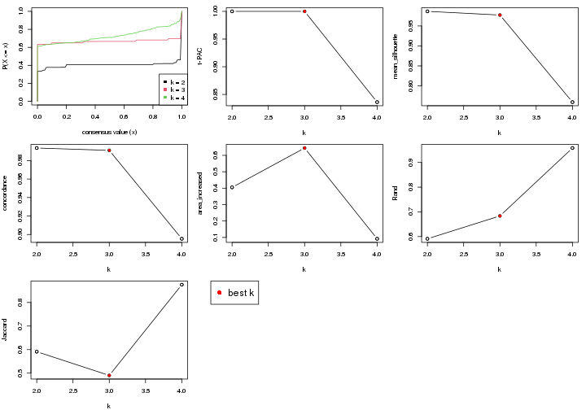

The numeric values for all these statistics can be obtained by `get_stats()`.

```r
get_stats(res)
```

```
#>   k 1-PAC mean_silhouette concordance area_increased  Rand Jaccard
#> 2 2 1.000           0.987       0.994         0.4050 0.591   0.591
#> 3 3 1.000           0.977       0.991         0.6445 0.684   0.490
#> 4 4 0.836           0.759       0.895         0.0918 0.958   0.875
```

`suggest_best_k()` suggests the best $k$ based on these statistics. The rules are as follows:

- All $k$ with Jaccard index larger than 0.95 are removed because increasing
  $k$ does not provide enough extra information. If all $k$ are removed, it is
  marked as no subgroup is detected.
- For all $k$ with 1-PAC score larger than 0.9, the maximal $k$ is taken as
  the best $k$, and other $k$ are marked as optional $k$.
- If it does not fit the second rule. The $k$ with the maximal vote of the
  highest 1-PAC score, highest mean silhouette, and highest concordance is
  taken as the best $k$.

```r
suggest_best_k(res)
```

```
#> [1] 3
#> attr(,"optional")
#> [1] 2
```

There is also optional best $k$ = 2 that is worth to check.

Following is the table of the partitions (You need to click the **show/hide
code output** link to see it). The membership matrix (columns with name `p*`)
is inferred by
[`clue::cl_consensus()`](https://www.rdocumentation.org/link/cl_consensus?package=clue)
function with the `SE` method. Basically the value in the membership matrix
represents the probability to belong to a certain group. The finall subgroup
label for an item is determined with the group with highest probability it
belongs to.

In `get_classes()` function, the entropy is calculated from the membership
matrix and the silhouette score is calculated from the consensus matrix.


<script>
$( function() {
	$( '#tabs-node-013-get-classes' ).tabs();
} );
</script>
<div id='tabs-node-013-get-classes'>
<ul>
<li><a href='#tab-node-013-get-classes-1'>k = 2</a></li>
<li><a href='#tab-node-013-get-classes-2'>k = 3</a></li>
<li><a href='#tab-node-013-get-classes-3'>k = 4</a></li>
</ul>

<div id='tab-node-013-get-classes-1'>
<p><a id='tab-node-013-get-classes-1-a' style='color:#0366d6' href='#'>show/hide code output</a></p>
<pre><code class="r">cbind(get_classes(res, k = 2), get_membership(res, k = 2))
</code></pre>

<pre><code>#&gt;            class entropy silhouette   p1   p2
#&gt; GSM1657871     2   0.327      0.929 0.06 0.94
#&gt; GSM1657873     1   0.000      0.999 1.00 0.00
#&gt; GSM1657876     2   0.000      0.978 0.00 1.00
#&gt; GSM1657877     1   0.000      0.999 1.00 0.00
#&gt; GSM1657880     2   0.722      0.760 0.20 0.80
#&gt; GSM1657881     1   0.000      0.999 1.00 0.00
#&gt; GSM1657889     1   0.000      0.999 1.00 0.00
#&gt; GSM1657890     1   0.000      0.999 1.00 0.00
#&gt; GSM1657891     1   0.000      0.999 1.00 0.00
#&gt; GSM1657892     1   0.000      0.999 1.00 0.00
#&gt; GSM1657893     2   0.000      0.978 0.00 1.00
#&gt; GSM1657894     1   0.000      0.999 1.00 0.00
#&gt; GSM1657897     1   0.000      0.999 1.00 0.00
#&gt; GSM1657899     1   0.000      0.999 1.00 0.00
#&gt; GSM1657900     1   0.000      0.999 1.00 0.00
#&gt; GSM1657901     1   0.000      0.999 1.00 0.00
#&gt; GSM1657902     1   0.000      0.999 1.00 0.00
#&gt; GSM1657906     2   0.000      0.978 0.00 1.00
#&gt; GSM1657907     2   0.000      0.978 0.00 1.00
#&gt; GSM1657908     2   0.000      0.978 0.00 1.00
#&gt; GSM1657913     2   0.000      0.978 0.00 1.00
#&gt; GSM1657916     2   0.000      0.978 0.00 1.00
#&gt; GSM1657917     2   0.000      0.978 0.00 1.00
#&gt; GSM1657918     2   0.000      0.978 0.00 1.00
#&gt; GSM1657922     2   0.000      0.978 0.00 1.00
#&gt; GSM1657923     1   0.000      0.999 1.00 0.00
#&gt; GSM1657944     1   0.000      0.999 1.00 0.00
#&gt; GSM1658018     1   0.000      0.999 1.00 0.00
#&gt; GSM1658085     1   0.000      0.999 1.00 0.00
#&gt; GSM1658088     1   0.000      0.999 1.00 0.00
#&gt; GSM1658093     1   0.000      0.999 1.00 0.00
#&gt; GSM1658097     1   0.000      0.999 1.00 0.00
#&gt; GSM1658109     1   0.242      0.957 0.96 0.04
#&gt; GSM1658112     1   0.000      0.999 1.00 0.00
#&gt; GSM1658118     1   0.000      0.999 1.00 0.00
#&gt; GSM1658119     1   0.000      0.999 1.00 0.00
#&gt; GSM1658120     1   0.000      0.999 1.00 0.00
#&gt; GSM1658123     1   0.000      0.999 1.00 0.00
#&gt; GSM1658124     1   0.000      0.999 1.00 0.00
#&gt; GSM1658125     1   0.000      0.999 1.00 0.00
#&gt; GSM1658144     2   0.000      0.978 0.00 1.00
#&gt; GSM1658155     1   0.000      0.999 1.00 0.00
#&gt; GSM1658162     1   0.000      0.999 1.00 0.00
#&gt; GSM1658164     1   0.000      0.999 1.00 0.00
#&gt; GSM1658167     1   0.000      0.999 1.00 0.00
#&gt; GSM1658173     1   0.000      0.999 1.00 0.00
#&gt; GSM1658180     1   0.000      0.999 1.00 0.00
</code></pre>

<script>
$('#tab-node-013-get-classes-1-a').parent().next().next().hide();
$('#tab-node-013-get-classes-1-a').click(function(){
  $('#tab-node-013-get-classes-1-a').parent().next().next().toggle();
  return(false);
});
</script>
</div>

<div id='tab-node-013-get-classes-2'>
<p><a id='tab-node-013-get-classes-2-a' style='color:#0366d6' href='#'>show/hide code output</a></p>
<pre><code class="r">cbind(get_classes(res, k = 3), get_membership(res, k = 3))
</code></pre>

<pre><code>#&gt;            class entropy silhouette   p1 p2   p3
#&gt; GSM1657871     3   0.000      0.993 0.00  0 1.00
#&gt; GSM1657873     3   0.000      0.993 0.00  0 1.00
#&gt; GSM1657876     2   0.000      1.000 0.00  1 0.00
#&gt; GSM1657877     3   0.000      0.993 0.00  0 1.00
#&gt; GSM1657880     3   0.000      0.993 0.00  0 1.00
#&gt; GSM1657881     3   0.000      0.993 0.00  0 1.00
#&gt; GSM1657889     3   0.000      0.993 0.00  0 1.00
#&gt; GSM1657890     3   0.000      0.993 0.00  0 1.00
#&gt; GSM1657891     3   0.000      0.993 0.00  0 1.00
#&gt; GSM1657892     3   0.000      0.993 0.00  0 1.00
#&gt; GSM1657893     2   0.000      1.000 0.00  1 0.00
#&gt; GSM1657894     3   0.000      0.993 0.00  0 1.00
#&gt; GSM1657897     3   0.000      0.993 0.00  0 1.00
#&gt; GSM1657899     3   0.000      0.993 0.00  0 1.00
#&gt; GSM1657900     3   0.000      0.993 0.00  0 1.00
#&gt; GSM1657901     3   0.000      0.993 0.00  0 1.00
#&gt; GSM1657902     3   0.000      0.993 0.00  0 1.00
#&gt; GSM1657906     2   0.000      1.000 0.00  1 0.00
#&gt; GSM1657907     2   0.000      1.000 0.00  1 0.00
#&gt; GSM1657908     2   0.000      1.000 0.00  1 0.00
#&gt; GSM1657913     2   0.000      1.000 0.00  1 0.00
#&gt; GSM1657916     2   0.000      1.000 0.00  1 0.00
#&gt; GSM1657917     2   0.000      1.000 0.00  1 0.00
#&gt; GSM1657918     2   0.000      1.000 0.00  1 0.00
#&gt; GSM1657922     2   0.000      1.000 0.00  1 0.00
#&gt; GSM1657923     3   0.000      0.993 0.00  0 1.00
#&gt; GSM1657944     1   0.000      0.979 1.00  0 0.00
#&gt; GSM1658018     1   0.000      0.979 1.00  0 0.00
#&gt; GSM1658085     1   0.000      0.979 1.00  0 0.00
#&gt; GSM1658088     1   0.000      0.979 1.00  0 0.00
#&gt; GSM1658093     3   0.000      0.993 0.00  0 1.00
#&gt; GSM1658097     1   0.000      0.979 1.00  0 0.00
#&gt; GSM1658109     1   0.000      0.979 1.00  0 0.00
#&gt; GSM1658112     1   0.000      0.979 1.00  0 0.00
#&gt; GSM1658118     1   0.571      0.522 0.68  0 0.32
#&gt; GSM1658119     1   0.000      0.979 1.00  0 0.00
#&gt; GSM1658120     1   0.000      0.979 1.00  0 0.00
#&gt; GSM1658123     1   0.000      0.979 1.00  0 0.00
#&gt; GSM1658124     1   0.000      0.979 1.00  0 0.00
#&gt; GSM1658125     3   0.296      0.883 0.10  0 0.90
#&gt; GSM1658144     2   0.000      1.000 0.00  1 0.00
#&gt; GSM1658155     1   0.000      0.979 1.00  0 0.00
#&gt; GSM1658162     1   0.000      0.979 1.00  0 0.00
#&gt; GSM1658164     1   0.000      0.979 1.00  0 0.00
#&gt; GSM1658167     1   0.000      0.979 1.00  0 0.00
#&gt; GSM1658173     1   0.000      0.979 1.00  0 0.00
#&gt; GSM1658180     1   0.000      0.979 1.00  0 0.00
</code></pre>

<script>
$('#tab-node-013-get-classes-2-a').parent().next().next().hide();
$('#tab-node-013-get-classes-2-a').click(function(){
  $('#tab-node-013-get-classes-2-a').parent().next().next().toggle();
  return(false);
});
</script>
</div>

<div id='tab-node-013-get-classes-3'>
<p><a id='tab-node-013-get-classes-3-a' style='color:#0366d6' href='#'>show/hide code output</a></p>
<pre><code class="r">cbind(get_classes(res, k = 4), get_membership(res, k = 4))
</code></pre>

<pre><code>#&gt;            class entropy silhouette   p1   p2   p3   p4
#&gt; GSM1657871     3  0.3801      0.772 0.00 0.00 0.78 0.22
#&gt; GSM1657873     3  0.0707      0.876 0.00 0.00 0.98 0.02
#&gt; GSM1657876     2  0.0000      0.994 0.00 1.00 0.00 0.00
#&gt; GSM1657877     3  0.0000      0.886 0.00 0.00 1.00 0.00
#&gt; GSM1657880     3  0.4134      0.739 0.00 0.00 0.74 0.26
#&gt; GSM1657881     3  0.0000      0.886 0.00 0.00 1.00 0.00
#&gt; GSM1657889     3  0.0000      0.886 0.00 0.00 1.00 0.00
#&gt; GSM1657890     3  0.0000      0.886 0.00 0.00 1.00 0.00
#&gt; GSM1657891     3  0.3610      0.787 0.00 0.00 0.80 0.20
#&gt; GSM1657892     3  0.0000      0.886 0.00 0.00 1.00 0.00
#&gt; GSM1657893     2  0.0000      0.994 0.00 1.00 0.00 0.00
#&gt; GSM1657894     3  0.0000      0.886 0.00 0.00 1.00 0.00
#&gt; GSM1657897     3  0.0000      0.886 0.00 0.00 1.00 0.00
#&gt; GSM1657899     3  0.2011      0.857 0.00 0.00 0.92 0.08
#&gt; GSM1657900     3  0.0000      0.886 0.00 0.00 1.00 0.00
#&gt; GSM1657901     3  0.0000      0.886 0.00 0.00 1.00 0.00
#&gt; GSM1657902     3  0.3400      0.802 0.00 0.00 0.82 0.18
#&gt; GSM1657906     2  0.0000      0.994 0.00 1.00 0.00 0.00
#&gt; GSM1657907     2  0.0000      0.994 0.00 1.00 0.00 0.00
#&gt; GSM1657908     2  0.0000      0.994 0.00 1.00 0.00 0.00
#&gt; GSM1657913     2  0.0000      0.994 0.00 1.00 0.00 0.00
#&gt; GSM1657916     2  0.0000      0.994 0.00 1.00 0.00 0.00
#&gt; GSM1657917     2  0.0000      0.994 0.00 1.00 0.00 0.00
#&gt; GSM1657918     2  0.1637      0.942 0.00 0.94 0.00 0.06
#&gt; GSM1657922     2  0.0000      0.994 0.00 1.00 0.00 0.00
#&gt; GSM1657923     3  0.2011      0.854 0.00 0.00 0.92 0.08
#&gt; GSM1657944     1  0.4522      0.376 0.68 0.00 0.00 0.32
#&gt; GSM1658018     1  0.4855      0.117 0.60 0.00 0.00 0.40
#&gt; GSM1658085     4  0.4907      0.280 0.42 0.00 0.00 0.58
#&gt; GSM1658088     1  0.0707      0.819 0.98 0.00 0.00 0.02
#&gt; GSM1658093     3  0.5256      0.539 0.04 0.00 0.70 0.26
#&gt; GSM1658097     1  0.0707      0.813 0.98 0.00 0.00 0.02
#&gt; GSM1658109     4  0.4624      0.390 0.34 0.00 0.00 0.66
#&gt; GSM1658112     1  0.4948     -0.111 0.56 0.00 0.00 0.44
#&gt; GSM1658118     4  0.7877      0.192 0.28 0.00 0.36 0.36
#&gt; GSM1658119     1  0.0707      0.813 0.98 0.00 0.00 0.02
#&gt; GSM1658120     1  0.4624      0.253 0.66 0.00 0.00 0.34
#&gt; GSM1658123     1  0.0000      0.821 1.00 0.00 0.00 0.00
#&gt; GSM1658124     1  0.0707      0.819 0.98 0.00 0.00 0.02
#&gt; GSM1658125     3  0.6881      0.110 0.12 0.00 0.54 0.34
#&gt; GSM1658144     2  0.0000      0.994 0.00 1.00 0.00 0.00
#&gt; GSM1658155     1  0.0707      0.819 0.98 0.00 0.00 0.02
#&gt; GSM1658162     1  0.0707      0.819 0.98 0.00 0.00 0.02
#&gt; GSM1658164     1  0.0707      0.813 0.98 0.00 0.00 0.02
#&gt; GSM1658167     1  0.0000      0.821 1.00 0.00 0.00 0.00
#&gt; GSM1658173     1  0.0000      0.821 1.00 0.00 0.00 0.00
#&gt; GSM1658180     1  0.0707      0.813 0.98 0.00 0.00 0.02
</code></pre>

<script>
$('#tab-node-013-get-classes-3-a').parent().next().next().hide();
$('#tab-node-013-get-classes-3-a').click(function(){
  $('#tab-node-013-get-classes-3-a').parent().next().next().toggle();
  return(false);
});
</script>
</div>
</div>

Heatmaps for the consensus matrix. It visualizes the probability of two
samples to be in a same group.


<script>
$( function() {
	$( '#tabs-node-013-consensus-heatmap' ).tabs();
} );
</script>
<div id='tabs-node-013-consensus-heatmap'>
<ul>
<li><a href='#tab-node-013-consensus-heatmap-1'>k = 2</a></li>
<li><a href='#tab-node-013-consensus-heatmap-2'>k = 3</a></li>
<li><a href='#tab-node-013-consensus-heatmap-3'>k = 4</a></li>
</ul>
<div id='tab-node-013-consensus-heatmap-1'>
<pre><code class="r">consensus_heatmap(res, k = 2)
</code></pre>

<p></p>

</div>
<div id='tab-node-013-consensus-heatmap-2'>
<pre><code class="r">consensus_heatmap(res, k = 3)
</code></pre>

<p></p>

</div>
<div id='tab-node-013-consensus-heatmap-3'>
<pre><code class="r">consensus_heatmap(res, k = 4)
</code></pre>

<p>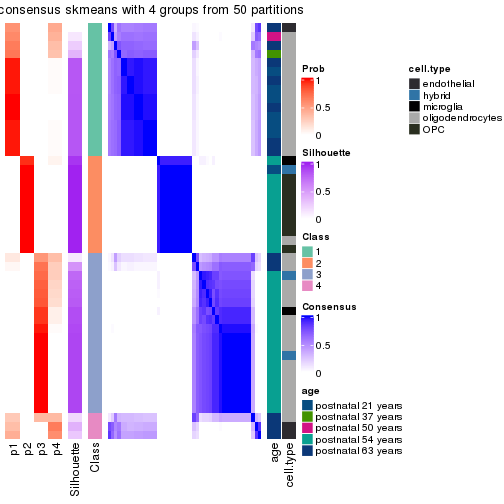</p>

</div>
</div>

Heatmaps for the membership of samples in all partitions to see how consistent they are:


<script>
$( function() {
	$( '#tabs-node-013-membership-heatmap' ).tabs();
} );
</script>
<div id='tabs-node-013-membership-heatmap'>
<ul>
<li><a href='#tab-node-013-membership-heatmap-1'>k = 2</a></li>
<li><a href='#tab-node-013-membership-heatmap-2'>k = 3</a></li>
<li><a href='#tab-node-013-membership-heatmap-3'>k = 4</a></li>
</ul>
<div id='tab-node-013-membership-heatmap-1'>
<pre><code class="r">membership_heatmap(res, k = 2)
</code></pre>

<p></p>

</div>
<div id='tab-node-013-membership-heatmap-2'>
<pre><code class="r">membership_heatmap(res, k = 3)
</code></pre>

<p></p>

</div>
<div id='tab-node-013-membership-heatmap-3'>
<pre><code class="r">membership_heatmap(res, k = 4)
</code></pre>

<p></p>

</div>
</div>

As soon as the classes for columns are determined, the signatures
that are significantly different between subgroups can be looked for. 
Following are the heatmaps for signatures.


Signature heatmaps where rows are scaled:


<script>
$( function() {
	$( '#tabs-node-013-get-signatures' ).tabs();
} );
</script>
<div id='tabs-node-013-get-signatures'>
<ul>
<li><a href='#tab-node-013-get-signatures-1'>k = 2</a></li>
<li><a href='#tab-node-013-get-signatures-2'>k = 3</a></li>
<li><a href='#tab-node-013-get-signatures-3'>k = 4</a></li>
</ul>
<div id='tab-node-013-get-signatures-1'>
<pre><code class="r">get_signatures(res, k = 2)
</code></pre>

<p>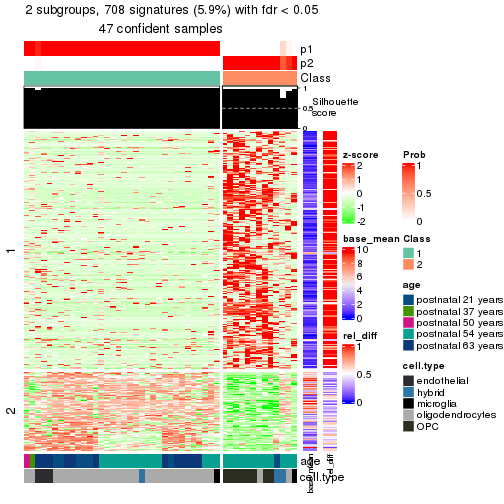</p>

</div>
<div id='tab-node-013-get-signatures-2'>
<pre><code class="r">get_signatures(res, k = 3)
</code></pre>

<p></p>

</div>
<div id='tab-node-013-get-signatures-3'>
<pre><code class="r">get_signatures(res, k = 4)
</code></pre>

<p></p>

</div>
</div>


Signature heatmaps where rows are not scaled:


<script>
$( function() {
	$( '#tabs-node-013-get-signatures-no-scale' ).tabs();
} );
</script>
<div id='tabs-node-013-get-signatures-no-scale'>
<ul>
<li><a href='#tab-node-013-get-signatures-no-scale-1'>k = 2</a></li>
<li><a href='#tab-node-013-get-signatures-no-scale-2'>k = 3</a></li>
<li><a href='#tab-node-013-get-signatures-no-scale-3'>k = 4</a></li>
</ul>
<div id='tab-node-013-get-signatures-no-scale-1'>
<pre><code class="r">get_signatures(res, k = 2, scale_rows = FALSE)
</code></pre>

<p></p>

</div>
<div id='tab-node-013-get-signatures-no-scale-2'>
<pre><code class="r">get_signatures(res, k = 3, scale_rows = FALSE)
</code></pre>

<p></p>

</div>
<div id='tab-node-013-get-signatures-no-scale-3'>
<pre><code class="r">get_signatures(res, k = 4, scale_rows = FALSE)
</code></pre>

<p></p>

</div>
</div>


Compare the overlap of signatures from different k:

```r
compare_signatures(res)
```


`get_signature()` returns a data frame invisibly. To get the list of signatures, the function
call should be assigned to a variable explicitly. In following code, if `plot` argument is set
to `FALSE`, no heatmap is plotted while only the differential analysis is performed.

```r
# code only for demonstration
tb = get_signature(res, k = ..., plot = FALSE)
```

An example of the output of `tb` is:

```
#>   which_row         fdr    mean_1    mean_2 scaled_mean_1 scaled_mean_2 km
#> 1        38 0.042760348  8.373488  9.131774    -0.5533452     0.5164555  1
#> 2        40 0.018707592  7.106213  8.469186    -0.6173731     0.5762149  1
#> 3        55 0.019134737 10.221463 11.207825    -0.6159697     0.5749050  1
#> 4        59 0.006059896  5.921854  7.869574    -0.6899429     0.6439467  1
#> 5        60 0.018055526  8.928898 10.211722    -0.6204761     0.5791110  1
#> 6        98 0.009384629 15.714769 14.887706     0.6635654    -0.6193277  2
...
```

The columns in `tb` are:

1. `which_row`: row indices corresponding to the input matrix.
2. `fdr`: FDR for the differential test. 
3. `mean_x`: The mean value in group x.
4. `scaled_mean_x`: The mean value in group x after rows are scaled.
5. `km`: Row groups if k-means clustering is applied to rows (which is done by automatically selecting number of clusters).

If there are too many signatures, `top_signatures = ...` can be set to only show the 
signatures with the highest FDRs:

```r
# code only for demonstration
# e.g. to show the top 500 most significant rows
tb = get_signature(res, k = ..., top_signatures = 500)
```

If the signatures are defined as these which are uniquely high in current group, `diff_method` argument
can be set to `"uniquely_high_in_one_group"`:

```r
# code only for demonstration
tb = get_signature(res, k = ..., diff_method = "uniquely_high_in_one_group")
```


UMAP plot which shows how samples are separated.


<script>
$( function() {
	$( '#tabs-node-013-dimension-reduction' ).tabs();
} );
</script>
<div id='tabs-node-013-dimension-reduction'>
<ul>
<li><a href='#tab-node-013-dimension-reduction-1'>k = 2</a></li>
<li><a href='#tab-node-013-dimension-reduction-2'>k = 3</a></li>
<li><a href='#tab-node-013-dimension-reduction-3'>k = 4</a></li>
</ul>
<div id='tab-node-013-dimension-reduction-1'>
<pre><code class="r">dimension_reduction(res, k = 2, method = &quot;UMAP&quot;)
</code></pre>

<p></p>

</div>
<div id='tab-node-013-dimension-reduction-2'>
<pre><code class="r">dimension_reduction(res, k = 3, method = &quot;UMAP&quot;)
</code></pre>

<p>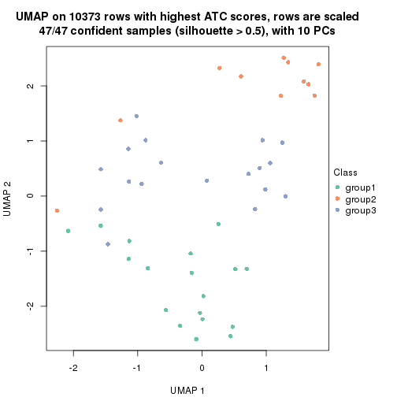</p>

</div>
<div id='tab-node-013-dimension-reduction-3'>
<pre><code class="r">dimension_reduction(res, k = 4, method = &quot;UMAP&quot;)
</code></pre>

<p></p>

</div>
</div>


Following heatmap shows how subgroups are split when increasing `k`:

```r
collect_classes(res)
```


Test correlation between subgroups and known annotations. If the known
annotation is numeric, one-way ANOVA test is applied, and if the known
annotation is discrete, chi-squared contingency table test is applied.

```r
test_to_known_factors(res)
```

```
#>             n_sample age(p-value) cell.type(p-value) k
#> ATC:skmeans       47     3.39e-02           2.08e-06 2
#> ATC:skmeans       47     1.13e-05           1.75e-06 3
#> ATC:skmeans       39     2.89e-06           3.22e-05 4
```


If matrix rows can be associated to genes, consider to use `functional_enrichment(res,
...)` to perform function enrichment for the signature genes. See [this vignette](https://jokergoo.github.io/cola_vignettes/functional_enrichment.html) for more detailed explanations.


 

---------------------------------------------------


### Node02


Parent node: [Node0](#Node0).
Child nodes: 
                [Node011](#Node011)
        ,
                [Node012](#Node012)
        ,
                [Node013](#Node013)
        ,
                [Node021](#Node021)
        ,
                Node022-leaf
        ,
                Node031-leaf
        ,
                Node032-leaf
        ,
                Node033-leaf
        .


The object with results only for a single top-value method and a single partitioning method 
can be extracted as:

```r
res = res_rh["02"]
```

A summary of `res` and all the functions that can be applied to it:

```r
res
```

```
#> A 'ConsensusPartition' object with k = 2, 3, 4.
#>   On a matrix with 11426 rows and 176 columns.
#>   Top rows (1143) are extracted by 'ATC' method.
#>   Subgroups are detected by 'skmeans' method.
#>   Performed in total 150 partitions by row resampling.
#>   Best k for subgroups seems to be 3.
#> 
#> Following methods can be applied to this 'ConsensusPartition' object:
#>  [1] "cola_report"             "collect_classes"         "collect_plots"          
#>  [4] "collect_stats"           "colnames"                "compare_partitions"     
#>  [7] "compare_signatures"      "consensus_heatmap"       "dimension_reduction"    
#> [10] "functional_enrichment"   "get_anno_col"            "get_anno"               
#> [13] "get_classes"             "get_consensus"           "get_matrix"             
#> [16] "get_membership"          "get_param"               "get_signatures"         
#> [19] "get_stats"               "is_best_k"               "is_stable_k"            
#> [22] "membership_heatmap"      "ncol"                    "nrow"                   
#> [25] "plot_ecdf"               "predict_classes"         "rownames"               
#> [28] "select_partition_number" "show"                    "suggest_best_k"         
#> [31] "test_to_known_factors"   "top_rows_heatmap"
```

`collect_plots()` function collects all the plots made from `res` for all `k` (number of subgroups)
into one single page to provide an easy and fast comparison between different `k`.

```r
collect_plots(res)
```


The plots are:

- The first row: a plot of the eCDF (empirical cumulative distribution
  function) curves of the consensus matrix for each `k` and the heatmap of
  predicted classes for each `k`.
- The second row: heatmaps of the consensus matrix for each `k`.
- The third row: heatmaps of the membership matrix for each `k`.
- The fouth row: heatmaps of the signatures for each `k`.

All the plots in panels can be made by individual functions and they are
plotted later in this section.

`select_partition_number()` produces several plots showing different
statistics for choosing "optimized" `k`. There are following statistics:

- eCDF curves of the consensus matrix for each `k`;
- 1-PAC. [The PAC score](https://en.wikipedia.org/wiki/Consensus_clustering#Over-interpretation_potential_of_consensus_clustering)
  measures the proportion of the ambiguous subgrouping.
- Mean silhouette score.
- Concordance. The mean probability of fiting the consensus subgroup labels in all
  partitions.
- Area increased. Denote $A_k$ as the area under the eCDF curve for current
  `k`, the area increased is defined as $A_k - A_{k-1}$.
- Rand index. The percent of pairs of samples that are both in a same cluster
  or both are not in a same cluster in the partition of k and k-1.
- Jaccard index. The ratio of pairs of samples are both in a same cluster in
  the partition of k and k-1 and the pairs of samples are both in a same
  cluster in the partition k or k-1.

The detailed explanations of these statistics can be found in [the _cola_
vignette](https://jokergoo.github.io/cola_vignettes/cola.html#toc_13).

Generally speaking, higher 1-PAC score, higher mean silhouette score or higher
concordance corresponds to better partition. Rand index and Jaccard index
measure how similar the current partition is compared to partition with `k-1`.
If they are too similar, we won't accept `k` is better than `k-1`.

```r
select_partition_number(res)
```


The numeric values for all these statistics can be obtained by `get_stats()`.

```r
get_stats(res)
```

```
#>   k 1-PAC mean_silhouette concordance area_increased  Rand Jaccard
#> 2 2 1.000           0.996       0.998         0.5024 0.498   0.498
#> 3 3 0.942           0.934       0.970         0.2102 0.877   0.758
#> 4 4 0.869           0.825       0.918         0.0791 0.947   0.866
```

`suggest_best_k()` suggests the best $k$ based on these statistics. The rules are as follows:

- All $k$ with Jaccard index larger than 0.95 are removed because increasing
  $k$ does not provide enough extra information. If all $k$ are removed, it is
  marked as no subgroup is detected.
- For all $k$ with 1-PAC score larger than 0.9, the maximal $k$ is taken as
  the best $k$, and other $k$ are marked as optional $k$.
- If it does not fit the second rule. The $k$ with the maximal vote of the
  highest 1-PAC score, highest mean silhouette, and highest concordance is
  taken as the best $k$.

```r
suggest_best_k(res)
```

```
#> [1] 3
#> attr(,"optional")
#> [1] 2
```

There is also optional best $k$ = 2 that is worth to check.

Following is the table of the partitions (You need to click the **show/hide
code output** link to see it). The membership matrix (columns with name `p*`)
is inferred by
[`clue::cl_consensus()`](https://www.rdocumentation.org/link/cl_consensus?package=clue)
function with the `SE` method. Basically the value in the membership matrix
represents the probability to belong to a certain group. The finall subgroup
label for an item is determined with the group with highest probability it
belongs to.

In `get_classes()` function, the entropy is calculated from the membership
matrix and the silhouette score is calculated from the consensus matrix.


<script>
$( function() {
	$( '#tabs-node-02-get-classes' ).tabs();
} );
</script>
<div id='tabs-node-02-get-classes'>
<ul>
<li><a href='#tab-node-02-get-classes-1'>k = 2</a></li>
<li><a href='#tab-node-02-get-classes-2'>k = 3</a></li>
<li><a href='#tab-node-02-get-classes-3'>k = 4</a></li>
</ul>

<div id='tab-node-02-get-classes-1'>
<p><a id='tab-node-02-get-classes-1-a' style='color:#0366d6' href='#'>show/hide code output</a></p>
<pre><code class="r">cbind(get_classes(res, k = 2), get_membership(res, k = 2))
</code></pre>

<pre><code>#&gt;            class entropy silhouette   p1   p2
#&gt; GSM1657872     2   0.000      0.999 0.00 1.00
#&gt; GSM1657874     2   0.000      0.999 0.00 1.00
#&gt; GSM1657875     2   0.000      0.999 0.00 1.00
#&gt; GSM1657879     2   0.000      0.999 0.00 1.00
#&gt; GSM1657882     2   0.000      0.999 0.00 1.00
#&gt; GSM1657883     1   0.000      0.997 1.00 0.00
#&gt; GSM1657884     2   0.000      0.999 0.00 1.00
#&gt; GSM1657886     2   0.000      0.999 0.00 1.00
#&gt; GSM1657887     2   0.000      0.999 0.00 1.00
#&gt; GSM1657888     2   0.000      0.999 0.00 1.00
#&gt; GSM1657895     1   0.000      0.997 1.00 0.00
#&gt; GSM1657896     2   0.000      0.999 0.00 1.00
#&gt; GSM1657898     2   0.000      0.999 0.00 1.00
#&gt; GSM1657912     1   0.000      0.997 1.00 0.00
#&gt; GSM1657930     1   0.000      0.997 1.00 0.00
#&gt; GSM1657931     2   0.000      0.999 0.00 1.00
#&gt; GSM1657933     2   0.000      0.999 0.00 1.00
#&gt; GSM1657935     2   0.000      0.999 0.00 1.00
#&gt; GSM1657936     2   0.000      0.999 0.00 1.00
#&gt; GSM1657937     2   0.000      0.999 0.00 1.00
#&gt; GSM1657940     2   0.000      0.999 0.00 1.00
#&gt; GSM1657942     2   0.000      0.999 0.00 1.00
#&gt; GSM1657943     2   0.000      0.999 0.00 1.00
#&gt; GSM1657945     2   0.000      0.999 0.00 1.00
#&gt; GSM1657946     1   0.000      0.997 1.00 0.00
#&gt; GSM1657947     2   0.000      0.999 0.00 1.00
#&gt; GSM1657949     2   0.327      0.936 0.06 0.94
#&gt; GSM1657950     2   0.000      0.999 0.00 1.00
#&gt; GSM1657952     1   0.000      0.997 1.00 0.00
#&gt; GSM1657954     2   0.000      0.999 0.00 1.00
#&gt; GSM1657955     2   0.000      0.999 0.00 1.00
#&gt; GSM1657956     1   0.000      0.997 1.00 0.00
#&gt; GSM1657957     1   0.000      0.997 1.00 0.00
#&gt; GSM1657958     1   0.000      0.997 1.00 0.00
#&gt; GSM1657959     2   0.000      0.999 0.00 1.00
#&gt; GSM1657960     1   0.000      0.997 1.00 0.00
#&gt; GSM1657961     2   0.000      0.999 0.00 1.00
#&gt; GSM1657962     1   0.000      0.997 1.00 0.00
#&gt; GSM1657963     1   0.000      0.997 1.00 0.00
#&gt; GSM1657964     2   0.000      0.999 0.00 1.00
#&gt; GSM1657966     1   0.000      0.997 1.00 0.00
#&gt; GSM1657967     1   0.000      0.997 1.00 0.00
#&gt; GSM1657968     2   0.000      0.999 0.00 1.00
#&gt; GSM1657970     2   0.000      0.999 0.00 1.00
#&gt; GSM1657971     1   0.000      0.997 1.00 0.00
#&gt; GSM1657973     1   0.000      0.997 1.00 0.00
#&gt; GSM1657974     2   0.000      0.999 0.00 1.00
#&gt; GSM1657976     2   0.000      0.999 0.00 1.00
#&gt; GSM1657977     1   0.000      0.997 1.00 0.00
#&gt; GSM1657978     2   0.000      0.999 0.00 1.00
#&gt; GSM1657980     2   0.000      0.999 0.00 1.00
#&gt; GSM1657982     1   0.000      0.997 1.00 0.00
#&gt; GSM1657983     2   0.000      0.999 0.00 1.00
#&gt; GSM1657984     2   0.000      0.999 0.00 1.00
#&gt; GSM1657985     2   0.000      0.999 0.00 1.00
#&gt; GSM1657986     1   0.000      0.997 1.00 0.00
#&gt; GSM1657987     1   0.000      0.997 1.00 0.00
#&gt; GSM1657988     2   0.000      0.999 0.00 1.00
#&gt; GSM1657990     1   0.000      0.997 1.00 0.00
#&gt; GSM1657991     2   0.000      0.999 0.00 1.00
#&gt; GSM1658002     1   0.000      0.997 1.00 0.00
#&gt; GSM1658005     2   0.000      0.999 0.00 1.00
#&gt; GSM1658008     1   0.000      0.997 1.00 0.00
#&gt; GSM1658009     1   0.000      0.997 1.00 0.00
#&gt; GSM1658010     1   0.000      0.997 1.00 0.00
#&gt; GSM1658011     1   0.000      0.997 1.00 0.00
#&gt; GSM1658012     1   0.000      0.997 1.00 0.00
#&gt; GSM1658013     1   0.000      0.997 1.00 0.00
#&gt; GSM1658014     1   0.000      0.997 1.00 0.00
#&gt; GSM1658015     1   0.000      0.997 1.00 0.00
#&gt; GSM1658019     1   0.000      0.997 1.00 0.00
#&gt; GSM1658022     1   0.000      0.997 1.00 0.00
#&gt; GSM1658023     2   0.000      0.999 0.00 1.00
#&gt; GSM1658025     2   0.000      0.999 0.00 1.00
#&gt; GSM1658028     1   0.000      0.997 1.00 0.00
#&gt; GSM1658030     2   0.000      0.999 0.00 1.00
#&gt; GSM1658032     1   0.000      0.997 1.00 0.00
#&gt; GSM1658033     1   0.000      0.997 1.00 0.00
#&gt; GSM1658034     1   0.000      0.997 1.00 0.00
#&gt; GSM1658035     2   0.000      0.999 0.00 1.00
#&gt; GSM1658037     1   0.000      0.997 1.00 0.00
#&gt; GSM1658038     2   0.000      0.999 0.00 1.00
#&gt; GSM1658039     2   0.000      0.999 0.00 1.00
#&gt; GSM1658040     1   0.000      0.997 1.00 0.00
#&gt; GSM1658041     1   0.000      0.997 1.00 0.00
#&gt; GSM1658042     2   0.000      0.999 0.00 1.00
#&gt; GSM1658044     2   0.000      0.999 0.00 1.00
#&gt; GSM1658046     2   0.000      0.999 0.00 1.00
#&gt; GSM1658047     1   0.000      0.997 1.00 0.00
#&gt; GSM1658052     1   0.000      0.997 1.00 0.00
#&gt; GSM1658053     2   0.000      0.999 0.00 1.00
#&gt; GSM1658055     2   0.000      0.999 0.00 1.00
#&gt; GSM1658057     1   0.000      0.997 1.00 0.00
#&gt; GSM1658058     1   0.000      0.997 1.00 0.00
#&gt; GSM1658060     1   0.529      0.865 0.88 0.12
#&gt; GSM1658062     2   0.000      0.999 0.00 1.00
#&gt; GSM1658063     1   0.000      0.997 1.00 0.00
#&gt; GSM1658070     1   0.000      0.997 1.00 0.00
#&gt; GSM1658074     1   0.000      0.997 1.00 0.00
#&gt; GSM1658075     1   0.000      0.997 1.00 0.00
#&gt; GSM1658076     1   0.000      0.997 1.00 0.00
#&gt; GSM1658077     2   0.000      0.999 0.00 1.00
#&gt; GSM1658080     1   0.000      0.997 1.00 0.00
#&gt; GSM1658084     1   0.000      0.997 1.00 0.00
#&gt; GSM1658087     1   0.000      0.997 1.00 0.00
#&gt; GSM1658090     1   0.000      0.997 1.00 0.00
#&gt; GSM1658091     1   0.000      0.997 1.00 0.00
#&gt; GSM1658095     2   0.000      0.999 0.00 1.00
#&gt; GSM1658100     1   0.000      0.997 1.00 0.00
#&gt; GSM1658101     1   0.141      0.978 0.98 0.02
#&gt; GSM1658103     1   0.000      0.997 1.00 0.00
#&gt; GSM1658104     2   0.000      0.999 0.00 1.00
#&gt; GSM1658105     1   0.000      0.997 1.00 0.00
#&gt; GSM1658106     2   0.000      0.999 0.00 1.00
#&gt; GSM1658107     1   0.000      0.997 1.00 0.00
#&gt; GSM1658108     2   0.000      0.999 0.00 1.00
#&gt; GSM1658110     1   0.000      0.997 1.00 0.00
#&gt; GSM1658111     1   0.000      0.997 1.00 0.00
#&gt; GSM1658113     2   0.000      0.999 0.00 1.00
#&gt; GSM1658114     2   0.000      0.999 0.00 1.00
#&gt; GSM1658115     2   0.000      0.999 0.00 1.00
#&gt; GSM1658121     1   0.000      0.997 1.00 0.00
#&gt; GSM1658127     1   0.000      0.997 1.00 0.00
#&gt; GSM1658128     2   0.000      0.999 0.00 1.00
#&gt; GSM1658129     1   0.000      0.997 1.00 0.00
#&gt; GSM1658131     2   0.000      0.999 0.00 1.00
#&gt; GSM1658132     1   0.000      0.997 1.00 0.00
#&gt; GSM1658134     1   0.000      0.997 1.00 0.00
#&gt; GSM1658135     2   0.000      0.999 0.00 1.00
#&gt; GSM1658137     1   0.000      0.997 1.00 0.00
#&gt; GSM1658138     2   0.000      0.999 0.00 1.00
#&gt; GSM1658139     2   0.000      0.999 0.00 1.00
#&gt; GSM1658140     1   0.000      0.997 1.00 0.00
#&gt; GSM1658141     1   0.000      0.997 1.00 0.00
#&gt; GSM1658143     2   0.000      0.999 0.00 1.00
#&gt; GSM1658145     1   0.000      0.997 1.00 0.00
#&gt; GSM1658146     2   0.000      0.999 0.00 1.00
#&gt; GSM1658147     1   0.000      0.997 1.00 0.00
#&gt; GSM1658148     1   0.000      0.997 1.00 0.00
#&gt; GSM1658149     2   0.000      0.999 0.00 1.00
#&gt; GSM1658150     2   0.000      0.999 0.00 1.00
#&gt; GSM1658151     2   0.000      0.999 0.00 1.00
#&gt; GSM1658152     2   0.000      0.999 0.00 1.00
#&gt; GSM1658153     2   0.000      0.999 0.00 1.00
#&gt; GSM1658156     1   0.000      0.997 1.00 0.00
#&gt; GSM1658157     1   0.000      0.997 1.00 0.00
#&gt; GSM1658158     1   0.000      0.997 1.00 0.00
#&gt; GSM1658160     1   0.000      0.997 1.00 0.00
#&gt; GSM1658163     1   0.000      0.997 1.00 0.00
#&gt; GSM1658165     1   0.000      0.997 1.00 0.00
#&gt; GSM1658166     1   0.000      0.997 1.00 0.00
#&gt; GSM1658169     1   0.000      0.997 1.00 0.00
#&gt; GSM1658170     1   0.000      0.997 1.00 0.00
#&gt; GSM1658171     2   0.000      0.999 0.00 1.00
#&gt; GSM1658172     1   0.000      0.997 1.00 0.00
#&gt; GSM1658175     2   0.000      0.999 0.00 1.00
#&gt; GSM1658176     1   0.000      0.997 1.00 0.00
#&gt; GSM1658177     1   0.000      0.997 1.00 0.00
#&gt; GSM1658179     1   0.000      0.997 1.00 0.00
#&gt; GSM1658181     2   0.000      0.999 0.00 1.00
#&gt; GSM1658182     1   0.000      0.997 1.00 0.00
#&gt; GSM1658192     2   0.000      0.999 0.00 1.00
#&gt; GSM1658195     2   0.000      0.999 0.00 1.00
#&gt; GSM1658248     2   0.000      0.999 0.00 1.00
#&gt; GSM1658255     2   0.000      0.999 0.00 1.00
#&gt; GSM1658257     1   0.469      0.890 0.90 0.10
#&gt; GSM1658259     1   0.000      0.997 1.00 0.00
#&gt; GSM1658268     2   0.000      0.999 0.00 1.00
#&gt; GSM1658281     2   0.000      0.999 0.00 1.00
#&gt; GSM1658294     2   0.000      0.999 0.00 1.00
#&gt; GSM1658299     1   0.000      0.997 1.00 0.00
#&gt; GSM1658313     2   0.000      0.999 0.00 1.00
#&gt; GSM1658323     1   0.000      0.997 1.00 0.00
#&gt; GSM1658339     1   0.000      0.997 1.00 0.00
#&gt; GSM1658348     2   0.000      0.999 0.00 1.00
#&gt; GSM1658352     1   0.000      0.997 1.00 0.00
</code></pre>

<script>
$('#tab-node-02-get-classes-1-a').parent().next().next().hide();
$('#tab-node-02-get-classes-1-a').click(function(){
  $('#tab-node-02-get-classes-1-a').parent().next().next().toggle();
  return(false);
});
</script>
</div>

<div id='tab-node-02-get-classes-2'>
<p><a id='tab-node-02-get-classes-2-a' style='color:#0366d6' href='#'>show/hide code output</a></p>
<pre><code class="r">cbind(get_classes(res, k = 3), get_membership(res, k = 3))
</code></pre>

<pre><code>#&gt;            class entropy silhouette   p1   p2   p3
#&gt; GSM1657872     3  0.5397      0.636 0.00 0.28 0.72
#&gt; GSM1657874     2  0.0000      0.987 0.00 1.00 0.00
#&gt; GSM1657875     2  0.0000      0.987 0.00 1.00 0.00
#&gt; GSM1657879     3  0.6280      0.233 0.00 0.46 0.54
#&gt; GSM1657882     2  0.0000      0.987 0.00 1.00 0.00
#&gt; GSM1657883     3  0.2537      0.850 0.08 0.00 0.92
#&gt; GSM1657884     2  0.0000      0.987 0.00 1.00 0.00
#&gt; GSM1657886     3  0.5560      0.605 0.00 0.30 0.70
#&gt; GSM1657887     3  0.2537      0.845 0.00 0.08 0.92
#&gt; GSM1657888     2  0.0000      0.987 0.00 1.00 0.00
#&gt; GSM1657895     3  0.2066      0.861 0.06 0.00 0.94
#&gt; GSM1657896     2  0.0000      0.987 0.00 1.00 0.00
#&gt; GSM1657898     2  0.0000      0.987 0.00 1.00 0.00
#&gt; GSM1657912     3  0.2537      0.850 0.08 0.00 0.92
#&gt; GSM1657930     1  0.0000      0.975 1.00 0.00 0.00
#&gt; GSM1657931     2  0.0000      0.987 0.00 1.00 0.00
#&gt; GSM1657933     2  0.0000      0.987 0.00 1.00 0.00
#&gt; GSM1657935     2  0.0000      0.987 0.00 1.00 0.00
#&gt; GSM1657936     2  0.0000      0.987 0.00 1.00 0.00
#&gt; GSM1657937     2  0.0000      0.987 0.00 1.00 0.00
#&gt; GSM1657940     2  0.0000      0.987 0.00 1.00 0.00
#&gt; GSM1657942     2  0.0000      0.987 0.00 1.00 0.00
#&gt; GSM1657943     2  0.0000      0.987 0.00 1.00 0.00
#&gt; GSM1657945     2  0.0000      0.987 0.00 1.00 0.00
#&gt; GSM1657946     1  0.0000      0.975 1.00 0.00 0.00
#&gt; GSM1657947     2  0.0000      0.987 0.00 1.00 0.00
#&gt; GSM1657949     2  0.2066      0.906 0.06 0.94 0.00
#&gt; GSM1657950     2  0.0000      0.987 0.00 1.00 0.00
#&gt; GSM1657952     1  0.0000      0.975 1.00 0.00 0.00
#&gt; GSM1657954     2  0.0000      0.987 0.00 1.00 0.00
#&gt; GSM1657955     2  0.0000      0.987 0.00 1.00 0.00
#&gt; GSM1657956     1  0.0000      0.975 1.00 0.00 0.00
#&gt; GSM1657957     1  0.0000      0.975 1.00 0.00 0.00
#&gt; GSM1657958     1  0.0000      0.975 1.00 0.00 0.00
#&gt; GSM1657959     2  0.0000      0.987 0.00 1.00 0.00
#&gt; GSM1657960     1  0.0000      0.975 1.00 0.00 0.00
#&gt; GSM1657961     2  0.0000      0.987 0.00 1.00 0.00
#&gt; GSM1657962     1  0.0000      0.975 1.00 0.00 0.00
#&gt; GSM1657963     1  0.0000      0.975 1.00 0.00 0.00
#&gt; GSM1657964     2  0.0000      0.987 0.00 1.00 0.00
#&gt; GSM1657966     1  0.1529      0.942 0.96 0.00 0.04
#&gt; GSM1657967     1  0.0000      0.975 1.00 0.00 0.00
#&gt; GSM1657968     2  0.0000      0.987 0.00 1.00 0.00
#&gt; GSM1657970     2  0.0000      0.987 0.00 1.00 0.00
#&gt; GSM1657971     1  0.0000      0.975 1.00 0.00 0.00
#&gt; GSM1657973     1  0.0892      0.959 0.98 0.00 0.02
#&gt; GSM1657974     2  0.0000      0.987 0.00 1.00 0.00
#&gt; GSM1657976     2  0.0000      0.987 0.00 1.00 0.00
#&gt; GSM1657977     1  0.0000      0.975 1.00 0.00 0.00
#&gt; GSM1657978     2  0.0000      0.987 0.00 1.00 0.00
#&gt; GSM1657980     2  0.0000      0.987 0.00 1.00 0.00
#&gt; GSM1657982     1  0.0000      0.975 1.00 0.00 0.00
#&gt; GSM1657983     2  0.0000      0.987 0.00 1.00 0.00
#&gt; GSM1657984     2  0.0000      0.987 0.00 1.00 0.00
#&gt; GSM1657985     2  0.0000      0.987 0.00 1.00 0.00
#&gt; GSM1657986     1  0.0000      0.975 1.00 0.00 0.00
#&gt; GSM1657987     1  0.0000      0.975 1.00 0.00 0.00
#&gt; GSM1657988     2  0.0000      0.987 0.00 1.00 0.00
#&gt; GSM1657990     1  0.0000      0.975 1.00 0.00 0.00
#&gt; GSM1657991     2  0.0000      0.987 0.00 1.00 0.00
#&gt; GSM1658002     1  0.0000      0.975 1.00 0.00 0.00
#&gt; GSM1658005     2  0.0000      0.987 0.00 1.00 0.00
#&gt; GSM1658008     1  0.0000      0.975 1.00 0.00 0.00
#&gt; GSM1658009     1  0.0000      0.975 1.00 0.00 0.00
#&gt; GSM1658010     1  0.6126      0.297 0.60 0.00 0.40
#&gt; GSM1658011     1  0.0000      0.975 1.00 0.00 0.00
#&gt; GSM1658012     1  0.0000      0.975 1.00 0.00 0.00
#&gt; GSM1658013     1  0.0000      0.975 1.00 0.00 0.00
#&gt; GSM1658014     1  0.0000      0.975 1.00 0.00 0.00
#&gt; GSM1658015     1  0.0000      0.975 1.00 0.00 0.00
#&gt; GSM1658019     1  0.0000      0.975 1.00 0.00 0.00
#&gt; GSM1658022     1  0.0000      0.975 1.00 0.00 0.00
#&gt; GSM1658023     2  0.0000      0.987 0.00 1.00 0.00
#&gt; GSM1658025     2  0.0000      0.987 0.00 1.00 0.00
#&gt; GSM1658028     1  0.0000      0.975 1.00 0.00 0.00
#&gt; GSM1658030     3  0.5948      0.461 0.00 0.36 0.64
#&gt; GSM1658032     1  0.0000      0.975 1.00 0.00 0.00
#&gt; GSM1658033     1  0.0000      0.975 1.00 0.00 0.00
#&gt; GSM1658034     1  0.0000      0.975 1.00 0.00 0.00
#&gt; GSM1658035     2  0.0000      0.987 0.00 1.00 0.00
#&gt; GSM1658037     1  0.0000      0.975 1.00 0.00 0.00
#&gt; GSM1658038     2  0.0000      0.987 0.00 1.00 0.00
#&gt; GSM1658039     2  0.0000      0.987 0.00 1.00 0.00
#&gt; GSM1658040     1  0.0000      0.975 1.00 0.00 0.00
#&gt; GSM1658041     1  0.0000      0.975 1.00 0.00 0.00
#&gt; GSM1658042     2  0.0000      0.987 0.00 1.00 0.00
#&gt; GSM1658044     2  0.0000      0.987 0.00 1.00 0.00
#&gt; GSM1658046     2  0.3340      0.854 0.00 0.88 0.12
#&gt; GSM1658047     1  0.0000      0.975 1.00 0.00 0.00
#&gt; GSM1658052     1  0.0000      0.975 1.00 0.00 0.00
#&gt; GSM1658053     2  0.0000      0.987 0.00 1.00 0.00
#&gt; GSM1658055     2  0.0000      0.987 0.00 1.00 0.00
#&gt; GSM1658057     1  0.0000      0.975 1.00 0.00 0.00
#&gt; GSM1658058     1  0.1529      0.943 0.96 0.00 0.04
#&gt; GSM1658060     3  0.6758      0.447 0.36 0.02 0.62
#&gt; GSM1658062     2  0.0000      0.987 0.00 1.00 0.00
#&gt; GSM1658063     1  0.0000      0.975 1.00 0.00 0.00
#&gt; GSM1658070     1  0.0000      0.975 1.00 0.00 0.00
#&gt; GSM1658074     1  0.0000      0.975 1.00 0.00 0.00
#&gt; GSM1658075     1  0.0000      0.975 1.00 0.00 0.00
#&gt; GSM1658076     1  0.1781      0.942 0.96 0.02 0.02
#&gt; GSM1658077     2  0.0000      0.987 0.00 1.00 0.00
#&gt; GSM1658080     1  0.0000      0.975 1.00 0.00 0.00
#&gt; GSM1658084     1  0.0000      0.975 1.00 0.00 0.00
#&gt; GSM1658087     1  0.2066      0.925 0.94 0.00 0.06
#&gt; GSM1658090     1  0.3340      0.864 0.88 0.00 0.12
#&gt; GSM1658091     1  0.0000      0.975 1.00 0.00 0.00
#&gt; GSM1658095     2  0.0000      0.987 0.00 1.00 0.00
#&gt; GSM1658100     1  0.0000      0.975 1.00 0.00 0.00
#&gt; GSM1658101     1  0.4796      0.735 0.78 0.00 0.22
#&gt; GSM1658103     1  0.3340      0.864 0.88 0.00 0.12
#&gt; GSM1658104     2  0.0000      0.987 0.00 1.00 0.00
#&gt; GSM1658105     1  0.2537      0.905 0.92 0.00 0.08
#&gt; GSM1658106     2  0.5216      0.630 0.00 0.74 0.26
#&gt; GSM1658107     3  0.0892      0.876 0.02 0.00 0.98
#&gt; GSM1658108     2  0.0000      0.987 0.00 1.00 0.00
#&gt; GSM1658110     1  0.4555      0.764 0.80 0.00 0.20
#&gt; GSM1658111     1  0.4555      0.766 0.80 0.00 0.20
#&gt; GSM1658113     2  0.0892      0.968 0.00 0.98 0.02
#&gt; GSM1658114     2  0.0000      0.987 0.00 1.00 0.00
#&gt; GSM1658115     2  0.0000      0.987 0.00 1.00 0.00
#&gt; GSM1658121     1  0.0000      0.975 1.00 0.00 0.00
#&gt; GSM1658127     1  0.0000      0.975 1.00 0.00 0.00
#&gt; GSM1658128     2  0.0000      0.987 0.00 1.00 0.00
#&gt; GSM1658129     1  0.0000      0.975 1.00 0.00 0.00
#&gt; GSM1658131     2  0.0000      0.987 0.00 1.00 0.00
#&gt; GSM1658132     3  0.5216      0.643 0.26 0.00 0.74
#&gt; GSM1658134     1  0.0000      0.975 1.00 0.00 0.00
#&gt; GSM1658135     2  0.0000      0.987 0.00 1.00 0.00
#&gt; GSM1658137     1  0.0000      0.975 1.00 0.00 0.00
#&gt; GSM1658138     2  0.0000      0.987 0.00 1.00 0.00
#&gt; GSM1658139     2  0.0000      0.987 0.00 1.00 0.00
#&gt; GSM1658140     1  0.0000      0.975 1.00 0.00 0.00
#&gt; GSM1658141     1  0.0000      0.975 1.00 0.00 0.00
#&gt; GSM1658143     2  0.5397      0.572 0.00 0.72 0.28
#&gt; GSM1658145     1  0.0000      0.975 1.00 0.00 0.00
#&gt; GSM1658146     2  0.0000      0.987 0.00 1.00 0.00
#&gt; GSM1658147     1  0.0000      0.975 1.00 0.00 0.00
#&gt; GSM1658148     1  0.0000      0.975 1.00 0.00 0.00
#&gt; GSM1658149     2  0.0000      0.987 0.00 1.00 0.00
#&gt; GSM1658150     2  0.1529      0.947 0.00 0.96 0.04
#&gt; GSM1658151     2  0.0000      0.987 0.00 1.00 0.00
#&gt; GSM1658152     2  0.0000      0.987 0.00 1.00 0.00
#&gt; GSM1658153     2  0.0000      0.987 0.00 1.00 0.00
#&gt; GSM1658156     1  0.0000      0.975 1.00 0.00 0.00
#&gt; GSM1658157     1  0.0000      0.975 1.00 0.00 0.00
#&gt; GSM1658158     1  0.0000      0.975 1.00 0.00 0.00
#&gt; GSM1658160     1  0.0000      0.975 1.00 0.00 0.00
#&gt; GSM1658163     1  0.0000      0.975 1.00 0.00 0.00
#&gt; GSM1658165     1  0.0000      0.975 1.00 0.00 0.00
#&gt; GSM1658166     1  0.0000      0.975 1.00 0.00 0.00
#&gt; GSM1658169     1  0.0000      0.975 1.00 0.00 0.00
#&gt; GSM1658170     1  0.0000      0.975 1.00 0.00 0.00
#&gt; GSM1658171     2  0.0000      0.987 0.00 1.00 0.00
#&gt; GSM1658172     1  0.0000      0.975 1.00 0.00 0.00
#&gt; GSM1658175     2  0.0000      0.987 0.00 1.00 0.00
#&gt; GSM1658176     1  0.0000      0.975 1.00 0.00 0.00
#&gt; GSM1658177     1  0.0000      0.975 1.00 0.00 0.00
#&gt; GSM1658179     1  0.5948      0.412 0.64 0.00 0.36
#&gt; GSM1658181     2  0.0892      0.968 0.00 0.98 0.02
#&gt; GSM1658182     1  0.0000      0.975 1.00 0.00 0.00
#&gt; GSM1658192     2  0.0000      0.987 0.00 1.00 0.00
#&gt; GSM1658195     2  0.0000      0.987 0.00 1.00 0.00
#&gt; GSM1658248     3  0.0000      0.881 0.00 0.00 1.00
#&gt; GSM1658255     3  0.0000      0.881 0.00 0.00 1.00
#&gt; GSM1658257     3  0.0000      0.881 0.00 0.00 1.00
#&gt; GSM1658259     3  0.2959      0.827 0.10 0.00 0.90
#&gt; GSM1658268     3  0.0000      0.881 0.00 0.00 1.00
#&gt; GSM1658281     3  0.0000      0.881 0.00 0.00 1.00
#&gt; GSM1658294     3  0.2959      0.831 0.00 0.10 0.90
#&gt; GSM1658299     3  0.0000      0.881 0.00 0.00 1.00
#&gt; GSM1658313     3  0.0000      0.881 0.00 0.00 1.00
#&gt; GSM1658323     3  0.0000      0.881 0.00 0.00 1.00
#&gt; GSM1658339     3  0.0000      0.881 0.00 0.00 1.00
#&gt; GSM1658348     3  0.0000      0.881 0.00 0.00 1.00
#&gt; GSM1658352     1  0.0000      0.975 1.00 0.00 0.00
</code></pre>

<script>
$('#tab-node-02-get-classes-2-a').parent().next().next().hide();
$('#tab-node-02-get-classes-2-a').click(function(){
  $('#tab-node-02-get-classes-2-a').parent().next().next().toggle();
  return(false);
});
</script>
</div>

<div id='tab-node-02-get-classes-3'>
<p><a id='tab-node-02-get-classes-3-a' style='color:#0366d6' href='#'>show/hide code output</a></p>
<pre><code class="r">cbind(get_classes(res, k = 4), get_membership(res, k = 4))
</code></pre>

<pre><code>#&gt;            class entropy silhouette   p1   p2   p3   p4
#&gt; GSM1657872     4  0.4079     0.6356 0.00 0.18 0.02 0.80
#&gt; GSM1657874     2  0.0000     0.9606 0.00 1.00 0.00 0.00
#&gt; GSM1657875     2  0.0000     0.9606 0.00 1.00 0.00 0.00
#&gt; GSM1657879     4  0.4797     0.5805 0.00 0.26 0.02 0.72
#&gt; GSM1657882     2  0.0707     0.9467 0.00 0.98 0.00 0.02
#&gt; GSM1657883     4  0.1411     0.6084 0.02 0.00 0.02 0.96
#&gt; GSM1657884     2  0.4948     0.0989 0.00 0.56 0.00 0.44
#&gt; GSM1657886     4  0.4284     0.6280 0.00 0.20 0.02 0.78
#&gt; GSM1657887     4  0.1913     0.6133 0.00 0.04 0.02 0.94
#&gt; GSM1657888     2  0.2011     0.8917 0.00 0.92 0.00 0.08
#&gt; GSM1657895     4  0.1411     0.6084 0.02 0.00 0.02 0.96
#&gt; GSM1657896     2  0.0707     0.9467 0.00 0.98 0.00 0.02
#&gt; GSM1657898     2  0.0000     0.9606 0.00 1.00 0.00 0.00
#&gt; GSM1657912     4  0.1411     0.6084 0.02 0.00 0.02 0.96
#&gt; GSM1657930     1  0.0000     0.9447 1.00 0.00 0.00 0.00
#&gt; GSM1657931     2  0.0000     0.9606 0.00 1.00 0.00 0.00
#&gt; GSM1657933     2  0.0000     0.9606 0.00 1.00 0.00 0.00
#&gt; GSM1657935     2  0.1913     0.9162 0.00 0.94 0.02 0.04
#&gt; GSM1657936     2  0.0707     0.9467 0.00 0.98 0.00 0.02
#&gt; GSM1657937     2  0.2011     0.8886 0.00 0.92 0.08 0.00
#&gt; GSM1657940     2  0.0000     0.9606 0.00 1.00 0.00 0.00
#&gt; GSM1657942     2  0.0000     0.9606 0.00 1.00 0.00 0.00
#&gt; GSM1657943     2  0.0000     0.9606 0.00 1.00 0.00 0.00
#&gt; GSM1657945     2  0.0000     0.9606 0.00 1.00 0.00 0.00
#&gt; GSM1657946     1  0.0000     0.9447 1.00 0.00 0.00 0.00
#&gt; GSM1657947     2  0.0000     0.9606 0.00 1.00 0.00 0.00
#&gt; GSM1657949     2  0.5383     0.5932 0.16 0.74 0.10 0.00
#&gt; GSM1657950     2  0.0000     0.9606 0.00 1.00 0.00 0.00
#&gt; GSM1657952     1  0.0000     0.9447 1.00 0.00 0.00 0.00
#&gt; GSM1657954     2  0.0000     0.9606 0.00 1.00 0.00 0.00
#&gt; GSM1657955     2  0.0000     0.9606 0.00 1.00 0.00 0.00
#&gt; GSM1657956     1  0.0000     0.9447 1.00 0.00 0.00 0.00
#&gt; GSM1657957     1  0.0000     0.9447 1.00 0.00 0.00 0.00
#&gt; GSM1657958     1  0.0000     0.9447 1.00 0.00 0.00 0.00
#&gt; GSM1657959     2  0.0000     0.9606 0.00 1.00 0.00 0.00
#&gt; GSM1657960     1  0.0000     0.9447 1.00 0.00 0.00 0.00
#&gt; GSM1657961     2  0.0000     0.9606 0.00 1.00 0.00 0.00
#&gt; GSM1657962     1  0.0000     0.9447 1.00 0.00 0.00 0.00
#&gt; GSM1657963     1  0.0000     0.9447 1.00 0.00 0.00 0.00
#&gt; GSM1657964     2  0.0000     0.9606 0.00 1.00 0.00 0.00
#&gt; GSM1657966     1  0.4406     0.5823 0.70 0.00 0.30 0.00
#&gt; GSM1657967     1  0.0000     0.9447 1.00 0.00 0.00 0.00
#&gt; GSM1657968     2  0.0000     0.9606 0.00 1.00 0.00 0.00
#&gt; GSM1657970     2  0.0000     0.9606 0.00 1.00 0.00 0.00
#&gt; GSM1657971     1  0.0000     0.9447 1.00 0.00 0.00 0.00
#&gt; GSM1657973     1  0.2647     0.8378 0.88 0.00 0.12 0.00
#&gt; GSM1657974     2  0.0000     0.9606 0.00 1.00 0.00 0.00
#&gt; GSM1657976     2  0.0000     0.9606 0.00 1.00 0.00 0.00
#&gt; GSM1657977     1  0.0000     0.9447 1.00 0.00 0.00 0.00
#&gt; GSM1657978     2  0.0000     0.9606 0.00 1.00 0.00 0.00
#&gt; GSM1657980     2  0.0000     0.9606 0.00 1.00 0.00 0.00
#&gt; GSM1657982     1  0.0000     0.9447 1.00 0.00 0.00 0.00
#&gt; GSM1657983     2  0.0000     0.9606 0.00 1.00 0.00 0.00
#&gt; GSM1657984     2  0.0000     0.9606 0.00 1.00 0.00 0.00
#&gt; GSM1657985     2  0.0000     0.9606 0.00 1.00 0.00 0.00
#&gt; GSM1657986     1  0.0000     0.9447 1.00 0.00 0.00 0.00
#&gt; GSM1657987     1  0.0000     0.9447 1.00 0.00 0.00 0.00
#&gt; GSM1657988     2  0.0000     0.9606 0.00 1.00 0.00 0.00
#&gt; GSM1657990     1  0.0000     0.9447 1.00 0.00 0.00 0.00
#&gt; GSM1657991     2  0.0000     0.9606 0.00 1.00 0.00 0.00
#&gt; GSM1658002     1  0.0000     0.9447 1.00 0.00 0.00 0.00
#&gt; GSM1658005     2  0.0000     0.9606 0.00 1.00 0.00 0.00
#&gt; GSM1658008     1  0.1211     0.9274 0.96 0.00 0.00 0.04
#&gt; GSM1658009     1  0.0000     0.9447 1.00 0.00 0.00 0.00
#&gt; GSM1658010     4  0.5820     0.3497 0.24 0.00 0.08 0.68
#&gt; GSM1658011     1  0.1211     0.9274 0.96 0.00 0.00 0.04
#&gt; GSM1658012     1  0.0000     0.9447 1.00 0.00 0.00 0.00
#&gt; GSM1658013     1  0.1211     0.9274 0.96 0.00 0.00 0.04
#&gt; GSM1658014     1  0.0000     0.9447 1.00 0.00 0.00 0.00
#&gt; GSM1658015     1  0.1211     0.9274 0.96 0.00 0.00 0.04
#&gt; GSM1658019     1  0.1211     0.9274 0.96 0.00 0.00 0.04
#&gt; GSM1658022     1  0.1211     0.9274 0.96 0.00 0.00 0.04
#&gt; GSM1658023     2  0.0000     0.9606 0.00 1.00 0.00 0.00
#&gt; GSM1658025     2  0.2011     0.8919 0.00 0.92 0.00 0.08
#&gt; GSM1658028     1  0.1211     0.9274 0.96 0.00 0.00 0.04
#&gt; GSM1658030     3  0.0707     0.5196 0.00 0.02 0.98 0.00
#&gt; GSM1658032     1  0.0000     0.9447 1.00 0.00 0.00 0.00
#&gt; GSM1658033     1  0.1211     0.9274 0.96 0.00 0.00 0.04
#&gt; GSM1658034     1  0.1211     0.9274 0.96 0.00 0.00 0.04
#&gt; GSM1658035     2  0.0000     0.9606 0.00 1.00 0.00 0.00
#&gt; GSM1658037     1  0.0000     0.9447 1.00 0.00 0.00 0.00
#&gt; GSM1658038     2  0.0000     0.9606 0.00 1.00 0.00 0.00
#&gt; GSM1658039     2  0.0000     0.9606 0.00 1.00 0.00 0.00
#&gt; GSM1658040     1  0.0000     0.9447 1.00 0.00 0.00 0.00
#&gt; GSM1658041     1  0.0000     0.9447 1.00 0.00 0.00 0.00
#&gt; GSM1658042     2  0.0000     0.9606 0.00 1.00 0.00 0.00
#&gt; GSM1658044     2  0.0000     0.9606 0.00 1.00 0.00 0.00
#&gt; GSM1658046     2  0.7220    -0.1319 0.00 0.44 0.42 0.14
#&gt; GSM1658047     1  0.1211     0.9274 0.96 0.00 0.00 0.04
#&gt; GSM1658052     1  0.1211     0.9274 0.96 0.00 0.00 0.04
#&gt; GSM1658053     2  0.1913     0.9120 0.00 0.94 0.02 0.04
#&gt; GSM1658055     2  0.0000     0.9606 0.00 1.00 0.00 0.00
#&gt; GSM1658057     1  0.1211     0.9274 0.96 0.00 0.00 0.04
#&gt; GSM1658058     1  0.4134     0.6488 0.74 0.00 0.26 0.00
#&gt; GSM1658060     4  0.3972     0.5449 0.08 0.00 0.08 0.84
#&gt; GSM1658062     2  0.0000     0.9606 0.00 1.00 0.00 0.00
#&gt; GSM1658063     1  0.1211     0.9274 0.96 0.00 0.00 0.04
#&gt; GSM1658070     1  0.1211     0.9274 0.96 0.00 0.00 0.04
#&gt; GSM1658074     1  0.1211     0.9274 0.96 0.00 0.00 0.04
#&gt; GSM1658075     1  0.1211     0.9274 0.96 0.00 0.00 0.04
#&gt; GSM1658076     1  0.7744     0.0577 0.48 0.02 0.36 0.14
#&gt; GSM1658077     2  0.0000     0.9606 0.00 1.00 0.00 0.00
#&gt; GSM1658080     1  0.0000     0.9447 1.00 0.00 0.00 0.00
#&gt; GSM1658084     1  0.0000     0.9447 1.00 0.00 0.00 0.00
#&gt; GSM1658087     1  0.4994     0.1262 0.52 0.00 0.48 0.00
#&gt; GSM1658090     1  0.5000     0.0692 0.50 0.00 0.50 0.00
#&gt; GSM1658091     1  0.0000     0.9447 1.00 0.00 0.00 0.00
#&gt; GSM1658095     2  0.0000     0.9606 0.00 1.00 0.00 0.00
#&gt; GSM1658100     1  0.1211     0.9274 0.96 0.00 0.00 0.04
#&gt; GSM1658101     3  0.3606     0.4303 0.14 0.00 0.84 0.02
#&gt; GSM1658103     3  0.5487     0.2062 0.40 0.00 0.58 0.02
#&gt; GSM1658104     2  0.0000     0.9606 0.00 1.00 0.00 0.00
#&gt; GSM1658105     1  0.4977     0.1927 0.54 0.00 0.46 0.00
#&gt; GSM1658106     3  0.3172     0.3645 0.00 0.16 0.84 0.00
#&gt; GSM1658107     3  0.5487     0.0588 0.02 0.00 0.58 0.40
#&gt; GSM1658108     2  0.0000     0.9606 0.00 1.00 0.00 0.00
#&gt; GSM1658110     3  0.5915     0.1935 0.40 0.00 0.56 0.04
#&gt; GSM1658111     3  0.5986     0.2422 0.32 0.00 0.62 0.06
#&gt; GSM1658113     2  0.2647     0.8452 0.00 0.88 0.12 0.00
#&gt; GSM1658114     2  0.1637     0.9131 0.00 0.94 0.06 0.00
#&gt; GSM1658115     2  0.0000     0.9606 0.00 1.00 0.00 0.00
#&gt; GSM1658121     1  0.0000     0.9447 1.00 0.00 0.00 0.00
#&gt; GSM1658127     1  0.0000     0.9447 1.00 0.00 0.00 0.00
#&gt; GSM1658128     2  0.2011     0.8930 0.00 0.92 0.08 0.00
#&gt; GSM1658129     1  0.0000     0.9447 1.00 0.00 0.00 0.00
#&gt; GSM1658131     2  0.3037     0.8436 0.00 0.88 0.02 0.10
#&gt; GSM1658132     4  0.7274     0.1061 0.22 0.00 0.24 0.54
#&gt; GSM1658134     1  0.0000     0.9447 1.00 0.00 0.00 0.00
#&gt; GSM1658135     2  0.0000     0.9606 0.00 1.00 0.00 0.00
#&gt; GSM1658137     1  0.2345     0.8582 0.90 0.00 0.10 0.00
#&gt; GSM1658138     2  0.0000     0.9606 0.00 1.00 0.00 0.00
#&gt; GSM1658139     2  0.0000     0.9606 0.00 1.00 0.00 0.00
#&gt; GSM1658140     1  0.1211     0.9274 0.96 0.00 0.00 0.04
#&gt; GSM1658141     1  0.0000     0.9447 1.00 0.00 0.00 0.00
#&gt; GSM1658143     4  0.5594     0.5952 0.00 0.18 0.10 0.72
#&gt; GSM1658145     1  0.0000     0.9447 1.00 0.00 0.00 0.00
#&gt; GSM1658146     2  0.2830     0.8755 0.00 0.90 0.06 0.04
#&gt; GSM1658147     1  0.0000     0.9447 1.00 0.00 0.00 0.00
#&gt; GSM1658148     1  0.0000     0.9447 1.00 0.00 0.00 0.00
#&gt; GSM1658149     2  0.0000     0.9606 0.00 1.00 0.00 0.00
#&gt; GSM1658150     4  0.4522     0.5138 0.00 0.32 0.00 0.68
#&gt; GSM1658151     2  0.0000     0.9606 0.00 1.00 0.00 0.00
#&gt; GSM1658152     2  0.0000     0.9606 0.00 1.00 0.00 0.00
#&gt; GSM1658153     2  0.0707     0.9461 0.00 0.98 0.02 0.00
#&gt; GSM1658156     1  0.0000     0.9447 1.00 0.00 0.00 0.00
#&gt; GSM1658157     1  0.0000     0.9447 1.00 0.00 0.00 0.00
#&gt; GSM1658158     1  0.0000     0.9447 1.00 0.00 0.00 0.00
#&gt; GSM1658160     1  0.0000     0.9447 1.00 0.00 0.00 0.00
#&gt; GSM1658163     1  0.0000     0.9447 1.00 0.00 0.00 0.00
#&gt; GSM1658165     1  0.0000     0.9447 1.00 0.00 0.00 0.00
#&gt; GSM1658166     1  0.0000     0.9447 1.00 0.00 0.00 0.00
#&gt; GSM1658169     1  0.0000     0.9447 1.00 0.00 0.00 0.00
#&gt; GSM1658170     1  0.0000     0.9447 1.00 0.00 0.00 0.00
#&gt; GSM1658171     2  0.0000     0.9606 0.00 1.00 0.00 0.00
#&gt; GSM1658172     1  0.0000     0.9447 1.00 0.00 0.00 0.00
#&gt; GSM1658175     2  0.0000     0.9606 0.00 1.00 0.00 0.00
#&gt; GSM1658176     1  0.0000     0.9447 1.00 0.00 0.00 0.00
#&gt; GSM1658177     1  0.0707     0.9320 0.98 0.00 0.02 0.00
#&gt; GSM1658179     1  0.7028     0.2734 0.56 0.00 0.16 0.28
#&gt; GSM1658181     2  0.3821     0.7951 0.00 0.84 0.04 0.12
#&gt; GSM1658182     1  0.0000     0.9447 1.00 0.00 0.00 0.00
#&gt; GSM1658192     2  0.0000     0.9606 0.00 1.00 0.00 0.00
#&gt; GSM1658195     2  0.0707     0.9462 0.00 0.98 0.02 0.00
#&gt; GSM1658248     3  0.4134     0.6554 0.00 0.00 0.74 0.26
#&gt; GSM1658255     3  0.4134     0.6554 0.00 0.00 0.74 0.26
#&gt; GSM1658257     3  0.4134     0.6554 0.00 0.00 0.74 0.26
#&gt; GSM1658259     3  0.4406     0.6208 0.00 0.00 0.70 0.30
#&gt; GSM1658268     3  0.4134     0.6554 0.00 0.00 0.74 0.26
#&gt; GSM1658281     3  0.4134     0.6554 0.00 0.00 0.74 0.26
#&gt; GSM1658294     3  0.7845     0.0489 0.00 0.32 0.40 0.28
#&gt; GSM1658299     3  0.4134     0.6554 0.00 0.00 0.74 0.26
#&gt; GSM1658313     3  0.4134     0.6554 0.00 0.00 0.74 0.26
#&gt; GSM1658323     3  0.4134     0.6554 0.00 0.00 0.74 0.26
#&gt; GSM1658339     3  0.4134     0.6554 0.00 0.00 0.74 0.26
#&gt; GSM1658348     3  0.4134     0.6554 0.00 0.00 0.74 0.26
#&gt; GSM1658352     1  0.0000     0.9447 1.00 0.00 0.00 0.00
</code></pre>

<script>
$('#tab-node-02-get-classes-3-a').parent().next().next().hide();
$('#tab-node-02-get-classes-3-a').click(function(){
  $('#tab-node-02-get-classes-3-a').parent().next().next().toggle();
  return(false);
});
</script>
</div>
</div>

Heatmaps for the consensus matrix. It visualizes the probability of two
samples to be in a same group.


<script>
$( function() {
	$( '#tabs-node-02-consensus-heatmap' ).tabs();
} );
</script>
<div id='tabs-node-02-consensus-heatmap'>
<ul>
<li><a href='#tab-node-02-consensus-heatmap-1'>k = 2</a></li>
<li><a href='#tab-node-02-consensus-heatmap-2'>k = 3</a></li>
<li><a href='#tab-node-02-consensus-heatmap-3'>k = 4</a></li>
</ul>
<div id='tab-node-02-consensus-heatmap-1'>
<pre><code class="r">consensus_heatmap(res, k = 2)
</code></pre>

<p></p>

</div>
<div id='tab-node-02-consensus-heatmap-2'>
<pre><code class="r">consensus_heatmap(res, k = 3)
</code></pre>

<p></p>

</div>
<div id='tab-node-02-consensus-heatmap-3'>
<pre><code class="r">consensus_heatmap(res, k = 4)
</code></pre>

<p></p>

</div>
</div>

Heatmaps for the membership of samples in all partitions to see how consistent they are:


<script>
$( function() {
	$( '#tabs-node-02-membership-heatmap' ).tabs();
} );
</script>
<div id='tabs-node-02-membership-heatmap'>
<ul>
<li><a href='#tab-node-02-membership-heatmap-1'>k = 2</a></li>
<li><a href='#tab-node-02-membership-heatmap-2'>k = 3</a></li>
<li><a href='#tab-node-02-membership-heatmap-3'>k = 4</a></li>
</ul>
<div id='tab-node-02-membership-heatmap-1'>
<pre><code class="r">membership_heatmap(res, k = 2)
</code></pre>

<p></p>

</div>
<div id='tab-node-02-membership-heatmap-2'>
<pre><code class="r">membership_heatmap(res, k = 3)
</code></pre>

<p>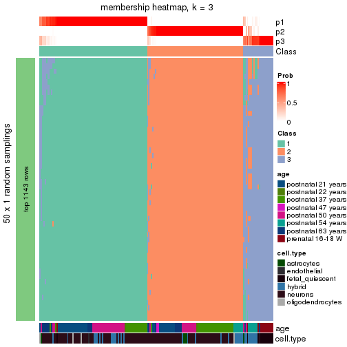</p>

</div>
<div id='tab-node-02-membership-heatmap-3'>
<pre><code class="r">membership_heatmap(res, k = 4)
</code></pre>

<p></p>

</div>
</div>

As soon as the classes for columns are determined, the signatures
that are significantly different between subgroups can be looked for. 
Following are the heatmaps for signatures.


Signature heatmaps where rows are scaled:


<script>
$( function() {
	$( '#tabs-node-02-get-signatures' ).tabs();
} );
</script>
<div id='tabs-node-02-get-signatures'>
<ul>
<li><a href='#tab-node-02-get-signatures-1'>k = 2</a></li>
<li><a href='#tab-node-02-get-signatures-2'>k = 3</a></li>
<li><a href='#tab-node-02-get-signatures-3'>k = 4</a></li>
</ul>
<div id='tab-node-02-get-signatures-1'>
<pre><code class="r">get_signatures(res, k = 2)
</code></pre>

<p></p>

</div>
<div id='tab-node-02-get-signatures-2'>
<pre><code class="r">get_signatures(res, k = 3)
</code></pre>

<p></p>

</div>
<div id='tab-node-02-get-signatures-3'>
<pre><code class="r">get_signatures(res, k = 4)
</code></pre>

<p></p>

</div>
</div>


Signature heatmaps where rows are not scaled:


<script>
$( function() {
	$( '#tabs-node-02-get-signatures-no-scale' ).tabs();
} );
</script>
<div id='tabs-node-02-get-signatures-no-scale'>
<ul>
<li><a href='#tab-node-02-get-signatures-no-scale-1'>k = 2</a></li>
<li><a href='#tab-node-02-get-signatures-no-scale-2'>k = 3</a></li>
<li><a href='#tab-node-02-get-signatures-no-scale-3'>k = 4</a></li>
</ul>
<div id='tab-node-02-get-signatures-no-scale-1'>
<pre><code class="r">get_signatures(res, k = 2, scale_rows = FALSE)
</code></pre>

<p></p>

</div>
<div id='tab-node-02-get-signatures-no-scale-2'>
<pre><code class="r">get_signatures(res, k = 3, scale_rows = FALSE)
</code></pre>

<p></p>

</div>
<div id='tab-node-02-get-signatures-no-scale-3'>
<pre><code class="r">get_signatures(res, k = 4, scale_rows = FALSE)
</code></pre>

<p></p>

</div>
</div>


Compare the overlap of signatures from different k:

```r
compare_signatures(res)
```


`get_signature()` returns a data frame invisibly. To get the list of signatures, the function
call should be assigned to a variable explicitly. In following code, if `plot` argument is set
to `FALSE`, no heatmap is plotted while only the differential analysis is performed.

```r
# code only for demonstration
tb = get_signature(res, k = ..., plot = FALSE)
```

An example of the output of `tb` is:

```
#>   which_row         fdr    mean_1    mean_2 scaled_mean_1 scaled_mean_2 km
#> 1        38 0.042760348  8.373488  9.131774    -0.5533452     0.5164555  1
#> 2        40 0.018707592  7.106213  8.469186    -0.6173731     0.5762149  1
#> 3        55 0.019134737 10.221463 11.207825    -0.6159697     0.5749050  1
#> 4        59 0.006059896  5.921854  7.869574    -0.6899429     0.6439467  1
#> 5        60 0.018055526  8.928898 10.211722    -0.6204761     0.5791110  1
#> 6        98 0.009384629 15.714769 14.887706     0.6635654    -0.6193277  2
...
```

The columns in `tb` are:

1. `which_row`: row indices corresponding to the input matrix.
2. `fdr`: FDR for the differential test. 
3. `mean_x`: The mean value in group x.
4. `scaled_mean_x`: The mean value in group x after rows are scaled.
5. `km`: Row groups if k-means clustering is applied to rows (which is done by automatically selecting number of clusters).

If there are too many signatures, `top_signatures = ...` can be set to only show the 
signatures with the highest FDRs:

```r
# code only for demonstration
# e.g. to show the top 500 most significant rows
tb = get_signature(res, k = ..., top_signatures = 500)
```

If the signatures are defined as these which are uniquely high in current group, `diff_method` argument
can be set to `"uniquely_high_in_one_group"`:

```r
# code only for demonstration
tb = get_signature(res, k = ..., diff_method = "uniquely_high_in_one_group")
```


UMAP plot which shows how samples are separated.


<script>
$( function() {
	$( '#tabs-node-02-dimension-reduction' ).tabs();
} );
</script>
<div id='tabs-node-02-dimension-reduction'>
<ul>
<li><a href='#tab-node-02-dimension-reduction-1'>k = 2</a></li>
<li><a href='#tab-node-02-dimension-reduction-2'>k = 3</a></li>
<li><a href='#tab-node-02-dimension-reduction-3'>k = 4</a></li>
</ul>
<div id='tab-node-02-dimension-reduction-1'>
<pre><code class="r">dimension_reduction(res, k = 2, method = &quot;UMAP&quot;)
</code></pre>

<p></p>

</div>
<div id='tab-node-02-dimension-reduction-2'>
<pre><code class="r">dimension_reduction(res, k = 3, method = &quot;UMAP&quot;)
</code></pre>

<p></p>

</div>
<div id='tab-node-02-dimension-reduction-3'>
<pre><code class="r">dimension_reduction(res, k = 4, method = &quot;UMAP&quot;)
</code></pre>

<p></p>

</div>
</div>


Following heatmap shows how subgroups are split when increasing `k`:

```r
collect_classes(res)
```


Test correlation between subgroups and known annotations. If the known
annotation is numeric, one-way ANOVA test is applied, and if the known
annotation is discrete, chi-squared contingency table test is applied.

```r
test_to_known_factors(res)
```

```
#>             n_sample age(p-value) cell.type(p-value) k
#> ATC:skmeans      176     1.51e-02           8.14e-01 2
#> ATC:skmeans      171     1.09e-20           6.02e-18 3
#> ATC:skmeans      160     3.78e-32           5.66e-26 4
```


If matrix rows can be associated to genes, consider to use `functional_enrichment(res,
...)` to perform function enrichment for the signature genes. See [this vignette](https://jokergoo.github.io/cola_vignettes/functional_enrichment.html) for more detailed explanations.


 

---------------------------------------------------


### Node021


Parent node: [Node02](#Node02).
Child nodes: 
                Node0111-leaf
        ,
                [Node0112](#Node0112)
        ,
                Node0121-leaf
        ,
                Node0122-leaf
        ,
                Node0123-leaf
        ,
                Node0124-leaf
        ,
                Node0131-leaf
        ,
                Node0132-leaf
        ,
                Node0133-leaf
        ,
                Node0211-leaf
        ,
                Node0212-leaf
        .


The object with results only for a single top-value method and a single partitioning method 
can be extracted as:

```r
res = res_rh["021"]
```

A summary of `res` and all the functions that can be applied to it:

```r
res
```

```
#> A 'ConsensusPartition' object with k = 2, 3, 4.
#>   On a matrix with 11415 rows and 92 columns.
#>   Top rows (1142) are extracted by 'ATC' method.
#>   Subgroups are detected by 'skmeans' method.
#>   Performed in total 150 partitions by row resampling.
#>   Best k for subgroups seems to be 2.
#> 
#> Following methods can be applied to this 'ConsensusPartition' object:
#>  [1] "cola_report"             "collect_classes"         "collect_plots"          
#>  [4] "collect_stats"           "colnames"                "compare_partitions"     
#>  [7] "compare_signatures"      "consensus_heatmap"       "dimension_reduction"    
#> [10] "functional_enrichment"   "get_anno_col"            "get_anno"               
#> [13] "get_classes"             "get_consensus"           "get_matrix"             
#> [16] "get_membership"          "get_param"               "get_signatures"         
#> [19] "get_stats"               "is_best_k"               "is_stable_k"            
#> [22] "membership_heatmap"      "ncol"                    "nrow"                   
#> [25] "plot_ecdf"               "predict_classes"         "rownames"               
#> [28] "select_partition_number" "show"                    "suggest_best_k"         
#> [31] "test_to_known_factors"   "top_rows_heatmap"
```

`collect_plots()` function collects all the plots made from `res` for all `k` (number of subgroups)
into one single page to provide an easy and fast comparison between different `k`.

```r
collect_plots(res)
```


The plots are:

- The first row: a plot of the eCDF (empirical cumulative distribution
  function) curves of the consensus matrix for each `k` and the heatmap of
  predicted classes for each `k`.
- The second row: heatmaps of the consensus matrix for each `k`.
- The third row: heatmaps of the membership matrix for each `k`.
- The fouth row: heatmaps of the signatures for each `k`.

All the plots in panels can be made by individual functions and they are
plotted later in this section.

`select_partition_number()` produces several plots showing different
statistics for choosing "optimized" `k`. There are following statistics:

- eCDF curves of the consensus matrix for each `k`;
- 1-PAC. [The PAC score](https://en.wikipedia.org/wiki/Consensus_clustering#Over-interpretation_potential_of_consensus_clustering)
  measures the proportion of the ambiguous subgrouping.
- Mean silhouette score.
- Concordance. The mean probability of fiting the consensus subgroup labels in all
  partitions.
- Area increased. Denote $A_k$ as the area under the eCDF curve for current
  `k`, the area increased is defined as $A_k - A_{k-1}$.
- Rand index. The percent of pairs of samples that are both in a same cluster
  or both are not in a same cluster in the partition of k and k-1.
- Jaccard index. The ratio of pairs of samples are both in a same cluster in
  the partition of k and k-1 and the pairs of samples are both in a same
  cluster in the partition k or k-1.

The detailed explanations of these statistics can be found in [the _cola_
vignette](https://jokergoo.github.io/cola_vignettes/cola.html#toc_13).

Generally speaking, higher 1-PAC score, higher mean silhouette score or higher
concordance corresponds to better partition. Rand index and Jaccard index
measure how similar the current partition is compared to partition with `k-1`.
If they are too similar, we won't accept `k` is better than `k-1`.

```r
select_partition_number(res)
```


The numeric values for all these statistics can be obtained by `get_stats()`.

```r
get_stats(res)
```

```
#>   k 1-PAC mean_silhouette concordance area_increased  Rand Jaccard
#> 2 2 1.000           0.985       0.993          0.489 0.514   0.514
#> 3 3 0.861           0.884       0.953          0.312 0.753   0.560
#> 4 4 0.685           0.751       0.860          0.145 0.812   0.537
```

`suggest_best_k()` suggests the best $k$ based on these statistics. The rules are as follows:

- All $k$ with Jaccard index larger than 0.95 are removed because increasing
  $k$ does not provide enough extra information. If all $k$ are removed, it is
  marked as no subgroup is detected.
- For all $k$ with 1-PAC score larger than 0.9, the maximal $k$ is taken as
  the best $k$, and other $k$ are marked as optional $k$.
- If it does not fit the second rule. The $k$ with the maximal vote of the
  highest 1-PAC score, highest mean silhouette, and highest concordance is
  taken as the best $k$.

```r
suggest_best_k(res)
```

```
#> [1] 2
```


Following is the table of the partitions (You need to click the **show/hide
code output** link to see it). The membership matrix (columns with name `p*`)
is inferred by
[`clue::cl_consensus()`](https://www.rdocumentation.org/link/cl_consensus?package=clue)
function with the `SE` method. Basically the value in the membership matrix
represents the probability to belong to a certain group. The finall subgroup
label for an item is determined with the group with highest probability it
belongs to.

In `get_classes()` function, the entropy is calculated from the membership
matrix and the silhouette score is calculated from the consensus matrix.


<script>
$( function() {
	$( '#tabs-node-021-get-classes' ).tabs();
} );
</script>
<div id='tabs-node-021-get-classes'>
<ul>
<li><a href='#tab-node-021-get-classes-1'>k = 2</a></li>
<li><a href='#tab-node-021-get-classes-2'>k = 3</a></li>
<li><a href='#tab-node-021-get-classes-3'>k = 4</a></li>
</ul>

<div id='tab-node-021-get-classes-1'>
<p><a id='tab-node-021-get-classes-1-a' style='color:#0366d6' href='#'>show/hide code output</a></p>
<pre><code class="r">cbind(get_classes(res, k = 2), get_membership(res, k = 2))
</code></pre>

<pre><code>#&gt;            class entropy silhouette   p1   p2
#&gt; GSM1657883     1   0.000      0.988 1.00 0.00
#&gt; GSM1657895     1   0.000      0.988 1.00 0.00
#&gt; GSM1657912     1   0.000      0.988 1.00 0.00
#&gt; GSM1657930     2   0.000      1.000 0.00 1.00
#&gt; GSM1657946     2   0.000      1.000 0.00 1.00
#&gt; GSM1657952     1   0.000      0.988 1.00 0.00
#&gt; GSM1657956     1   0.000      0.988 1.00 0.00
#&gt; GSM1657957     1   0.000      0.988 1.00 0.00
#&gt; GSM1657958     1   0.000      0.988 1.00 0.00
#&gt; GSM1657960     2   0.000      1.000 0.00 1.00
#&gt; GSM1657962     2   0.000      1.000 0.00 1.00
#&gt; GSM1657963     1   0.000      0.988 1.00 0.00
#&gt; GSM1657966     1   0.000      0.988 1.00 0.00
#&gt; GSM1657967     1   0.000      0.988 1.00 0.00
#&gt; GSM1657971     2   0.000      1.000 0.00 1.00
#&gt; GSM1657973     1   0.000      0.988 1.00 0.00
#&gt; GSM1657977     2   0.000      1.000 0.00 1.00
#&gt; GSM1657982     2   0.000      1.000 0.00 1.00
#&gt; GSM1657986     1   0.000      0.988 1.00 0.00
#&gt; GSM1657987     1   0.680      0.784 0.82 0.18
#&gt; GSM1657990     1   0.000      0.988 1.00 0.00
#&gt; GSM1658002     1   0.000      0.988 1.00 0.00
#&gt; GSM1658008     1   0.760      0.725 0.78 0.22
#&gt; GSM1658009     2   0.000      1.000 0.00 1.00
#&gt; GSM1658010     2   0.000      1.000 0.00 1.00
#&gt; GSM1658011     2   0.000      1.000 0.00 1.00
#&gt; GSM1658012     1   0.000      0.988 1.00 0.00
#&gt; GSM1658013     2   0.000      1.000 0.00 1.00
#&gt; GSM1658014     2   0.000      1.000 0.00 1.00
#&gt; GSM1658015     2   0.000      1.000 0.00 1.00
#&gt; GSM1658019     2   0.000      1.000 0.00 1.00
#&gt; GSM1658022     2   0.000      1.000 0.00 1.00
#&gt; GSM1658028     2   0.000      1.000 0.00 1.00
#&gt; GSM1658032     2   0.000      1.000 0.00 1.00
#&gt; GSM1658033     2   0.000      1.000 0.00 1.00
#&gt; GSM1658034     2   0.000      1.000 0.00 1.00
#&gt; GSM1658037     2   0.000      1.000 0.00 1.00
#&gt; GSM1658040     2   0.000      1.000 0.00 1.00
#&gt; GSM1658041     2   0.000      1.000 0.00 1.00
#&gt; GSM1658047     2   0.000      1.000 0.00 1.00
#&gt; GSM1658052     2   0.000      1.000 0.00 1.00
#&gt; GSM1658057     2   0.000      1.000 0.00 1.00
#&gt; GSM1658058     1   0.000      0.988 1.00 0.00
#&gt; GSM1658060     2   0.000      1.000 0.00 1.00
#&gt; GSM1658063     2   0.000      1.000 0.00 1.00
#&gt; GSM1658070     2   0.000      1.000 0.00 1.00
#&gt; GSM1658074     2   0.000      1.000 0.00 1.00
#&gt; GSM1658075     2   0.000      1.000 0.00 1.00
#&gt; GSM1658076     1   0.000      0.988 1.00 0.00
#&gt; GSM1658080     2   0.000      1.000 0.00 1.00
#&gt; GSM1658084     1   0.000      0.988 1.00 0.00
#&gt; GSM1658087     1   0.000      0.988 1.00 0.00
#&gt; GSM1658090     1   0.000      0.988 1.00 0.00
#&gt; GSM1658091     1   0.000      0.988 1.00 0.00
#&gt; GSM1658100     1   0.000      0.988 1.00 0.00
#&gt; GSM1658101     1   0.000      0.988 1.00 0.00
#&gt; GSM1658103     1   0.000      0.988 1.00 0.00
#&gt; GSM1658105     1   0.000      0.988 1.00 0.00
#&gt; GSM1658107     1   0.000      0.988 1.00 0.00
#&gt; GSM1658110     1   0.000      0.988 1.00 0.00
#&gt; GSM1658111     1   0.000      0.988 1.00 0.00
#&gt; GSM1658121     1   0.000      0.988 1.00 0.00
#&gt; GSM1658127     1   0.000      0.988 1.00 0.00
#&gt; GSM1658129     1   0.000      0.988 1.00 0.00
#&gt; GSM1658132     1   0.000      0.988 1.00 0.00
#&gt; GSM1658134     1   0.000      0.988 1.00 0.00
#&gt; GSM1658137     1   0.000      0.988 1.00 0.00
#&gt; GSM1658140     1   0.000      0.988 1.00 0.00
#&gt; GSM1658141     2   0.000      1.000 0.00 1.00
#&gt; GSM1658145     1   0.000      0.988 1.00 0.00
#&gt; GSM1658147     2   0.000      1.000 0.00 1.00
#&gt; GSM1658148     2   0.000      1.000 0.00 1.00
#&gt; GSM1658156     2   0.000      1.000 0.00 1.00
#&gt; GSM1658157     1   0.795      0.691 0.76 0.24
#&gt; GSM1658158     1   0.000      0.988 1.00 0.00
#&gt; GSM1658160     1   0.000      0.988 1.00 0.00
#&gt; GSM1658163     1   0.000      0.988 1.00 0.00
#&gt; GSM1658165     1   0.000      0.988 1.00 0.00
#&gt; GSM1658166     1   0.000      0.988 1.00 0.00
#&gt; GSM1658169     1   0.000      0.988 1.00 0.00
#&gt; GSM1658170     2   0.000      1.000 0.00 1.00
#&gt; GSM1658172     1   0.000      0.988 1.00 0.00
#&gt; GSM1658176     1   0.000      0.988 1.00 0.00
#&gt; GSM1658177     1   0.000      0.988 1.00 0.00
#&gt; GSM1658179     1   0.000      0.988 1.00 0.00
#&gt; GSM1658182     2   0.000      1.000 0.00 1.00
#&gt; GSM1658257     1   0.000      0.988 1.00 0.00
#&gt; GSM1658259     1   0.000      0.988 1.00 0.00
#&gt; GSM1658299     1   0.000      0.988 1.00 0.00
#&gt; GSM1658323     1   0.000      0.988 1.00 0.00
#&gt; GSM1658339     1   0.000      0.988 1.00 0.00
#&gt; GSM1658352     1   0.000      0.988 1.00 0.00
</code></pre>

<script>
$('#tab-node-021-get-classes-1-a').parent().next().next().hide();
$('#tab-node-021-get-classes-1-a').click(function(){
  $('#tab-node-021-get-classes-1-a').parent().next().next().toggle();
  return(false);
});
</script>
</div>

<div id='tab-node-021-get-classes-2'>
<p><a id='tab-node-021-get-classes-2-a' style='color:#0366d6' href='#'>show/hide code output</a></p>
<pre><code class="r">cbind(get_classes(res, k = 3), get_membership(res, k = 3))
</code></pre>

<pre><code>#&gt;            class entropy silhouette   p1   p2   p3
#&gt; GSM1657883     1  0.0000    0.95073 1.00 0.00 0.00
#&gt; GSM1657895     1  0.0000    0.95073 1.00 0.00 0.00
#&gt; GSM1657912     1  0.0000    0.95073 1.00 0.00 0.00
#&gt; GSM1657930     3  0.0000    0.91272 0.00 0.00 1.00
#&gt; GSM1657946     3  0.0000    0.91272 0.00 0.00 1.00
#&gt; GSM1657952     1  0.0000    0.95073 1.00 0.00 0.00
#&gt; GSM1657956     1  0.0000    0.95073 1.00 0.00 0.00
#&gt; GSM1657957     1  0.0000    0.95073 1.00 0.00 0.00
#&gt; GSM1657958     3  0.0000    0.91272 0.00 0.00 1.00
#&gt; GSM1657960     3  0.0000    0.91272 0.00 0.00 1.00
#&gt; GSM1657962     3  0.0000    0.91272 0.00 0.00 1.00
#&gt; GSM1657963     1  0.0000    0.95073 1.00 0.00 0.00
#&gt; GSM1657966     1  0.0000    0.95073 1.00 0.00 0.00
#&gt; GSM1657967     3  0.2066    0.87056 0.06 0.00 0.94
#&gt; GSM1657971     3  0.0000    0.91272 0.00 0.00 1.00
#&gt; GSM1657973     1  0.0000    0.95073 1.00 0.00 0.00
#&gt; GSM1657977     3  0.0000    0.91272 0.00 0.00 1.00
#&gt; GSM1657982     3  0.0000    0.91272 0.00 0.00 1.00
#&gt; GSM1657986     1  0.0000    0.95073 1.00 0.00 0.00
#&gt; GSM1657987     3  0.0000    0.91272 0.00 0.00 1.00
#&gt; GSM1657990     1  0.5706    0.54211 0.68 0.00 0.32
#&gt; GSM1658002     3  0.0000    0.91272 0.00 0.00 1.00
#&gt; GSM1658008     2  0.0892    0.96223 0.02 0.98 0.00
#&gt; GSM1658009     3  0.6126    0.32069 0.00 0.40 0.60
#&gt; GSM1658010     2  0.0000    0.98334 0.00 1.00 0.00
#&gt; GSM1658011     2  0.0000    0.98334 0.00 1.00 0.00
#&gt; GSM1658012     1  0.0000    0.95073 1.00 0.00 0.00
#&gt; GSM1658013     2  0.0000    0.98334 0.00 1.00 0.00
#&gt; GSM1658014     2  0.2959    0.88609 0.00 0.90 0.10
#&gt; GSM1658015     2  0.0000    0.98334 0.00 1.00 0.00
#&gt; GSM1658019     2  0.0000    0.98334 0.00 1.00 0.00
#&gt; GSM1658022     2  0.0000    0.98334 0.00 1.00 0.00
#&gt; GSM1658028     2  0.0000    0.98334 0.00 1.00 0.00
#&gt; GSM1658032     3  0.5016    0.65573 0.00 0.24 0.76
#&gt; GSM1658033     2  0.0000    0.98334 0.00 1.00 0.00
#&gt; GSM1658034     2  0.0000    0.98334 0.00 1.00 0.00
#&gt; GSM1658037     3  0.4291    0.74262 0.00 0.18 0.82
#&gt; GSM1658040     3  0.0000    0.91272 0.00 0.00 1.00
#&gt; GSM1658041     3  0.0000    0.91272 0.00 0.00 1.00
#&gt; GSM1658047     2  0.0000    0.98334 0.00 1.00 0.00
#&gt; GSM1658052     2  0.0000    0.98334 0.00 1.00 0.00
#&gt; GSM1658057     2  0.0000    0.98334 0.00 1.00 0.00
#&gt; GSM1658058     1  0.0000    0.95073 1.00 0.00 0.00
#&gt; GSM1658060     2  0.0000    0.98334 0.00 1.00 0.00
#&gt; GSM1658063     2  0.0000    0.98334 0.00 1.00 0.00
#&gt; GSM1658070     2  0.0000    0.98334 0.00 1.00 0.00
#&gt; GSM1658074     2  0.0000    0.98334 0.00 1.00 0.00
#&gt; GSM1658075     2  0.0000    0.98334 0.00 1.00 0.00
#&gt; GSM1658076     1  0.1529    0.91561 0.96 0.04 0.00
#&gt; GSM1658080     3  0.3340    0.81380 0.00 0.12 0.88
#&gt; GSM1658084     1  0.0000    0.95073 1.00 0.00 0.00
#&gt; GSM1658087     1  0.0000    0.95073 1.00 0.00 0.00
#&gt; GSM1658090     1  0.0000    0.95073 1.00 0.00 0.00
#&gt; GSM1658091     1  0.5948    0.45635 0.64 0.00 0.36
#&gt; GSM1658100     1  0.0000    0.95073 1.00 0.00 0.00
#&gt; GSM1658101     1  0.0000    0.95073 1.00 0.00 0.00
#&gt; GSM1658103     1  0.0000    0.95073 1.00 0.00 0.00
#&gt; GSM1658105     1  0.0000    0.95073 1.00 0.00 0.00
#&gt; GSM1658107     1  0.0000    0.95073 1.00 0.00 0.00
#&gt; GSM1658110     1  0.0000    0.95073 1.00 0.00 0.00
#&gt; GSM1658111     1  0.0000    0.95073 1.00 0.00 0.00
#&gt; GSM1658121     1  0.0000    0.95073 1.00 0.00 0.00
#&gt; GSM1658127     3  0.0000    0.91272 0.00 0.00 1.00
#&gt; GSM1658129     3  0.0892    0.90081 0.02 0.00 0.98
#&gt; GSM1658132     1  0.0000    0.95073 1.00 0.00 0.00
#&gt; GSM1658134     1  0.4555    0.74118 0.80 0.00 0.20
#&gt; GSM1658137     1  0.0000    0.95073 1.00 0.00 0.00
#&gt; GSM1658140     1  0.0000    0.95073 1.00 0.00 0.00
#&gt; GSM1658141     3  0.0000    0.91272 0.00 0.00 1.00
#&gt; GSM1658145     1  0.0000    0.95073 1.00 0.00 0.00
#&gt; GSM1658147     3  0.0000    0.91272 0.00 0.00 1.00
#&gt; GSM1658148     3  0.0000    0.91272 0.00 0.00 1.00
#&gt; GSM1658156     2  0.4291    0.77926 0.00 0.82 0.18
#&gt; GSM1658157     3  0.1529    0.88736 0.04 0.00 0.96
#&gt; GSM1658158     3  0.4002    0.76801 0.16 0.00 0.84
#&gt; GSM1658160     3  0.5397    0.58403 0.28 0.00 0.72
#&gt; GSM1658163     1  0.0000    0.95073 1.00 0.00 0.00
#&gt; GSM1658165     1  0.5948    0.45196 0.64 0.00 0.36
#&gt; GSM1658166     1  0.6309    0.01960 0.50 0.00 0.50
#&gt; GSM1658169     3  0.6302    0.00329 0.48 0.00 0.52
#&gt; GSM1658170     3  0.0000    0.91272 0.00 0.00 1.00
#&gt; GSM1658172     1  0.0000    0.95073 1.00 0.00 0.00
#&gt; GSM1658176     1  0.4796    0.71359 0.78 0.00 0.22
#&gt; GSM1658177     1  0.0000    0.95073 1.00 0.00 0.00
#&gt; GSM1658179     1  0.0000    0.95073 1.00 0.00 0.00
#&gt; GSM1658182     3  0.0892    0.90149 0.00 0.02 0.98
#&gt; GSM1658257     1  0.0000    0.95073 1.00 0.00 0.00
#&gt; GSM1658259     1  0.0000    0.95073 1.00 0.00 0.00
#&gt; GSM1658299     1  0.0000    0.95073 1.00 0.00 0.00
#&gt; GSM1658323     1  0.0000    0.95073 1.00 0.00 0.00
#&gt; GSM1658339     1  0.0000    0.95073 1.00 0.00 0.00
#&gt; GSM1658352     1  0.0000    0.95073 1.00 0.00 0.00
</code></pre>

<script>
$('#tab-node-021-get-classes-2-a').parent().next().next().hide();
$('#tab-node-021-get-classes-2-a').click(function(){
  $('#tab-node-021-get-classes-2-a').parent().next().next().toggle();
  return(false);
});
</script>
</div>

<div id='tab-node-021-get-classes-3'>
<p><a id='tab-node-021-get-classes-3-a' style='color:#0366d6' href='#'>show/hide code output</a></p>
<pre><code class="r">cbind(get_classes(res, k = 4), get_membership(res, k = 4))
</code></pre>

<pre><code>#&gt;            class entropy silhouette   p1   p2   p3   p4
#&gt; GSM1657883     4  0.1637     0.8170 0.06 0.00 0.00 0.94
#&gt; GSM1657895     4  0.2921     0.8177 0.14 0.00 0.00 0.86
#&gt; GSM1657912     4  0.2345     0.8278 0.10 0.00 0.00 0.90
#&gt; GSM1657930     3  0.0707     0.8941 0.02 0.00 0.98 0.00
#&gt; GSM1657946     3  0.0000     0.8930 0.00 0.00 1.00 0.00
#&gt; GSM1657952     1  0.3172     0.7503 0.84 0.00 0.00 0.16
#&gt; GSM1657956     1  0.4277     0.7084 0.72 0.00 0.00 0.28
#&gt; GSM1657957     1  0.3172     0.7115 0.84 0.00 0.00 0.16
#&gt; GSM1657958     3  0.4406     0.7048 0.30 0.00 0.70 0.00
#&gt; GSM1657960     3  0.1637     0.8857 0.06 0.00 0.94 0.00
#&gt; GSM1657962     3  0.2011     0.8772 0.08 0.00 0.92 0.00
#&gt; GSM1657963     1  0.2921     0.7459 0.86 0.00 0.00 0.14
#&gt; GSM1657966     1  0.3975     0.7310 0.76 0.00 0.00 0.24
#&gt; GSM1657967     1  0.5173     0.2650 0.66 0.00 0.32 0.02
#&gt; GSM1657971     3  0.0000     0.8930 0.00 0.00 1.00 0.00
#&gt; GSM1657973     1  0.3400     0.7487 0.82 0.00 0.00 0.18
#&gt; GSM1657977     3  0.0707     0.8941 0.02 0.00 0.98 0.00
#&gt; GSM1657982     3  0.1211     0.8910 0.04 0.00 0.96 0.00
#&gt; GSM1657986     1  0.3172     0.7484 0.84 0.00 0.00 0.16
#&gt; GSM1657987     3  0.3610     0.7831 0.20 0.00 0.80 0.00
#&gt; GSM1657990     1  0.0000     0.6965 1.00 0.00 0.00 0.00
#&gt; GSM1658002     1  0.3610     0.5564 0.80 0.00 0.20 0.00
#&gt; GSM1658008     2  0.4134     0.6655 0.00 0.74 0.00 0.26
#&gt; GSM1658009     3  0.2921     0.7914 0.00 0.14 0.86 0.00
#&gt; GSM1658010     2  0.0707     0.9398 0.00 0.98 0.00 0.02
#&gt; GSM1658011     2  0.0000     0.9465 0.00 1.00 0.00 0.00
#&gt; GSM1658012     1  0.4855     0.5228 0.60 0.00 0.00 0.40
#&gt; GSM1658013     2  0.0000     0.9465 0.00 1.00 0.00 0.00
#&gt; GSM1658014     3  0.4994     0.0493 0.00 0.48 0.52 0.00
#&gt; GSM1658015     2  0.0000     0.9465 0.00 1.00 0.00 0.00
#&gt; GSM1658019     2  0.0707     0.9462 0.00 0.98 0.02 0.00
#&gt; GSM1658022     2  0.0707     0.9398 0.00 0.98 0.00 0.02
#&gt; GSM1658028     2  0.0707     0.9462 0.00 0.98 0.02 0.00
#&gt; GSM1658032     3  0.1211     0.8773 0.00 0.04 0.96 0.00
#&gt; GSM1658033     2  0.0707     0.9462 0.00 0.98 0.02 0.00
#&gt; GSM1658034     2  0.0707     0.9462 0.00 0.98 0.02 0.00
#&gt; GSM1658037     3  0.1637     0.8690 0.00 0.06 0.94 0.00
#&gt; GSM1658040     3  0.0000     0.8930 0.00 0.00 1.00 0.00
#&gt; GSM1658041     3  0.0000     0.8930 0.00 0.00 1.00 0.00
#&gt; GSM1658047     2  0.0707     0.9398 0.00 0.98 0.00 0.02
#&gt; GSM1658052     2  0.0707     0.9462 0.00 0.98 0.02 0.00
#&gt; GSM1658057     2  0.0707     0.9462 0.00 0.98 0.02 0.00
#&gt; GSM1658058     1  0.4977     0.3834 0.54 0.00 0.00 0.46
#&gt; GSM1658060     2  0.0707     0.9398 0.00 0.98 0.00 0.02
#&gt; GSM1658063     2  0.0707     0.9462 0.00 0.98 0.02 0.00
#&gt; GSM1658070     2  0.0000     0.9465 0.00 1.00 0.00 0.00
#&gt; GSM1658074     2  0.0707     0.9462 0.00 0.98 0.02 0.00
#&gt; GSM1658075     2  0.0000     0.9465 0.00 1.00 0.00 0.00
#&gt; GSM1658076     4  0.2921     0.7854 0.14 0.00 0.00 0.86
#&gt; GSM1658080     3  0.1637     0.8653 0.00 0.06 0.94 0.00
#&gt; GSM1658084     1  0.4134     0.7189 0.74 0.00 0.00 0.26
#&gt; GSM1658087     1  0.4277     0.7084 0.72 0.00 0.00 0.28
#&gt; GSM1658090     1  0.4277     0.7084 0.72 0.00 0.00 0.28
#&gt; GSM1658091     1  0.7206    -0.0677 0.46 0.00 0.14 0.40
#&gt; GSM1658100     4  0.1411     0.8101 0.02 0.02 0.00 0.96
#&gt; GSM1658101     1  0.4277     0.7084 0.72 0.00 0.00 0.28
#&gt; GSM1658103     1  0.4277     0.7084 0.72 0.00 0.00 0.28
#&gt; GSM1658105     1  0.4134     0.7219 0.74 0.00 0.00 0.26
#&gt; GSM1658107     1  0.4406     0.6868 0.70 0.00 0.00 0.30
#&gt; GSM1658110     1  0.4713     0.6062 0.64 0.00 0.00 0.36
#&gt; GSM1658111     1  0.4977     0.3678 0.54 0.00 0.00 0.46
#&gt; GSM1658121     4  0.4907     0.0883 0.42 0.00 0.00 0.58
#&gt; GSM1658127     3  0.4277     0.7198 0.28 0.00 0.72 0.00
#&gt; GSM1658129     1  0.3400     0.5629 0.82 0.00 0.18 0.00
#&gt; GSM1658132     4  0.0707     0.7985 0.00 0.02 0.00 0.98
#&gt; GSM1658134     1  0.0707     0.6881 0.98 0.00 0.02 0.00
#&gt; GSM1658137     1  0.3172     0.7498 0.84 0.00 0.00 0.16
#&gt; GSM1658140     4  0.1411     0.7837 0.02 0.02 0.00 0.96
#&gt; GSM1658141     3  0.0707     0.8941 0.02 0.00 0.98 0.00
#&gt; GSM1658145     1  0.4624     0.6409 0.66 0.00 0.00 0.34
#&gt; GSM1658147     3  0.0707     0.8941 0.02 0.00 0.98 0.00
#&gt; GSM1658148     3  0.1211     0.8910 0.04 0.00 0.96 0.00
#&gt; GSM1658156     2  0.6554     0.1855 0.00 0.52 0.40 0.08
#&gt; GSM1658157     3  0.6921     0.5636 0.16 0.00 0.58 0.26
#&gt; GSM1658158     1  0.2647     0.6090 0.88 0.00 0.12 0.00
#&gt; GSM1658160     1  0.0707     0.6886 0.98 0.00 0.02 0.00
#&gt; GSM1658163     1  0.3400     0.7476 0.82 0.00 0.00 0.18
#&gt; GSM1658165     4  0.5006     0.6319 0.16 0.02 0.04 0.78
#&gt; GSM1658166     1  0.1211     0.6752 0.96 0.00 0.04 0.00
#&gt; GSM1658169     1  0.1637     0.6620 0.94 0.00 0.06 0.00
#&gt; GSM1658170     3  0.0000     0.8930 0.00 0.00 1.00 0.00
#&gt; GSM1658172     1  0.2345     0.7354 0.90 0.00 0.00 0.10
#&gt; GSM1658176     1  0.0707     0.6886 0.98 0.00 0.02 0.00
#&gt; GSM1658177     1  0.3801     0.7391 0.78 0.00 0.00 0.22
#&gt; GSM1658179     4  0.0707     0.7985 0.00 0.02 0.00 0.98
#&gt; GSM1658182     3  0.4766     0.8019 0.04 0.02 0.80 0.14
#&gt; GSM1658257     4  0.3172     0.8074 0.16 0.00 0.00 0.84
#&gt; GSM1658259     4  0.1637     0.8274 0.06 0.00 0.00 0.94
#&gt; GSM1658299     4  0.3172     0.8074 0.16 0.00 0.00 0.84
#&gt; GSM1658323     4  0.3172     0.8074 0.16 0.00 0.00 0.84
#&gt; GSM1658339     4  0.3172     0.8074 0.16 0.00 0.00 0.84
#&gt; GSM1658352     4  0.3801     0.7128 0.22 0.00 0.00 0.78
</code></pre>

<script>
$('#tab-node-021-get-classes-3-a').parent().next().next().hide();
$('#tab-node-021-get-classes-3-a').click(function(){
  $('#tab-node-021-get-classes-3-a').parent().next().next().toggle();
  return(false);
});
</script>
</div>
</div>

Heatmaps for the consensus matrix. It visualizes the probability of two
samples to be in a same group.


<script>
$( function() {
	$( '#tabs-node-021-consensus-heatmap' ).tabs();
} );
</script>
<div id='tabs-node-021-consensus-heatmap'>
<ul>
<li><a href='#tab-node-021-consensus-heatmap-1'>k = 2</a></li>
<li><a href='#tab-node-021-consensus-heatmap-2'>k = 3</a></li>
<li><a href='#tab-node-021-consensus-heatmap-3'>k = 4</a></li>
</ul>
<div id='tab-node-021-consensus-heatmap-1'>
<pre><code class="r">consensus_heatmap(res, k = 2)
</code></pre>

<p></p>

</div>
<div id='tab-node-021-consensus-heatmap-2'>
<pre><code class="r">consensus_heatmap(res, k = 3)
</code></pre>

<p></p>

</div>
<div id='tab-node-021-consensus-heatmap-3'>
<pre><code class="r">consensus_heatmap(res, k = 4)
</code></pre>

<p></p>

</div>
</div>

Heatmaps for the membership of samples in all partitions to see how consistent they are:


<script>
$( function() {
	$( '#tabs-node-021-membership-heatmap' ).tabs();
} );
</script>
<div id='tabs-node-021-membership-heatmap'>
<ul>
<li><a href='#tab-node-021-membership-heatmap-1'>k = 2</a></li>
<li><a href='#tab-node-021-membership-heatmap-2'>k = 3</a></li>
<li><a href='#tab-node-021-membership-heatmap-3'>k = 4</a></li>
</ul>
<div id='tab-node-021-membership-heatmap-1'>
<pre><code class="r">membership_heatmap(res, k = 2)
</code></pre>

<p></p>

</div>
<div id='tab-node-021-membership-heatmap-2'>
<pre><code class="r">membership_heatmap(res, k = 3)
</code></pre>

<p></p>

</div>
<div id='tab-node-021-membership-heatmap-3'>
<pre><code class="r">membership_heatmap(res, k = 4)
</code></pre>

<p></p>

</div>
</div>

As soon as the classes for columns are determined, the signatures
that are significantly different between subgroups can be looked for. 
Following are the heatmaps for signatures.


Signature heatmaps where rows are scaled:


<script>
$( function() {
	$( '#tabs-node-021-get-signatures' ).tabs();
} );
</script>
<div id='tabs-node-021-get-signatures'>
<ul>
<li><a href='#tab-node-021-get-signatures-1'>k = 2</a></li>
<li><a href='#tab-node-021-get-signatures-2'>k = 3</a></li>
<li><a href='#tab-node-021-get-signatures-3'>k = 4</a></li>
</ul>
<div id='tab-node-021-get-signatures-1'>
<pre><code class="r">get_signatures(res, k = 2)
</code></pre>

<p></p>

</div>
<div id='tab-node-021-get-signatures-2'>
<pre><code class="r">get_signatures(res, k = 3)
</code></pre>

<p></p>

</div>
<div id='tab-node-021-get-signatures-3'>
<pre><code class="r">get_signatures(res, k = 4)
</code></pre>

<p></p>

</div>
</div>


Signature heatmaps where rows are not scaled:


<script>
$( function() {
	$( '#tabs-node-021-get-signatures-no-scale' ).tabs();
} );
</script>
<div id='tabs-node-021-get-signatures-no-scale'>
<ul>
<li><a href='#tab-node-021-get-signatures-no-scale-1'>k = 2</a></li>
<li><a href='#tab-node-021-get-signatures-no-scale-2'>k = 3</a></li>
<li><a href='#tab-node-021-get-signatures-no-scale-3'>k = 4</a></li>
</ul>
<div id='tab-node-021-get-signatures-no-scale-1'>
<pre><code class="r">get_signatures(res, k = 2, scale_rows = FALSE)
</code></pre>

<p></p>

</div>
<div id='tab-node-021-get-signatures-no-scale-2'>
<pre><code class="r">get_signatures(res, k = 3, scale_rows = FALSE)
</code></pre>

<p></p>

</div>
<div id='tab-node-021-get-signatures-no-scale-3'>
<pre><code class="r">get_signatures(res, k = 4, scale_rows = FALSE)
</code></pre>

<p></p>

</div>
</div>


Compare the overlap of signatures from different k:

```r
compare_signatures(res)
```


`get_signature()` returns a data frame invisibly. To get the list of signatures, the function
call should be assigned to a variable explicitly. In following code, if `plot` argument is set
to `FALSE`, no heatmap is plotted while only the differential analysis is performed.

```r
# code only for demonstration
tb = get_signature(res, k = ..., plot = FALSE)
```

An example of the output of `tb` is:

```
#>   which_row         fdr    mean_1    mean_2 scaled_mean_1 scaled_mean_2 km
#> 1        38 0.042760348  8.373488  9.131774    -0.5533452     0.5164555  1
#> 2        40 0.018707592  7.106213  8.469186    -0.6173731     0.5762149  1
#> 3        55 0.019134737 10.221463 11.207825    -0.6159697     0.5749050  1
#> 4        59 0.006059896  5.921854  7.869574    -0.6899429     0.6439467  1
#> 5        60 0.018055526  8.928898 10.211722    -0.6204761     0.5791110  1
#> 6        98 0.009384629 15.714769 14.887706     0.6635654    -0.6193277  2
...
```

The columns in `tb` are:

1. `which_row`: row indices corresponding to the input matrix.
2. `fdr`: FDR for the differential test. 
3. `mean_x`: The mean value in group x.
4. `scaled_mean_x`: The mean value in group x after rows are scaled.
5. `km`: Row groups if k-means clustering is applied to rows (which is done by automatically selecting number of clusters).

If there are too many signatures, `top_signatures = ...` can be set to only show the 
signatures with the highest FDRs:

```r
# code only for demonstration
# e.g. to show the top 500 most significant rows
tb = get_signature(res, k = ..., top_signatures = 500)
```

If the signatures are defined as these which are uniquely high in current group, `diff_method` argument
can be set to `"uniquely_high_in_one_group"`:

```r
# code only for demonstration
tb = get_signature(res, k = ..., diff_method = "uniquely_high_in_one_group")
```


UMAP plot which shows how samples are separated.


<script>
$( function() {
	$( '#tabs-node-021-dimension-reduction' ).tabs();
} );
</script>
<div id='tabs-node-021-dimension-reduction'>
<ul>
<li><a href='#tab-node-021-dimension-reduction-1'>k = 2</a></li>
<li><a href='#tab-node-021-dimension-reduction-2'>k = 3</a></li>
<li><a href='#tab-node-021-dimension-reduction-3'>k = 4</a></li>
</ul>
<div id='tab-node-021-dimension-reduction-1'>
<pre><code class="r">dimension_reduction(res, k = 2, method = &quot;UMAP&quot;)
</code></pre>

<p>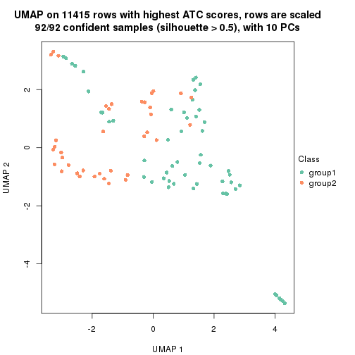</p>

</div>
<div id='tab-node-021-dimension-reduction-2'>
<pre><code class="r">dimension_reduction(res, k = 3, method = &quot;UMAP&quot;)
</code></pre>

<p></p>

</div>
<div id='tab-node-021-dimension-reduction-3'>
<pre><code class="r">dimension_reduction(res, k = 4, method = &quot;UMAP&quot;)
</code></pre>

<p></p>

</div>
</div>


Following heatmap shows how subgroups are split when increasing `k`:

```r
collect_classes(res)
```

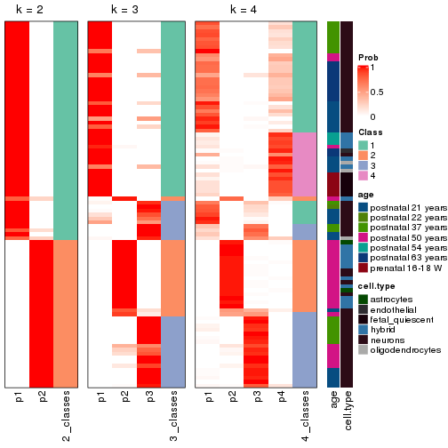


Test correlation between subgroups and known annotations. If the known
annotation is numeric, one-way ANOVA test is applied, and if the known
annotation is discrete, chi-squared contingency table test is applied.

```r
test_to_known_factors(res)
```

```
#>             n_sample age(p-value) cell.type(p-value) k
#> ATC:skmeans       92     2.61e-07           2.31e-02 2
#> ATC:skmeans       87     8.27e-11           1.50e-06 3
#> ATC:skmeans       85     8.23e-16           9.27e-15 4
```


If matrix rows can be associated to genes, consider to use `functional_enrichment(res,
...)` to perform function enrichment for the signature genes. See [this vignette](https://jokergoo.github.io/cola_vignettes/functional_enrichment.html) for more detailed explanations.


 

---------------------------------------------------


### Node03


Parent node: [Node0](#Node0).
Child nodes: 
                [Node011](#Node011)
        ,
                [Node012](#Node012)
        ,
                [Node013](#Node013)
        ,
                [Node021](#Node021)
        ,
                Node022-leaf
        ,
                Node031-leaf
        ,
                Node032-leaf
        ,
                Node033-leaf
        .


The object with results only for a single top-value method and a single partitioning method 
can be extracted as:

```r
res = res_rh["03"]
```

A summary of `res` and all the functions that can be applied to it:

```r
res
```

```
#> A 'ConsensusPartition' object with k = 2, 3, 4.
#>   On a matrix with 11068 rows and 52 columns.
#>   Top rows (1107) are extracted by 'ATC' method.
#>   Subgroups are detected by 'skmeans' method.
#>   Performed in total 150 partitions by row resampling.
#>   Best k for subgroups seems to be 3.
#> 
#> Following methods can be applied to this 'ConsensusPartition' object:
#>  [1] "cola_report"             "collect_classes"         "collect_plots"          
#>  [4] "collect_stats"           "colnames"                "compare_partitions"     
#>  [7] "compare_signatures"      "consensus_heatmap"       "dimension_reduction"    
#> [10] "functional_enrichment"   "get_anno_col"            "get_anno"               
#> [13] "get_classes"             "get_consensus"           "get_matrix"             
#> [16] "get_membership"          "get_param"               "get_signatures"         
#> [19] "get_stats"               "is_best_k"               "is_stable_k"            
#> [22] "membership_heatmap"      "ncol"                    "nrow"                   
#> [25] "plot_ecdf"               "predict_classes"         "rownames"               
#> [28] "select_partition_number" "show"                    "suggest_best_k"         
#> [31] "test_to_known_factors"   "top_rows_heatmap"
```

`collect_plots()` function collects all the plots made from `res` for all `k` (number of subgroups)
into one single page to provide an easy and fast comparison between different `k`.

```r
collect_plots(res)
```


The plots are:

- The first row: a plot of the eCDF (empirical cumulative distribution
  function) curves of the consensus matrix for each `k` and the heatmap of
  predicted classes for each `k`.
- The second row: heatmaps of the consensus matrix for each `k`.
- The third row: heatmaps of the membership matrix for each `k`.
- The fouth row: heatmaps of the signatures for each `k`.

All the plots in panels can be made by individual functions and they are
plotted later in this section.

`select_partition_number()` produces several plots showing different
statistics for choosing "optimized" `k`. There are following statistics:

- eCDF curves of the consensus matrix for each `k`;
- 1-PAC. [The PAC score](https://en.wikipedia.org/wiki/Consensus_clustering#Over-interpretation_potential_of_consensus_clustering)
  measures the proportion of the ambiguous subgrouping.
- Mean silhouette score.
- Concordance. The mean probability of fiting the consensus subgroup labels in all
  partitions.
- Area increased. Denote $A_k$ as the area under the eCDF curve for current
  `k`, the area increased is defined as $A_k - A_{k-1}$.
- Rand index. The percent of pairs of samples that are both in a same cluster
  or both are not in a same cluster in the partition of k and k-1.
- Jaccard index. The ratio of pairs of samples are both in a same cluster in
  the partition of k and k-1 and the pairs of samples are both in a same
  cluster in the partition k or k-1.

The detailed explanations of these statistics can be found in [the _cola_
vignette](https://jokergoo.github.io/cola_vignettes/cola.html#toc_13).

Generally speaking, higher 1-PAC score, higher mean silhouette score or higher
concordance corresponds to better partition. Rand index and Jaccard index
measure how similar the current partition is compared to partition with `k-1`.
If they are too similar, we won't accept `k` is better than `k-1`.

```r
select_partition_number(res)
```


The numeric values for all these statistics can be obtained by `get_stats()`.

```r
get_stats(res)
```

```
#>   k 1-PAC mean_silhouette concordance area_increased  Rand Jaccard
#> 2 2 0.711           0.957       0.974          0.361 0.660   0.660
#> 3 3 1.000           0.969       0.987          0.798 0.663   0.500
#> 4 4 0.880           0.903       0.953          0.148 0.874   0.658
```

`suggest_best_k()` suggests the best $k$ based on these statistics. The rules are as follows:

- All $k$ with Jaccard index larger than 0.95 are removed because increasing
  $k$ does not provide enough extra information. If all $k$ are removed, it is
  marked as no subgroup is detected.
- For all $k$ with 1-PAC score larger than 0.9, the maximal $k$ is taken as
  the best $k$, and other $k$ are marked as optional $k$.
- If it does not fit the second rule. The $k$ with the maximal vote of the
  highest 1-PAC score, highest mean silhouette, and highest concordance is
  taken as the best $k$.

```r
suggest_best_k(res)
```

```
#> [1] 3
```


Following is the table of the partitions (You need to click the **show/hide
code output** link to see it). The membership matrix (columns with name `p*`)
is inferred by
[`clue::cl_consensus()`](https://www.rdocumentation.org/link/cl_consensus?package=clue)
function with the `SE` method. Basically the value in the membership matrix
represents the probability to belong to a certain group. The finall subgroup
label for an item is determined with the group with highest probability it
belongs to.

In `get_classes()` function, the entropy is calculated from the membership
matrix and the silhouette score is calculated from the consensus matrix.


<script>
$( function() {
	$( '#tabs-node-03-get-classes' ).tabs();
} );
</script>
<div id='tabs-node-03-get-classes'>
<ul>
<li><a href='#tab-node-03-get-classes-1'>k = 2</a></li>
<li><a href='#tab-node-03-get-classes-2'>k = 3</a></li>
<li><a href='#tab-node-03-get-classes-3'>k = 4</a></li>
</ul>

<div id='tab-node-03-get-classes-1'>
<p><a id='tab-node-03-get-classes-1-a' style='color:#0366d6' href='#'>show/hide code output</a></p>
<pre><code class="r">cbind(get_classes(res, k = 2), get_membership(res, k = 2))
</code></pre>

<pre><code>#&gt;            class entropy silhouette   p1   p2
#&gt; GSM1657932     1   0.529      0.894 0.88 0.12
#&gt; GSM1657938     1   0.529      0.894 0.88 0.12
#&gt; GSM1657965     1   0.529      0.894 0.88 0.12
#&gt; GSM1657975     1   0.529      0.894 0.88 0.12
#&gt; GSM1657979     1   0.529      0.894 0.88 0.12
#&gt; GSM1657981     1   0.000      0.966 1.00 0.00
#&gt; GSM1658006     1   0.000      0.966 1.00 0.00
#&gt; GSM1658007     1   0.000      0.966 1.00 0.00
#&gt; GSM1658016     1   0.000      0.966 1.00 0.00
#&gt; GSM1658017     1   0.000      0.966 1.00 0.00
#&gt; GSM1658020     1   0.000      0.966 1.00 0.00
#&gt; GSM1658021     1   0.000      0.966 1.00 0.00
#&gt; GSM1658024     2   0.000      1.000 0.00 1.00
#&gt; GSM1658026     1   0.000      0.966 1.00 0.00
#&gt; GSM1658027     1   0.000      0.966 1.00 0.00
#&gt; GSM1658029     1   0.000      0.966 1.00 0.00
#&gt; GSM1658031     1   0.327      0.933 0.94 0.06
#&gt; GSM1658043     1   0.000      0.966 1.00 0.00
#&gt; GSM1658045     1   0.000      0.966 1.00 0.00
#&gt; GSM1658048     2   0.000      1.000 0.00 1.00
#&gt; GSM1658050     1   0.000      0.966 1.00 0.00
#&gt; GSM1658051     1   0.000      0.966 1.00 0.00
#&gt; GSM1658054     1   0.000      0.966 1.00 0.00
#&gt; GSM1658056     1   0.000      0.966 1.00 0.00
#&gt; GSM1658059     1   0.000      0.966 1.00 0.00
#&gt; GSM1658061     1   0.000      0.966 1.00 0.00
#&gt; GSM1658064     1   0.000      0.966 1.00 0.00
#&gt; GSM1658065     1   0.000      0.966 1.00 0.00
#&gt; GSM1658066     1   0.000      0.966 1.00 0.00
#&gt; GSM1658067     1   0.000      0.966 1.00 0.00
#&gt; GSM1658068     1   0.000      0.966 1.00 0.00
#&gt; GSM1658069     1   0.000      0.966 1.00 0.00
#&gt; GSM1658071     1   0.000      0.966 1.00 0.00
#&gt; GSM1658072     1   0.000      0.966 1.00 0.00
#&gt; GSM1658073     1   0.000      0.966 1.00 0.00
#&gt; GSM1658078     1   0.000      0.966 1.00 0.00
#&gt; GSM1658079     1   0.000      0.966 1.00 0.00
#&gt; GSM1658081     1   0.529      0.894 0.88 0.12
#&gt; GSM1658082     1   0.000      0.966 1.00 0.00
#&gt; GSM1658130     2   0.000      1.000 0.00 1.00
#&gt; GSM1658133     2   0.000      1.000 0.00 1.00
#&gt; GSM1658142     2   0.000      1.000 0.00 1.00
#&gt; GSM1658159     2   0.000      1.000 0.00 1.00
#&gt; GSM1658161     2   0.000      1.000 0.00 1.00
#&gt; GSM1658168     1   0.722      0.804 0.80 0.20
#&gt; GSM1658174     1   0.529      0.894 0.88 0.12
#&gt; GSM1658178     2   0.000      1.000 0.00 1.00
#&gt; GSM1658183     2   0.000      1.000 0.00 1.00
#&gt; GSM1658184     1   0.529      0.894 0.88 0.12
#&gt; GSM1658201     1   0.529      0.894 0.88 0.12
#&gt; GSM1658213     2   0.000      1.000 0.00 1.00
#&gt; GSM1658215     2   0.000      1.000 0.00 1.00
</code></pre>

<script>
$('#tab-node-03-get-classes-1-a').parent().next().next().hide();
$('#tab-node-03-get-classes-1-a').click(function(){
  $('#tab-node-03-get-classes-1-a').parent().next().next().toggle();
  return(false);
});
</script>
</div>

<div id='tab-node-03-get-classes-2'>
<p><a id='tab-node-03-get-classes-2-a' style='color:#0366d6' href='#'>show/hide code output</a></p>
<pre><code class="r">cbind(get_classes(res, k = 3), get_membership(res, k = 3))
</code></pre>

<pre><code>#&gt;            class entropy silhouette   p1   p2   p3
#&gt; GSM1657932     3  0.0000      0.977 0.00 0.00 1.00
#&gt; GSM1657938     3  0.0000      0.977 0.00 0.00 1.00
#&gt; GSM1657965     3  0.0000      0.977 0.00 0.00 1.00
#&gt; GSM1657975     3  0.0000      0.977 0.00 0.00 1.00
#&gt; GSM1657979     3  0.0000      0.977 0.00 0.00 1.00
#&gt; GSM1657981     3  0.0000      0.977 0.00 0.00 1.00
#&gt; GSM1658006     1  0.0000      0.999 1.00 0.00 0.00
#&gt; GSM1658007     1  0.0892      0.976 0.98 0.00 0.02
#&gt; GSM1658016     3  0.0000      0.977 0.00 0.00 1.00
#&gt; GSM1658017     3  0.0000      0.977 0.00 0.00 1.00
#&gt; GSM1658020     3  0.1529      0.935 0.04 0.00 0.96
#&gt; GSM1658021     3  0.0892      0.957 0.02 0.00 0.98
#&gt; GSM1658024     3  0.5948      0.430 0.00 0.36 0.64
#&gt; GSM1658026     3  0.0000      0.977 0.00 0.00 1.00
#&gt; GSM1658027     3  0.0000      0.977 0.00 0.00 1.00
#&gt; GSM1658029     1  0.0000      0.999 1.00 0.00 0.00
#&gt; GSM1658031     3  0.0000      0.977 0.00 0.00 1.00
#&gt; GSM1658043     1  0.0000      0.999 1.00 0.00 0.00
#&gt; GSM1658045     3  0.0000      0.977 0.00 0.00 1.00
#&gt; GSM1658048     2  0.6000      0.727 0.20 0.76 0.04
#&gt; GSM1658050     1  0.0000      0.999 1.00 0.00 0.00
#&gt; GSM1658051     1  0.0000      0.999 1.00 0.00 0.00
#&gt; GSM1658054     1  0.0000      0.999 1.00 0.00 0.00
#&gt; GSM1658056     1  0.0000      0.999 1.00 0.00 0.00
#&gt; GSM1658059     1  0.0000      0.999 1.00 0.00 0.00
#&gt; GSM1658061     1  0.0000      0.999 1.00 0.00 0.00
#&gt; GSM1658064     1  0.0000      0.999 1.00 0.00 0.00
#&gt; GSM1658065     1  0.0000      0.999 1.00 0.00 0.00
#&gt; GSM1658066     1  0.0000      0.999 1.00 0.00 0.00
#&gt; GSM1658067     1  0.0000      0.999 1.00 0.00 0.00
#&gt; GSM1658068     1  0.0000      0.999 1.00 0.00 0.00
#&gt; GSM1658069     1  0.0000      0.999 1.00 0.00 0.00
#&gt; GSM1658071     1  0.0000      0.999 1.00 0.00 0.00
#&gt; GSM1658072     1  0.0000      0.999 1.00 0.00 0.00
#&gt; GSM1658073     1  0.0000      0.999 1.00 0.00 0.00
#&gt; GSM1658078     1  0.0000      0.999 1.00 0.00 0.00
#&gt; GSM1658079     1  0.0000      0.999 1.00 0.00 0.00
#&gt; GSM1658081     3  0.0000      0.977 0.00 0.00 1.00
#&gt; GSM1658082     1  0.0000      0.999 1.00 0.00 0.00
#&gt; GSM1658130     2  0.0000      0.974 0.00 1.00 0.00
#&gt; GSM1658133     2  0.0000      0.974 0.00 1.00 0.00
#&gt; GSM1658142     2  0.0000      0.974 0.00 1.00 0.00
#&gt; GSM1658159     2  0.0000      0.974 0.00 1.00 0.00
#&gt; GSM1658161     2  0.0000      0.974 0.00 1.00 0.00
#&gt; GSM1658168     3  0.0000      0.977 0.00 0.00 1.00
#&gt; GSM1658174     3  0.0000      0.977 0.00 0.00 1.00
#&gt; GSM1658178     2  0.0000      0.974 0.00 1.00 0.00
#&gt; GSM1658183     2  0.0000      0.974 0.00 1.00 0.00
#&gt; GSM1658184     3  0.0000      0.977 0.00 0.00 1.00
#&gt; GSM1658201     3  0.0000      0.977 0.00 0.00 1.00
#&gt; GSM1658213     2  0.0000      0.974 0.00 1.00 0.00
#&gt; GSM1658215     2  0.0000      0.974 0.00 1.00 0.00
</code></pre>

<script>
$('#tab-node-03-get-classes-2-a').parent().next().next().hide();
$('#tab-node-03-get-classes-2-a').click(function(){
  $('#tab-node-03-get-classes-2-a').parent().next().next().toggle();
  return(false);
});
</script>
</div>

<div id='tab-node-03-get-classes-3'>
<p><a id='tab-node-03-get-classes-3-a' style='color:#0366d6' href='#'>show/hide code output</a></p>
<pre><code class="r">cbind(get_classes(res, k = 4), get_membership(res, k = 4))
</code></pre>

<pre><code>#&gt;            class entropy silhouette   p1   p2   p3   p4
#&gt; GSM1657932     3  0.0000      0.939 0.00 0.00 1.00 0.00
#&gt; GSM1657938     3  0.0000      0.939 0.00 0.00 1.00 0.00
#&gt; GSM1657965     3  0.0000      0.939 0.00 0.00 1.00 0.00
#&gt; GSM1657975     3  0.0000      0.939 0.00 0.00 1.00 0.00
#&gt; GSM1657979     3  0.0000      0.939 0.00 0.00 1.00 0.00
#&gt; GSM1657981     3  0.2011      0.888 0.00 0.00 0.92 0.08
#&gt; GSM1658006     4  0.0707      0.924 0.02 0.00 0.00 0.98
#&gt; GSM1658007     4  0.0000      0.909 0.00 0.00 0.00 1.00
#&gt; GSM1658016     3  0.0000      0.939 0.00 0.00 1.00 0.00
#&gt; GSM1658017     3  0.0707      0.932 0.00 0.00 0.98 0.02
#&gt; GSM1658020     3  0.4948      0.279 0.00 0.00 0.56 0.44
#&gt; GSM1658021     4  0.3172      0.751 0.00 0.00 0.16 0.84
#&gt; GSM1658024     3  0.4079      0.764 0.00 0.18 0.80 0.02
#&gt; GSM1658026     3  0.0707      0.932 0.00 0.00 0.98 0.02
#&gt; GSM1658027     3  0.3525      0.844 0.10 0.00 0.86 0.04
#&gt; GSM1658029     4  0.0707      0.924 0.02 0.00 0.00 0.98
#&gt; GSM1658031     3  0.0000      0.939 0.00 0.00 1.00 0.00
#&gt; GSM1658043     4  0.0707      0.924 0.02 0.00 0.00 0.98
#&gt; GSM1658045     3  0.1211      0.923 0.00 0.00 0.96 0.04
#&gt; GSM1658048     1  0.3247      0.850 0.88 0.06 0.06 0.00
#&gt; GSM1658050     1  0.2011      0.901 0.92 0.00 0.00 0.08
#&gt; GSM1658051     4  0.2345      0.865 0.10 0.00 0.00 0.90
#&gt; GSM1658054     1  0.0707      0.941 0.98 0.00 0.00 0.02
#&gt; GSM1658056     1  0.1211      0.932 0.96 0.00 0.00 0.04
#&gt; GSM1658059     1  0.0000      0.947 1.00 0.00 0.00 0.00
#&gt; GSM1658061     1  0.0000      0.947 1.00 0.00 0.00 0.00
#&gt; GSM1658064     1  0.4406      0.576 0.70 0.00 0.00 0.30
#&gt; GSM1658065     1  0.0000      0.947 1.00 0.00 0.00 0.00
#&gt; GSM1658066     1  0.0000      0.947 1.00 0.00 0.00 0.00
#&gt; GSM1658067     4  0.4624      0.471 0.34 0.00 0.00 0.66
#&gt; GSM1658068     1  0.0000      0.947 1.00 0.00 0.00 0.00
#&gt; GSM1658069     1  0.0000      0.947 1.00 0.00 0.00 0.00
#&gt; GSM1658071     1  0.1637      0.919 0.94 0.00 0.00 0.06
#&gt; GSM1658072     1  0.0000      0.947 1.00 0.00 0.00 0.00
#&gt; GSM1658073     4  0.0707      0.924 0.02 0.00 0.00 0.98
#&gt; GSM1658078     4  0.0707      0.924 0.02 0.00 0.00 0.98
#&gt; GSM1658079     4  0.0707      0.924 0.02 0.00 0.00 0.98
#&gt; GSM1658081     3  0.1211      0.917 0.04 0.00 0.96 0.00
#&gt; GSM1658082     1  0.0707      0.941 0.98 0.00 0.00 0.02
#&gt; GSM1658130     2  0.0000      1.000 0.00 1.00 0.00 0.00
#&gt; GSM1658133     2  0.0000      1.000 0.00 1.00 0.00 0.00
#&gt; GSM1658142     2  0.0000      1.000 0.00 1.00 0.00 0.00
#&gt; GSM1658159     2  0.0000      1.000 0.00 1.00 0.00 0.00
#&gt; GSM1658161     2  0.0000      1.000 0.00 1.00 0.00 0.00
#&gt; GSM1658168     3  0.2647      0.851 0.00 0.00 0.88 0.12
#&gt; GSM1658174     3  0.0000      0.939 0.00 0.00 1.00 0.00
#&gt; GSM1658178     2  0.0000      1.000 0.00 1.00 0.00 0.00
#&gt; GSM1658183     2  0.0000      1.000 0.00 1.00 0.00 0.00
#&gt; GSM1658184     3  0.0000      0.939 0.00 0.00 1.00 0.00
#&gt; GSM1658201     3  0.0000      0.939 0.00 0.00 1.00 0.00
#&gt; GSM1658213     2  0.0000      1.000 0.00 1.00 0.00 0.00
#&gt; GSM1658215     2  0.0000      1.000 0.00 1.00 0.00 0.00
</code></pre>

<script>
$('#tab-node-03-get-classes-3-a').parent().next().next().hide();
$('#tab-node-03-get-classes-3-a').click(function(){
  $('#tab-node-03-get-classes-3-a').parent().next().next().toggle();
  return(false);
});
</script>
</div>
</div>

Heatmaps for the consensus matrix. It visualizes the probability of two
samples to be in a same group.


<script>
$( function() {
	$( '#tabs-node-03-consensus-heatmap' ).tabs();
} );
</script>
<div id='tabs-node-03-consensus-heatmap'>
<ul>
<li><a href='#tab-node-03-consensus-heatmap-1'>k = 2</a></li>
<li><a href='#tab-node-03-consensus-heatmap-2'>k = 3</a></li>
<li><a href='#tab-node-03-consensus-heatmap-3'>k = 4</a></li>
</ul>
<div id='tab-node-03-consensus-heatmap-1'>
<pre><code class="r">consensus_heatmap(res, k = 2)
</code></pre>

<p></p>

</div>
<div id='tab-node-03-consensus-heatmap-2'>
<pre><code class="r">consensus_heatmap(res, k = 3)
</code></pre>

<p></p>

</div>
<div id='tab-node-03-consensus-heatmap-3'>
<pre><code class="r">consensus_heatmap(res, k = 4)
</code></pre>

<p></p>

</div>
</div>

Heatmaps for the membership of samples in all partitions to see how consistent they are:


<script>
$( function() {
	$( '#tabs-node-03-membership-heatmap' ).tabs();
} );
</script>
<div id='tabs-node-03-membership-heatmap'>
<ul>
<li><a href='#tab-node-03-membership-heatmap-1'>k = 2</a></li>
<li><a href='#tab-node-03-membership-heatmap-2'>k = 3</a></li>
<li><a href='#tab-node-03-membership-heatmap-3'>k = 4</a></li>
</ul>
<div id='tab-node-03-membership-heatmap-1'>
<pre><code class="r">membership_heatmap(res, k = 2)
</code></pre>

<p></p>

</div>
<div id='tab-node-03-membership-heatmap-2'>
<pre><code class="r">membership_heatmap(res, k = 3)
</code></pre>

<p></p>

</div>
<div id='tab-node-03-membership-heatmap-3'>
<pre><code class="r">membership_heatmap(res, k = 4)
</code></pre>

<p></p>

</div>
</div>

As soon as the classes for columns are determined, the signatures
that are significantly different between subgroups can be looked for. 
Following are the heatmaps for signatures.


Signature heatmaps where rows are scaled:


<script>
$( function() {
	$( '#tabs-node-03-get-signatures' ).tabs();
} );
</script>
<div id='tabs-node-03-get-signatures'>
<ul>
<li><a href='#tab-node-03-get-signatures-1'>k = 2</a></li>
<li><a href='#tab-node-03-get-signatures-2'>k = 3</a></li>
<li><a href='#tab-node-03-get-signatures-3'>k = 4</a></li>
</ul>
<div id='tab-node-03-get-signatures-1'>
<pre><code class="r">get_signatures(res, k = 2)
</code></pre>

<p></p>

</div>
<div id='tab-node-03-get-signatures-2'>
<pre><code class="r">get_signatures(res, k = 3)
</code></pre>

<p></p>

</div>
<div id='tab-node-03-get-signatures-3'>
<pre><code class="r">get_signatures(res, k = 4)
</code></pre>

<p></p>

</div>
</div>


Signature heatmaps where rows are not scaled:


<script>
$( function() {
	$( '#tabs-node-03-get-signatures-no-scale' ).tabs();
} );
</script>
<div id='tabs-node-03-get-signatures-no-scale'>
<ul>
<li><a href='#tab-node-03-get-signatures-no-scale-1'>k = 2</a></li>
<li><a href='#tab-node-03-get-signatures-no-scale-2'>k = 3</a></li>
<li><a href='#tab-node-03-get-signatures-no-scale-3'>k = 4</a></li>
</ul>
<div id='tab-node-03-get-signatures-no-scale-1'>
<pre><code class="r">get_signatures(res, k = 2, scale_rows = FALSE)
</code></pre>

<p></p>

</div>
<div id='tab-node-03-get-signatures-no-scale-2'>
<pre><code class="r">get_signatures(res, k = 3, scale_rows = FALSE)
</code></pre>

<p></p>

</div>
<div id='tab-node-03-get-signatures-no-scale-3'>
<pre><code class="r">get_signatures(res, k = 4, scale_rows = FALSE)
</code></pre>

<p></p>

</div>
</div>


Compare the overlap of signatures from different k:

```r
compare_signatures(res)
```


`get_signature()` returns a data frame invisibly. To get the list of signatures, the function
call should be assigned to a variable explicitly. In following code, if `plot` argument is set
to `FALSE`, no heatmap is plotted while only the differential analysis is performed.

```r
# code only for demonstration
tb = get_signature(res, k = ..., plot = FALSE)
```

An example of the output of `tb` is:

```
#>   which_row         fdr    mean_1    mean_2 scaled_mean_1 scaled_mean_2 km
#> 1        38 0.042760348  8.373488  9.131774    -0.5533452     0.5164555  1
#> 2        40 0.018707592  7.106213  8.469186    -0.6173731     0.5762149  1
#> 3        55 0.019134737 10.221463 11.207825    -0.6159697     0.5749050  1
#> 4        59 0.006059896  5.921854  7.869574    -0.6899429     0.6439467  1
#> 5        60 0.018055526  8.928898 10.211722    -0.6204761     0.5791110  1
#> 6        98 0.009384629 15.714769 14.887706     0.6635654    -0.6193277  2
...
```

The columns in `tb` are:

1. `which_row`: row indices corresponding to the input matrix.
2. `fdr`: FDR for the differential test. 
3. `mean_x`: The mean value in group x.
4. `scaled_mean_x`: The mean value in group x after rows are scaled.
5. `km`: Row groups if k-means clustering is applied to rows (which is done by automatically selecting number of clusters).

If there are too many signatures, `top_signatures = ...` can be set to only show the 
signatures with the highest FDRs:

```r
# code only for demonstration
# e.g. to show the top 500 most significant rows
tb = get_signature(res, k = ..., top_signatures = 500)
```

If the signatures are defined as these which are uniquely high in current group, `diff_method` argument
can be set to `"uniquely_high_in_one_group"`:

```r
# code only for demonstration
tb = get_signature(res, k = ..., diff_method = "uniquely_high_in_one_group")
```


UMAP plot which shows how samples are separated.


<script>
$( function() {
	$( '#tabs-node-03-dimension-reduction' ).tabs();
} );
</script>
<div id='tabs-node-03-dimension-reduction'>
<ul>
<li><a href='#tab-node-03-dimension-reduction-1'>k = 2</a></li>
<li><a href='#tab-node-03-dimension-reduction-2'>k = 3</a></li>
<li><a href='#tab-node-03-dimension-reduction-3'>k = 4</a></li>
</ul>
<div id='tab-node-03-dimension-reduction-1'>
<pre><code class="r">dimension_reduction(res, k = 2, method = &quot;UMAP&quot;)
</code></pre>

<p></p>

</div>
<div id='tab-node-03-dimension-reduction-2'>
<pre><code class="r">dimension_reduction(res, k = 3, method = &quot;UMAP&quot;)
</code></pre>

<p></p>

</div>
<div id='tab-node-03-dimension-reduction-3'>
<pre><code class="r">dimension_reduction(res, k = 4, method = &quot;UMAP&quot;)
</code></pre>

<p></p>

</div>
</div>


Following heatmap shows how subgroups are split when increasing `k`:

```r
collect_classes(res)
```


Test correlation between subgroups and known annotations. If the known
annotation is numeric, one-way ANOVA test is applied, and if the known
annotation is discrete, chi-squared contingency table test is applied.

```r
test_to_known_factors(res)
```

```
#>             n_sample age(p-value) cell.type(p-value) k
#> ATC:skmeans       52     2.53e-06           8.08e-09 2
#> ATC:skmeans       51     1.97e-08           7.48e-07 3
#> ATC:skmeans       50     6.04e-08           1.29e-05 4
```


If matrix rows can be associated to genes, consider to use `functional_enrichment(res,
...)` to perform function enrichment for the signature genes. See [this vignette](https://jokergoo.github.io/cola_vignettes/functional_enrichment.html) for more detailed explanations.


 

## Session info


```r
sessionInfo()
```

```
#> R version 4.1.0 (2021-05-18)
#> Platform: x86_64-pc-linux-gnu (64-bit)
#> Running under: CentOS Linux 7 (Core)
#> 
#> Matrix products: default
#> BLAS/LAPACK: /usr/lib64/libopenblas-r0.3.3.so
#> 
#> locale:
#>  [1] LC_CTYPE=en_US.UTF-8       LC_NUMERIC=C               LC_TIME=en_US.UTF-8       
#>  [4] LC_COLLATE=en_US.UTF-8     LC_MONETARY=en_US.UTF-8    LC_MESSAGES=en_US.UTF-8   
#>  [7] LC_PAPER=en_US.UTF-8       LC_NAME=C                  LC_ADDRESS=C              
#> [10] LC_TELEPHONE=C             LC_MEASUREMENT=en_US.UTF-8 LC_IDENTIFICATION=C       
#> 
#> attached base packages:
#>  [1] grid      parallel  stats4    stats     graphics  grDevices utils     datasets  methods  
#> [10] base     
#> 
#> other attached packages:
#>  [1] genefilter_1.74.0           ComplexHeatmap_2.8.0        markdown_1.1               
#>  [4] knitr_1.33                  scRNAseq_2.6.1              SingleCellExperiment_1.14.1
#>  [7] SummarizedExperiment_1.22.0 Biobase_2.52.0              GenomicRanges_1.44.0       
#> [10] GenomeInfoDb_1.28.1         IRanges_2.26.0              S4Vectors_0.30.0           
#> [13] BiocGenerics_0.38.0         MatrixGenerics_1.4.0        matrixStats_0.59.0         
#> [16] cola_1.9.4                 
#> 
#> loaded via a namespace (and not attached):
#>   [1] circlize_0.4.13               AnnotationHub_3.0.1           BiocFileCache_2.0.0          
#>   [4] lazyeval_0.2.2                polylabelr_0.2.0              splines_4.1.0                
#>   [7] Polychrome_1.3.1              BiocParallel_1.26.1           ggplot2_3.3.5                
#>  [10] digest_0.6.27                 foreach_1.5.1                 ensembldb_2.16.3             
#>  [13] htmltools_0.5.1.1             viridis_0.6.1                 fansi_0.5.0                  
#>  [16] magrittr_2.0.1                memoise_2.0.0                 cluster_2.1.2                
#>  [19] doParallel_1.0.16             Biostrings_2.60.1             annotate_1.70.0              
#>  [22] askpass_1.1                   prettyunits_1.1.1             colorspace_2.0-2             
#>  [25] blob_1.2.1                    rappdirs_0.3.3                xfun_0.24                    
#>  [28] dplyr_1.0.7                   crayon_1.4.1                  RCurl_1.98-1.3               
#>  [31] microbenchmark_1.4-7          jsonlite_1.7.2                impute_1.66.0                
#>  [34] brew_1.0-6                    survival_3.2-11               iterators_1.0.13             
#>  [37] glue_1.4.2                    polyclip_1.10-0               gtable_0.3.0                 
#>  [40] zlibbioc_1.38.0               XVector_0.32.0                GetoptLong_1.0.5             
#>  [43] DelayedArray_0.18.0           shape_1.4.6                   scales_1.1.1                 
#>  [46] data.tree_1.0.0               DBI_1.1.1                     Rcpp_1.0.7                   
#>  [49] viridisLite_0.4.0             xtable_1.8-4                  progress_1.2.2               
#>  [52] clue_0.3-59                   reticulate_1.20               bit_4.0.4                    
#>  [55] mclust_5.4.7                  umap_0.2.7.0                  httr_1.4.2                   
#>  [58] RColorBrewer_1.1-2            ellipsis_0.3.2                pkgconfig_2.0.3              
#>  [61] XML_3.99-0.6                  dbplyr_2.1.1                  utf8_1.2.1                   
#>  [64] tidyselect_1.1.1              rlang_0.4.11                  later_1.2.0                  
#>  [67] AnnotationDbi_1.54.1          munsell_0.5.0                 BiocVersion_3.13.1           
#>  [70] tools_4.1.0                   cachem_1.0.5                  generics_0.1.0               
#>  [73] RSQLite_2.2.7                 ExperimentHub_2.0.0           evaluate_0.14                
#>  [76] stringr_1.4.0                 fastmap_1.1.0                 yaml_2.2.1                   
#>  [79] bit64_4.0.5                   purrr_0.3.4                   dendextend_1.15.1            
#>  [82] KEGGREST_1.32.0               AnnotationFilter_1.16.0       mime_0.11                    
#>  [85] slam_0.1-48                   xml2_1.3.2                    biomaRt_2.48.2               
#>  [88] compiler_4.1.0                rstudioapi_0.13               filelock_1.0.2               
#>  [91] curl_4.3.2                    png_0.1-7                     interactiveDisplayBase_1.30.0
#>  [94] tibble_3.1.2                  stringi_1.7.3                 highr_0.9                    
#>  [97] GenomicFeatures_1.44.0        RSpectra_0.16-0               lattice_0.20-44              
#> [100] ProtGenerics_1.24.0           Matrix_1.3-4                  vctrs_0.3.8                  
#> [103] pillar_1.6.1                  lifecycle_1.0.0               BiocManager_1.30.16          
#> [106] eulerr_6.1.0                  GlobalOptions_0.1.2           bitops_1.0-7                 
#> [109] irlba_2.3.3                   httpuv_1.6.1                  rtracklayer_1.52.0           
#> [112] R6_2.5.0                      BiocIO_1.2.0                  promises_1.2.0.1             
#> [115] gridExtra_2.3                 codetools_0.2-18              assertthat_0.2.1             
#> [118] openssl_1.4.4                 rjson_0.2.20                  GenomicAlignments_1.28.0     
#> [121] Rsamtools_2.8.0               GenomeInfoDbData_1.2.6        hms_1.1.0                    
#> [124] skmeans_0.2-13                Cairo_1.5-12.2                scatterplot3d_0.3-41         
#> [127] shiny_1.6.0                   restfulr_0.0.13
```


